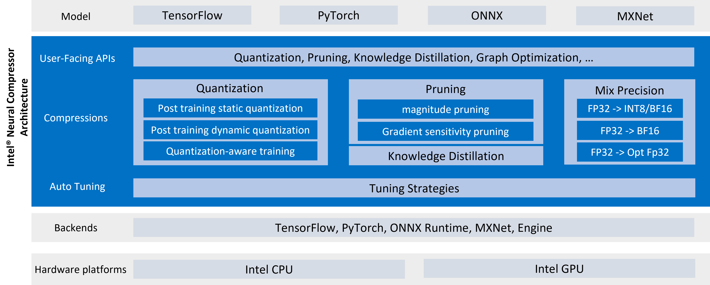

Introduction to Intel® Neural Compressor 
===========================

Intel® Neural Compressor (formerly known as Intel® Low Precision Optimization Tool) is an open-source Python library running on Intel CPUs and GPUs, which delivers unified interfaces across multiple deep learning frameworks for popular network compression technologies, such as quantization, pruning, knowledge distillation. This tool supports automatic accuracy-driven tuning strategies to help user quickly find out the best quantized model. It also implements different weight pruning algorithms to generate pruned model with predefined sparsity goal and supports knowledge distillation to distill the knowledge from the teacher model to the student model.

> **Note**
>
> GPU support is under development.

**Visit the Intel® Neural Compressor online document website at: <https://intel.github.io/neural-compressor>.**   

## Infrastructure

Intel® Neural Compressor features an architecture and workflow that aids in increasing performance and faster deployments across infrastructures. 


#### Architecture

<a target="_blank" href="docs/imgs/architecture.png">
  
</a>

Click the image to enlarge it.

#### Workflow

<a target="_blank" href="docs/imgs/workflow.png">
  
</a>

Click the image to enlarge it.

#### Supported Frameworks

Supported deep learning frameworks are:
* [TensorFlow\*](https://github.com/Intel-tensorflow/tensorflow), including [1.15.0 UP3](https://github.com/Intel-tensorflow/tensorflow/tree/v1.15.0up3), [2.7.0](https://github.com/Intel-tensorflow/tensorflow/tree/v2.7.0), [2.8.0](https://github.com/Intel-tensorflow/tensorflow/tree/v2.8.0), [Official TensorFlow 2.6.2](https://github.com/tensorflow/tensorflow/tree/v2.6.2), [Official TensorFlow 2.7.0](https://github.com/tensorflow/tensorflow/tree/v2.7.0), [Official TensorFlow 2.8.0](https://github.com/tensorflow/tensorflow/tree/v2.8.0)

>  **Note**: Intel Optimized TensorFlow 2.5.0 requires to set environment variable TF_ENABLE_MKL_NATIVE_FORMAT=0 before running Neural Compressor quantization or deploying the quantized model.

>  **Note**: From the official TensorFlow 2.6.0, oneDNN support has been upstreamed. Download the official TensorFlow 2.6.0 binary for the CPU device and set the environment variable TF_ENABLE_ONEDNN_OPTS=1 before running the quantization process or deploying the quantized model.

* [PyTorch\*](https://pytorch.org/), including [1.9.0+cpu](https://download.pytorch.org/whl/torch_stable.html), [1.10.0+cpu](https://download.pytorch.org/whl/torch_stable.html), [1.11.0+cpu](https://download.pytorch.org/whl/torch_stable.html)
* [Apache\* MXNet](https://mxnet.apache.org), including [1.6.0](https://github.com/apache/incubator-mxnet/tree/1.6.0), [1.7.0](https://github.com/apache/incubator-mxnet/tree/1.7.0), [1.8.0](https://github.com/apache/incubator-mxnet/tree/1.8.0)
* [ONNX\* Runtime](https://github.com/microsoft/onnxruntime), including [1.8.0](https://github.com/microsoft/onnxruntime/tree/v1.8.0), [1.9.0](https://github.com/microsoft/onnxruntime/tree/v1.9.0), [1.10.0](https://github.com/microsoft/onnxruntime/tree/v1.10.0)
* [Execution Engine](./docs/engine.md), a reference bare metal solution(./engine) for domain-specific NLP models.

## Installation

Select the installation based on your operating system.


### Linux Installation

You can install Neural Compressor using one of three options: Install just the library
from binary or source, or get the Intel-optimized framework together with the
library by installing the [Intel® oneAPI AI Analytics Toolkit](https://software.intel.com/content/www/us/en/develop/tools/oneapi/ai-analytics-toolkit.html).

**Prerequisites**

The following prerequisites and requirements must be satisfied for a successful installation:

- Python version: 3.7 or 3.8 or 3.9 or 3.10

- C++ compiler: 7.2.1 or above

- CMake: 3.12 or above

> **common build issues**
>
> `Issue 1`: ValueError: numpy.ndarray size changed, may indicate binary incompatibility. Expected 88 from C header, got 80 from PyObject
>
> Solution: reinstall pycocotools by "pip install pycocotools --no-cache-dir"
>    
> `Issue 2`: ImportError: libGL.so.1: cannot open shared object file: No such file or directory 
>
> Solution: apt install or yum install opencv

#### Option 1 Install from binary

  ```Shell
  # install stable version from pip
  pip install neural-compressor

  # install nightly version from pip
  pip install -i https://test.pypi.org/simple/ neural-compressor

  # install stable version from from conda
  conda install neural-compressor -c conda-forge -c intel 
  ```

#### Option 2 Install from source

  ```Shell
  git clone https://github.com/intel/neural-compressor.git
  cd neural-compressor
  git submodule sync
  git submodule update --init --recursive
  pip install -r requirements.txt
  python setup.py install
  ```

#### Option 3 Install from AI Kit

The Intel® Neural Compressor library is released as part of the
[Intel® oneAPI AI Analytics Toolkit](https://software.intel.com/content/www/us/en/develop/tools/oneapi/ai-analytics-toolkit.html) (AI Kit).
The AI Kit provides a consolidated package of Intel's latest deep learning and
machine optimizations all in one place for ease of development. Along with
Neural Compressor, the AI Kit includes Intel-optimized versions of deep learning frameworks
(such as TensorFlow and PyTorch) and high-performing Python libraries to
streamline end-to-end data science and AI workflows on Intel architectures.

The AI Kit is distributed through many common channels,
including from Intel's website, YUM, APT, Anaconda, and more.
Select and [download](https://software.intel.com/content/www/us/en/develop/tools/oneapi/ai-analytics-toolkit/download.html)
the AI Kit distribution package that's best suited for you and follow the
[Get Started Guide](https://software.intel.com/content/www/us/en/develop/documentation/get-started-with-ai-linux/top.html)
for post-installation instructions.

|[Download AI Kit](https://software.intel.com/content/www/us/en/develop/tools/oneapi/ai-analytics-toolkit/) |[AI Kit Get Started Guide](https://software.intel.com/content/www/us/en/develop/documentation/get-started-with-ai-linux/top.html) |
|---|---|

### Windows Installation

**Prerequisites**

The following prerequisites and requirements must be satisfied for a successful installation:

- Python version: 3.7 or 3.8 or 3.9

- Download and install [anaconda](https://anaconda.org/).

- Create a virtual environment named nc in anaconda:

    ```shell
    # Here we install python 3.7 for instance. You can also choose python 3.8 or 3.9.
    conda create -n nc python=3.7
    conda activate nc
    ```
**Installation options**

#### Option 1 Install from binary

  ```Shell
  # install stable version from pip
  pip install neural-compressor

  # install nightly version from pip
  pip install -i https://test.pypi.org/simple/ neural-compressor

  # install from conda
  conda install pycocotools -c esri   
  conda install neural-compressor -c conda-forge -c intel
  ```

#### Option 2 Install from source

  ```shell
  git clone https://github.com/intel/neural-compressor.git
  cd neural-compressor
  git submodule sync
  git submodule update --init --recursive
  pip install -r requirements.txt
  python setup.py install
  ```

## Documentation

**Get Started**

* [APIs](docs/api-introduction.md) explains Intel® Neural Compressor's API.
* [GUI](docs/bench.md) provides web-based UI service to make quantization easier.
* [Transform](docs/transform.md) introduces how to utilize Neural Compressor's built-in data processing and how to develop a custom data processing method. 
* [Dataset](docs/dataset.md) introduces how to utilize Neural Compressor's built-in dataset and how to develop a custom dataset.
* [Metric](docs/metric.md) introduces how to utilize Neural Compressor's built-in metrics and how to develop a custom metric.
* [Objective](docs/objective.md) introduces how to utilize Neural Compressor's built-in objectives and how to develop a custom objective.
* [Tutorial](docs/tutorial.md) provides comprehensive instructions on how to utilize Neural Compressor's features with examples. 
* [Examples](/examples) are provided to demonstrate the usage of Neural Compressor in different frameworks: TensorFlow, PyTorch, MXNet, and ONNX Runtime.
* [Intel oneAPI AI Analytics Toolkit Get Started Guide](https://software.intel.com/content/www/us/en/develop/documentation/get-started-with-ai-linux/top.html) explains the AI Kit components, installation and configuration guides, and instructions for building and running sample apps.
* [AI and Analytics Samples](https://github.com/oneapi-src/oneAPI-samples/tree/master/AI-and-Analytics) includes code samples for Intel oneAPI libraries.

**Deep Dive**

* [Quantization](docs/Quantization.md) are processes that enable inference and training by performing computations at low-precision data types, such as fixed-point integers. Neural Compressor supports Post-Training Quantization ([PTQ](docs/PTQ.md)) with [different quantization capabilities](docs/backend_quant.md) and Quantization-Aware Training ([QAT](docs/QAT.md)). Note that ([Dynamic Quantization](docs/dynamic_quantization.md)) currently has limited support.
* [Pruning](docs/pruning.md) provides a common method for introducing sparsity in weights and activations.
* [Knowledge Distillation](docs/distillation.md) provides a common method for distilling knowledge from teacher model to student model.
* [Distributed Training](docs/distributed.md) introduces how to leverage Horovod to do multi-node training in Intel® Neural Compressor to speed up the training time.
* [Benchmarking](docs/benchmark.md) introduces how to utilize the benchmark interface of Neural Compressor.
* [Mixed precision](docs/mixed_precision.md) introduces how to enable mixed precision, including BFP16 and int8 and FP32, on Intel platforms during tuning.
* [Graph Optimization](docs/graph_optimization.md) introduces how to enable graph optimization for FP32 and auto-mixed precision.
* [Model Conversion](docs/model_conversion.md) introduces how to convert TensorFlow QAT model to quantized model running on Intel platforms.
* [TensorBoard](docs/tensorboard.md) provides tensor histograms and execution graphs for tuning debugging purposes. 

**Advanced Topics**

* [Execution Engine](docs/engine.md) is a bare metal solution domain-specific NLP models as the reference for customers.
* [Adaptor](docs/adaptor.md) is the interface between components and framework. The method to develop adaptor extension is introduced with ONNX Runtime as example. 
* [Strategy](docs/tuning_strategies.md) can automatically optimized low-precision recipes for deep learning models to achieve optimal product objectives like inference performance and memory usage with expected accuracy criteria. The method to develop a new strategy is introduced.

**Publications**

* [New instructions in the Intel® Xeon® Scalable processors combined with optimized software frameworks enable real-time AI within network workloads](https://builders.intel.com/docs/networkbuilders/ai-technologies-unleash-ai-innovation-in-network-applications-solution-brief-1637303210.pdf) (Feb 2022)
* [Quantizing ONNX Models using Intel® Neural Compressor](https://community.intel.com/t5/Blogs/Tech-Innovation/Artificial-Intelligence-AI/Quantizing-ONNX-Models-using-Intel-Neural-Compressor/post/1355237) (Feb 2022)
* [Quantize AI Model by Intel® oneAPI AI Analytics Toolkit on Alibaba Cloud](https://www.intel.com/content/www/us/en/developer/articles/technical/quantize-ai-by-oneapi-analytics-on-alibaba-cloud.html) (Feb 2022)
* [AI Performance and Productivity with Intel® Neural Compressor](https://twitter.com/IntelAI/status/1469079414562557952) (Jan 2022)
* [Ease-of-use quantization for PyTorch with Intel® Neural Compressor](https://pytorch.org/tutorials/recipes/intel_neural_compressor_for_pytorch.html) (Jan 2022)
* [Faster, Easier Optimization with Intel® Neural Compressor](https://www.intel.com/content/www/us/en/artificial-intelligence/posts/optimization-with-intel-neural-compressor.html) (Nov 2021)
* [MLPerf™ Performance Gains Abound with latest 3rd Generation Intel® Xeon® Scalable Processors](https://www.intel.com/content/www/us/en/artificial-intelligence/posts/3rd-gen-xeon-mlperf-performance-gains.html) (Apr 2021)
* [3D Digital Face Reconstruction Solution enabled by 3rd Gen Intel® Xeon® Scalable Processors](https://www.intel.com/content/www/us/en/artificial-intelligence/posts/tencent-3d-digital-face-reconstruction.html) (Apr 2021)
* [Accelerating Alibaba Transformer model performance with 3rd Gen Intel® Xeon® Scalable Processors (Ice Lake) and Intel® Deep Learning Boost](https://www.intel.com/content/www/us/en/artificial-intelligence/posts/alibaba-lpot.html) (Apr 2021)
* [Using Low-Precision Optimizations for High-Performance DL Inference Applications](https://techdecoded.intel.io/essentials/using-low-precision-optimizations-for-high-performance-dl-inference-applications/#gs.z20k91) (Apr 2021)
* [DL Boost Quantization with CERN's 3D-GANs model](https://www.nextplatform.com/2021/02/01/cern-uses-dlboost-oneapi-to-juice-inference-without-accuracy-loss/) (Feb 2021)

View the [full publications list](docs/publication_list.md).

## System Requirements

Intel® Neural Compressor supports systems based on [Intel 64 architecture or compatible processors](https://en.wikipedia.org/wiki/X86-64), specially optimized for the following CPUs:

* Intel Xeon Scalable processor (formerly Skylake, Cascade Lake, Cooper Lake, and Icelake)
* future Intel Xeon Scalable processor (code name Sapphire Rapids)

Intel® Neural Compressor requires installing the Intel-optimized framework version for the supported DL framework you use: TensorFlow, PyTorch, MXNet, or ONNX runtime. 

Note: Intel Neural Compressor supports Intel-optimized and official frameworks for some TensorFlow versions. Refer to [Supported Frameworks](#Supported-Frameworks) for specifics.

### Validated Hardware/Software Environment

<table class="docutils">
<thead>
  <tr>
    <th class="tg-bobw">Processor</th>
    <th class="tg-bobw">OS</th>
    <th class="tg-bobw">Python</th>
    <th class="tg-bobw">Framework</th>
    <th class="tg-bobw">Version</th>
  </tr>
</thead>
<tbody>
  <tr>
    <td class="tg-nrix" rowspan="14">Intel Xeon Scalable processor<br> (formerly Skylake, Cascade Lake, Cooper Lake, and Icelake)<br></td>
    <td class="tg-nrix" rowspan="14">CentOS 8.3<br><br>Ubuntu 18.04</td>
    <td class="tg-nrix" rowspan="14">3.7<br><br>3.8<br><br>3.9</td>
    <td class="tg-cly1" rowspan="4">TensorFlow</td>
    <td class="tg-7zrl">2.8.0</td>
  </tr>
  <tr>
    <td class="tg-7zrl">2.7.0</td>
  </tr>
  <tr>
    <td class="tg-7zrl">2.6.2</td>
  </tr>
  <tr>
    <td class="tg-7zrl">1.15.0UP3</td>
  </tr>
  <tr>
    <td class="tg-7zrl" rowspan="4">PyTorch</td>
    <td class="tg-7zrl">1.11.0+cpu</td>
  </tr>
  <tr>
    <td class="tg-7zrl">1.10.0+cpu</td>
  </tr>
  <tr>
    <td class="tg-7zrl">1.9.0+cpu</td>
  </tr>
  <tr>
    <td class="tg-7zrl">IPEX</td>
  </tr>
  <tr>
    <td class="tg-cly1" rowspan="3">MXNet</td>
    <td class="tg-7zrl">1.8.0</td>
  </tr>
  <tr>
    <td class="tg-7zrl">1.7.0</td>
  </tr>
  <tr>
    <td class="tg-7zrl">1.6.0</td>
  </tr>
  <tr>
    <td class="tg-7zrl" rowspan="3">ONNX Runtime</td>
    <td class="tg-7zrl">1.10.0</td>
  </tr>
  <tr>
    <td class="tg-7zrl">1.9.0</td>
  </tr>
  <tr>
    <td class="tg-7zrl">1.8.0</td>
  </tr>
</tbody>
</table>

### Validated Models

Intel® Neural Compressor provides numerous examples to show the performance gains while minimizing the accuracy loss. A full quantized model list on various frameworks is available in the [Model List](docs/full_model_list.md).   

#### Validated MLPerf Models

<table class="docutils">
<thead>
  <tr>
    <th>Model</th>
    <th>Framework</th>
    <th>Support</th>
    <th>Example</th>
  </tr>
</thead>
<tbody>
  <tr>
    <td rowspan="2">ResNet50 v1.5</td>
    <td>TensorFlow</td>
    <td>Yes</td>
    <td><a href="https://github.com/intel/neural-compressor/tree/master/examples/tensorflow/image_recognition/tensorflow_models/quantization">Link</a></td>
  </tr>
  <tr>
    <td>PyTorch</td>
    <td>Yes</td>
    <td><a href="https://github.com/intel/neural-compressor/tree/master/examples/pytorch/image_recognition/torchvision_models/quantization/ptq/cpu/ipex">Link</a></td>
  </tr>
  <tr>
    <td>DLRM</td>
    <td>PyTorch</td>
    <td>Yes</td>
    <td><a href="https://github.com/intel/neural-compressor/tree/examples/pytorch/recommendation/dlrm/quantization">Link</a></td>
  </tr>
  <tr>
    <td rowspan="2">BERT-large</td>
    <td>TensorFlow</td>
    <td>Yes</td>
    <td><a href="https://github.com/intel/neural-compressor/tree/master/examples/tensorflow/nlp/bert_large_squad/quantization">Link</a></td>
  </tr>
  <tr>
    <td>PyTorch</td>
    <td>Yes</td>
    <td><a href="https://github.com/intel/neural-compressor/tree/v1.8/examples/pytorch/eager/language_translation">Link</a></td>
  </tr>
  <tr>
    <td rowspan="2">SSD-ResNet34</td>
    <td>TensorFlow</td>
    <td>Yes</td>
    <td><a href="https://github.com/intel/neural-compressor/tree/master/examples/tensorflow/object_detection/tensorflow_models/quantization">Link</a></td>
  </tr>
  <tr>
    <td>PyTorch</td>
    <td>Yes</td>
    <td><a href="https://github.com/intel/neural-compressor/tree/master/examples/pytorch/object_detection/ssd_resnet34/quantization">Link</a></td>
  </tr>
  <tr>
    <td>RNN-T</td>
    <td>PyTorch</td>
    <td>Yes</td>
    <td><a href="https://github.com/intel/neural-compressor/tree/master/examples/pytorch/speech_recognition/rnnt/quantization">Link</a></td>    
  </tr>
  <tr>
    <td rowspan="2">3D-UNet</td>
    <td>TensorFlow</td>
    <td>WIP</td>
    <td></td>
  </tr>
  <tr>
    <td>PyTorch</td>
    <td>Yes</td>
    <td><a href="https://github.com/intel/neural-compressor/tree/master/examples/pytorch/image_recognition/3d-unet/quantization">Link</a></td>
  </tr>
</tbody>
</table>

#### Validated Quantized Models on Intel Xeon Platinum 8380 Scalable processor

<table class="docutils">
<thead>
  <tr>
    <th rowspan="2">Framework</th>
    <th rowspan="2">version</th>
    <th rowspan="2">model</th>
    <th colspan="3">Accuracy</th>
    <th colspan="3">Performance<br>1s4c10ins1bs/throughput<br>(samples/sec)<br></th>
  </tr>
  <tr>
    <th>INT8</th>
    <th>FP32</th>
    <th>Acc Ratio[(INT8-FP32)/FP32]</th>
    <th>INT8</th>
    <th>FP32</th>
    <th>Performance Ratio[INT8/FP32]</th>
  </tr>
</thead>
<tbody>
  <tr>
    <td>intel-tensorflow</td>
    <td>2.7.0</td>
    <td>resnet50v1.0</td>
    <td>74.11%</td>
    <td>74.27%</td>
    <td>-0.22%</td>
    <td>1474.03</td>
    <td>486.21</td>
    <td>3.03x</td>
  </tr>
  <tr>
    <td>intel-tensorflow</td>
    <td>2.7.0</td>
    <td>resnet50v1.5</td>
    <td>76.82%</td>
    <td>76.46%</td>
    <td>0.47%</td>
    <td>1224.52</td>
    <td>414.92</td>
    <td>2.95x</td>
  </tr>
  <tr>
    <td>intel-tensorflow</td>
    <td>2.7.0</td>
    <td>resnet101</td>
    <td>77.50%</td>
    <td>76.45%</td>
    <td>1.37%</td>
    <td>853.41</td>
    <td>342.71</td>
    <td>2.49x</td>
  </tr>
  <tr>
    <td>intel-tensorflow</td>
    <td>2.7.0</td>
    <td>inception_v1</td>
    <td>70.48%</td>
    <td>69.74%</td>
    <td>1.06%</td>
    <td>2192.55</td>
    <td>1052.98</td>
    <td>2.08x</td>
  </tr>
  <tr>
    <td>intel-tensorflow</td>
    <td>2.7.0</td>
    <td>inception_v2</td>
    <td>74.36%</td>
    <td>73.97%</td>
    <td>0.53%</td>
    <td>1799.2</td>
    <td>816.74</td>
    <td>2.20x</td>
  </tr>
  <tr>
    <td>intel-tensorflow</td>
    <td>2.7.0</td>
    <td>inception_v3</td>
    <td>77.28%</td>
    <td>76.75%</td>
    <td>0.69%</td>
    <td>923.76</td>
    <td>386.05</td>
    <td>2.39x</td>
  </tr>
  <tr>
    <td>intel-tensorflow</td>
    <td>2.7.0</td>
    <td>inception_v4</td>
    <td>80.40%</td>
    <td>80.27%</td>
    <td>0.16%</td>
    <td>572.49</td>
    <td>190.99</td>
    <td>3.00x</td>
  </tr>
  <tr>
    <td>intel-tensorflow</td>
    <td>2.7.0</td>
    <td>inception_resnet_v2</td>
    <td>80.44%</td>
    <td>80.40%</td>
    <td>0.05%</td>
    <td>265.7</td>
    <td>133.92</td>
    <td>1.98x</td>
  </tr>
  <tr>
    <td>intel-tensorflow</td>
    <td>2.7.0</td>
    <td>mobilenetv1</td>
    <td>71.79%</td>
    <td>70.96%</td>
    <td>1.17%</td>
    <td>3633.27</td>
    <td>1382.64</td>
    <td>2.63x</td>
  </tr>
  <tr>
    <td>intel-tensorflow</td>
    <td>2.7.0</td>
    <td>mobilenetv2</td>
    <td>71.89%</td>
    <td>71.76%</td>
    <td>0.18%</td>
    <td>2504.63</td>
    <td>1418.82</td>
    <td>1.77x</td>
  </tr>
  <tr>
    <td>intel-tensorflow</td>
    <td>2.7.0</td>
    <td>ssd_resnet50_v1</td>
    <td>37.86%</td>
    <td>38.00%</td>
    <td>-0.37%</td>
    <td>68.03</td>
    <td>24.68</td>
    <td>2.76x</td>
  </tr>
  <tr>
    <td>intel-tensorflow</td>
    <td>2.7.0</td>
    <td>ssd_mobilenet_v1</td>
    <td>22.97%</td>
    <td>23.13%</td>
    <td>-0.69%</td>
    <td>866.75</td>
    <td>450.34</td>
    <td>1.92x</td>
  </tr>
  <tr>
    <td>intel-tensorflow</td>
    <td>2.7.0</td>
    <td>ssd_resnet34</td>
    <td>21.69%</td>
    <td>22.09%</td>
    <td>-1.81%</td>
    <td>41.17</td>
    <td>10.76</td>
    <td>3.83x</td>
  </tr>
</tbody>
</table>


<table class="docutils">
<thead>
  <tr>
    <th rowspan="2">Framework</th>
    <th rowspan="2">version</th>
    <th rowspan="2">model</th>
    <th colspan="3">Accuracy</th>
    <th colspan="3">Performance<br>1s4c10ins1bs/throughput<br>(samples/sec)<br></th>
  </tr>
  <tr>
    <th>INT8</th>
    <th>FP32</th>
    <th>Acc Ratio[(INT8-FP32)/FP32]</th>
    <th>INT8</th>
    <th>FP32</th>
    <th>Performance Ratio[INT8/FP32]</th>
  </tr>
</thead>
<tbody>
  <tr>
    <td>pytorch</td>
    <td>1.9.0+cpu</td>
    <td>resnet18</td>
    <td>69.57%</td>
    <td>69.76%</td>
    <td>-0.27%</td>
    <td>828.529</td>
    <td>402.887</td>
    <td>2.06x</td>
  </tr>
  <tr>
    <td>pytorch</td>
    <td>1.9.0+cpu</td>
    <td>resnet50</td>
    <td>75.98%</td>
    <td>76.15%</td>
    <td>-0.21%</td>
    <td>515.564</td>
    <td>194.381</td>
    <td>2.65x</td>
  </tr>
  <tr>
    <td>pytorch</td>
    <td>1.9.0+cpu</td>
    <td>resnext101_32x8d</td>
    <td>79.15%</td>
    <td>79.31%</td>
    <td>-0.20%</td>
    <td>203.845</td>
    <td>70.247</td>
    <td>2.90x</td>
  </tr>
  <tr>
    <td>pytorch</td>
    <td>1.9.0+cpu</td>
    <td>inception_v3</td>
    <td>69.43%</td>
    <td>69.52%</td>
    <td>-0.13%</td>
    <td>472.927</td>
    <td>216.804</td>
    <td>2.18x</td>
  </tr>
  <tr>
    <td>pytorch</td>
    <td>1.9.0+cpu</td>
    <td>peleenet</td>
    <td>71.66%</td>
    <td>72.10%</td>
    <td>-0.62%</td>
    <td>513.073</td>
    <td>388.098</td>
    <td>1.32x</td>
  </tr>
  <tr>
    <td>pytorch</td>
    <td>1.9.0+cpu</td>
    <td>yolo_v3</td>
    <td>24.46%</td>
    <td>24.54%</td>
    <td>-0.36%</td>
    <td>99.827</td>
    <td>37.337</td>
    <td>2.67x</td>
  </tr>
  <tr>
    <td>pytorch</td>
    <td>1.8.0+cpu</td>
    <td>bert_base_sts-b</td>
    <td>89.07%</td>
    <td>89.76%</td>
    <td>-0.77%</td>
    <td>179.076</td>
    <td>103.044</td>
    <td>1.74x</td>
  </tr>
  <tr>
    <td>pytorch</td>
    <td>1.8.0+cpu</td>
    <td>bert_base_sst-2</td>
    <td>91.35%</td>
    <td>91.83%</td>
    <td>-0.52%</td>
    <td>179.677</td>
    <td>101.563</td>
    <td>1.77x</td>
  </tr>
  <tr>
    <td>pytorch</td>
    <td>1.8.0+cpu</td>
    <td>bert_base_rte</td>
    <td>69.53%</td>
    <td>69.14%</td>
    <td>0.56%</td>
    <td>176.974</td>
    <td>101.55</td>
    <td>1.74x</td>
  </tr>
  <tr>
    <td>pytorch</td>
    <td>1.8.0+cpu</td>
    <td>bert_large_rte</td>
    <td>72.27%</td>
    <td>71.88%</td>
    <td>0.54%</td>
    <td>37.546</td>
    <td>33.779</td>
    <td>1.11x</td>
  </tr>
  <tr>
    <td>pytorch</td>
    <td>1.8.0+cpu</td>
    <td>bert_large_mrpc</td>
    <td>88.97%</td>
    <td>89.91%</td>
    <td>-1.05%</td>
    <td>86.948</td>
    <td>33.841</td>
    <td>2.57x</td>
  </tr>
  <tr>
    <td>pytorch</td>
    <td>1.8.0+cpu</td>
    <td>bert_large_qnli</td>
    <td>91.54%</td>
    <td>91.84%</td>
    <td>-0.32%</td>
    <td>89.916</td>
    <td>33.837</td>
    <td>2.66x</td>
  </tr>
  <tr>
    <td>pytorch</td>
    <td>1.8.0+cpu</td>
    <td>bert_large_cola</td>
    <td>62.07%</td>
    <td>62.83%</td>
    <td>-1.21%</td>
    <td>87.102</td>
    <td>33.964</td>
    <td>2.56x</td>
  </tr>
</tbody>
</table>

#### Validated Pruning Models

<table class="docutils">
<thead>
  <tr>
    <th rowspan="2">Tasks</th>
    <th rowspan="2">FWK</th>
    <th rowspan="2">Model</th>
    <th rowspan="2">fp32 baseline</th>
    <th colspan="3">gradient sensitivity with 20% sparsity</th>
    <th colspan="3">+onnx dynamic quantization on pruned model</th>
  </tr>
  <tr>
    <td>accuracy%</td>
    <td> drop%</td>
    <td>perf gain (sample/s)</td>
    <td>accuracy%</td>
    <td> drop%</td>
    <td>perf gain (sample/s)</td>
  </tr>
</thead>
<tbody>
  <tr>
    <td>SST-2</td>
    <td>pytorch</td>
    <td>bert-base</td>
    <td>accuracy = 92.32</td>
    <td>accuracy = 91.97</td>
    <td>-0.38</td>
    <td>1.30x</td>
    <td>accuracy = 92.20</td>
    <td>-0.13</td>
    <td>1.86x</td>
  </tr>
  <tr>
    <td>QQP</td>
    <td>pytorch</td>
    <td>bert-base</td>
    <td>[accuracy, f1] = [91.10, 88.05]</td>
    <td>[accuracy, f1] = [89.97, 86.54]</td>
    <td>[-1.24, -1.71]</td>
    <td>1.32x</td>
    <td>[accuracy, f1] = [89.75, 86.60]</td>
    <td>[-1.48, -1.65]</td>
    <td>1.81x</td>
  </tr>
</tbody>
</table>

<table class="docutils">
<thead>
  <tr>
    <th rowspan="2">Tasks</th>
    <th rowspan="2">FWK</th>
    <th rowspan="2">Model</th>
    <th rowspan="2">fp32 baseline</th>
    <th colspan="2">Pattern Lock on 70% Unstructured Sparsity</th>
    <th colspan="2">Pattern Lock on 50% 1:2 Structured Sparsity</th>
  </tr>
  <tr>
    <td>accuracy%</td>
    <td> drop%</td>
    <td>accuracy%</td>
    <td> drop%</td>
  </tr>
</thead>
<tbody>
  <tr>
    <td>MNLI</td>
    <td>pytorch</td>
    <td>bert-base</td>
    <td>[m, mm] = [84.57, 84.79]</td>
    <td>[m, mm] = [82.45, 83.27]</td>
    <td>[-2.51, -1.80]</td>
    <td>[m, mm] = [83.20, 84.11]</td>
    <td>[-1.62, -0.80]</td>
  </tr>
  <tr>
    <td>SST-2</td>
    <td>pytorch</td>
    <td>bert-base</td>
    <td>accuracy = 92.32</td>
    <td>accuracy = 91.51</td>
    <td>-0.88</td>
    <td>accuracy = 92.20</td>
    <td>-0.13</td>
  </tr>
  <tr>
    <td>QQP</td>
    <td>pytorch</td>
    <td>bert-base</td>
    <td>[accuracy, f1] = [91.10, 88.05]</td>
    <td>[accuracy, f1] = [90.48, 87.06]</td>
    <td>[-0.68, -1.12]</td>
    <td>[accuracy, f1] = [90.92, 87.78]</td>
    <td>[-0.20, -0.31]</td>
  </tr>
  <tr>
    <td>QNLI</td>
    <td>pytorch</td>
    <td>bert-base</td>
    <td>accuracy = 91.54</td>
    <td>accuracy = 90.39</td>
    <td>-1.26</td>
    <td>accuracy = 90.87</td>
    <td>-0.73</td>
  </tr>
  <tr>
    <td>QnA</td>
    <td>pytorch</td>
    <td>bert-base</td>
    <td>[em, f1] = [79.34, 87.10]</td>
    <td>[em, f1] = [77.27, 85.75]</td>
    <td>[-2.61, -1.54]</td>
    <td>[em, f1] = [78.03, 86.50]</td>
    <td>[-1.65, -0.69]</td>
  </tr>
</tbody>
</table>

<table class="docutils">
<thead>
  <tr>
    <th>Framework</th>
    <th>Model</th>
    <th>fp32 baseline</th>
    <th>Compression</th>
    <th>dataset</th>
    <th>acc(drop)%</th>
  </tr>
</thead>
<tbody>
  <tr>
    <td>Pytorch</td>
    <td>resnet18</td>
    <td>69.76</td>
    <td>30% sparsity on magnitude</td>
    <td>ImageNet</td>
    <td>69.47(-0.42)</td>
  </tr>
  <tr>
    <td>Pytorch</td>
    <td>resnet18</td>
    <td>69.76</td>
    <td>30% sparsity on gradient sensitivity</td>
    <td>ImageNet</td>
    <td>68.85(-1.30)</td>
  </tr>
  <tr>
    <td>Pytorch</td>
    <td>resnet50</td>
    <td>76.13</td>
    <td>30% sparsity on magnitude</td>
    <td>ImageNet</td>
    <td>76.11(-0.03)</td>
  </tr>
  <tr>
    <td>Pytorch</td>
    <td>resnet50</td>
    <td>76.13</td>
    <td>30% sparsity on magnitude and post training quantization</td>
    <td>ImageNet</td>
    <td>76.01(-0.16)</td>
  </tr>
  <tr>
    <td>Pytorch</td>
    <td>resnet50</td>
    <td>76.13</td>
    <td>30% sparsity on magnitude and quantization aware training</td>
    <td>ImageNet</td>
    <td>75.90(-0.30)</td>
  </tr>
</tbody>
</table>

#### Validated Knowledge Distillation Examples

<table class="docutils">
<thead>
  <tr>
    <th rowspan="2">Example Name</th>
    <th rowspan="2">Dataset</th>
    <th rowspan="2">Student<br>(Accuracy)</th>
    <th rowspan="2">Teacher<br>(Accuracy)</th>
    <th rowspan="2">Student With Distillation<br>(Accuracy Improvement)</th>
  </tr>
  <tr>
  </tr>
</thead>
<tbody>
  <tr>
    <td rowspan="2">ResNet example</td>
    <td rowspan="2">ImageNet</td>
    <td rowspan="2">ResNet18<br>(0.6739)</td>
    <td rowspan="2">ResNet50<br>(0.7399)</td>
    <td rowspan="2">0.6845<br>(0.0106)</td>
  </tr>
  <tr>
  </tr>
  <tr>
    <td rowspan="2">BlendCnn example</td>
    <td rowspan="2">MRPC</td>
    <td rowspan="2">BlendCnn<br>(0.7034)</td>
    <td rowspan="2">BERT-Base<br>(0.8382)</td>
    <td rowspan="2">0.7034<br>(0)</td>
  </tr>
  <tr>
  </tr>
  <tr>
    <td rowspan="2">BiLSTM example</td>
    <td rowspan="2">SST-2</td>
    <td rowspan="2">BiLSTM<br>(0.7913)</td>
    <td rowspan="2">RoBERTa-Base<br>(0.9404)</td>
    <td rowspan="2">0.8085<br>(0.0172)</td>
  </tr>
  <tr>
  </tr>
</tbody>
</table>

#### Validated Engine Examples on Intel Xeon Platinum 8380 Scalable processor

<table class="docutils">
<thead>
  <tr>
    <th rowspan="2">model</th>
    <th colspan="3">Accuracy</th>
    <th colspan="3">Performance<br>1s4c10ins1bs/throughput<br>(samples/sec)<br></th>
  </tr>
  <tr>
    <th>INT8</th>
    <th>FP32</th>
    <th>Acc Ratio[(INT8-FP32)/FP32]</th>
    <th>INT8</th>
    <th>FP32</th>
    <th>Preformance<br>Ratio[INT8/FP32]</th>
  </tr>
</thead>
<tbody>
  <tr>
    <td>bert_large_squad</td>
    <td>90.7</td>
    <td>90.87</td>
    <td>-0.19%</td>
    <td>45.32</td>
    <td>12.53</td>
    <td>3.62x</td>
  </tr>
  <tr>
    <td>distilbert_base_uncased_sst2</td>
    <td>90.14%</td>
    <td>90.25%</td>
    <td>-0.12%</td>
    <td>999.98</td>
    <td>283.96</td>
    <td>3.52x</td>
  </tr>
  <tr>
    <td>minilm_l6_h384_uncased_sst2</td>
    <td>89.33%</td>
    <td>90.14%</td>
    <td>-0.90%</td>
    <td>2690.5</td>
    <td>1002.7</td>
    <td>2.68x</td>
  </tr>
  <tr>
    <td>roberta_base_mrpc</td>
    <td>89.71%</td>
    <td>88.97%</td>
    <td>0.83%</td>
    <td>508.18</td>
    <td>142.48</td>
    <td>3.57x</td>
  </tr>
  <tr>
    <td>bert_base_nli_mean_tokens_stsb</td>
    <td>89.26%</td>
    <td>89.55%</td>
    <td>-0.32%</td>
    <td>504.15</td>
    <td>141.5</td>
    <td>3.56x</td>
  </tr>
</tbody>
</table>

## Additional Content

* [Release Information](releases_info.md)
* [Contribution Guidelines](contributions.md)
* [Legal](legal_information.md)
* [Security Policy](security_policy.md)
* [Intel® Neural Compressor Website](https://intel.github.io/neural-compressor)

## Hiring

We are hiring. Please send your resume to inc.maintainers@intel.com if you have interests in model compression techniques.
