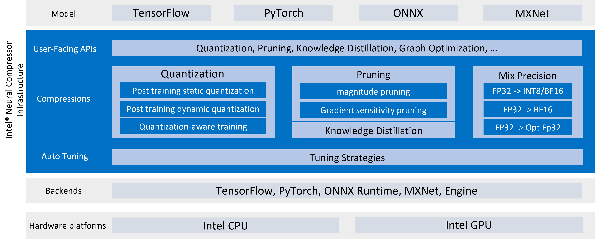
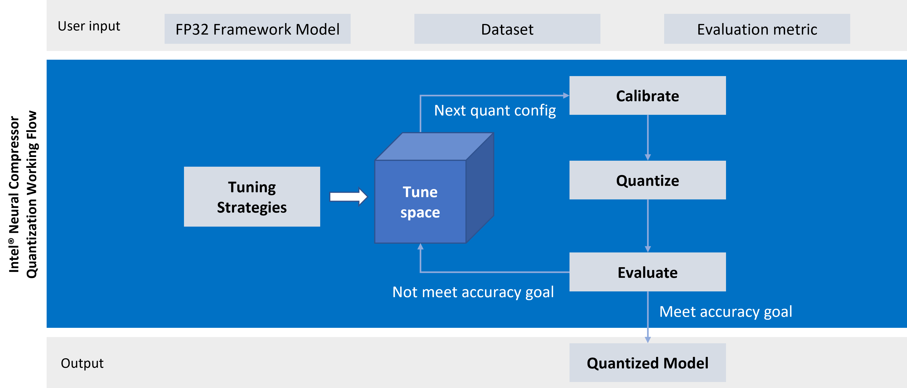

Intel® Low Precision Optimization Tool
======================================

Intel® Low Precision Optimization Tool (Intel® LPOT) is an open-source Python* library that delivers a unified low-precision inference interface across multiple Intel-optimized DL frameworks on both CPUs and GPUs. It supports automatic accuracy-driven tuning strategies, along with additional objectives such as optimizing for performance, model size, and memory footprint. It also provides easy extension capability for new backends, tuning strategies, metrics, and objectives.

> **Note**
>
> GPU support is under development.

<table>
  <tr>
    <td>Infrastructure</td>
    <td>Workflow</td>
  </tr>
  <tr>
    <td></td>
    <td></td>
  </tr>
 </table>

Supported Intel optimized DL frameworks are:
* [TensorFlow\*](https://github.com/Intel-tensorflow/tensorflow), including [1.15.0 UP2](https://github.com/Intel-tensorflow/tensorflow/tree/v1.15.0up2), [1.15.0 UP1](https://github.com/Intel-tensorflow/tensorflow/tree/v1.15.0up1), [2.1.0](https://github.com/Intel-tensorflow/tensorflow/tree/v2.1.0), [2.2.0](https://github.com/Intel-tensorflow/tensorflow/tree/v2.2.0), [2.3.0](https://github.com/Intel-tensorflow/tensorflow/tree/v2.3.0), [2.4.0](https://github.com/Intel-tensorflow/tensorflow/tree/v2.4.0)
* [PyTorch\*](https://pytorch.org/), including [1.5.0+cpu](https://download.pytorch.org/whl/torch_stable.html), [1.6.0+cpu](https://download.pytorch.org/whl/torch_stable.html)
* [Apache\* MXNet](https://mxnet.apache.org), including [1.6.0](https://github.com/apache/incubator-mxnet/tree/1.6.0), [1.7.0](https://github.com/apache/incubator-mxnet/tree/1.7.0)
* [ONNX\* Runtime](https://github.com/microsoft/onnxruntime), including [1.6.0](https://github.com/microsoft/onnxruntime/tree/v1.6.0)


# Installation

The Intel® LPOT library is released as part of
[Intel® oneAPI AI Analytics Toolkit](https://software.intel.com/content/www/us/en/develop/tools/oneapi/ai-analytics-toolkit.html) (AI Kit).
The AI Kit provides a consolidated package of Intel's latest deep learning and
machine optimizations all in one place for ease of development.  Along with
LPOT, the AI Kit includes Intel-optimized versions of deep learning frameworks
(such as TensorFlow and PyTorch) and high performing Python libraries to streamline
end-to-end data science and AI workflows on Intel architectures.

## Install for Linux

You can install just the LPOT library from binary or source, or you can get
the Intel optimized framework together with the LPOT
library by installing the Intel® oneAPI AI Analytics Toolkit.

### Install from binary

  ```shell
  # install from pip
  pip install lpot

  # install from conda
  conda install lpot -c conda-forge -c intel 
  ```

### Install from source

  ```shell
  git clone https://github.com/intel/lpot.git
  cd lpot
  pip install -r requirements.txt
  python setup.py install
  ```
### Install from AI Kit

The AI Kit, which includes the LPOT
library, is distributed through many common channels,
including from Intel's website, YUM, APT, Anaconda, and more.
[Select and download](https://software.intel.com/content/www/us/en/develop/tools/oneapi/ai-analytics-toolkit/download.html)
the AI Kit distribution package that's best suited for you and follow the
[Get Started Guide](https://software.intel.com/content/www/us/en/develop/documentation/get-started-with-ai-linux/top.html)
for post-installation instructions.

|[Download AI Kit](https://software.intel.com/content/www/us/en/develop/tools/oneapi/ai-analytics-toolkit/) |[AI Kit Get Started Guide](https://software.intel.com/content/www/us/en/develop/documentation/get-started-with-ai-linux/top.html) |
|---|---|

## Install for Windows

### **Prerequisites**

The following prerequisites and requirements must be satisfied in order to install successfully：

- Python version: 3.6 or 3.7 or 3.8

- Download and install anaconda: [anaconda](https://anaconda.org/)

- Create a virtual environment named lpot in anaconda:

  ```shell
  # Here we install python 3.7 for instance. You can also choose python 3.6 & 3.8.
  conda create -n lpot python=3.7
  conda activate lpot
  ```

### Install from binary

  ```shell
  # install from pip
  pip install lpot

  # install from conda
  conda install lpot -c conda-forge -c intel 
  ```

### Install from source

  ```shell
  git clone https://github.com/intel/lpot.git
  cd lpot
  pip install -r requirements.txt
  python setup.py install
  ```

# Getting started

* [Introduction](docs/introduction.md) explains Intel® Low Precision Optimization Tool's API.
* [Transform](docs/transform.md) introduces how to utilize LPOT buildin data processing and how to develop a custom data processing method. 
* [Dataset](docs/dataset.md) introudces how to utilize LPOT buildin dataset and how to develop a custom dataset.
* [Metric](docs/metric.md) introduces how to utilize LPOT buildin metrics and how to develop a custom metric.
* [Tutorial](docs/tutorial.md) provides comprehensive instructions on how to utilize Intel® Low Precision Optimization Tool's features with examples. 
* [Examples](examples) are provided to demonstrate the usage of Intel® Low Precision Optimization Tool in different frameworks: [TensorFlow](examples/tensorflow), [PyTorch](examples/pytorch), [MXNet](examples/mxnet) and [ONNX Runtime](examples/onnxrt).
* [UX](docs/ux.md) is a web based system to simplify Intel® Low Precision Optimization Tool usage.
* [Intel oneAPI AI Analytics Toolkit Get Started Guide](https://software.intel.com/content/www/us/en/develop/documentation/get-started-with-ai-linux/top.html) explains the AI Kit components, installation and configuration guides, and instructions for building and running sample apps.
* [AI and Analytics Samples](https://github.com/oneapi-src/oneAPI-samples/tree/master/AI-and-Analytics) includes code samples for Intel oneAPI libraries.


# Deep Dive

* [Quantization](docs/Quantization.md) is the processes that enable inference and training by performing computations at low precision data type, such as fixed point integers. LPOT supports [Post-Training Quantization](docs/PTQ.md) and [Quantization-Aware Training](docs/QAT.md)
* [Pruning](docs/pruning.md) provides a common method for introducing sparsity in weights and activations.
* [Benchmarking](docs/benchmark.md) introduces how to utilize the benchmark interface of LPOT.
* [Mixed precision](docs/mixed_precision.md) introduces how to enable mixed precision, including BFP16 and int8 and FP32, on Intel platforms during tuning.
* [Graph Optimization](docs/graph_optimization.md) introduces how to enable graph optimization for fp32 and auto-mixed precision.
* [TensorBoard](docs/tensorboard.md) provides tensor histogram and execution graph for tuning debugging purpose.


# Advanced Topics

* [Adaptor](docs/adaptor.md) is the interface between LPOT and framework. The method to develop adaptor extension is introduced with ONNX Runtime as example. 
* [Strategy](docs/tuning_strategies.md) can automatically optimized low-precision recipes for deep learning models to achieve optimal product objectives like inference performance and memory usage with expected accuracy criteria. The method to develop a new strategy is introduced.


# System Requirements

Intel® Low Precision Optimization Tool supports systems based on [Intel 64 architecture or compatible processors](https://en.wikipedia.org/wiki/X86-64), specially optimized for the following CPUs:

* Intel Xeon Scalable processor (formerly Skylake, Cascade Lake, and Cooper Lake)
* future Intel Xeon Scalable processor (code name Sapphire Rapids)

Intel® Low Precision Optimization Tool requires installing the pertinent Intel-optimized framework version for TensorFlow, PyTorch, and MXNet.

### Validated Hardware/Software Environment

<table>
<thead>
  <tr>
    <th class="tg-bobw">Platform</th>
    <th class="tg-bobw">OS</th>
    <th class="tg-bobw">Python</th>
    <th class="tg-bobw">Framework</th>
    <th class="tg-bobw">Version</th>
  </tr>
</thead>
<tbody>
  <tr>
    <td class="tg-nrix" rowspan="13">Cascade Lake<br><br>Cooper Lake<br><br>Skylake</td>
    <td class="tg-nrix" rowspan="13">CentOS 7.8<br><br>Ubuntu 18.04</td>
    <td class="tg-nrix" rowspan="13">3.6<br><br>3.7<br><br>3.8</td>
    <td class="tg-cly1" rowspan="7">TensorFlow</td>
    <td class="tg-7zrl">2.4.0</td>
  </tr>
  <tr>
    <td class="tg-7zrl">2.2.0</td>
  </tr>
  <tr>
    <td class="tg-7zrl">1.15.0 UP1</td>
  </tr>
  <tr>
    <td class="tg-7zrl">1.15.0 UP2</td>
  </tr>
  <tr>
    <td class="tg-7zrl">2.3.0</td>
  </tr>
  <tr>
    <td class="tg-7zrl">2.1.0</td>
  </tr>
  <tr>
    <td class="tg-7zrl">1.15.2</td>
  </tr>
  <tr>
    <td class="tg-7zrl" rowspan="3">PyTorch</td>
    <td class="tg-7zrl">1.5.0+cpu</td>
  </tr>
  <tr>
    <td class="tg-7zrl">1.6.0+cpu</td>
  </tr>
  <tr>
    <td class="tg-7zrl">IPEX</td>
  </tr>
  <tr>
    <td class="tg-cly1" rowspan="2">MXNet</td>
    <td class="tg-7zrl">1.7.0</td>
  </tr>
  <tr>
    <td class="tg-7zrl">1.6.0</td>
  </tr>
  <tr>
    <td class="tg-7zrl">ONNX Runtime</td>
    <td class="tg-7zrl">1.6.0</td>
  </tr>
</tbody>
</table>

# Validated Models

Intel® Low Precision Optimization Tool provides numerous examples to show promising accuracy loss with the best performance gain. Below table lists some key models as showcases. Full quantized model list on various frameworks is available in [Model List](docs/full_model_list.md)

<table>
<thead>
  <tr>
    <th rowspan="2">Framework</th>
    <th rowspan="2">version</th>
    <th rowspan="2">Model</th>
    <th rowspan="2">dataset</th>
    <th colspan="3">Accuracy</th>
    <th>Performance speed up</th>
  </tr>
  <tr>
    <td>INT8 Tuning Accuracy</td>
    <td>FP32 Accuracy Baseline</td>
    <td>Acc Ratio[(INT8-FP32)/FP32]</td>
    <td>Realtime Latency Ratio[FP32/INT8]</td>
  </tr>
</thead>
<tbody>
  <tr>
    <td>tensorflow</td>
    <td>2.4.0</td>
    <td>resnet50v1.5</td>
    <td>ImageNet</td>
    <td>76.70%</td>
    <td>76.50%</td>
    <td>0.26%</td>
    <td>3.23x</td>
  </tr>
  <tr>
    <td>tensorflow</td>
    <td>2.4.0</td>
    <td>Resnet101</td>
    <td>ImageNet</td>
    <td>77.20%</td>
    <td>76.40%</td>
    <td>1.05%</td>
    <td>2.42x</td>
  </tr>
  <tr>
    <td>tensorflow</td>
    <td>2.4.0</td>
    <td>inception_v1</td>
    <td>ImageNet</td>
    <td>70.10%</td>
    <td>69.70%</td>
    <td>0.57%</td>
    <td>1.88x</td>
  </tr>
  <tr>
    <td>tensorflow</td>
    <td>2.4.0</td>
    <td>inception_v2</td>
    <td>ImageNet</td>
    <td>74.10%</td>
    <td>74.00%</td>
    <td>0.14%</td>
    <td>1.96x</td>
  </tr>
  <tr>
    <td>tensorflow</td>
    <td>2.4.0</td>
    <td>inception_v3</td>
    <td>ImageNet</td>
    <td>77.20%</td>
    <td>76.70%</td>
    <td>0.65%</td>
    <td>2.36x</td>
  </tr>
  <tr>
    <td>tensorflow</td>
    <td>2.4.0</td>
    <td>inception_v4</td>
    <td>ImageNet</td>
    <td>80.00%</td>
    <td>80.30%</td>
    <td>-0.37%</td>
    <td>2.59x</td>
  </tr>
  <tr>
    <td>tensorflow</td>
    <td>2.4.0</td>
    <td>inception_resnet_v2</td>
    <td>ImageNet</td>
    <td>80.10%</td>
    <td>80.40%</td>
    <td>-0.37%</td>
    <td>1.97x</td>
  </tr>
  <tr>
    <td>tensorflow</td>
    <td>2.4.0</td>
    <td>Mobilenetv1</td>
    <td>ImageNet</td>
    <td>71.10%</td>
    <td>71.00%</td>
    <td>0.14%</td>
    <td>2.88x</td>
  </tr>
  <tr>
    <td>tensorflow</td>
    <td>2.4.0</td>
    <td>ssd_resnet50_v1</td>
    <td>Coco</td>
    <td>37.90%</td>
    <td>38.00%</td>
    <td>-0.26%</td>
    <td>2.97x</td>
  </tr>
  <tr>
    <td>tensorflow</td>
    <td>2.4.0</td>
    <td>mask_rcnn_inception_v2</td>
    <td>Coco</td>
    <td>28.90%</td>
    <td>29.10%</td>
    <td>-0.69%</td>
    <td>2.66x</td>
  </tr>
  <tr>
    <td>tensorflow</td>
    <td>2.4.0</td>
    <td>vgg16</td>
    <td>ImageNet</td>
    <td>72.50%</td>
    <td>70.90%</td>
    <td>2.26%</td>
    <td>3.75x</td>
  </tr>
  <tr>
    <td>tensorflow</td>
    <td>2.4.0</td>
    <td>vgg19</td>
    <td>ImageNet</td>
    <td>72.40%</td>
    <td>71.00%</td>
    <td>1.97%</td>
    <td>3.79x</td>
  </tr>
</tbody>
</table>


<table>
<thead>
  <tr>
    <th rowspan="2">Framework</th>
    <th rowspan="2">version</th>
    <th rowspan="2">model</th>
    <th rowspan="2">dataset</th>
    <th colspan="3">Accuracy</th>
    <th>Performance speed up</th>
  </tr>
  <tr>
    <td>INT8 Tuning Accuracy</td>
    <td>FP32 Accuracy Baseline</td>
    <td>Acc Ratio[(INT8-FP32)/FP32]</td>
    <td>Realtime Latency Ratio[FP32/INT8]</td>
  </tr>
</thead>
<tbody>
  <tr>
    <td>pytorch</td>
    <td>1.5.0+cpu</td>
    <td>resnet50</td>
    <td>ImageNet</td>
    <td>75.96%</td>
    <td>76.13%</td>
    <td>-0.23%</td>
    <td>2.63x</td>
  </tr>
  <tr>
    <td>pytorch</td>
    <td>1.5.0+cpu</td>
    <td>resnext101_32x8d</td>
    <td>ImageNet</td>
    <td>79.12%</td>
    <td>79.31%</td>
    <td>-0.24%</td>
    <td>2.61x</td>
  </tr>
  <tr>
    <td>pytorch</td>
    <td>1.6.0a0+24aac32</td>
    <td>bert_base_mrpc</td>
    <td>MRPC</td>
    <td>88.90%</td>
    <td>88.73%</td>
    <td>0.19%</td>
    <td>1.98x</td>
  </tr>
  <tr>
    <td>pytorch</td>
    <td>1.6.0a0+24aac32</td>
    <td>bert_base_cola</td>
    <td>COLA</td>
    <td>59.06%</td>
    <td>58.84%</td>
    <td>0.37%</td>
    <td>2.19x</td>
  </tr>
  <tr>
    <td>pytorch</td>
    <td>1.6.0a0+24aac32</td>
    <td>bert_base_sts-b</td>
    <td>STS-B</td>
    <td>88.40%</td>
    <td>89.27%</td>
    <td>-0.97%</td>
    <td>2.28x</td>
  </tr>
  <tr>
    <td>pytorch</td>
    <td>1.6.0a0+24aac32</td>
    <td>bert_base_sst-2</td>
    <td>SST-2</td>
    <td>91.51%</td>
    <td>91.86%</td>
    <td>-0.37%</td>
    <td>2.30x</td>
  </tr>
  <tr>
    <td>pytorch</td>
    <td>1.6.0a0+24aac32</td>
    <td>bert_base_rte</td>
    <td>RTE</td>
    <td>69.31%</td>
    <td>69.68%</td>
    <td>-0.52%</td>
    <td>2.15x</td>
  </tr>
  <tr>
    <td>pytorch</td>
    <td>1.6.0a0+24aac32</td>
    <td>bert_large_mrpc</td>
    <td>MRPC</td>
    <td>87.45%</td>
    <td>88.33%</td>
    <td>-0.99%</td>
    <td>2.73x</td>
  </tr>
  <tr>
    <td>pytorch</td>
    <td>1.6.0a0+24aac32</td>
    <td>bert_large_squad</td>
    <td>SQUAD</td>
    <td>92.85%</td>
    <td>93.05%</td>
    <td>-0.21%</td>
    <td>2.01x</td>
  </tr>
  <tr>
    <td>pytorch</td>
    <td>1.6.0a0+24aac32</td>
    <td>bert_large_qnli</td>
    <td>QNLI</td>
    <td>91.20%</td>
    <td>91.82%</td>
    <td>-0.68%</td>
    <td>2.69x</td>
  </tr>
</tbody>
</table>


# Known Issues

The MSE tuning strategy does not work with the PyTorch adaptor layer. This strategy requires a comparison between the FP32 and INT8 tensors to decide which op impacts the final quantization accuracy. The PyTorch adaptor layer does not implement this inspect tensor interface. Therefore, do not choose the MSE tuning strategy for PyTorch models.

# Incompatible Changes

[LPOT v1.2](https://github.com/intel/lpot/tree/v1.2) introduces incompatible changes in user facing APIs. Please refer to [incompatible changes](./docs/incompatible_changes.md) to know which incompatible changes are made in v1.2.

[LPOT v1.2.1](https://github.com/intel/lpot/tree/v1.2.1) solves this backward compatible issues introduced in v1.2 by moving new user facing APIs to lpot.experimental package and keep old one as is. Please refer to [introduction](./docs/introduction.md) to know the details of user-facing APIs.

# Support

Submit your questions, feature requests, and bug reports to the
[GitHub issues](https://github.com/intel/lpot/issues) page. You may also reach out to lpot.maintainers@intel.com.

# Contribution

We welcome community contributions to Intel® Low Precision Optimization
Tool. If you have an idea on how to improve the library, refer to the following:

* For changes impacting the public API, submit an [RFC pull request](CONTRIBUTING.md#RFC_pull_requests).
* Ensure that the changes are consistent with the [code contribution guidelines](CONTRIBUTING.md#code_contribution_guidelines) and [coding style](CONTRIBUTING.md#coding_style).
* Ensure that you can run all the examples with your patch.
* Submit a [pull request](https://github.com/intel/lpot/pulls).

For additional details, see [contribution guidelines](CONTRIBUTING.md).

This project is intended to be a safe, welcoming space for collaboration, and contributors are expected to adhere to the [Contributor Covenant](CODE_OF_CONDUCT.md) code of conduct.

# License

Intel® Low Precision Optimization Tool is licensed under [Apache License Version 2.0](http://www.apache.org/licenses/LICENSE-2.0). This software includes components that have separate copyright notices and licensing terms. Your use of the source code for these components is subject to the terms and conditions of the following licenses.

Apache License Version 2.0:
* [Intel TensorFlow Quantization Tool](https://github.com/IntelAI/tools)

MIT License:
* [bayesian-optimization](https://github.com/fmfn/BayesianOptimization)

See the accompanying [LICENSE](LICENSE) file for full license text and copyright notices.

--------

View [Legal Information](legal_information.md).

## Citation

If you use Intel® Low Precision Optimization Tool in your research or you wish to refer to the tuning results published in the [Validated Models](#validated-models), use the following BibTeX entry.

```
@misc{Intel® Low Precision Optimization Tool,
  author =       {Feng Tian, Chuanqi Wang, Guoming Zhang, Penghui Cheng, Pengxin Yuan, Haihao Shen, and Jiong Gong},
  title =        {Intel® Low Precision Optimization Tool},
  howpublished = {\url{https://github.com/intel/lpot}},
  year =         {2020}
}
```

