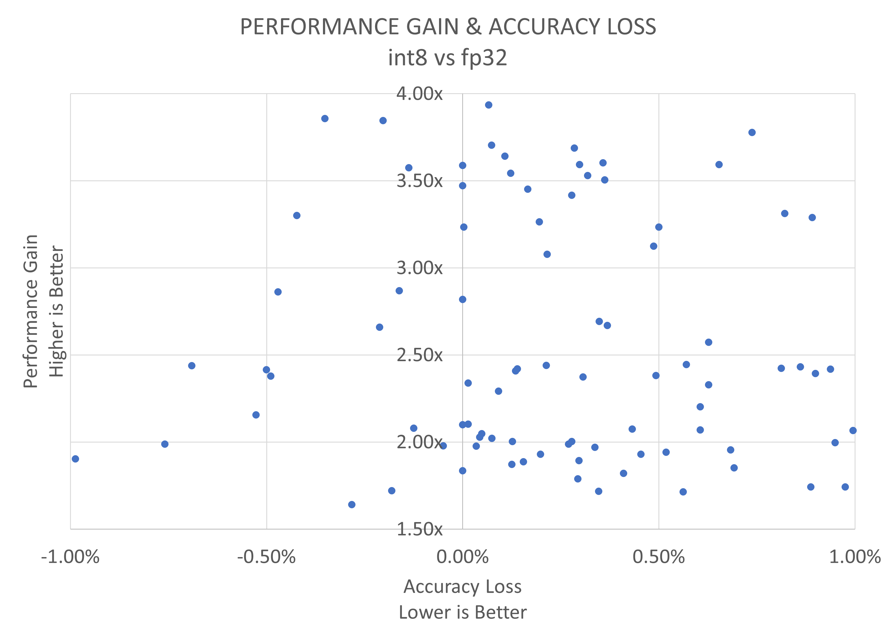

<div align="center">
  
Intel® Neural Compressor
===========================
<h3> An open-source Python library supporting popular network compression technologies on all mainstream deep learning frameworks (TensorFlow, PyTorch, ONNX Runtime, and MXNet)</h3>

[](https://github.com/intel/neural-compressor)
[](https://github.com/intel/neural-compressor/releases)
[](https://github.com/intel/neural-compressor/blob/master/LICENSE)
[](https://pepy.tech/project/neural-compressor)
</div>

---

Intel® Neural Compressor, formerly known as Intel® Low Precision Optimization Tool, an open-source Python library running on Intel CPUs and GPUs, which delivers unified interfaces across multiple deep learning frameworks for popular network compression technologies, such as quantization, pruning, knowledge distillation. This tool supports automatic accuracy-driven tuning strategies to help user quickly find out the best quantized model. It also implements different weight pruning algorithms to generate pruned model with predefined sparsity goal and supports knowledge distillation to distill the knowledge from the teacher model to the student model. 
Intel® Neural Compressor has been one of the critical AI software components in [Intel® oneAPI AI Analytics Toolkit](https://software.intel.com/content/www/us/en/develop/tools/oneapi/ai-analytics-toolkit.html).

> **Note:**
> GPU support is under development.

**Visit the Intel® Neural Compressor online document website at: <https://intel.github.io/neural-compressor>.**   

## Installation

**Prerequisites**

- Python version: 3.7 or 3.8 or 3.9 or 3.10

**Install on Linux**
  ```Shell
  # install stable version from pip
  pip install neural-compressor

  # install nightly version from pip
  pip install -i https://test.pypi.org/simple/ neural-compressor

  # install stable version from from conda
  conda install neural-compressor -c conda-forge -c intel 
  ```
More installation methods can be found at [Installation Guide](./docs/installation_guide.md).  
> **Note:**
> Run into installation issues, please check [FAQ](./docs/faq.md). 

## Getting Started
* Quantization with Python API  

```shell
# A TensorFlow Example
pip install tensorflow
# Prepare fp32 model
wget https://storage.googleapis.com/intel-optimized-tensorflow/models/v1_6/mobilenet_v1_1.0_224_frozen.pb
```
```python
import tensorflow as tf
from neural_compressor.experimental import Quantization, common
tf.compat.v1.disable_eager_execution()
quantizer = Quantization()
quantizer.model = './mobilenet_v1_1.0_224_frozen.pb'
dataset = quantizer.dataset('dummy', shape=(1, 224, 224, 3))
quantizer.calib_dataloader = common.DataLoader(dataset)
quantizer.fit()
```
* Quantization with [GUI](./docs/bench.md)
```shell
# An ONNX Example
pip install onnx==1.9.0 onnxruntime==1.10.0 onnxruntime-extensions
# Prepare fp32 model
wget https://github.com/onnx/models/blob/main/vision/classification/resnet/model/resnet50-v1-12.onnx
# Start GUI
inc_bench
```
<a target="_blank" href="./docs/imgs/INC_GUI.gif">
  
</a>

## System Requirements

Intel® Neural Compressor supports systems based on [Intel 64 architecture or compatible processors](https://en.wikipedia.org/wiki/X86-64), specially optimized for the following CPUs:

* Intel Xeon Scalable processor (formerly Skylake, Cascade Lake, Cooper Lake, and Icelake)
* Future Intel Xeon Scalable processor (code name Sapphire Rapids)

### Validated Software Environment

* OS version: CentOS 8.4, Ubuntu 20.04  
* Python version: 3.7, 3.8, 3.9, 3.10  

<table class="docutils">
<thead>
  <tr>
    <th>Framework</th>
    <th>TensorFlow</th>
    <th>Intel TensorFlow</th>
    <th>PyTorch</th>
    <th>IPEX</th>
    <th>ONNX Runtime</th>
    <th>MXNet</th>
  </tr>
</thead>
<tbody>
  <tr align="center">
    <th>Version</th>
    <td class="tg-7zrl"><a href=https://github.com/tensorflow/tensorflow/tree/v2.9.1>2.9.1</a><br>
    <a href=https://github.com/tensorflow/tensorflow/tree/v2.8.2>2.8.2</a><br>
    <a href=https://github.com/tensorflow/tensorflow/tree/v2.7.3>2.7.3</a><br>
    <td class="tg-7zrl"><a href=https://github.com/Intel-tensorflow/tensorflow/tree/v2.8.0>2.8.0</a><br>
    <a href=https://github.com/Intel-tensorflow/tensorflow/tree/v2.7.0>2.7.0</a><br>
    <a href=https://github.com/Intel-tensorflow/tensorflow/tree/v1.15.0up3>1.15.0UP3</a></td>
    <td class="tg-7zrl"><a href=https://download.pytorch.org/whl/torch_stable.html>1.11.0+cpu</a><br>
    <a href=https://download.pytorch.org/whl/torch_stable.html>1.10.0+cpu</a><br>
    <a href=https://download.pytorch.org/whl/torch_stable.html>1.9.0+cpu</a></td>
    <td class="tg-7zrl"><a href=https://github.com/intel/intel-extension-for-pytorch/tree/v1.11.0>1.11.0</a><br>
    <a href=https://github.com/intel/intel-extension-for-pytorch/tree/v1.10.0>1.10.0</a><br>
    <a href=https://github.com/intel/intel-extension-for-pytorch/tree/v1.9.0>1.9.0</a></td>
    <td class="tg-7zrl"><a href=https://github.com/microsoft/onnxruntime/tree/v1.10.0>1.10.0</a><br>
    <a href=https://github.com/microsoft/onnxruntime/tree/v1.9.0>1.9.0</a><br>
    <a href=https://github.com/microsoft/onnxruntime/tree/v1.8.0>1.8.0</a></td>
    <td class="tg-7zrl"><a href=https://github.com/apache/incubator-mxnet/tree/1.8.0>1.8.0</a><br>
    <a href=https://github.com/apache/incubator-mxnet/tree/1.7.0>1.7.0</a><br>
    <a href=https://github.com/apache/incubator-mxnet/tree/1.6.0>1.6.0</a></td>
  </tr>
</tbody>
</table>

> Note: 1.Starting from official TensorFlow 2.6.0, oneDNN has been default in the binary. Please set the environment variable TF_ENABLE_ONEDNN_OPTS=1 to enable the oneDNN optimizations.  
> 2.Starting from official TensorFlow 2.9.0, oneDNN optimizations are enabled by default on CPUs with neural-network-focused hardware features such as AVX512_VNNI, AVX512_BF16, AMX, etc. No need to set environment variable.

### Validated Models
Intel® Neural Compressor validated 420+ [examples](./examples) with performance speedup geomean 2.2x and up to 4.2x on VNNI while minimizing the accuracy loss. 
More details for validated models are available [here](docs/validated_model_list.md).   

<a target="_blank" href="./docs/imgs/INC-release-data.png">
  
</a>

## Documentation

<table class="docutils">
  <thead>
  <tr>
    <th colspan="9">Overview</th>
  </tr>
  </thead>
  <tbody>
    <tr>
      <td colspan="3" align="center"><a href="docs/infrastructure.md">Infrastructure</a></td>
      <td colspan="2" align="center"><a href="docs/tutorial.md">Tutorial</a></td>
      <td colspan="2" align="center"><a href="./examples">Examples</a></td>
      <td colspan="1" align="center"><a href="docs/bench.md">GUI</a></td>
      <td colspan="1" align="center"><a href="docs/api-introduction.md">APIs</a></td>
    </tr>
    <tr>
      <td colspan="5" align="center"><a href="https://software.intel.com/content/www/us/en/develop/documentation/get-started-with-ai-linux/top.html">Intel oneAPI AI Analytics Toolkit</a></td>
      <td colspan="4" align="center"><a href="https://github.com/oneapi-src/oneAPI-samples/tree/master/AI-and-Analytics">AI and Analytics Samples</a></td>
    </tr>
  </tbody>
  <thead>
  <tr>
    <th colspan="9">Basic API</th>
  </tr>
  </thead>
  <tbody>
    <tr>
      <td colspan="2" align="center"><a href="docs/transform.md">Transform</a></td>
      <td colspan="2" align="center"><a href="docs/dataset.md">Dataset</a></td>
      <td colspan="2" align="center"><a href="docs/metric.md">Metric</a></td>
      <td colspan="3" align="center"><a href="docs/objective.md">Objective</a></td>
    </tr>
  </tbody>
  <thead>
    <tr>
      <th colspan="9">Deep Dive</th>
    </tr>
  </thead>
  <tbody>
    <tr>
        <td colspan="2" align="center"><a href="docs/Quantization.md">Quantization</a></td>
        <td colspan="1" align="center"><a href="docs/pruning.md">Pruning</a> <a href="docs/sparsity.md">(Sparsity)</a> </td> 
        <td colspan="3" align="center"><a href="docs/distillation.md">Knowledge Distillation</a></td>
        <td colspan="3" align="center"><a href="docs/mixed_precision.md">Mixed precision</a></td>
    </tr>
    <tr>
        <td colspan="2" align="center"><a href="docs/benchmark.md">Benchmarking</a></td>
        <td colspan="3" align="center"><a href="docs/distributed.md">Distributed Training</a></td>
        <td colspan="2" align="center"><a href="docs/model_conversion.md">Model Conversion</a></td>
        <td colspan="2" align="center"><a href="docs/tensorboard.md">TensorBoard</a></td>
    </tr>
  </tbody>
  <thead>
      <tr>
        <th colspan="9">Advanced Topics</th>
      </tr>
  </thead>
  <tbody>
      <tr>
          <td colspan="3" align="center"><a href="docs/adaptor.md">Adaptor</a></td>
          <td colspan="3" align="center"><a href="docs/tuning_strategies.md">Strategy</a></td>
          <td colspan="3" align="center"><a href="docs/reference_examples.md">Reference Example</a></td>
      </tr>
  </tbody>
</table>

## Selected Publications
* [Intel® Deep Learning Boost - Boost Network Security AI Inference Performance in Google Cloud Platform (GCP)](https://networkbuilders.intel.com/solutionslibrary/intel-deep-learning-boost-boost-network-security-ai-inference-performance-in-google-cloud-platform-gcp-technology-guide) (Apr 2022)
* [Intel® Neural Compressor joined PyTorch ecosystem tool ](https://pytorch.org/ecosystem/) (Apr 2022)
* [New instructions in the Intel® Xeon® Scalable processors combined with optimized software frameworks enable real-time AI within network workloads](https://builders.intel.com/docs/networkbuilders/ai-technologies-unleash-ai-innovation-in-network-applications-solution-brief-1637303210.pdf) (Feb 2022)
* [Quantizing ONNX Models using Intel® Neural Compressor](https://community.intel.com/t5/Blogs/Tech-Innovation/Artificial-Intelligence-AI/Quantizing-ONNX-Models-using-Intel-Neural-Compressor/post/1355237) (Feb 2022)
* [Quantize AI Model by Intel® oneAPI AI Analytics Toolkit on Alibaba Cloud](https://www.intel.com/content/www/us/en/developer/articles/technical/quantize-ai-by-oneapi-analytics-on-alibaba-cloud.html) (Feb 2022)

> View the [full publication list](docs/publication_list.md).

## Additional Content

* [Release Information](docs/releases_info.md)
* [Contribution Guidelines](docs/contributions.md)
* [Legal Information](docs/legal_information.md)
* [Security Policy](docs/security_policy.md)
* [Intel® Neural Compressor Website](https://intel.github.io/neural-compressor)

## Hiring

We are hiring. Please send your resume to inc.maintainers@intel.com if you have interests in model compression techniques.
