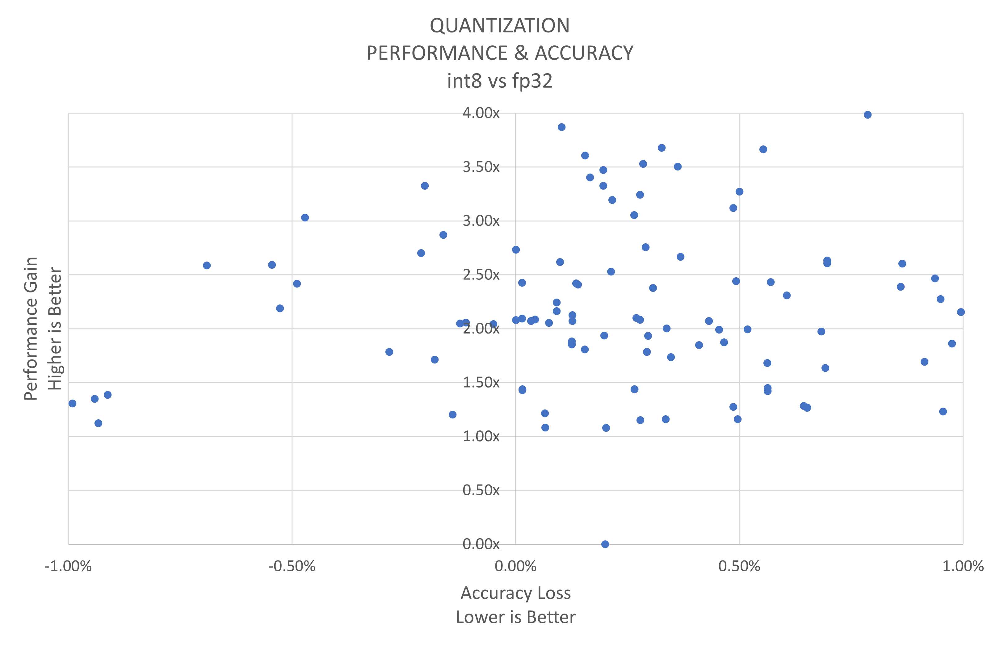

<div align="center">
  
Intel® Neural Compressor
===========================
<h3> An open-source Python library supporting popular model compression techniques on all mainstream deep learning frameworks (TensorFlow, PyTorch, ONNX Runtime, and MXNet)</h3>

[](https://github.com/intel/neural-compressor)
[](https://github.com/intel/neural-compressor/releases)
[](https://github.com/intel/neural-compressor/blob/master/LICENSE)
[](https://github.com/intel/neural-compressor)
[](https://pepy.tech/project/neural-compressor)
</div>

---
<div align="left">

Intel® Neural Compressor, formerly known as Intel® Low Precision Optimization Tool, is an open-source Python library that runs on Intel CPUs and GPUs, which delivers unified interfaces across multiple deep-learning frameworks for popular network compression technologies such as quantization, pruning, and knowledge distillation. This tool supports automatic accuracy-driven tuning strategies to help the user quickly find out the best quantized model. It also implements different weight-pruning algorithms to generate a pruned model with predefined sparsity goal. It also supports knowledge distillation to distill the knowledge from the teacher model to the student model. 
Intel® Neural Compressor is a critical AI software component in the [Intel® oneAPI AI Analytics Toolkit](https://software.intel.com/content/www/us/en/develop/tools/oneapi/ai-analytics-toolkit.html).


**Visit the Intel® Neural Compressor online document website at: <https://intel.github.io/neural-compressor>.**   

## Installation

### Prerequisites

Python version: 3.7, 3.8, 3.9, 3.10

### Install on Linux
- Release binary install 
  ```Shell
  # install stable basic version from pip
  pip install neural-compressor
  # Or install stable full version from pip (including GUI)
  pip install neural-compressor-full
  ```
- Nightly binary install
  ```Shell
  git clone https://github.com/intel/neural-compressor.git
  cd neural-compressor
  pip install -r requirements.txt
  # install nightly basic version from pip
  pip install -i https://test.pypi.org/simple/ neural-compressor
  # Or install nightly full version from pip (including GUI)
  pip install -i https://test.pypi.org/simple/ neural-compressor-full
  ```
More installation methods can be found at [Installation Guide](./docs/installation_guide.md). Please check out our [FAQ](./docs/faq.md) for more details.

## Getting Started
### Quantization with Python API    

```shell
# A TensorFlow Example
pip install tensorflow
# Prepare fp32 model
wget https://storage.googleapis.com/intel-optimized-tensorflow/models/v1_6/mobilenet_v1_1.0_224_frozen.pb
```
```python
import tensorflow as tf
from neural_compressor.experimental import Quantization, common
quantizer = Quantization()
quantizer.model = './mobilenet_v1_1.0_224_frozen.pb'
dataset = quantizer.dataset('dummy', shape=(1, 224, 224, 3))
quantizer.calib_dataloader = common.DataLoader(dataset)
quantizer.fit()
```
### Quantization with [JupyterLab Extension](./neural_coder/extensions/neural_compressor_ext_lab/README.md)
Search for ```jupyter-lab-neural-compressor``` in the Extension Manager in JupyterLab and install with one click:

<a target="_blank" href="./neural_coder/extensions/screenshots/extmanager.png">
  
</a>
  
### Quantization with [GUI](./docs/bench.md)
```shell
# An ONNX Example
pip install onnx==1.12.0 onnxruntime==1.12.1 onnxruntime-extensions
# Prepare fp32 model
wget https://github.com/onnx/models/raw/main/vision/classification/resnet/model/resnet50-v1-12.onnx
# Start GUI
inc_bench
```
<a target="_blank" href="./docs/imgs/INC_GUI.gif">
  
</a>

## System Requirements

### Validated Hardware Environment
#### Intel® Neural Compressor supports CPUs based on [Intel 64 architecture or compatible processors](https://en.wikipedia.org/wiki/X86-64):

* Intel Xeon Scalable processor (formerly Skylake, Cascade Lake, Cooper Lake, and Icelake)
* Future Intel Xeon Scalable processor (code name Sapphire Rapids)

#### Intel® Neural Compressor supports GPUs built on Intel's Xe architecture:

* [Intel® Data Center GPU Flex Series](https://www.intel.com/content/www/us/en/products/docs/discrete-gpus/data-center-gpu/flex-series/overview.html)

#### Intel® Neural Compressor quantized models are scalable for broad devices:

* Examples of ONNX INT8 model quantized by Intel® Neural Compressor verified with accuracy on INTEL/AMD/ARM CPUs and NV GPU.
<table class="tg">
<thead>
  <tr>
    <th class="tg-twlt" rowspan="2">INC quantized models</th>
    <th class="tg-aldk" rowspan="2">Intel ICX</th>
    <th class="tg-aldk" rowspan="2">NV A100 CUDA <br>Execution Provider</th>
    <th class="tg-aldk" rowspan="2">AMD Milan</th>
    <th class="tg-aldk" rowspan="2">ARM Graviton2</th>
  </tr>
</thead>
<tbody align="center">
  <tr>
    <td class="tg-cwad">ResNet50 QDQ</td>
    <td class="tg-cwad">74%</td>
    <td class="tg-cwad">74%</td>
    <td class="tg-cwad">73%</td>
    <td class="tg-cwad">74%</td>
  </tr>
  <tr>
    <td class="tg-cwad">BERT-base QDQ</td>
    <td class="tg-cwad">86%</td>
    <td class="tg-cwad">85%</td>
    <td class="tg-cwad">86%</td>
    <td class="tg-cwad">86%</td>
  </tr>
</tbody>
</table>

> **Note:**
> More examples validated on [AWS](https://aws.amazon.com/ec2/instance-types/) please check [extension list](./docs/validated_model_list.md#Validated-ONNX-INT8-models-accuracy-on-broad-hardware). 

### Validated Software Environment

* OS version: CentOS 8.4, Ubuntu 20.04  
* Python version: 3.7, 3.8, 3.9, 3.10  

<table class="docutils">
<thead>
  <tr>
    <th>Framework</th>
    <th>TensorFlow</th>
    <th>Intel TensorFlow</th>
    <th>PyTorch</th>
    <th>IPEX</th>
    <th>ONNX Runtime</th>
    <th>MXNet</th>
  </tr>
</thead>
<tbody>
  <tr align="center">
    <th>Version</th>
    <td class="tg-7zrl"><a href=https://github.com/tensorflow/tensorflow/tree/v2.10.0>2.10.0</a><br>
    <a href=https://github.com/tensorflow/tensorflow/tree/v2.9.1>2.9.1</a><br>
    <a href=https://github.com/tensorflow/tensorflow/tree/v2.8.2>2.8.2</a><br>
    <td class="tg-7zrl"><a href=https://github.com/Intel-tensorflow/tensorflow/tree/v2.10.0>2.10.0</a><br>
    <a href=https://github.com/Intel-tensorflow/tensorflow/tree/v2.9.1>2.9.1</a><br>
    <a href=https://github.com/Intel-tensorflow/tensorflow/tree/v2.8.0>2.8.0</a><br>
    <td class="tg-7zrl"><a href=https://download.pytorch.org/whl/torch_stable.html>1.12.1+cpu</a><br>
    <a href=https://download.pytorch.org/whl/torch_stable.html>1.11.0+cpu</a><br>
    <a href=https://download.pytorch.org/whl/torch_stable.html>1.10.0+cpu</a></td>
    <td class="tg-7zrl"><a href=https://github.com/intel/intel-extension-for-pytorch/tree/v1.12.0>1.12.0</a><br>
    <a href=https://github.com/intel/intel-extension-for-pytorch/tree/1.11.0>1.11.0</a><br>
    <a href=https://github.com/intel/intel-extension-for-pytorch/tree/v1.10.0>1.10.0</a></td>
    <td class="tg-7zrl"><a href=https://github.com/microsoft/onnxruntime/tree/v1.12.1>1.12.1</a><br>
    <a href=https://github.com/microsoft/onnxruntime/tree/v1.11.0>1.11.0</a><br>
    <a href=https://github.com/microsoft/onnxruntime/tree/v1.10.0>1.10.0</a></td>
    <td class="tg-7zrl"><a href=https://github.com/apache/incubator-mxnet/tree/1.8.0>1.8.0</a><br>
    <a href=https://github.com/apache/incubator-mxnet/tree/1.7.0>1.7.0</a><br>
    <a href=https://github.com/apache/incubator-mxnet/tree/1.6.0>1.6.0</a></td>
  </tr>
</tbody>
</table>

> **Note:**
> Set the environment variable ``TF_ENABLE_ONEDNN_OPTS=1`` to enable oneDNN optimizations if you are using TensorFlow v2.6 to v2.8. oneDNN is the default for TensorFlow v2.9.

### Validated Models
Intel® Neural Compressor validated 420+ [examples](./examples) for quantization with a performance speedup geomean of 2.2x and up to 4.2x on VNNI while minimizing accuracy loss. Over 30 pruning and knowledge distillation samples are also available. More details for validated models are available [here](docs/validated_model_list.md).   

<div style = "width: 77%; margin-bottom: 2%;">
  <a target="_blank" href="./docs/imgs/release_data.png">
    
  </a>
</div>

## Documentation

<table class="docutils">
  <thead>
  <tr>
    <th colspan="9">Overview</th>
  </tr>
  </thead>
  <tbody>
    <tr>
      <td colspan="3" align="center"><a href="docs/design.md">Architecture</a></td>
      <td colspan="2" align="center"><a href="https://github.com/intel/neural-compressor/tree/master/examples">Examples</a></td>
      <td colspan="2" align="center"><a href="docs/bench.md">GUI</a></td>
      <td colspan="2" align="center"><a href="docs/api-introduction.md">APIs</a></td>
    </tr>
    <tr>
      <td colspan="5" align="center"><a href="https://software.intel.com/content/www/us/en/develop/documentation/get-started-with-ai-linux/top.html">Intel oneAPI AI Analytics Toolkit</a></td>
      <td colspan="4" align="center"><a href="https://github.com/oneapi-src/oneAPI-samples/tree/master/AI-and-Analytics">AI and Analytics Samples</a></td>
    </tr>
  </tbody>
  <thead>
  <tr>
    <th colspan="9">Basic API</th>
  </tr>
  </thead>
  <tbody>
    <tr>
      <td colspan="2" align="center"><a href="docs/transform.md">Transform</a></td>
      <td colspan="2" align="center"><a href="docs/dataset.md">Dataset</a></td>
      <td colspan="2" align="center"><a href="docs/metric.md">Metric</a></td>
      <td colspan="3" align="center"><a href="docs/objective.md">Objective</a></td>
    </tr>
  </tbody>
  <thead>
    <tr>
      <th colspan="9">Deep Dive</th>
    </tr>
  </thead>
  <tbody>
    <tr>
        <td colspan="2" align="center"><a href="docs/Quantization.md">Quantization</a></td>
        <td colspan="1" align="center"><a href="docs/pruning.md">Pruning</a> <a href="docs/sparsity.md">(Sparsity)</a> </td> 
        <td colspan="2" align="center"><a href="docs/distillation.md">Knowledge Distillation</a></td>
        <td colspan="2" align="center"><a href="docs/mixed_precision.md">Mixed Precision</a></td>
        <td colspan="2" align="center"><a href="docs/orchestration.md">Orchestration</a></td>
    </tr>
    <tr>
        <td colspan="2" align="center"><a href="docs/benchmark.md">Benchmarking</a></td>
        <td colspan="3" align="center"><a href="docs/distributed.md">Distributed Training</a></td>
        <td colspan="2" align="center"><a href="docs/model_conversion.md">Model Conversion</a></td>
        <td colspan="2" align="center"><a href="docs/tensorboard.md">TensorBoard</a></td>
    </tr>
    <tr>
        <td colspan="4" align="center"><a href="docs/distillation_quantization.md">Distillation for Quantization</a></td>
        <td colspan="5" align="center"><a href="neural_coder">Neural Coder</a></td>
    </tr>    
    
  </tbody>
  <thead>
      <tr>
        <th colspan="9">Advanced Topics</th>
      </tr>
  </thead>
  <tbody>
      <tr>
          <td colspan="3" align="center"><a href="docs/adaptor.md">Adaptor</a></td>
          <td colspan="3" align="center"><a href="docs/tuning_strategies.md">Strategy</a></td>
          <td colspan="3" align="center"><a href="docs/reference_examples.md">Reference Example</a></td>
      </tr>
  </tbody>
</table>

## Selected Publications
* [Meet the Innovation of Intel AI Software: Intel® Extension for TensorFlow*](https://www.intel.com/content/www/us/en/developer/articles/technical/innovation-of-ai-software-extension-tensorflow.html) (Oct 2022)
* [PyTorch* Inference Acceleration with Intel® Neural Compressor](https://www.intel.com/content/www/us/en/developer/articles/technical/pytorch-inference-with-intel-neural-compressor.html#gs.gnq0cj) (Oct 2022)
* Neural Coder, a new plug-in for Intel Neural Compressor was covered by [Twitter](https://intel.sharepoint.com/sites/iLit-MyLearning/Shared%20Documents/My%20Learning/Haihao/MSR/2022/o%09https:/twitter.com/IntelDevTools/status/1583629213697212416?s=20&t=f2dXY_g9-bCO-GQm-S6Btg), [LinkedIn](https://www.linkedin.com/posts/intel-software_oneapi-ai-deeplearning-activity-6989377309917007872-Dbzg?utm_source=share&utm_medium=member_desktop), and [Intel Developer Zone](https://mp.weixin.qq.com/s/LL-4eD-R0YagFgODM23oQA) from Intel, and [Twitter](https://twitter.com/IntelDevTools/status/1583629213697212416/retweets) and [LinkedIn](https://www.linkedin.com/feed/update/urn:li:share:6990377841435574272/) from Hugging Face. (Oct 2022)
* Intel Neural Compressor successfully landed on [GCP](https://console.cloud.google.com/marketplace/product/bitnami-launchpad/inc-tensorflow-intel?project=verdant-sensor-286207), [AWS](https://aws.amazon.com/marketplace/pp/prodview-yjyh2xmggbmga#pdp-support), and [Azure](https://azuremarketplace.microsoft.com/en-us/marketplace/apps/bitnami.inc-tensorflow-intel) marketplace. (Oct 2022)
* [Neural Coder (Intel Neural Compressor Plug-in): One-Click, No-Code Solution (Pat's Keynote IntelON 2022)](https://twitter.com/i/status/1574909338203967497) (Sep 2022)
* [Alibaba Cloud and Intel Neural Compressor Deliver Better Productivity for PyTorch Users](https://medium.com/intel-analytics-software/alibaba-cloud-collaborates-with-intel-neural-compressor-for-better-productivity-and-performance-83cdb6500420) (Sep 2022)
* [Efficient Text Classification with Intel Neural Compressor](https://medium.com/intel-analytics-software/efficient-text-classification-with-intel-neural-compressor-4853296deeac) (Sep 2022)

> View our [full publication list](docs/publication_list.md).

## Additional Content

* [Release Information](docs/releases_info.md)
* [Contribution Guidelines](docs/contributions.md)
* [Legal Information](docs/legal_information.md)
* [Security Policy](SECURITY.md)
* [Intel® Neural Compressor Website](https://intel.github.io/neural-compressor)

## Hiring

We are actively hiring. Send your resume to inc.maintainers@intel.com if you are interested in model compression techniques.
