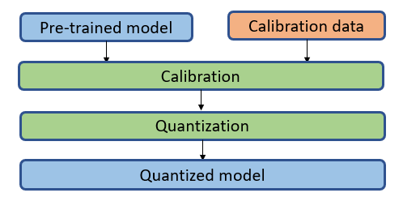
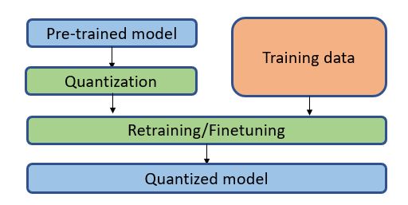

# Quantization

Quantization is a widely-used model compression technique that can reduce model size while also improving inference and training latency. 
The full precision data converts to low-precision, there is little degradation in model accuracy, but the inference performance of quantized model can gain higher performance by saving the memory bandwidth and accelerating computations with low precision instructions. Intel provided several lower precision instructions (ex: 8-bit or 16-bit multipliers), both training and inference can get benefits from them.
Refer to the Intel article on [lower numerical precision inference and training in deep learning](https://software.intel.com/content/www/us/en/develop/articles/lower-numerical-precision-deep-learning-inference-and-training.html).

## Quantization Support Matrix

Quantization methods include the following three types:
<table class="center">
    <thead>
        <tr>
            <th>Types</th>
            <th>Quantization</th>
            <th>Dataset Requirements</th>
            <th>Framework</th>
            <th>Backend</th>
        </tr>
    </thead>
    <tbody>
        <tr>
            <td rowspan="3" align="center">Post-Training Static Quantization (PTQ)</td>
            <td rowspan="3" align="center">weights and activations</td>
            <td rowspan="3" align="center">calibration</td>
            <td align="center">PyTorch</td>
            <td align="center"><a href="https://pytorch.org/docs/stable/quantization.html#eager-mode-quantization">PyTorch Eager</a>/<a href="https://pytorch.org/docs/stable/quantization.html#prototype-fx-graph-mode-quantization">PyTorch FX</a>/<a href="https://github.com/intel/intel-extension-for-pytorch">IPEX</a></td>
        </tr>
        <tr>
            <td align="center">TensorFlow</td>
            <td align="center"><a href="https://github.com/tensorflow/tensorflow">TensorFlow</a>/<a href="https://github.com/Intel-tensorflow/tensorflow">Intel TensorFlow</a></td>
        </tr>
        <tr>
            <td align="center">ONNX Runtime</td>
            <td align="center"><a href="https://github.com/microsoft/onnxruntime/blob/master/onnxruntime/python/tools/quantization/quantize.py">QLinearops/QDQ</a></td>
        </tr>
        <tr>
            <td rowspan="2" align="center">Post-Training Dynamic Quantization</td>
            <td rowspan="2" align="center">weights</td>
            <td rowspan="2" align="center">none</td>
            <td align="center">PyTorch</td>
            <td align="center"><a href="https://pytorch.org/docs/stable/quantization.html#eager-mode-quantization">PyTorch eager mode</a>/<a href="https://pytorch.org/docs/stable/quantization.html#prototype-fx-graph-mode-quantization">PyTorch fx mode</a>/<a href="https://github.com/intel/intel-extension-for-pytorch">IPEX</a></td>
        </tr>
        <tr>
            <td align="center">ONNX Runtime</td>
            <td align="center"><a href="https://github.com/microsoft/onnxruntime/blob/master/onnxruntime/python/tools/quantization/quantize.py">QIntegerops</a></td>
        </tr>  
        <tr>
            <td rowspan="2" align="center">Quantization-aware Training (QAT)</td>
            <td rowspan="2" align="center">weights and activations</td>
            <td rowspan="2" align="center">fine-tuning</td>
            <td align="center">PyTorch</td>
            <td align="center"><a href="https://pytorch.org/docs/stable/quantization.html#eager-mode-quantization">PyTorch eager mode</a>/<a href="https://pytorch.org/docs/stable/quantization.html#prototype-fx-graph-mode-quantization">PyTorch fx mode</a>/<a href="https://github.com/intel/intel-extension-for-pytorch">IPEX</a></td>
        </tr>
        <tr>
            <td align="center">TensorFlow</td>
            <td align="center"><a href="https://github.com/tensorflow/tensorflow">TensorFlow</a>/<a href="https://github.com/Intel-tensorflow/tensorflow">Intel TensorFlow</a></td>
        </tr>
    </tbody>
</table>
 
 

### [Post-Training Static Quantization](./PTQ.md) performs quantization on already trained models, it requires an additional pass over the dataset to work, only activations do calibration.

 

### [Post-Training Dynamic Quantization](./dynamic_quantization.md) simply multiplies input values by a scaling factor, then rounds the result to the nearest, it determines the scale factor for activations dynamically based on the data range observed at runtime. Weights are quantized ahead of time but the activations are dynamically quantized during inference.

 

### [Quantization-aware Training (QAT)](./QAT.md) quantizes models during training and typically provides higher accuracy comparing with post-training quantization, but QAT may require additional hyper-parameter tuning and it may take more time to deployment.

## Examples of Quantization

For Quantization related examples, please refer to [Quantization examples](/examples/README.md)
