Intel® Neural Compressor Bench
=======

Intel® Neural Compressor Bench is a web application for easier use of Intel® Neural Compressor. It is only available on Linux based hosts.

## Table of Contents
- [Introduction](#introduction)
- [Home screen](#home-screen)
- [Create new project](#create-new-project)
  - [Add optimization](#add-optimization)
  - [Add benchmark](#add-benchmark)
  - [Add profiling](#add-profiling)
  - [Display model graph](#display-model-graph)
  - [Add dataset](#add-dataset)
  - [Project information](#project-information)
- [System information](#system-information)
- [Security](#security)
# Introduction
## Start the Intel® Neural Compressor Bench

To start the Intel® Neural Compressor Bench server execute `inc_bench` command:

```shell
inc_bench
```
The server generates a self-signed TLS certificate and prints instruction how to access the Web UI.

```text
Intel(r) Neural Compressor Bench Server started.

Open address https://10.11.12.13:5000/?token=338174d13706855fc6924cec7b3a8ae8
```

Server generated certificate is not trusted by your web browser, you will need to accept usage of such certificate.


You might also use additional parameters and settings:
* Intel® Neural Compressor Bench listens on port 5000.
Make sure that port 5000 is accessible to your browser (you might need to open it in your firewall),
or specify different port that is already opened, for example 8080:
    ```shell
    inc_bench -p 8080
    ```

* When using official TF>=2.6.0, set environment variable `TF_ENABLE_ONEDNN_OPTS=1` for INT8 tuning:
    ```shell
    TF_ENABLE_ONEDNN_OPTS=1 inc_bench
    ```

* To start the Intel® Neural Compressor Bench server with your own TLS certificate add `--cert` and `--key` parameters:

    ```shell
    inc_bench --cert path_to_cert.crt --key path_to_private_key.key
    ```

* To start the Intel® Neural Compressor Bench server without TLS encryption use `--allow-insecure-connections` parameter:

    ```shell
    inc_bench --allow-insecure-connections
    ```

    This enables access to the server from any machine in your local network (or the whole Internet if your server is exposed to it).

    You are forfeiting security, confidentiality and integrity of all client-server communication. Your server is exposed to external threats.

## Home screen
This view shows introduction to Intel® Neural Compressor Bench and a button for creating new project. After clicking this button, pop-up with project wizard will be shown.

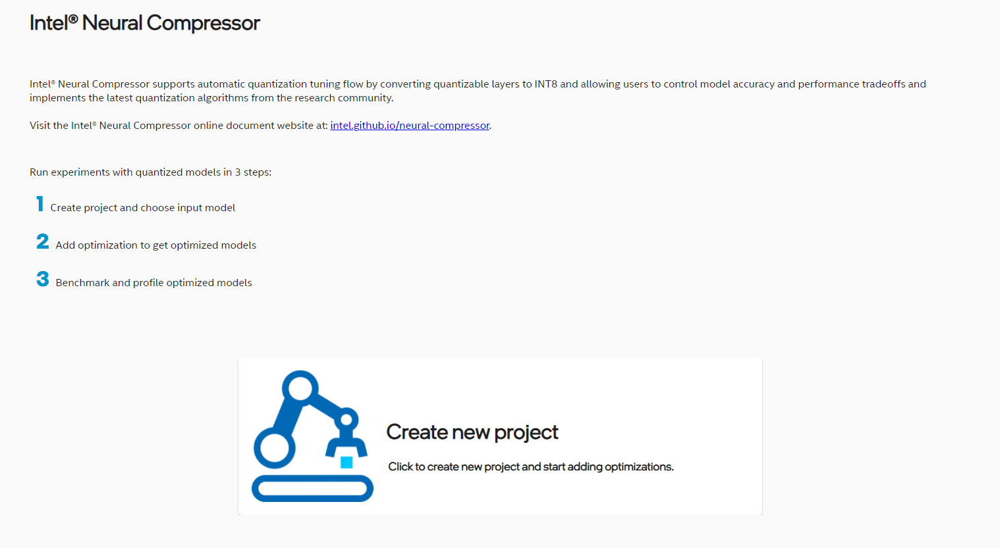

# Create new project
To create a new project, in first step you need to choose its name.

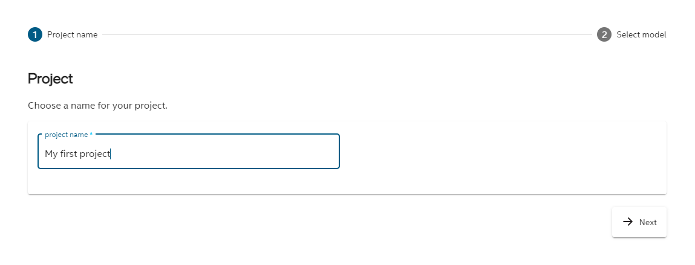

In second step there are 2 possible options to choose from: 
* *predefined model* - you choose model from predefined examples list, you don't need to set any additional parameters,
* *custom model* - in this scenario you can set more parameters and customize your model. 

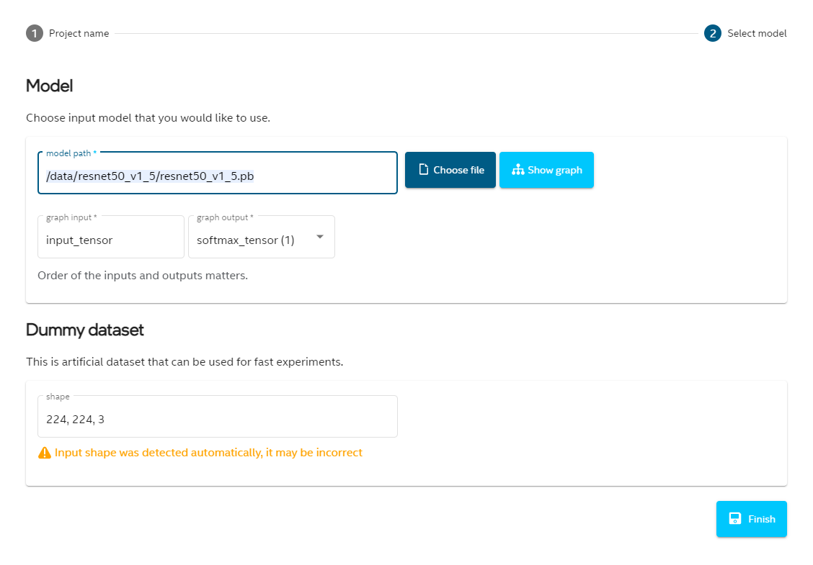

## Predefined model
First you need to choose domain for the model (image recognition or object detection). For each domain there are few available models to choose from. When you click *Finish* the chosen model will be downloaded.


## Custom model

First you have to choose the model path. When it is chosen, in most cases all other fields will be completed automatically. You can edit its input and output nodes, see the model graph (if it is available for this model) and set shape for synthetic dataset. If model domain was not detected, you need to choose it from the list. Model domain is used to set some default parameters for the model.


# Project list
On the left hand side there is a panel with list of created projects. When you click on the project name, you can see its details. "Create new project" button navigates to new project wizard pop-up described in previous section.

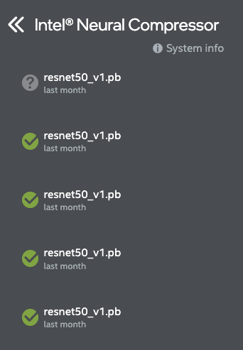

## Remove project

If you want to remove project, you have to click the trash icon next to project name (it is visible when the cursor is on the project name).

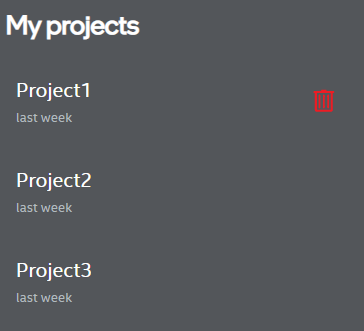

Then you will be prompted to confirm your choice by typing the project name. Project removal is not reversible.


# Develop the project

## Add optimization
### Optimization table
In Optimizations tab you can see list of optimizations in the project. Currently UI supports three optimization precisions and two types of optimization.
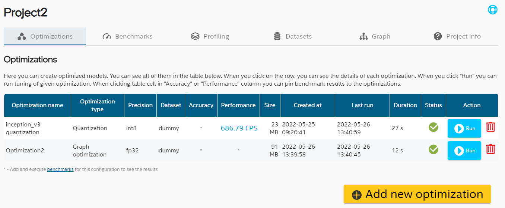

### Optimization wizard
To add new optimization, click "Add new optimization" button at the bottom of the table and follow the steps.
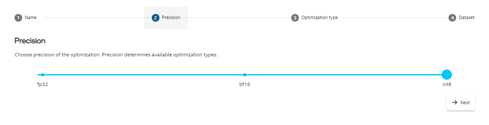
### Optimization details
To perform optimization click "Run" button. Once process is finished you can click on row with specific optimization to display details about optimization parameters and optimized model. When you click on blue arrow icon in model path line, you can download optimized model.
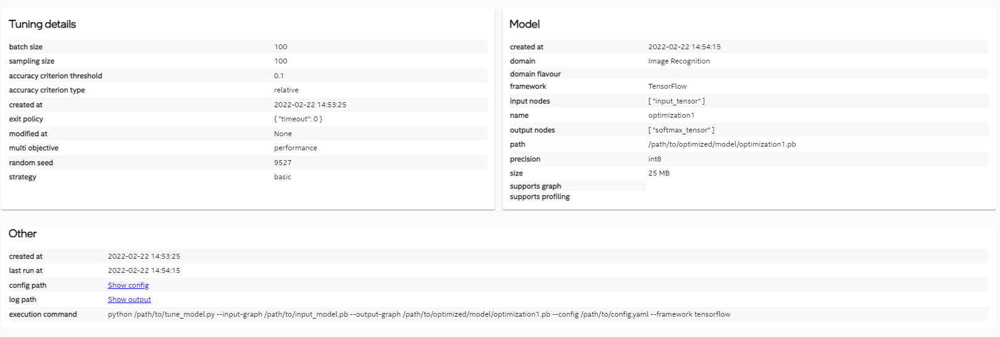

## Add benchmark
### Benchmark table
For each optimization and input model you can add benchmark. Benchmark have 2 modes: accuracy and performance. In benchmark tab you can see all your benchmarks. When you check checkboxes in the last column you can choose benchmark you want to compare in the chart (visible after clicking "Compare selected").

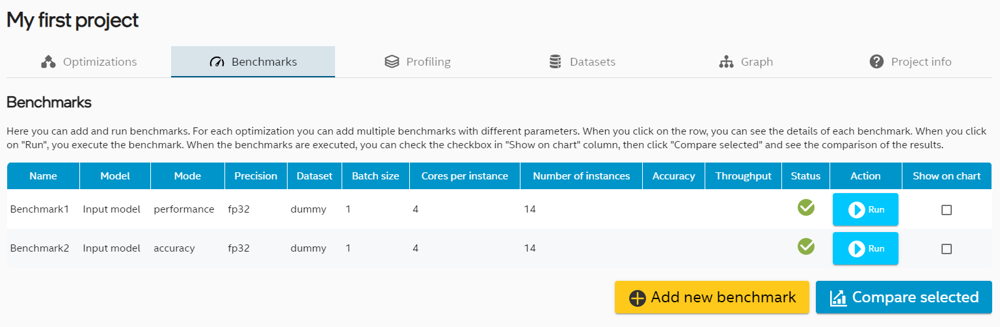

### Benchmark wizard
To add new benchmark, click "Add new benchmark" button at the bottom of the table and follow the steps.

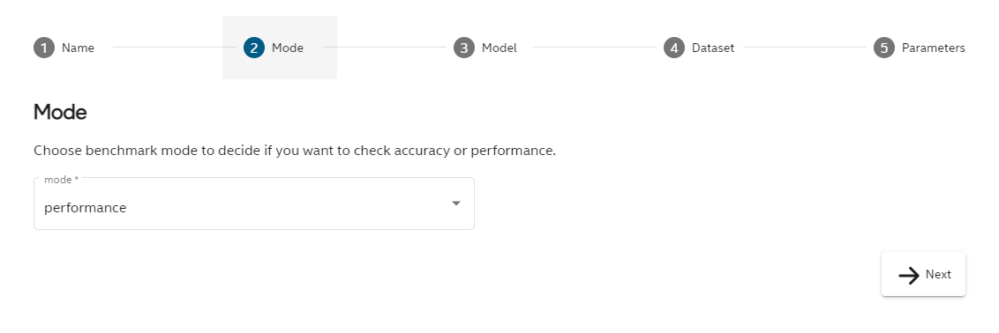

### Benchmark details
When the benchmark is added, you can click "Run" button to execute it. Results will be filled in the table and in details view visible after clicking row in the table. You can also see config and output logs when clicking links highlighted in blue.

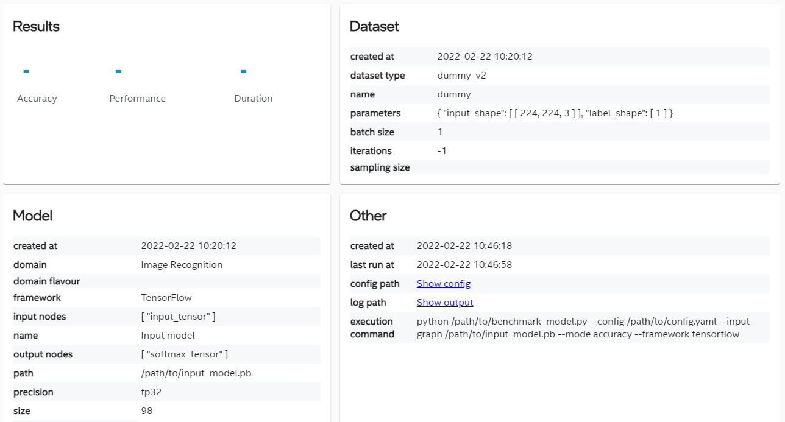


## Add profiling
### Profiling table
It is also possible to do profiling of all Tensorflow frozen models in project.
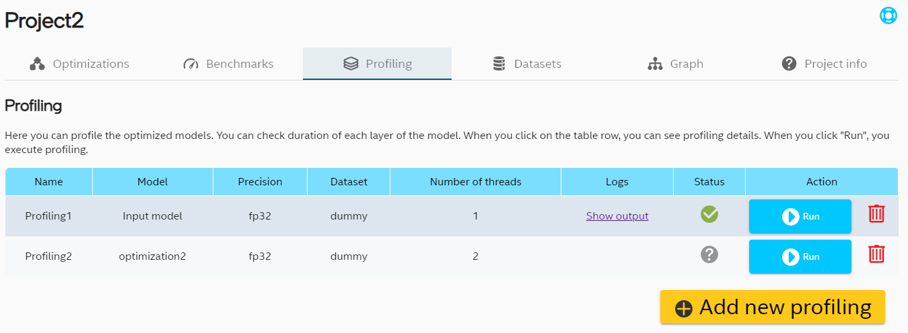
### Profiling wizard
To profile model, click "Add new profiling" button at the bottom of the table and follow the steps.

### Profiling details
Once profiling entry is added, you can click "Run" button to execute it. After completing the process, the results will appear in the form of a bar chart and a table with full profiling data. The table is also used to control which operations are included in the chart. Check the box next to the selected row and click "Update chart" button to include it in the bar chart.
Click "Download .csv file" button to get profiling data in .csv file.
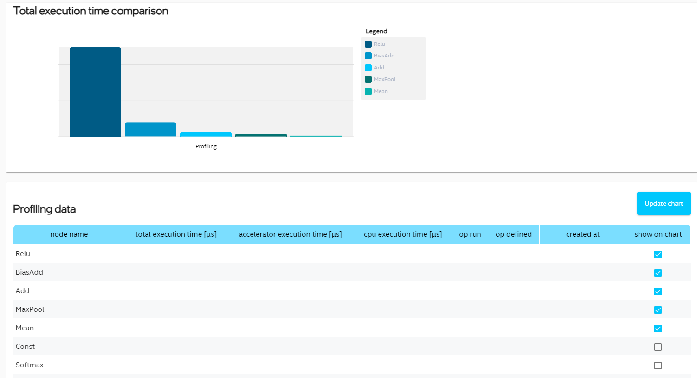

## Display model graph
For Tensorflow frozen pb models there will be a button available  in the project wizard. It is also possible to see the graph in Diagnosis tab. The graph by default is collapsed, but when you click on plus icon, sections will be unfolded.


.

## Add dataset
### Dataset list
Dataset tab presents list of datasets assigned to a project. In most cases the "dummy" dataset consisting of synthetic data should be automatically added while creating a project.
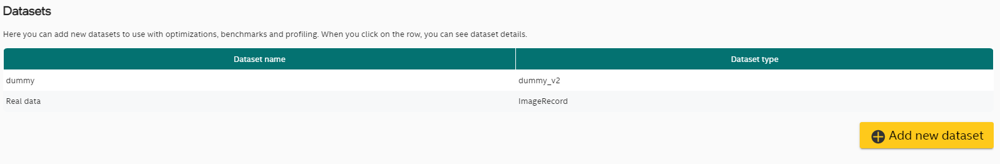
### Dataset wizard
New dataset can be defined by clicking "Add new profiling" button at the bottom of the table and follow the steps.


### Dataset details
Dataset details can be inspected by clicking specific row.


### Custom dataset
When adding the dataset, you can choose *custom* in dataloader and metric field. In that case a template file will be created. The path to the template file will be available in dataset details. You should edit this file to add your custom configuration before using this dataset in optimizations or benchmarks. Small yellow warning will remind about it. 


## Project information

Last tab is called "Project info". You can find here details about the project, when it was created and modified, what is the framework and some details about input model. It is also possible to add some notes about the project.

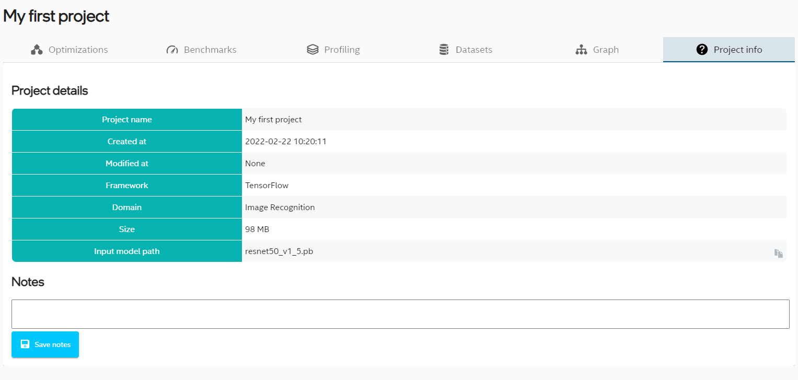

## System information

One can see system information by clicking  button. The result is details dialog:


## Security
Intel® Neural Compressor Bench uses encrypted connections to ensure security, confidentiality and integrity of all client-server communication.

You can use automatically generated self-signed certificate or provide your own trusted certificate.

You can also choose to start the server without encryption exposing it to threats from network.

Intel® Neural Compressor Bench uses external packages to run the web-server and provide encryption. Please report any security issues to correct organizations:
- [Cryptography module](https://cryptography.io/en/latest/security/)
- [Flask](https://flask.palletsprojects.com/en/2.0.x/contributing/#reporting-issues)
- [Flask-SocketIO](https://github.com/miguelgrinberg/Flask-SocketIO/blob/main/SECURITY.md)
