Intel® Neural Compressor Bench
=======

Intel® Neural Compressor Bench is a web application for easier use of Intel® Neural Compressor. It is only available on Linux based hosts.

# Introduction
## Start the Intel® Neural Compressor Bench

1. Start the Intel® Neural Compressor Bench server:

   ```shell
   neural_compressor_bench
   ```
   > **Note**: TF 2.5.0 requires setting environment variable TF_ENABLE_MKL_NATIVE_FORMAT=0 for INT8 quantization:
    ```shell
    TF_ENABLE_MKL_NATIVE_FORMAT=0 neural_compressor_bench
    ```

2. The server prints information on how to access the Web UI.

   An example message looks like this: 

   ```text
   Intel(r) Neural Compressor Bench Server started.
   Setup port forwarding from your local port 5000 to 5000 on this machine.
   Then open address http://localhost:5000/?token=338174d13706855fc6924cec7b3a8ae8
   ```

   Make certain that requested port forwarding is set up (depending on your OS) and then open the address in your web browser.

## Home
This view shows introduction to Intel® Neural Compressor Bench and 2 buttons for creating new configurations in 2 different ways. First one links to **Quantize from presets** where you can find examples of models to chose from, the second one to **Quantize using wizard** where you can your custom models with many configurable parameters.


# Quantize from presets

## Description
In this scenario you can use one of preset models divided into 2 domain categories: image recognition and object detection.
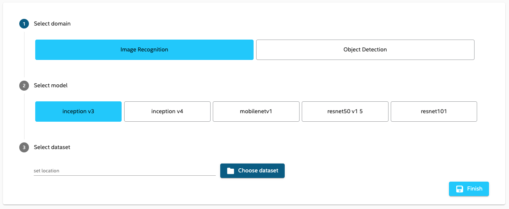

You can use included models to test tuning. You have to point to the Dataset that you want to use and click **Finish** to add it to your models. A new model will be downloaded and added to the **My models** list, ready for tuning.

## Examples
### ResNet50 v1.5
Follow [instructions](../examples/tensorflow/image_recognition/README.md) to get the ImageRecord dataset. Then go to **Examples**, choose **Image Recognition** domain, then click on **resnet50 v1 5** button and in the last step select the ImageRecord dataset like in the example below:
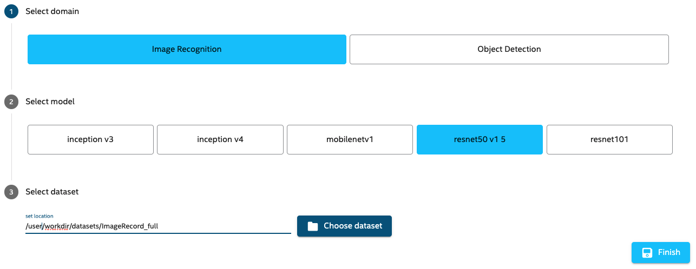
### MobileNet v1
Follow [instructions](../examples/tensorflow/image_recognition/README.md) to get the ImageRecord dataset. Then go to **Examples**, choose  **Image Recognition** domain, then click on **mobilenet v1** button and in the last step select the ImageRecord dataset like in the example below:
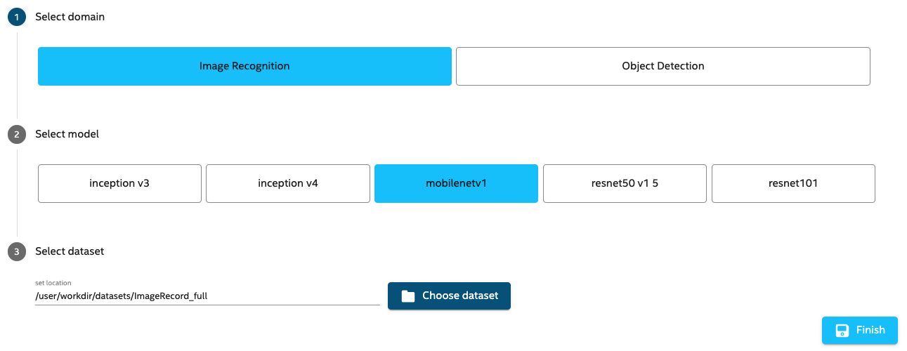
### SSD MobileNet v1
Follow [instructions](../examples/tensorflow/object_detection/README.md) to get the COCORecord dataset. Then go to **Examples**, choose  **Object Detection** domain, then click on **ssd mobilenet v1** button and in the last step select the COCORecord dataset like in the example below:
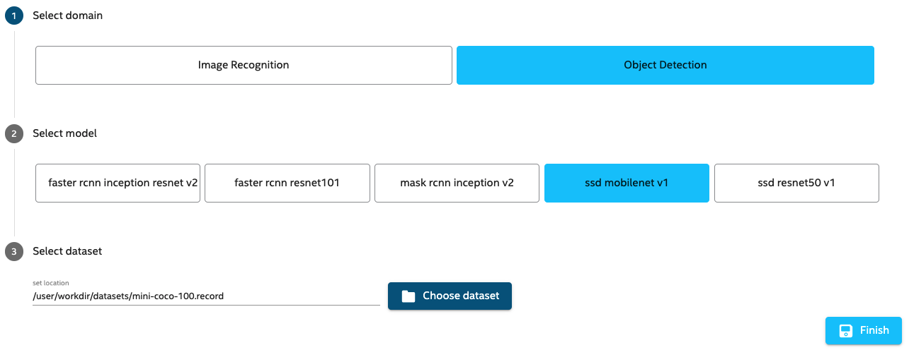

# Quantize using wizard
## Description
### Basic parameters

1. Enter information in all required fields (marked by a *) in the Wizard: 

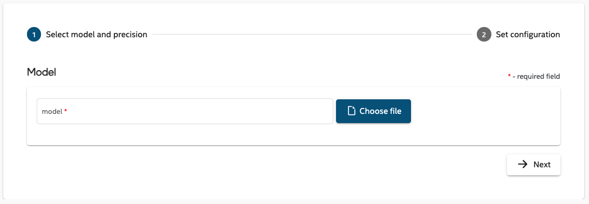
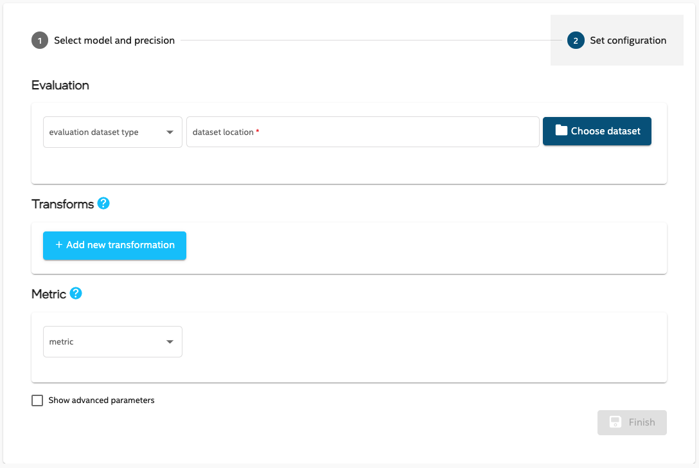

2. Either save this configuration (by clicking **Finish**), or change some advanced parameters (by checking the checkbox 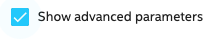
).

## Examples
### ResNet50 v1.5
* Follow [instructions](../examples/tensorflow/image_recognition/README.md) to:
   * install Intel Tensorflow 1.15 up2
   * prepare dataset and a frozen pb model 
* In the **Create low precision model** in first step:
   * select created frozen model
   * inputs, outputs and model domain will be selected automatically
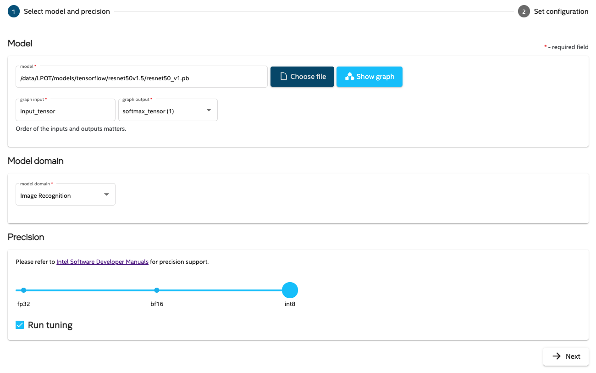

* in second step :
   * in **Calibration/dataset location**, select **ImageRecord** file from created dataset
   * transformation and other parameters will be filled automatically
   * click **Finish** or change Advanced parameters
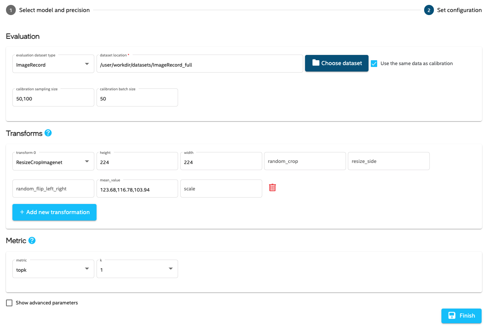

### SSD-ResNet34
* Follow [instructions](../examples/tensorflow/object_detection/README.md) to:
   * install Intel Tensorflow 1.15 up2
   * prepare dataset and a frozen pb model 
* In the **Create low precision model** in first step:
   * select created frozen model
   * inputs, outputs and model domain will be selected automatically
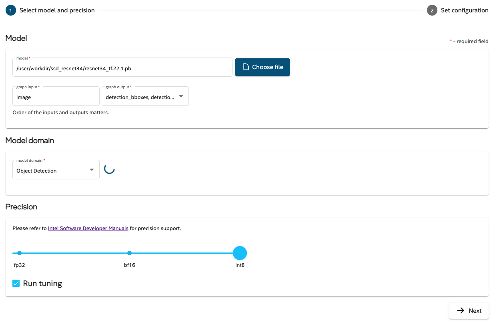

* in second step :
   * in **Calibration/dataset location**, select **coco record** file from created dataset
   * transformation and other parameters will be filled automatically
   * click **Finish** or change Advanced parameters
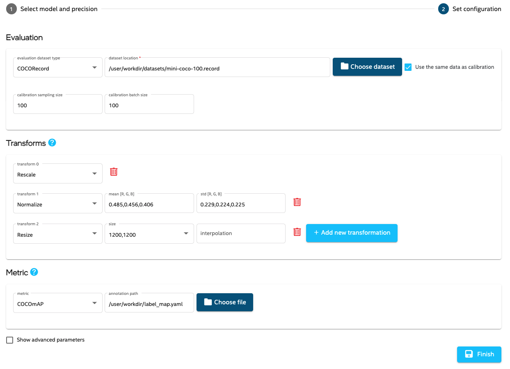

### BERT
* Follow [instructions](../examples/tensorflow/nlp/bert_large_squad/README.md) to:
   * install Intel Tensorflow 1.15 up2
   * prepare dataset and a frozen pb model 
* In the **Create low precision model** in first step:
   * select created frozen model
   * select `input_file`, `batch_size` in inputs (in that order)
   * choose **custom** in output and enter `IteratorGetNext:3, unstack:0, unstack:1` in input field
   * choose NLP as model domain
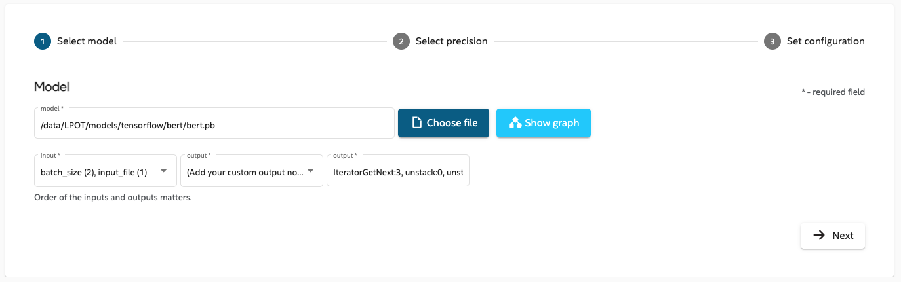

* in second step :
   * in **Calibration/dataset location**, select **eval.tf_record** file from created dataset
   * label_file and vocab_file fields should be filled automatically
   * click **Finish** or change Advanced parameters
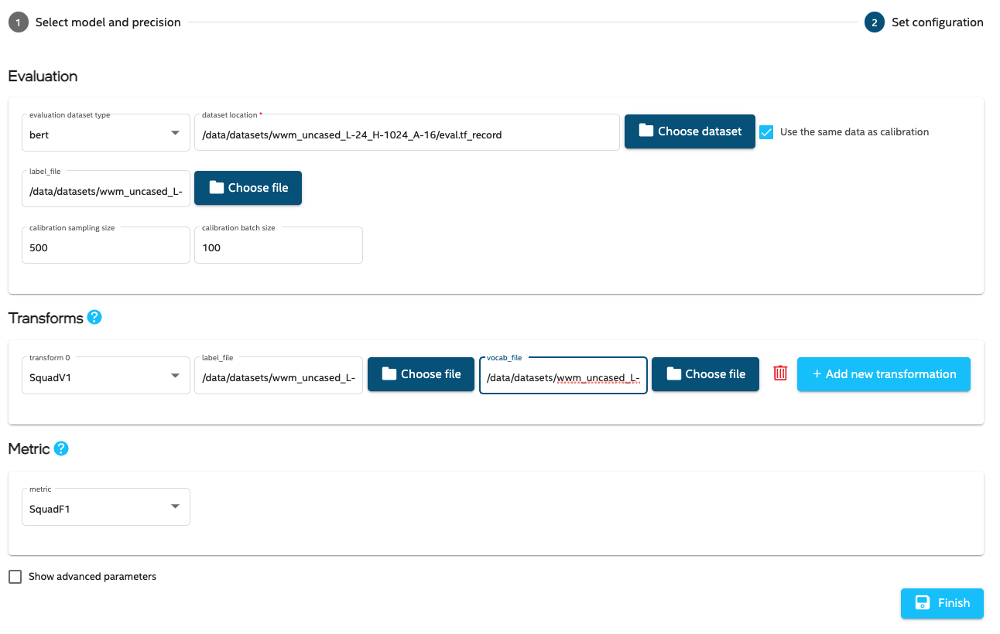

## Advanced configs

### Advanced parameters

From the advanced parameters page, you can configure more features such as tuning, quantization, and benchmarking. 

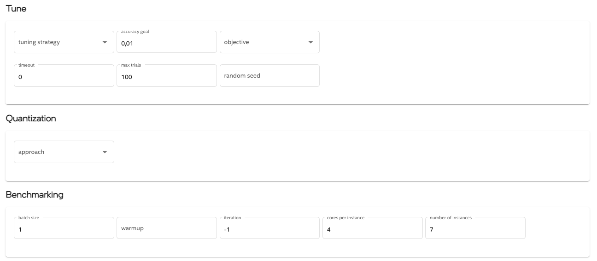

### Custom dataset or metric

If you choose **custom** in the Dataset or Metric section, the appropriate code templates will be generated for you to fill in with your code. The path to the template will be available by clicking the **Copy code template path** button located in the right-most column in the **My models** list.

Follow the comments in the generated code template to fill in required methods with your own code.

# Available views
On the left hand side there is a panel with list of configurations.


One can see system information by clicking  button. The result is details dialog:

 

By clicking   button you can navigate to **My models list**.

## My Models list

This view lists all Model Configurations defined on a given server. 

You can create a new model using pre-defined models by using a New Model Wizard or **Examples**:


## Configuration details

When clicking on configuration from the left hand side list, you can see its details view. You can see the results, rerun the tuning, check the configuration and console output. You can also see the model graph.

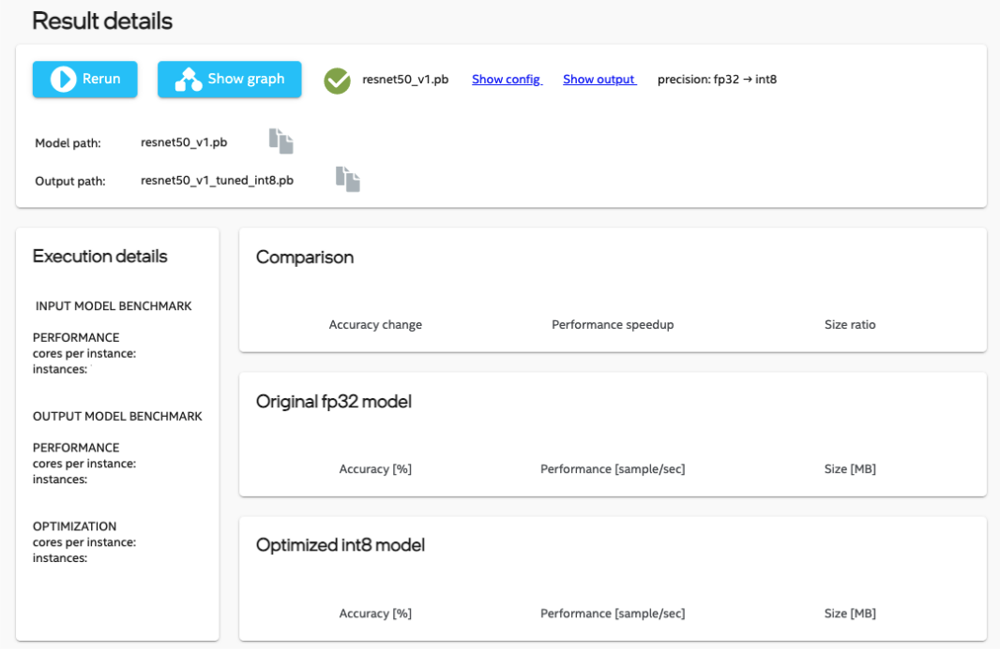

## Tuning

Now that you have created a Model Configuration, you can do the following:

* See the generated config (by clicking the **Show config** link).
* Start the tuning process:
  * Click the blue arrow  to start the tuning.
  * Click **Show output** to see logs that are generated during tuning.
  * Your model will be tuned according to configuration.
  * When the tuning is finished, you will see accuracy results in the **My Models** list:
      - The **Accuracy** section displays comparisons in accuracy metrics between the original and tuned models.
      - **Model size** compares the sizes of both models.
      - When automatic benchmarking is finished, **Throughput** shows the performance gain from tuning. 

### Tuning history

If the configuration was tuned several times, in the details view there will be a chart showing accuracy and duration of historical tunings.

## Model Graph Display
For Tensorflow frozen pb models there will be a new button available .

Click it to display graph of selected model:

.
