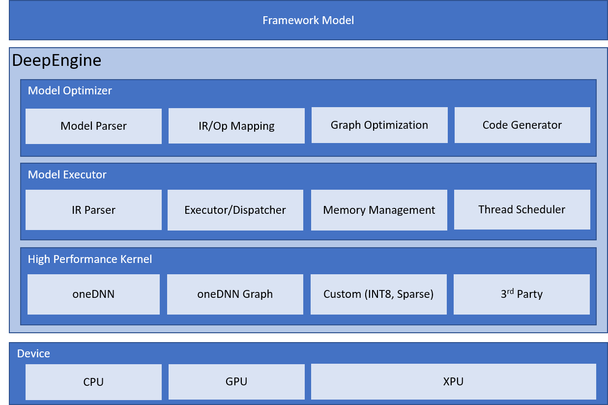

# Introduction to Engine
A deep learning inference engine for quantized and sparsified models.

## Architecture
Engine support model compile, model executor and high performance kernel for multi device.

<a target="_blank" href="docs/imgs/infrastructure.png">
  
</a>

## Installation

Just support Linux operating system for now.


### 0. Prepare environment and requirement

```
# prepare your env
conda create -n <env name> python=3.7
conda install cmake --yes
conda install absl-py --yes

```

### 1. install neural-compressor

As engine is part of neural_compressor, just install neural-compressor will build the binary and engine interface

```
pip install neural-compressor

```

### 2. install C++ binary by deploy bare metal engine

```
cd <nc_folder>
git submodule sync
git submodule update --init --recursive
cd engine/executor
mkdir build
cd build
cmake ..
make -j
```
Then in the build folder, you will get the `inferencer`, `engine_py.cpython-37m-x86_64-linux-gnu.so` and `libengine.so`. The first one is used for pure c++ model inference, and the second is used for python inference, they all need the `libengine.so`.


## Generate the bert model intermediate representations, that are yaml and bin files

```
from engine.compile.compile import prepare_ir
model = prepare_ir('/path/to/your/model')
model.save('/ir/path')
```
Now engine support tensorflow and onnx model conversion.

## Use case

### 1. Use the `inferencer` for dummy/const data performance test

`./inferencer --config=<the generated yaml file path> --weight=<the generated bin file path> --batch_size=32 --iterations=20`

You can set the `batch_size` and `iterations` number. Besides you can use the `numactl` command to bind cpu cores and open multi-instances. For example:

`OMP_NUM_THREADS=4 numactl -C '0-3' ./inferencer --config=<the generated yaml file path> --weight=<the generated bin file path> --batch_size=32 --iterations=20`

Then, you can see  throughput result of the `inferencer`  on the terminal.

Please remember to change the input data type, shape and range for your input in `inferencer.cpp`

```
  vector<string> input_dtype(3, "int32");
  vector<vector<float>> input_range(3, vector<float>({1, 300}));
  vector<vector<int64_t>> input_shape(3, {FLAGS_batch_size, FLAGS_seq_len});
  executor::DataLoader* dataloader;
  // dataloader = new executor::ConstDataLoader(input_shape, input_dtype, input_range);
  dataloader = new executor::DummyDataLoader(input_shape, input_dtype, input_range);

```
The dataloader generate data using prepare_batch() and make sure the generate data is the yaml need:

```
model: 
  name: bert_mlperf_int8
  operator:
    input_data:
      type: Input
      output:
        # -1 means it's dynamic shape

        input_ids:
          dtype: int32
          shape: [-1, -1]
        segment_ids: 
          dtype: int32
          shape: [-1, -1]
        input_mask:
          dtype: int32
          shape: [-1, -1]
        softmax1_min:
          dtype: fp32
          shape: [1]
          location: [430411380, 4]

```
All input tensors are in an operator typed Input. But slightly difference is some tensors have location while others not. A tensor with location means that is a frozen tensor or weight, it's read from the bin file. A tensor without location means it's activation, that should feed to the model during inference. When you use C++ interface, initialize the tensor config and feed data/shape from dataloader:

```
  // initialize the input tensor config(which correspond to the yaml tensor without location)
  vector<executor::Tensor> input_tensors;
  auto input_configs = bert_model.input_configs();
  for (int i = 0; i < bert_model.num_inputs(); ++i) {
    input_tensors.push_back(executor::Tensor(*(input_configs[i])));
  // feed the data and shape
  auto raw_data = dataloader->prepare_batch(i);
  for (int i = 0; i < input_tensors.size(); ++i) {
    input_tensors[i].set_data(raw_data[i]);
    input_tensors[i].set_shape(input_shape[i]);
  }

```

The output tensor is defined in an operator named Output, which only have inputs. See an example 

```
  output_data:
    type: Output
    input:
      matmul_post_output_reshape: {}

```
You can add the tensor you want to the Output. Remember, all output tensors from operators should have operators take as input, that means output edges should have an end node. In this case, each operator's output has one or several other operators take as input.

If you want to close log information of the `inferencer`, use the command `export GLOG_minloglevel=2` before executing the `inferencer`.  `export GLOG_minloglevel=1` will open the log information again. This command can also be used in python engine model.

### 2. Use the python API of engine model

If you use pip install -e . to install the engine in your current folder, please make sure to export LD_LIBRARY_PATH=$LD_LIBRARY_PATH:/path/to/your/libengine.so

Other installation method will have no need to set the library path.

```
# import the engine model
from engine_py import Model
# load the model
# config_path is the generated yaml file path
# weight_path is the generated bin file path
model = Model(config_path, weight_path)
# use engine model to inference
out = model.forward([input_ids, segment_ids, input_mask])
```
Engine python api support input numpy array and output numpy array. if you have several inputs, you can put them in to a list and feed to the model forward interface.

The `input_ids`, `segment_ids` and `input_mask` are the input numpy array data of a bert model, which have size (batch_size, seq_len). Note that the `out` is a list contains the bert model output numpy data (`out=[output numpy data]`). 


## Get a low precision model using neural_compressor tool

You may have a tensorflow or onnx model and want to have an high performance int8 engine ir, that will be easy to have 

```
from neural_compressor.experimental import Quantization, common
ds = TF_BERTDataSet(args.data_dir, args.vocab_file, args.do_lower_case)
quantizer = Quantization(args.config)
quantizer.model = common.Model(args.input_model)
quantizer.eval_dataloader = common.DataLoader(ds, args.batch_size)
quantizer.calib_dataloader = common.DataLoader(ds, args.batch_size)
q_model = quantizer()
q_model.save(args.output_model)

```
The output_model is the generated int8 ir of engine. you can also test the benchmark of the engine model

```
from neural_compressor.experimental import Benchmark, common
ds = TF_BERTDataSet(args.data_dir, args.vocab_file, args.do_lower_case)
evaluator = Benchmark(args.config)
evaluator.model = common.Model(args.input_model)
evaluator.b_dataloader = common.DataLoader(ds, args.batch_size)
evaluator(args.mode)

```

Reference examples can be found at <nc_folder>/examples/engine/nlp

