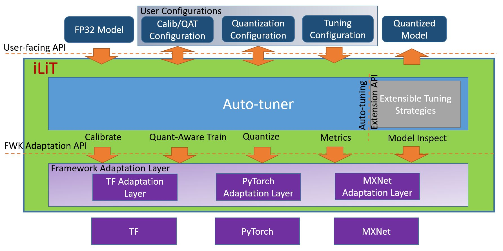
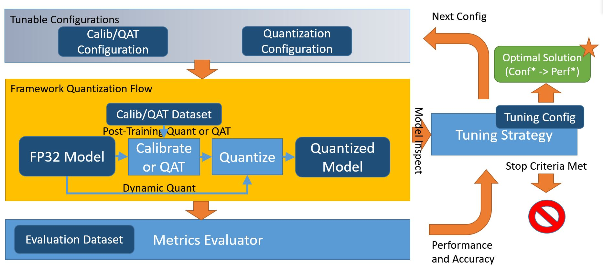

Introduction
=========================================

Intel Low Precision Tool (iLiT) is an open source python library to help users to fast deploy low-precision inference solution on popular DL frameworks including TensorFlow, PyTorch, MxNet etc. It automatically optimizes low-precision recipes for deep learning models to achieve optimal product objectives like inference performance and memory usage with expected accuracy criteria.

# Infrastructure

<div align="left">
  
</div>

### Three level APIs

1. User API

   User API is intented to provide best out-of-box experiences and unify the low precision quantization workflow cross multiple DL frameworks.

   ```
   def tune(self, model, q_dataloader, q_func=None,
            eval_dataloader=None, eval_func=None, resume_file=None)
   ```

   The tuning config and model-specific information are controlled by user config yaml file. As for the format of yaml file, please refer to [template.yaml](../examples/template.yaml)

   iLiT v1.0a release supports two usages:

   a) User specifies fp32 "model", calibration dataset "q_dataloader", evaluation dataset "eval_dataloader" and accuracy metrics in tuning.metric field of the yaml config file.

   b) User specifies fp32 "model", calibration dataset "q_dataloader" and a custom "eval_func" which encapsulates the evaluation dataset and accuracy metrics by itself.

   The first usage is designed for seamless enablement of DL model tuning with iLiT, leveraging the pre-defined accuracy metrics supported by iLiT. We expect this is the most common usage of iLiT. Now it works well for most image classification models and we are improving iLiT to support more.

   The second usage is designed for ease of tuning enablement for models with custom metric evaluation or metrics not supported by iLiT yet. Currently this usage model works for object detection and NLP networks.

2. Framework Adaptation API

   Framework adaptation layer abstracts out the API differences of various DL frameworks needed for supporting low-precision quantization workflow and provides a unified API for auto-tuning engine to use. The abstracted functionalities include quantization configurations, quantization capabilities, calibration, quantization-aware training, graph transformation for quantization, data loader and metric evaluation, and tensor inspection.

3. Extension API
   
   iLiT is designed to be highly extensible. New tuning strategies can be added by inheriting "Strategy" class. New frameworks can be added by inheriting "Adaptor" class. New metrics can be added by inheriting "Metric" class. New tuning objectives can be added by inheriting "Objective" class.

# Workflow

<div align="left">
  
</div>

# Strategies

### Basic Strategy

This strategy is iLiT default tuning strategy, which does model-wise tuning by adjusting gloabl tuning parameters, such as calibration related parameters, kl or minmax algo, quantization related parameters, symmetric or asymmetric, per_channel or per_tensor. If the model-wise tuning result does not meet accuracy goal, this strategy will attempt to do op-wise fallback from bottom to top to prioritize which fallback op has biggest impact on final accuracy, and then do incremental fallback till achieving the accuracy goal.

### Bayersian Strategy

Bayesian optimization is a sequential design strategy for global optimization of black-box functions. The strategy refers to the Bayesian optimization package [bayesian-optimization](https://github.com/fmfn/BayesianOptimization) and changes it to a discrete version that complies with the iLiT strategy standard. It uses Gaussian Processes to define the prior/posterior distribution over the black-box function, and then finds the tuning configuration that maximizes the expected improvement.

### MSE Strategy

This strategy is very similar to the basic strategy. It needs to get the tensors for each Operator of raw FP32 models and the quantized model based on best model-wise tuning configuration. And then calculate the MSE (Mean Squared Error) for each operator, sort those operators according to the MSE value, finally do the op-wise fallback in this order.

# Objectives

iLiT supports below 3 build-in objectives. All objectives are optimized and driven by accuracy metrics.

### 1. Performance

This objective targets best performance of quantized model. It is default objective.

### 2. Memory Footprint

This objective targets minimal memory usage of quantized model.

### 3. Model Size

This objective targets the weight size of quantized model.

# Metrics

iLiT supports 3 built-in metrics, Topk, F1 and CocoMAP. The metric is easily extensible via inheriting Metric class.
