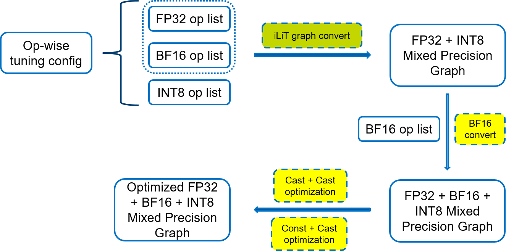
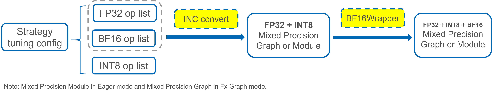

Mixed Precision
===============

## Introduction

The recent growth of Deep Learning has driven the development of more complex models that require significantly more compute and memory capabilities. Several low precision numeric formats have been proposed to address the problem. Google's [bfloat16](https://cloud.google.com/tpu/docs/bfloat16) and the [FP16: IEEE](https://en.wikipedia.org/wiki/Half-precision_floating-point_format) half-precision format are two of the most widely used sixteen bit formats. [Mixed precision](https://arxiv.org/abs/1710.03740) training and inference using low precision formats have been developed to reduce compute and bandwidth requirements.

The recently launched 3rd Gen Intel® Xeon® Scalable processor (codenamed Cooper Lake), featuring Intel® Deep Learning Boost, is the first general-purpose x86 CPU to support the bfloat16 format. Specifically, three new bfloat16 instructions are added as a part of the AVX512_BF16 extension within Intel Deep Learning Boost: VCVTNE2PS2BF16, VCVTNEPS2BF16, and VDPBF16PS. The first two instructions allow converting to and from bfloat16 data type, while the last one performs a dot product of bfloat16 pairs. Further details can be found in the [hardware numerics document](https://software.intel.com/content/www/us/en/develop/download/bfloat16-hardware-numerics-definition.html) published by Intel.

Intel® Neural Compressor (INC) supports two use cases for mixed precision: 
1. Direct mixed precision conversion: Mix `BF16 + FP32` and be executed by MixedPrecision API
2. Mixed precision during quantization: Mix `BF16 + FP32 + INT8` and occur during quantization

Its support status:

|Framework     |BF16         |
|--------------|:-----------:|
|TensorFlow    |&#10004;     |
|PyTorch       |&#10004;     |
|ONNX          |plan to support in the future |
|MXNet         |&#10004;     |

## Pre-requirements

### Hardware
It needs the CPU supports `avx512_bf16` instruction set. 

### Software
Intel has worked with the PyTorch & TensorFlow development teams to enhance PyTorch & TensorFlow to include bfloat16 data support for CPUs.
- For PyTorch, the version higher than [1.11.0](https://download.pytorch.org/whl/torch_stable.html) is necessary. 


- For Tensorflow, BF16 support has been enabled in intel-tensorflow [2.3.0](https://pypi.org/project/intel-tensorflow/2.3.0/)/[2.4.0](https://pypi.org/project/intel-tensorflow/2.4.0/)/[1.15.0up1](https://github.com/Intel-tensorflow/tensorflow/tree/v1.15.0up1)/[1.15.0up2](https://github.com/Intel-tensorflow/tensorflow/tree/v1.15.0up2) and intel-tensorflow-avx512[2.3.0](https://pypi.org/project/intel-tensorflow-avx512/2.3.0/)/[2.4.0](https://pypi.org/project/intel-tensorflow-avx512/2.4.0/). 

  > For more information about BF16 in TensorFlow, please read [Accelerating AI performance on 3rd Gen Intel® Xeon® Scalable processors with TensorFlow and Bfloat16](https://blog.tensorflow.org/2020/06/accelerating-ai-performance-on-3rd-gen-processors-with-tensorflow-bfloat16.html).
  
  > To get better performance with BF16 datatype, the intel-tensorflow-avx512 is recommended, or build intel tensorflow (take [tag v1.15.0up2](https://github.com/Intel-tensorflow/tensorflow/tree/v1.15.0up2) as example) from source code by using below command:

  ```shell
  bazel build --cxxopt=-D_GLIBCXX_USE_CXX11_ABI=0 --copt=-O3 --copt=-Wformat --copt=-Wformat-security \
        --copt=-fstack-protector --copt=-fPIC --copt=-fpic --linkopt=-znoexecstack --linkopt=-zrelro \
        --linkopt=-znow --linkopt=-fstack-protector --config=mkl --define build_with_mkl_dnn_v1_only=true \
        --copt=-DENABLE_INTEL_MKL_BFLOAT16 --copt=-march=native //tensorflow/tools/pip_package:build_pip_package

  ./bazel-bin/tensorflow/tools/pip_package/build_pip_package /tmp/
  ``` 

## Methods to enable & disable BF16 support
By default, BF16 has been added into activation and weight supported datatype if **the TensorFlow/PyTorch version and CPU meet the requirements at the same time**. We can disable it in the yaml config file by specifying the datatype for activation and weight. 

If either pre-requirement can't be met, the program would exit consequently. But we can force enable it for debug usage by setting the environment variable `FORCE_BF16=1`:
```shell
FORCE_BF16=1 /path/to/executable_nc_wrapper
```
> ⚠️Without hardware or software support, the poor performance or other problems may expect for force enabling.

## Direct mixed precision conversion

INC queries framework capability and user-defined precision to generate an op-wise config based on the pre-optimized fp32 model. Direct mixed precision conversion will be implemented under the direction of config. Further, if users add necessary evaluation components, INC will tune accuracy during conversion.

### How to use it

- Convert as many nodes as possible to target dtype

  ```python
  from neural_compressor.experimental import MixedPrecision
  converter = MixedPrecision()
  converter.precisions = 'bf16'
  converter.model = '/path/to/model'
  optimized_model = converter()
  ```

- Tune accuracy during conversion
  
  Users can add dataloader and metric in yaml to execute evaluation.
  ```yaml
  model:
    name: resnet50_v1
    framework: tensorflow

  mixed_precision:
    precisions: 'bf16'

  evaluation:
    accuracy:
      dataloader:
        ...
      metric:
        ...
  ```


  ```python
  from neural_compressor.experimental import MixedPrecision
  converter = MixedPrecision('./conf.yaml')
  converter.model = './model.pb'
  output_model = converter()
  ```

  Users can also define their own dataloader or metric by python code.
  ```python
  class Metric:
     def __init__(self):
       # initialization code

     def update(self, sample):
       # update predictions and label to recorder

     def reset(self):
       # reset recorder

     def result(self):
       # return accuracy

  class Dataset:
     def __init__(self):
       # initialization code

     def getitem(self, index)：
       # use idx to get data and label

     def __length__(self):
       # return data length

  from neural_compressor.experimental import MixedPrecision, common
  dataset = Dataset()
  converter = MixedPrecision()
  converter.metric = Metric()
  converter.precisions = 'bf16'
  converter.eval_dataloader = common.DataLoader(dataset)
  converter.model = './model.pb'
  output_model = converter()
  ```

## Mixed precision during quantization

This use case is only executed during quantization. Currently, only the Basic strategy with BF16 support has been validated.

### Tensorflow

- BF16 conversion during quantization in TensorFlow



- Three steps

1. Convert to a `FP32 + INT8` mixed precision Graph

   In this steps, TF adaptor will regard all fallback datatype as `FP32`. According to the per op datatype in tuning config passed by strategy, TF adaptor will generate a `FP32 + INT8` mixed precision graph.

2. Convert to a `BF16 + FP32 + INT8` mixed precision Graph

   In this phase, adaptor will convert some `FP32` ops to `BF16` according to `bf16_ops` list in tuning config.

3. Optimize the `BF16 + FP32 + INT8` mixed precision Graph
   
   After the mixed precision graph generated, there are still some optimization need to be applied to improved the performance, for example `Cast + Cast` and so on. The `BF16Convert` transformer also apply a depth-first method to make it possible to take the ops use `BF16` which can support `BF16` datatype to reduce the insertion of `Cast` op.

### PyTorch

- BF16 conversion during quantization in PyTorch



- Two steps
1. Convert to a `FP32 + INT8` mixed precision Graph or Module

   In this steps, PT adaptor will combine the `INT8` ops and all fallback ops to `FP32 + INT8` mixed precision Graph or Module no matter in Eager mode or Fx Graph mode.

2. Convert to a `BF16 + FP32 + INT8` mixed precision Graph or Module

   In this phase, adaptor will according to `BF16` op list from strategy tune config to wrapper the `FP32` module with `BF16Wrapper` to realize the `BF16 + FP32 + INT8` mixed precision Graph or Module. adaptor will do retrace the `GraphModule` again if using Fx Graph mode.
