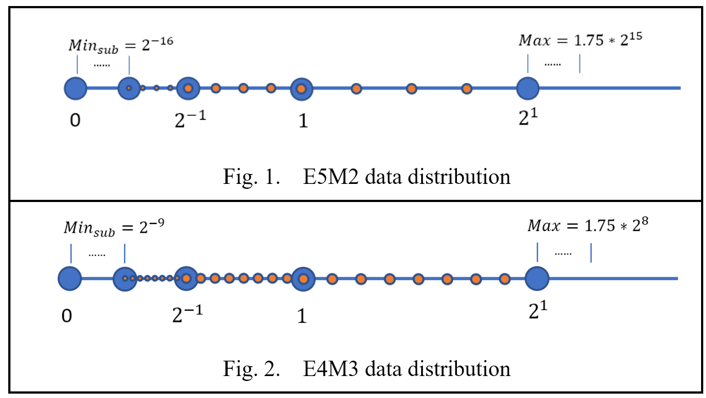

FP8 Quantization
=======

1. [Introduction](#introduction)
2. [Supported Parameters](#supported-parameters)
3. [Get Start with FP8 Quantization](#get-start-with-fp8-quantization)
4. [Examples](#examples)  

## Introduction

Float point 8 (FP8) is a promising data type for low precision quantization which provides a data distribution that is completely different from INT8 and it's shown as below.

<div align="center">
    
</div>

Intel Gaudi2, also known as HPU, provides this data type capability for low precision quantization, which includes `E4M3` and `E5M2`. For more information about these two data type, please refer to [link](https://arxiv.org/abs/2209.05433).

Intel Neural Compressor provides general quantization APIs to leverage HPU FP8 capability. with simple  with lower memory usage and lower compute cost, 8 bit model

## Supported Parameters

<style type="text/css">
.tg  {border-collapse:collapse;border-spacing:0;}
.tg td{border-color:black;border-style:solid;border-width:1px;font-family:Arial, sans-serif;font-size:14px;
  overflow:hidden;padding:10px 5px;word-break:normal;}
.tg th{border-color:black;border-style:solid;border-width:1px;font-family:Arial, sans-serif;font-size:14px;
  font-weight:normal;overflow:hidden;padding:10px 5px;word-break:normal;}
.tg .tg-fymr{border-color:inherit;font-weight:bold;text-align:left;vertical-align:top}
.tg .tg-0pky{border-color:inherit;text-align:left;vertical-align:top}
</style>
<table class="tg"><thead>
  <tr>
    <th class="tg-fymr">Attribute</th>
    <th class="tg-fymr">Description</th>
    <th class="tg-fymr">Values</th>
  </tr></thead>
<tbody>
  <tr>
    <td class="tg-0pky">fp8_config</td>
    <td class="tg-0pky">The target data type of FP8 quantization.</td>
    <td class="tg-0pky">E4M3 (default) - As Fig. 2<br>E5M2 - As Fig. 1.</td>
  </tr>
  <tr>
    <td class="tg-0pky">hp_dtype</td>
    <td class="tg-0pky">The high precision data type of non-FP8 operators.</td>
    <td class="tg-0pky">bf16 (default) - torch.bfloat16<br>fp16 - torch.float16.<br>fp32 - torch.float32.</td>
  </tr>
  <tr>
    <td class="tg-0pky">observer</td>
    <td class="tg-0pky">The observer to measure the statistics.</td>
    <td class="tg-0pky">maxabs (default), saves all tensors to files.</td>
  </tr>
  <tr>
    <td class="tg-0pky">allowlist</td>
    <td class="tg-0pky">List of nn.Module names or types to quantize. When setting an empty list, all the supported modules will be quantized by default. See Supported Modules. Not setting the list at all is not recommended as it will set the allowlist to these modules only: torch.nn.Linear, torch.nn.Conv2d, and BMM.</td>
    <td class="tg-0pky">Default = {'names': [], 'types': <span title=["Matmul","Linear","FalconLinear","KVCache","Conv2d","LoRACompatibleLinear","LoRACompatibleConv","Softmax","ModuleFusedSDPA","LinearLayer","LinearAllreduce","ScopedLinearAllReduce","LmHeadLinearAllreduce"]>FP8_WHITE_LIST}</span></td>
  </tr>
  <tr>
    <td class="tg-0pky">blocklist</td>
    <td class="tg-0pky">List of nn.Module names or types not to quantize. Defaults to empty list, so you may omit it from the config file.</td>
    <td class="tg-0pky">Default = {'names': [], 'types': ()}</td>
  </tr>
  <tr>
    <td class="tg-0pky">mode</td>
    <td class="tg-0pky">The mode, measure or quantize, to run HQT with.</td>
    <td class="tg-0pky">MEASURE - Measure statistics of all modules and emit the results to dump_stats_path.<br>QUANTIZE - Quantize and run the model according to the provided measurements.<br>AUTO (default) - Select from [MEASURE, QUANTIZE] automatically.</td>
  </tr>
  <tr>
    <td class="tg-0pky">dump_stats_path</td>
    <td class="tg-0pky">The path to save and load the measurements. The path is created up until the level before last "/". The string after the last / will be used as prefix to all the measurement files that will be created.</td>
    <td class="tg-0pky">Default = "./hqt_output/measure"</td>
  </tr>
  <tr>
    <td class="tg-0pky">scale_method</td>
    <td class="tg-0pky">The method for calculating the scale from the measurement.</td>
    <td class="tg-0pky">- without_scale - Convert to/from FP8 without scaling.<br>- unit_scale - Always use scale of 1.<br>- maxabs_hw (default) - Scale is calculated to stretch/compress the maxabs measurement to the full-scale of FP8 and then aligned to the corresponding HW accelerated scale.<br>- maxabs_pow2 - Scale is calculated to stretch/compress the maxabs measurement to the full-scale of FP8 and then rounded to the power of 2.<br>- maxabs_hw_opt_weight - Scale of model params (weights) is chosen as the scale that provides minimal mean-square-error between quantized and non-quantized weights, from all possible HW accelerated scales. Scale of activations is calculated the same as maxabs_hw.<br>- act_maxabs_pow2_weights_pcs_opt_pow2 - Scale of model params (weights) is calculated per-channel of the params tensor. The scale per-channel is calculated the same as maxabs_hw_opt_weight. Scale of activations is calculated the same as maxabs_pow2.<br>- act_maxabs_hw_weights_pcs_maxabs_pow2 - Scale of model params (weights) is calculated per-channel of the params tensor. The scale per-channel is calculated the same as maxabs_pow2. Scale of activations is calculated the same as maxabs_hw.</td>
  </tr>
  <tr>
    <td class="tg-0pky">measure_exclude</td>
    <td class="tg-0pky">If this attribute is not defined, the default is OUTPUT. Since most models do not require measuring output tensors, you can exclude it to speed up the measurement process.</td>
    <td class="tg-0pky">NONE - All tensors are measured.<br>OUTPUT (default) - Excludes measurement of output tensors.</td>
  </tr>
</tbody></table>

## Get Start with FP8 Quantization

### Demo Usage

```python
from neural_compressor.torch.quantization import (
    FP8Config,
    prepare,
    convert,
)
import torchvision.models as models

model = models.resnet18()
qconfig = FP8Config(fp8_config="E4M3")
model = prepare(model, qconfig)
# customer defined calibration
calib_func(model)
model = convert(model)
```

## Examples

| Task                 | Example |
|----------------------|---------|
| Computer Vision (CV)      |    [Link](../../examples/3.x_api/pytorch/cv/fp8_quant/)     |
| Large Language Model (LLM) |    [Link](https://github.com/huggingface/optimum-habana/tree/main/examples/text-generation#running-with-fp8)     |

> Note: For LLM, Optimum-habana provides higher performance based on modified modeling files, so here the Link of LLM goes to Optimum-habana, which utilize Intel Neural Compressor for FP8 quantization internally.
