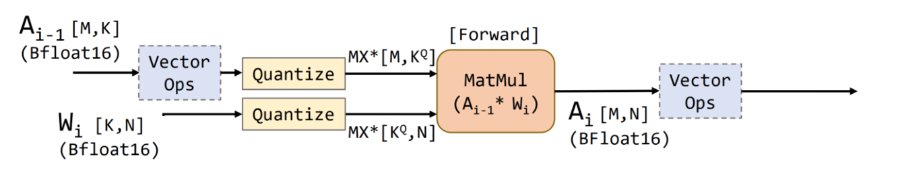

Microscaling Quantization
===============

1. [Introduction](#introduction)
2. [Get Started with Microscaling Quantization API](#get-start-with-microscaling-quantization-api)
3. [Examples](#examples)
4. [Reference](#reference)

## Introduction

Numerous breakthroughs have emerged across various fields, such as text analysis, language translation and chatbot technologies, fueled by the development of large language models (LLMs). Nevertheless, their increasing power comes with the challenge of explosive growth in parameters, posing obstacles for practical use. To balance memory limits and accuracy preservation for AI models, the Microscaling (MX) specification was promoted from the well-known Microsoft Floating Point (MSFP) data type [1, 2]:

<table>
  <tr>
    <th>Format Name</th>
    <th>Element Data type</th>
    <th>Element Bits</th>
    <th>Scaling Block Size</th>
    <th>Scale Data Type</th> 
    <th>Scale Bits</th>
  </tr>
  <tr>
    <td rowspan="2">MXFP8</td>
    <td>FP8 (E5M2)</td>
    <td rowspan="2">8</td>
    <td rowspan="2">32</td>
    <td rowspan="2">E8M0</td>
    <td rowspan="2">8</td>
  </tr>
  <tr>
    <td>FP8 (E4M3)</td>
  </tr>
  <tr>
    <td rowspan="2">MXFP6</td>
    <td>FP6 (E3M2)</td>
    <td rowspan="2">6</td>
    <td rowspan="2">32</td>
    <td rowspan="2">E8M0</td>
    <td rowspan="2">8</td>
  </tr>
  <tr>
    <td>FP6 (E2M3)</td>
  </tr>
  <tr>
    <td>MXFP4</td>
    <td>FP4 (E2M1)</td>
    <td>4</td>
    <td>32</td>
    <td>E8M0</td> 
    <td>8</td>
  </tr>
  <tr>
    <td>MXINT8</td>
    <td>INT8</td>
    <td>8</td>
    <td>32</td>
    <td>E8M0</td> 
    <td>8</td>
  </tr>
</table>


At an equivalent accuracy level, the MX data type demonstrates the ability to occupy a smaller area and incur lower energy costs for multiply-accumulate compared to other conventional data types on the same silicon [1].

Neural Compressor seamlessly applies the MX data type to post-training quantization, offering meticulously crafted recipes to empower users to quantize LLMs without sacrificing accuracy. The workflow is shown as below.

<a target="_blank" href="./imgs/mx_workflow.png" text-align:left>
    <left> 
         
    </left>
</a>

The memory and computational limits of LLMs are more severe than other general neural networks, so our exploration focuses on LLMs first. The following table shows the basic MX quantization recipes in Neural Compressor and enumerates distinctions among various data types. The MX data type replaces general float scale with powers of two to be more hardware-friendly.

|            | MX Format |  INT8  |  FP8  |
|------------|--------------|------------|------------|
|  Scale  |   $2^{exp}$   |  $\frac{MAX}{amax}$  |  $\frac{MAX}{amax}$  |
|  Zero point  |   0 (None)   | $2^{bits - 1}$ or $-min * scale$ |   0 (None)   |
|  Granularity  |  per-block (default blocksize is 32)   |  per-channel or per-tensor  | per-channel or per-tensor  |

The exponent (exp) is equal to clamp(floor(log2(amax)) - maxExp, -127, 127), MAX is the representation range of the data type, amax is the max absolute value of per-block tensor, and rmin is the minimum value of the per-block tensor.


## Get Started with Microscaling Quantization API

To get a model quantized with Microscaling Data Types, users can use the AutoRound Quantization API as follows.

```python
from neural_compressor.torch.quantization import AutoRoundConfig, prepare, convert
from transformers import AutoModelForCausalLM, AutoTokenizer

fp32_model = AutoModelForCausalLM.from_pretrained(
    "facebook/opt-125m",
    device_map="auto",
)
tokenizer = AutoTokenizer.from_pretrained("facebook/opt-125m", trust_remote_code=True)
output_dir = "./saved_inc"

# quantization configuration
quant_config = AutoRoundConfig(
    tokenizer=tokenizer,
    nsamples=32,
    seqlen=32,
    iters=20,
    scheme="MXFP4",  # MXFP4, MXFP8
    export_format="auto_round",
    output_dir=output_dir,  # default is "temp_auto_round"
)

# quantize the model and save to output_dir
model = prepare(model=fp32_model, quant_config=quant_config)
model = convert(model)

# loading
model = AutoModelForCausalLM.from_pretrained(output_dir, torch_dtype="auto", device_map="auto")

# inference
text = "There is a girl who likes adventure,"
inputs = tokenizer(text, return_tensors="pt").to(model.device)
print(tokenizer.decode(model.generate(**inputs, max_new_tokens=10)[0]))
```

## Examples

- PyTorch [LLM/VLM models](/examples/pytorch/multimodal-modeling/quantization/auto_round/llama4)


## Reference

[1]: Darvish Rouhani, Bita, et al. "Pushing the limits of narrow precision inferencing at cloud scale with microsoft floating point." Advances in neural information processing systems 33 (2020): 10271-10281 

[2]: OCP Microscaling Formats (MX) Specification

[3]: Rouhani, Bita Darvish, et al. "Microscaling Data Formats for Deep Learning." arXiv preprint arXiv:2310.10537 (2023). 
