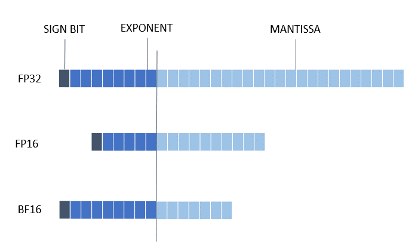

PyTorch Mixed Precision
========================================

1. [Introduction](#introduction)
2. [Mixed Precision Support Matrix](#mixed-precision-support-matrix)
3. [Get Started](#get-start)
4. [Examples](#examples)

## Introduction

The recent growth of Deep Learning has driven the development of more complex models that require significantly more compute and memory capabilities. Several low precision numeric formats have been proposed to address the problem. 
Google's [bfloat16](https://cloud.google.com/tpu/docs/bfloat16) and the [FP16: IEEE](https://en.wikipedia.org/wiki/Half-precision_floating-point_format) half-precision format are two of the most widely used sixteen bit formats. [Mixed precision](https://arxiv.org/abs/1710.03740) training and inference using low precision formats have been developed to reduce compute and bandwidth requirements.

The 3rd Gen Intel® Xeon® Scalable processor (codenamed Cooper Lake), featuring Intel® Deep Learning Boost, is the first general-purpose x86 CPU to support the bfloat16 format. Specifically, three new bfloat16 instructions are added as a part of the AVX512_BF16 extension within Intel Deep Learning Boost: VCVTNE2PS2BF16, VCVTNEPS2BF16, and VDPBF16PS. The first two instructions allow converting to and from bfloat16 data type, while the last one performs a dot product of bfloat16 pairs. 
Further details can be found in the [Hardware Numerics Document](https://www.intel.com/content/www/us/en/developer/articles/technical/intel-deep-learning-boost-new-instruction-bfloat16.html) published by Intel.  

The 4th Gen Intel® Xeon® Scalable processor supports FP16 instruction set architecture (ISA) for Intel® Advanced Vector Extensions 512 (Intel® AVX-512). The new ISA supports a wide range of general-purpose numeric operations for 16-bit half-precision IEEE-754 floating-point and complements the existing 32-bit and 64-bit floating-point instructions already available in the Intel Xeon processor based products. 
Further details can be found in the [Intel AVX512 FP16 Guide](https://www.intel.com/content/www/us/en/content-details/669773/intel-avx-512-fp16-instruction-set-for-intel-xeon-processor-based-products-technology-guide.html) published by Intel.

The latest Intel Xeon processors deliver flexibility of Intel Advanced Matrix Extensions (Intel AMX) ,an accelerator that improves the performance of deep learning(DL) training and inference, making it ideal for workloads like NLP, recommender systems, and image recognition. Developers can code AI functionality to take advantage of the Intel AMX instruction set, and they can code non-AI functionality to use the processor instruction set architecture (ISA). Intel has integrated the Intel® oneAPI Deep Neural Network Library (oneDNN), its oneAPI DL engine, into Pytorch.
Further details can be found in the [Intel AMX Document](https://www.intel.com/content/www/us/en/content-details/785250/accelerate-artificial-intelligence-workloads-with-intel-advanced-matrix-extensions.html) published by Intel.

<p align="center" width="100%">
    
</p>

## Mixed Precision Support Matrix

<table class="center">
    <thead>
        <tr>
            <th>Framework</th>
            <th>Backend</th>
            <th>Backend Library</th>
            <th>Backend Value</th>
            <th>Support Device(cpu as default)</th> 
            <th>Support BF16</th>
            <th>Support FP16</th>
        </tr>
    </thead>
    <tbody>
        <tr>
            <td rowspan="1" align="left">PyTorch</td>
            <td align="left">FX</td>
            <td align="left">FBGEMM</td>
            <td align="left">"default"</td>
            <td align="left">cpu</td>
            <td align="left">&#10004;</td>
            <td align="left">&#10004;</td>
        </tr>
    </tbody>
</table>


### Hardware and Software requests for **BF16**
- PyTorch
  1. Hardware: CPU supports `avx512_bf16` instruction set.
  2. Software: torch >= [1.11.0](https://download.pytorch.org/whl/torch_stable.html).


### Hardware and Software requests for **FP16**
- PyTorch
  1. Hardware: CPU supports `avx512_fp16` instruction set.
  2. Software: torch >= [1.11.0](https://download.pytorch.org/whl/torch_stable.html).
> Note: To run FP16 on Intel-AMX, please set the environment variable `ONEDNN_MAX_CPU_ISA`:
> ```export ONEDNN_MAX_CPU_ISA=AVX512_CORE_AMX_FP16```


### Accuracy-driven mixed precision
BF16/FP16 conversion may lead to accuracy drop. Intel® Neural Compressor provides an accuracy-driven tuning function to reduce accuracy loss, 
which could fallback converted ops to FP32, if set in config, to get better accuracy. To enable this function, users only to provide 
`eval_fn` and `eval_args` for `autotune`.   
To be noticed, IPEX backend doesn't support accuracy-driven mixed precision.  

## Get Started with autotune API

To get a bf16/fp16 model, users can use the `autotune` interface with `MixedPrecisionConfig` as follows.

- BF16:

```python
from neural_compressor.torch.quantization import MixedPrecisionConfig, TuningConfig, autotune

def eval_acc_fn(model):
    ......
    return acc

# modules might be fallback to fp32 to get better accuracy
custom_tune_config = TuningConfig(config_set=[MixedPrecisionConfig(dtype=["bf16", "fp32"])], max_trials=3)
best_model = autotune(model=build_torch_model(), tune_config=custom_tune_config, eval_fn=eval_acc_fn)
```

- FP16:

```python
from neural_compressor.torch.quantization import MixedPrecisionConfig, TuningConfig, autotune

def eval_acc_fn(model):
    ......
    return acc

# modules might be fallback to fp32 to get better accuracy
custom_tune_config = TuningConfig(config_set=[MixedPrecisionConfig(dtype=["fp16", "fp32"])], max_trials=3)
best_model = autotune(model=build_torch_model(), tune_config=custom_tune_config, eval_fn=eval_acc_fn)
```
  
## Examples

Users can also refer to [examples](https://github.com/intel/neural-compressor/blob/master/examples/pytorch/cv/mixed_precision
) on how to quantize a model with Mixed Precision.
