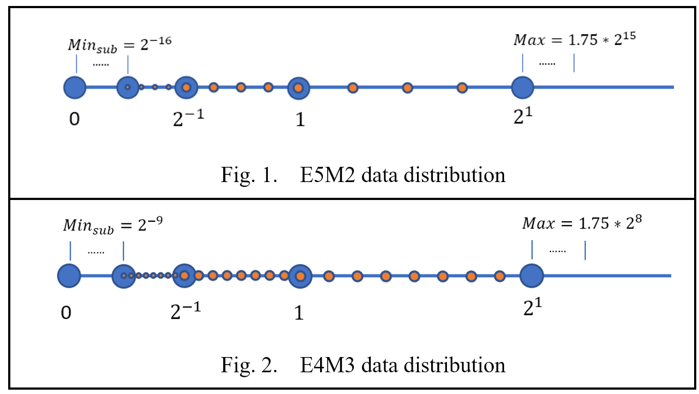
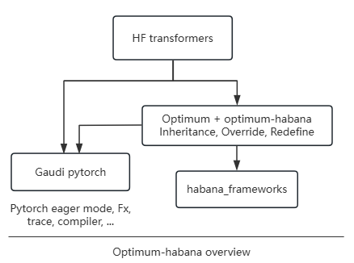

FP8 Quantization
=======

1. [Introduction](#introduction)
2. [Support Matrix](#support-matrix)
3. [Supported Parameters](#supported-parameters)
4. [Get Start with FP8 Quantization](#get-start-with-fp8-quantization)
5. [Optimum-habana LLM example](#optimum-habana-LLM-example)
6. [VLLM example](#VLLM-example)

## Introduction

Float point 8 (FP8) is a promising data type for low precision quantization which provides a data distribution that is completely different from INT8 and it's shown as below.

<div align="center">
    
</div>

Intel Gaudi2, also known as HPU, provides this data type capability for low precision quantization, which includes `E4M3` and `E5M2`. For more information about these two data type, please refer to [link](https://arxiv.org/abs/2209.05433).

To harness FP8 capabilities — offering reduced memory usage and lower computational costs — Intel Neural Compressor provides general quantization APIs to generate FP8 models.

## Support Matrix

| Hardware | FP8 mode | FP8 QDQ mode |
| :------- |:--------|:---------|
| HPU      | &#10004; | &#10004; |
| CPU      | &#10005; | &#10004; |

For FP8 mode, tensors are all represented in FP8 format and kernels are replaced to FP8 version explicitly.

For FP8 QDQ mode, activations are still in high precision and quant/dequant pairs are inserted. Frameworks can compile and fuse operators of FP8 QDQ model based on their own capability.

During runtime, Intel Neural Compressor will detect hardware automatically and the priority is HPU > CPU.

## Supported Parameters

<table class="tg"><thead>
  <tr>
    <th class="tg-fymr">Attribute</th>
    <th class="tg-fymr">Description</th>
    <th class="tg-fymr">Values</th>
  </tr></thead>
<tbody>
  <tr>
    <td class="tg-0pky">fp8_config</td>
    <td class="tg-0pky">The target data type of FP8 quantization.</td>
    <td class="tg-0pky">E4M3 (default) - As Fig. 2<br>E5M2 - As Fig. 1.</td>
  </tr>
  <tr>
    <td class="tg-0pky">hp_dtype</td>
    <td class="tg-0pky">The high precision data type of non-FP8 operators.</td>
    <td class="tg-0pky">bf16 (default) - torch.bfloat16<br>fp16 - torch.float16.<br>fp32 - torch.float32.</td>
  </tr>
  <tr>
    <td class="tg-0pky">observer</td>
    <td class="tg-0pky">The observer to measure the statistics.</td>
    <td class="tg-0pky">maxabs (default), saves all tensors to files.</td>
  </tr>
  <tr>
    <td class="tg-0pky">allowlist</td>
    <td class="tg-0pky">List of nn.Module names or types to quantize. When setting an empty list, all the supported modules will be quantized by default. See Supported Modules. Not setting the list at all is not recommended as it will set the allowlist to these modules only: torch.nn.Linear, torch.nn.Conv2d, and BMM.</td>
    <td class="tg-0pky">Default = {'names': [], 'types': <span title=["Matmul","Linear","FalconLinear","KVCache","Conv2d","LoRACompatibleLinear","LoRACompatibleConv","Softmax","ModuleFusedSDPA","LinearLayer","LinearAllreduce","ScopedLinearAllReduce","LmHeadLinearAllreduce"]>FP8_WHITE_LIST}</span></td>
  </tr>
  <tr>
    <td class="tg-0pky">blocklist</td>
    <td class="tg-0pky">List of nn.Module names or types not to quantize. Defaults to empty list, so you may omit it from the config file.</td>
    <td class="tg-0pky">Default = {'names': [], 'types': ()}</td>
  </tr>
  <tr>
    <td class="tg-0pky">mode</td>
    <td class="tg-0pky">The mode, measure or quantize, to run HQT with.</td>
    <td class="tg-0pky">MEASURE - Measure statistics of all modules and emit the results to dump_stats_path.<br>QUANTIZE - Quantize and run the model according to the provided measurements.<br>AUTO (default) - Select from [MEASURE, QUANTIZE] automatically.</td>
  </tr>
  <tr>
    <td class="tg-0pky">dump_stats_path</td>
    <td class="tg-0pky">The path to save and load the measurements. The path is created up until the level before last "/". The string after the last / will be used as prefix to all the measurement files that will be created.</td>
    <td class="tg-0pky">Default = "./hqt_output/measure"</td>
  </tr>
  <tr>
    <td class="tg-0pky">scale_method</td>
    <td class="tg-0pky">The method for calculating the scale from the measurement.</td>
    <td class="tg-0pky">- unit_scale - Always use scale of 1.<br>- hw_aligned_single_scale - Always use scale that's aligned to the corresponding HW accelerated scale.<br>- maxabs_hw (default) - Scale is calculated to stretch/compress the maxabs measurement to the full-scale of FP8 and then aligned to the corresponding HW accelerated scale.<br>- maxabs_pow2 - Scale is calculated to stretch/compress the maxabs measurement to the full-scale of FP8 and then rounded to the power of 2.<br>- maxabs_hw_opt_weight - Scale of model params (weights) is chosen as the scale that provides minimal mean-square-error between quantized and non-quantized weights, from all possible HW accelerated scales. Scale of activations is calculated the same as maxabs_hw.<br>- act_maxabs_pow2_weights_pcs_opt_pow2 - Scale of model params (weights) is calculated per-channel of the params tensor. The scale per-channel is calculated the same as maxabs_hw_opt_weight. Scale of activations is calculated the same as maxabs_pow2.<br>- act_maxabs_hw_weights_pcs_maxabs_pow2 - Scale of model params (weights) is calculated per-channel of the params tensor. The scale per-channel is calculated the same as maxabs_pow2. Scale of activations is calculated the same as maxabs_hw.</td>
  </tr>
  <tr>
    <td class="tg-0pky">measure_exclude</td>
    <td class="tg-0pky">If this attribute is not defined, the default is OUTPUT. Since most models do not require measuring output tensors, you can exclude it to speed up the measurement process.</td>
    <td class="tg-0pky">NONE - All tensors are measured.<br>OUTPUT (default) - Excludes measurement of output tensors.</td>
  </tr>
</tbody></table>

## Get Start with FP8 Quantization
[Demo Usage](https://github.com/intel/neural-compressor?tab=readme-ov-file#getting-started)    
[Computer vision example](../../examples/pytorch/cv/fp8_quant)

## Optimum-habana LLM example
### Overview
[Optimum](https://huggingface.co/docs/optimum) is an extension of Transformers that provides a set of performance optimization tools to train and run models on targeted hardware with maximum efficiency.    
[Optimum-habana](https://github.com/huggingface/optimum-habana) is the interface between the Transformers, Diffusers libraries and Intel Gaudi AI Accelerators (HPU). It provides higher performance based on modified modeling files, and utilizes Intel Neural Compressor for FP8 quantization internally,  [running-with-fp8](https://github.com/huggingface/optimum-habana/tree/main/examples/text-generation#running-with-fp8)    

### Installation
Refer to [optimum-habana, install-the-library-and-get-example-scripts](https://github.com/huggingface/optimum-habana?tab=readme-ov-file#install-the-library-and-get-example-scripts)    
Option to install from source,
```
$ git clone https://github.com/huggingface/optimum-habana
$ cd optimum-habana && git checkout v1.14.0 (change the version)
$ pip install -e .
$ pip install git+https://github.com/HabanaAI/DeepSpeed.git@1.18.0
$ cd examples/text-generation
$ pip install -r requirements.txt
$ pip install -r requirements_lm_eval.txt  (Option)
```
### Check neural_compressor code
> optimum-habana/examples/text-generation/utils.py
>> initialize_model() -> setup_model() -> setup_quantization() -> FP8Config/prepare()/convert() 

### FP8 KV cache
Introduction: [kv-cache-quantization in huggingface transformers](https://huggingface.co/blog/kv-cache-quantization)    

BF16 KVCache Code -> [Modeling_all_models.py -> KVCache()](https://github.com/huggingface/optimum-habana/blob/main/optimum/habana/transformers/models/modeling_all_models.py)    

FP8 KVCache code trace with neural compressor support, for example Llama models,    
> optimum-habana/optimum/habana/transformers/models/llama/modeling_llama.py     
>> GaudiLlamaForCausalLM()  -> self.model()
>>>    GaudiLlamaModel() -> forward() -> decoder_layer() ->  GaudiLlamaDecoderLayer() forward() -> pre_attn() -> pre_attn_forward() -> self.k_cache.update     

> neural_compressor/torch/algorithms/fp8_quant/_quant_common/helper_modules.py    
>> PatchedKVCache() -> update()    
>> PatchedModuleFusedSDPA()

Models list which support FP8 KV Cache,
```
microsoft/Phi-3-mini-4k-instruct
bigcode/starcoder2-3b
Qwen/Qwen2.5-7B-Instruct|
meta-llama/Llama-3.2-3B-Instruct
tiiuae/falcon-7b-instruct
mistralai/Mixtral-8x7B-Instruct-v0.1
EleutherAI/gpt-j-6b
mistralai/Mistral-Nemo-Instruct-2407
...
```

### Running with FP8
Refer to [here](https://github.com/huggingface/optimum-habana/tree/main/examples/text-generation#running-with-fp8).    
Change "--model_name_or_path" to be your model like someone in the above models list. "--use_kv_cache" is or not to enable FP8 KV cache.

### Profiling
Add "--profiling_warmup_steps 5 --profiling_steps 2 --profiling_record_shapes" as args in the end of commandline of `run_generation.py`.     
Refer to [torch.profiler.ProfilerActivity.HPU](https://github.com/huggingface/optimum-habana/blob/c9e1c23620618e2f260c92c46dfeb163545ec5ba/optimum/habana/utils.py#L305).    

### FP8 Accuracy 
"lm_eval.tasks", "lm_eval.evaluator", "lm_eval" are installed from the above requirements_lm_eval.txt. The tasks can be set and the default is ["hellaswag", "lambada_openai", "piqa", "winogrande"], [more info](https://github.com/EleutherAI/lm-evaluation-harness/)    

| `Llama-3.1-8B-Instruct`| fp8 w/ fp8 KVCache| bf16 w/ bf16 KVCache|
|---------------|---------|--------|
| lambada_openai| 0.7299  | 0.7359 |
| hellaswag     | 0.5892  | 0.5911 |
| piqa          | 0.7965  | 0.7998 |
| winogrande    | 0.7474  | 0.7372 |
| mmlu          | 0.6599  | 0.6829 |

| `Phi-3-mini-4k-instruct`| fp8 w/ fp8 KVCache| bf16 w/ bf16 KVCache|
|---------------|---------|--------|
| lambada_openai| 0.6420  | 0.6552 |
| hellaswag     | 0.5866  | 0.5902 |
| piqa          | 0.8041  | 0.8014 |
| winogrande    | 0.7324  | 0.7348 |
| mmlu          | 0.7035  | 0.7055 |

| `Mistral-7B-Instruct-v0.2`| fp8 w/ fp8 KVCache| bf16 w/ bf16 KVCache|
|---------------|---------|--------|
| lambada_openai| 0.7126  | 0.7165 |
| hellaswag     | 0.6556  | 0.6609 |
| piqa          | 0.8014  | 0.8025 |
| winogrande    | 0.7253  | 0.7388 |
| mmlu          | 0.5833  | 0.5919 |

| `Mistral-Nemo-Instruct-2407`| fp8 w/ fp8 KVCache| bf16 w/ bf16 KVCache|
|---------------|---------|--------|
| lambada_openai| 0.7568  | 0.7596 |
| hellaswag     | 0.6273  | 0.6325 |
| piqa          | 0.8150  | 0.8085 |
| winogrande    | 0.7419  | 0.7482 |
| mmlu          | 0.6684  | 0.6840 |

| `bigscience/bloom-7b1`| fp8 w/ fp8 KVCache| bf16 w/ bf16 KVCache|
|---------------|---------|--------|
| lambada_openai| 0.5599  | 0.5731 |
| hellaswag     | 0.4632  | 0.4639 |
| piqa          | 0.7301  | 0.7242 |
| winogrande    | 0.6314  | 0.6393 |
| mmlu          | 0.2563  | 0.2572 |

| `Mixtral-8x7B-Instruct-v0.1`| fp8 w/ fp8 KVCache| bf16 w/ bf16 KVCache|
|---------------|---------|--------|
| lambada_openai| 0.7805  | 0.7778 |
| hellaswag     | 0.6733  | 0.6764 |
| piqa          | 0.8324  | 0.8351 |
| winogrande    | 0.7680  | 0.7672 |
| mmlu          | 0.7031  | 0.7026 |

| `EleutherAI/gpt-j-6b`| fp8 w/ fp8 KVCache| bf16 w/ bf16 KVCache|
|---------------|---------|--------|
| lambada_openai| 0.6769  | 0.6781 |
| hellaswag     | 0.4928  | 0.4958 |
| piqa          | 0.7557  | 0.7541 |
| winogrande    | 0.6409  | 0.6425 |
| mmlu          | 0.2524  | 0.2606 |
> Notes: For gpt-j model, if `--use_kv_cache` is set to enable KVCache quantization, `--reuse_cache` should also be set.    

## VLLM example
### Overview


### Installation
Refer to [Habana vllm-fork](https://github.com/HabanaAI/vllm-fork) to install.    
Option to install `vllm-hpu-extension`, `neural_compressor` and `vllm` from the source,
```
$ git clone https://github.com/HabanaAI/vllm-fork.git
$ cd vllm-fork
$ pip install -r requirements-hpu.txt
$ python setup.py develop --user

## Check
$ pip list |grep vllm
vllm                              0.6.3.dev1122+g2f43ebf5.d20241121.gaudi118 /home/fengding/vllm-fork
vllm-hpu-extension                0.1

## Validation
$ VLLM_SKIP_WARMUP=true python3 examples/offline_inference.py
......
Prompt: 'Hello, my name is', Generated text: ' Kelly and I have a job to do.\nI need someone to come over'
Prompt: 'The president of the United States is', Generated text: ' facing a sharp criticism of his handling of the coronavirus pandemic, including'
Prompt: 'The capital of France is', Generated text: ' the capital of the Socialist Party of France (SPF), with its state-'
Prompt: 'The future of AI is', Generated text: " in what's coming, not what's coming.\nI don't know what"
```

### Run FP8 calibration
Refer to [vllm-hpu-extension->calibration](https://github.com/HabanaAI/vllm-hpu-extension/tree/main/calibration)    
```
$ git clone https://github.com/HabanaAI/vllm-hpu-extension
$ cd vllm-hpu-extension/calibration

# For Llama-3.1.8B-Instruct
$ ./calibrate_model.sh -m meta-llama/Llama-3.1-8B-Instruct -d /home/fengding/processed-data.pkl -o ./output_llama3.1.8b.Instruct -b 128 -t 1 -l 128
    ## Generate scale factors in ./output_llama3.1.8b.Instruct
```

### Start vllm server
```
$ cd vllm-fork/

$ PT_HPU_ENABLE_LAZY_COLLECTIVES=true \
PT_HPU_WEIGHT_SHARING=0 \
VLLM_CONTIGUOUS_PA=true \
VLLM_SKIP_WARMUP=true \
QUANT_CONFIG=output_llama3.1.8b.Instruct/maxabs_quant_g2.json \
python3 -m vllm.entrypoints.openai.api_server \
--model meta-llama/Llama-3.1-8B-Instruct \
--port 8080 \
--gpu-memory-utilization 0.9 \
--tensor-parallel-size 1 \
--disable-log-requests \
--block-size 128 \
--quantization inc \
--kv-cache-dtype fp8_inc \
--device hpu \
--weights-load-device cpu \
--dtype bfloat16 \
--num_scheduler_steps 16 2>&1 > vllm_serving.log &
```
Refer to [vllm-fork->README_GAUDI.md](https://github.com/HabanaAI/vllm-fork/blob/habana_main/README_GAUDI.md) for more details.

### Start client to test
```
$ curl --noproxy "*" http://localhost:8080/v1/completions -H "Content-Type: application/json" -d '{"model": "meta-llama/Llama-3.1-8B-Instruct", "prompt": "San Francisco is a", "max_tokens": 100}'
```

### Run benchmark
```
python benchmarks/benchmark_serving.py \
--backend vllm \
--model meta-llama/Llama-3.1-8B-Instruct  \
--dataset-name sonnet \
--dataset-path benchmarks/sonnet.txt \
--request-rate 128 \
--num-prompts 128 \
--port 8080 \
--sonnet-input-len 128 \
--sonnet-output-len 128 \
--sonnet-prefix-len 100
```

### FP8 KV cache
Code trace
> vllm-fork/vllm/attention/backends/hpu_attn.py
>> from vllm_hpu_extension.utils import Matmul, Softmax, VLLMKVCache
>> HPUAttentionImpl() -> self.k_cache() / self.v_cache()    

> neural_compressor/torch/algorithms/fp8_quant/_quant_common/helper_modules.py
>> PatchedVLLMKVCache()

> neural_compressor/torch/algorithms/fp8_quant/common.py
>> "VLLMKVCache": ModuleInfo("kv_cache", PatchedVLLMKVCache)
