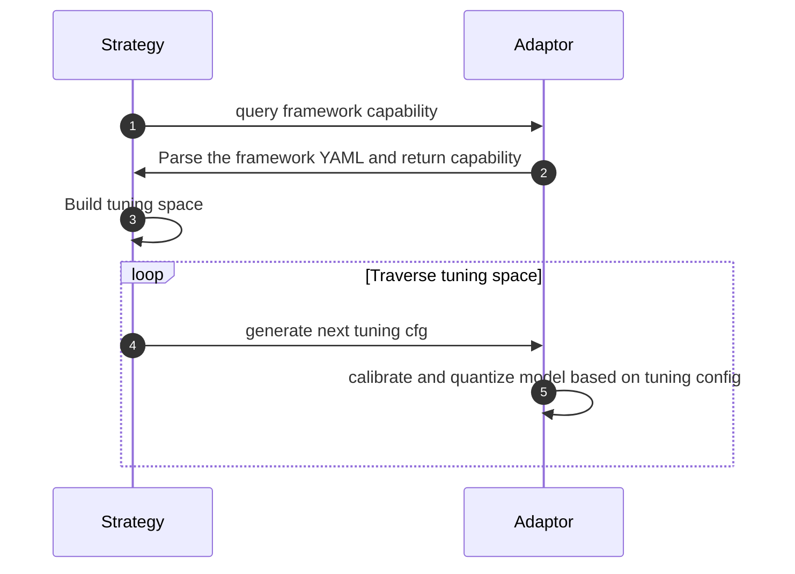

How to Support New Adaptor
=======


- [Introduction](#introduction)
- [Add query_fw_capability to Adaptor](#add-query-fw-capability-to-adaptor)
- [Add Pre-quantization Optimizations](#add-pre-quantization-optimizations)
- [Quantize Model according to tune cfg](#quantize-model-according-to-tune-cfg)
- [Evaluate Model on Validation Dataset](#evaluate-model-on-validation-dataset)
- [Train Model for Quantization-aware Training](#Train-model-for-quantization-awar-training)
- [Other API that not Mandatory Needed](#other-api-that-not-mandatory-needed)
- [Summary](#summary)

## Introduction
Intel® Neural Compressor builds the low-precision inference solution on popular deep learning frameworks such as TensorFlow, PyTorch, MXNet, Keras and ONNX Runtime. The adaptor layer is the bridge between the tuning strategy and vanilla framework quantization APIs.

The quantizable operator behavior and it's tuning scope is defined in specific framework YAML file. The adaptor will parse this file and give the quantization capability to the Strategy object. Then Strategy will build tuning space of the specific graph/model and generate different tuning configuration from the tuning space to adaptor.

The diagram below illustrates all the relevant steps of how adaptor is invoked, with additional details provided for each annotated step.

1. **Strategy**: Drives the overall tuning process and utilizes `adaptor.query_fw_capability` to query the framework's capabilities.

2. **Adaptor**: Parses the framework YAML, filters some corner cases, and constructs the framework capability. This includes the capabilities of each operator and other model-related information.

3. **Strategy**: Constructs the tuning space based on the framework capability and initiates the tuning process.

4. **Strategy**: Generates the tuning configurations for each operators of the model using the tuning space constructed in the previous step, specifying the desired tuning process.

5. **Adaptor**: Invokes the specific kernels for the calibration and quantization based on the tuning configuration.


## Add query_fw_capability to Adaptor

To enable accuracy-aware tuning with a specific framework, we should define the [framework YAML](./framework_yaml.md) which unifies the configuration format for quantization and provides a description for the capabilities of the specific framework. 
>**Note**: You should refer to [framework_yaml.md](./framework_yaml.md) to define the framework specific YAML.

After the framework YAML enabled, The The abstract class `QueryBackendCapability` should be inherited and implemented. This class is used to load the YAML file and parse the quantization config from the specific framework version. You can refer to Tensorflow implementation [TensorflowQuery](../neural_compressor/adaptor/tensorflow.py#L628).

With the inherited `QueryBackendCapability` class enabled. The Adaptor will initialize a `query_handler` and used in API `query_fw_capability`.

Each framework adaptor should implement the `query_fw_capability` fucntion, this function will only be invoked once and will loop over the graph/model for the quantizable operators and collect each operator's opwise details and optypewise capability. You should return a standard dict of the input model's tuning capability. The format is like below:

```python
    def query_fw_capability(self, model):
        # loop over the model and generate the capability of the model
        capability = {
            'opwise': quantizable_op_details,
            'optypewise': self.get_optye_wise_ability(quantizable_op_details),
        }
        return capability
```
The `quantizable_op_details` is key-value pairs of each operators. The key is a tuple (node_name, node_op) and the value is a list including different data type quantization config. 

```python
    op_capability = self.query_handler.get_quantization_capability()
    int8_conv_config = copy.deepcopy(op_capability['int8']['Conv2D'])
    fp32_config = {'weight': {'dtype': 'fp32'}, 'activation': {'dtype': 'fp32'}}
    bf16_config = {'weight': {'dtype': 'bf16'}, 'activation': {'dtype': 'bf16'}}
    quantizable_op_details = {
      ('conv2d', 'Conv2D'): [int8_conv_config, bf16_config, fp32_config]
    }

```
In most case, `bf16_config` and `fp32_config` stay the same on different operators and we can add config of different data type to the `quantizable_op_details`. It's configured in the YAML file and parsed out with format like below.

```python
    int8_conv_config = {
        'weight': {
               'dtype': 'int8',
               'algorithm': 'minmax',
               'granularity': 'per_channel',
               'scheme': 'sym'
        },
        'activation': {
               'dtype': 'int8',
               'quant_mode': 'static',
               'algorithm': 'kl',
               'granularity': 'per_tensor',
               'scheme': 'sym'
        }
    }

```
After we got the opwise capability of the model, we should also get the optypewise ability. It's also a key-value pair but the key is op type and the value is the configuration of activation and weight for this op type. It has format like below:

```python
    optype_wise_ability = {
        'Conv2D': {
            'weight': {
                   'dtype': 'int8',
                   'algorithm': 'minmax',
                   'granularity': 'per_channel',
                   'scheme': 'sym'
            },
            'activation': {
                   'dtype': 'int8',
                   'quant_mode': 'static',
                   'algorithm': 'kl',
                   'granularity': 'per_tensor',
                   'scheme': 'sym'
            }
        }
    }
```
There is an API get_optype_wise_ability to get the optype_wise_ability from the `quantizable_op_details`. You can refer to [get_optype_wise_ability](../neural_compressor/adaptor/keras.py#L614) for the implementation.

After the work above, we have implement the `query_fw_capability` API and get the tuning capability dict for the Strategy object. Then the Strategy object will fetch tuning configuration and give to the quantize API to get the quantized model.

## Add Pre-quantization optimizations
As the `query_fw_capability` only invoked once, we can do some pre-optimizations in the `query_fw_capability` API and cache the pre_optimized_object for quantization. It's not mandatory and if you have done optimizations on the model, take care to use the optimized model in the quantize API.


## Quantize Model according to tune_cfg
`quantize` function is used to perform quantization for post-training quantization and quantization-aware training. Quantization processing includes calibration and conversion processing for post-training quantization, while for quantization-aware training, it includes training and conversion processing.

The first work of `quantize` function is to invoke `tuning_cfg_to_fw` to generate the self.quantize_config. The self.quantize_config is a dict including the quantization information. It's format is like below

```
self.quantize_config  = {
    'device': 'CPU',
    'calib_iteration': 50,
    'advance': {},
    'op_wise_config': {
        'conv2d': (True, 'minmax', False, 8),
        # ....
    }
}
```
As the Strategy object will decide which operator to quantize or not, some quantizable operators may not be in the `tune_cfg`. Only dispatched operators will be set to the `op_wise_config` in `self.quantize_config`. `op_wise_config` is a dict with format like 

```
op_wise_config = {
    op_name: (is_perchannel, 
              algorithm, 
              is_asymmetric, 
              weight_bit)
} 
```

You can also set bf16_ops in `tuning_cfg_to_fw` and the `self.bf16_ops` will be converted in `convert_bf16` function.

After got the `self.quantize_config`, we can prepare to quantize the model. It usually have three steps.

### Insert FakeQuant operator to the fp32 graph for calibration.
FakeQuant operator is inserted before the quantizable operator and responsible for the activation collection. Only operators in self.quantize_config['op_wise_config'] can have FakeQuant before. The fake code should be like

```python
calib_model = FrameworkModel()
for operator in self.pre_optimized_model:
    if operator['op_name'] in self.quantize_config['op_wise_config']:
        fake_q_operator = FakeQuant(self.quantize_config['op_wise_config']['op_name'])
        calib_model.add_layer(fake_q_operator)
        calib_model.add_layer(operator)
    else:
        calib_model.add_layer(operator)
                
```
In this sample code, we initialize an empty framework model and loop over the pre_optimized_model from `query_fw_capability`, when we see operator in `self.quantize_config`, then initialize a fake quant operator and add before the quantizable operator.

### Run sampling iterations of the fp32 graph to calibrate quantizable operators.
When we get the calib_model, it's still fp32 model with FakeQuant operator inserted, We should run calibration on this fp32 model and collect the fp32 activation data. In this step, we will use the dataloader and forward the model. The sample code is like below
```
    results = {}
    for idx, (inputs, labels) in enumerate(dataloader):
        outputs = calib_model.predict_on_batch(inputs)
        for layer in calib_model.layers:
            if layer['op_type'] == 'FakeQuant':
                calib_data = layer['calib_data']
                if layer['op_name'] not in results:
                    results[layer['op_name']] = {'calib_data': calib_data}
                else:
                    results[layer['op_name']]['calib_data'].append(calib_data)
        if idx + 1  == calib_iteration:
            break
```
After calib_iteration inference, the `results` above will collect all quantizable operators' activations. These activations is called calibration data. 

### Replace the FakeQuant with Quantize/DeQuantize 
Calibration data can only approximate the data distribution of the entire dataset, larger sampling size means a more complete approximation of the data distribution, but it will also introduce some outliers, which will cause the data range obtained to be somewhat distorted.

 we will use different algorithms to make the data range more in line with the real data distribution. After applying these algorithms, we obtained the data distribution range of each operator. At this time, operator replacement can be performed.

We take the FakeQuant and replace it with Quant and Dequant, then connect it in front of the original quantizable operator. Notice the data range calculated by the algorithm should be written into the Quant and Dequant operators.

This quantized model can be evaluated. If the evaluation meets the set metric goal, the entire quantization process will be over. Otherwise, a new tuning configuration will be generated until a quantized model that meets the metric requirements.

## Evaluate Model on Validation Dataset
After getting the quantization model, we need to evaluate the model. The `evaluate` function needs to use dataloader to generate data and labels, then use the generated quantization model to predict on these data, and then use postprocess and metric method to calculate the final result. Because some evaluation criteria are not accuracy-driven, we can also insert the measurer to evaluate the performance of quantization model such as memory usage. The evaluate function returns a scalar representing the measured performance during the evaluation. The reference code example is as follows

```python
   def evaluate(self, model, dataloader, postprocess=None,
                 metrics=None, measurer=None, iteration=-1,
                 tensorboard=False, fp32_baseline=False):
       results = []
       for idx, (inputs, labels) in enumerate(dataloader):
           if measurer is not None:
               measurer.start()
               predictions = model.predict_on_batch(inputs)
               measurer.end()
           else:
               predictions = model.predict_on_batch(inputs)

           if postprocess is not None:
               predictions, labels = postprocess((predictions, labels))
           if metrics:
               for metric in metrics:
                   metric.update(predictions, labels)
           if idx + 1 == iteration:
               break
       acc = 0 if metrics is None else [metric.result() for metric in metrics]
       return acc if not isinstance(acc, list) or len(acc) > 1 else acc[0]

```

## Train Model for Quantization-aware Training

## Other API that not Mandatory Needed

|Function      | Description                                                 |
|--------------|:-----------------------------------------------------------:|
|save          |used by tune strategy class for saving model                 |
|convert       |convert a source model format to another                     |
|quantize_input|quantize the model to be able to take quantized input        |
|inspect_tensor|used by tune strategy class for dumping tensor info          |
|set_tensor    |used by tune strategy class for setting tensor back to model |
|convert_bf16  |execute bf16 model conversion                                |


## Summary
The document outlines the process of adding support for a new adaptor, in Intel® Neural Compressor with minimal changes. It provides instructions and code examples for implementation of a new backend. By following the steps outlined in the document, users can extend Intel® Neural Compressor's functionality to accommodate new adaptor and incorporate it into quantization workflows.
