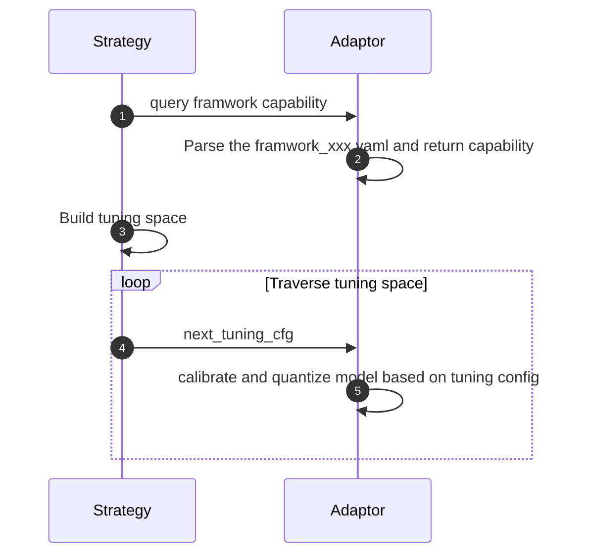

How to Support New Data Type, Like Int4, with a Few Line Changes
=======


- [How to Support New Data Type, Like Int4, with a Few Line Changes](#how-to-support-new-data-type-like-int4-with-a-few-line-changes)
  - [Introduction](#introduction)
  - [Defines the Quantization Ability of the Specific Operator](#defines-the-quantization-ability-of-the-specific-operator)
  - [Invoke the Operator Kernel According to the Tuning Configuration](#invoke-the-operator-kernel-according-to-the-tuning-configuration)
  - [Use the New Data Type](#use-the-new-data-type)
  - [Summary](#summary)

## Introduction
To enable accuracy-aware tuning with various frameworks, Intel® Neural Compressor introduced the [framework YAML](./framework_yaml.md) which unifies the configuration format for quantization and provides a description of the capabilities of specific operators. Before explaining how to add a new data type, let's first introduce the overall process, from defining the operator behavior in YAML to invoking it by adaptor. The diagram below illustrates all the relevant steps, with additional details provided for each annotated step.

> Note: The `adaptor` is a layer abstracts various frameworks supported by Intel® Neural Compressor.



- 1. **Strategy**: Drives the overall tuning process and utilizes `adaptor.query_fw_capability` to query the framework's capabilities.
- 2. **Adaptor**: Parses the framework YAML, filters some corner cases, and constructs the framework capability. This includes the capabilities of each operator and other model-related information.
- 3. **Strategy**: Constructs the tuning space based on the obtained capability and initiates the tuning process.
- 4. **Strategy**: Generates the tuning configurations for each operators of the model using the tuning space constructed in the previous step, specifying the desired tuning process.
- 5. **Adaptor** Invokes the specific kernels for the calibration and quantization based on the tuning configuration.


The following section provides an example of extending the PyTorch `Conv2d` operator to include support for 4-bit quantization.

## Defines the Quantization Ability of the Specific Operator

The first step in adding a new data type for specific operator to Intel® Neural Compressor is to extend the capabilities of operator and include it to the framework YAML.
The capabilities should include the quantized data types and quantization schemes of activation and weight(if applicable). The following table describes the detail of each filed:


| Field name | Options | Description |
| -----------|---------------|------------
| Data Type (`dtype`) | `uint4`, `int4` | The quantization data type being added. It use 4-bit as example, where `uint4` represents an unsigned 4-bit integer and `int4` represents a signed 4-bit integer.|
| Quantization (`scheme`) | `sym`, `asym`| The quantization scheme used for the new data type. `sym` represents symmetric quantization, `asym` represents asymmetric quantization.|
| Quantization Granularity (`granularity`)| `per_channel`, `per_tensor`| The granularity at which quantization is applied. `per_channel` represents that the quantization is applied independently per channel, `per_tensor` represents that the quantization is applied to the entire tensor as a whole. |
| Calibration Algorithm (`algorithm`)| `minmax`, `kl`| 	The calibration algorithm used for the new data type. `minmax` represents the minimum-maximum algorithm, `kl` represents the Kullback-Leibler divergence algorithm. |


To add  4-bit quantization for `Conv2d` in the PyTorch backend. We can modify the `neural_compressor/adaptor/pytorch_cpu.yaml` as follows:

```diff
  ...
  fp32: ['*'] # `*` means all op types.


+    int4: {
+        'static': {
+            'Conv2d': {
+                'weight': {
+                    'dtype': ['int4'],
+                    'scheme': ['sym'],
+                    'granularity': ['per_channel'],
+                    'algorithm': ['minmax']},
+                'activation': {
+                    'dtype': ['uint4'],
+                    'scheme': ['sym'],
+                    'granularity': ['per_tensor'],
+                    'algorithm': ['minmax']},
+            },
+        }
+    }

  int8: &1_11_capabilities {
    'static': &cap_s8_1_11 {
          'Conv1d': &cap_s8_1_11_Conv1d {
  ...

```
The code states that the PyTorch Conv2d Operator has the ability to quantize weights to int4 using the `torch.per_channel_symmetric` quantization scheme, , with the supported calibration algorithm being `minmax`. Additionally, the operator can quantize activations to `uint4` using the `torch.per_tensor_symmetric` quantization scheme, with the supported calibration algorithm also being `minmax`.


## Invoke the Operator Kernel According to the Tuning Configuration

One fo the tuning configuration generated by strategy for `Conv2d` looks like as following:

```python

tune_cfg = {
    'op': {
        ('conv', 'Conv2d'): {
            'weight': {
                'dtype': 'int4',
                'algorithm': 'minmax',
                'granularity': 'per_channel',
                'scheme': 'sym'
            },
            'activation': {
                'dtype': 'uint4',
                'quant_mode': 'static',
                'algorithm': 'kl',
                'granularity': 'per_tensor',
                'scheme': 'sym'
            }
        },
```
Now, we can invoke the specified kernel according to above configurations in adaptor `quantize` function. Due to the PyTorch currently do not have native support for quantization with 4-bit for `Conv2d`. We simulate i numerically by specifying the value ranges of a given data type in observer. We implemented it with following [code](https://github.com/intel/neural-compressor/blob/ad907ab2506514c862f8d79e2109e7407310ceee/neural_compressor/adaptor/pytorch.py#L497-L502):
```diff
    return observer.with_args(qscheme=qscheme,
                              dtype=torch_dtype,
                              reduce_range=(REDUCE_RANGE and scheme == 'asym'),
+                              quant_min=quant_min,
+                              quant_max=quant_max
            )

```

> Note: It's important to note that this simulation only supports N-bit quantization for the PyTorch backend, where N is an integer between 1 and 7.

<!-- Intel® Neural Compressor provides flexibility for users to extend its functionality by adding new data types to the framework. -->

## Use the New Data Type

Once the new data type has been added to Intel® Neural Compressor, it can be used in the same way as any other data type within the framework. Below is an example to specify that all `Conv2d` operators should utilize 4-bit quantization, here's an example of how to do it:

```python
from neural_compressor.config import PostTrainingQuantConfig
op_type_dict = {
    'Conv2d': {
        'weight': {
            'dtype': ['int4']
        },
        'activation': {
            'dtype': ['uint4']
        }
    }
}
conf = PostTrainingQuantConfig(op_type_dict=op_type_dict)
...

```

With this code, all `Conv2d` operators will be quantized to 4-bit, with weight using `int4` and activation using `uint4`.

## Summary
The document outlines the process of adding support for a new data type, such as int4, in Intel® Neural Compressor with minimal changes. It provides instructions and code examples for defining the data type's quantization capabilities, invoking the operator kernel, and using the new data type within the framework. By following the steps outlined in the document, users can extend Intel® Neural Compressor's functionality to accommodate new data types and incorporate them into their quantization workflows.