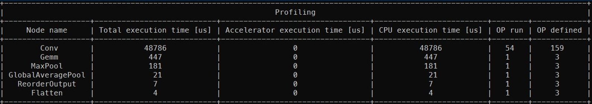

# Diagnosis
1. [Diagnosis introduction](#diagnosis-introduction)
2. [Supported Feature Matrix](#supported-feature-matrix)
3. [Get started](#get-started)
4. [Example](#example)

# Diagnosis introduction
The diagnosis feature provides methods to debug the accuracy loss during quantization and profile the performance gap during benchmark.
There are 2 ways to diagnose a model with Intel® Neural Compressor. First is non-GUI mode that is described below and second is GUI mode with [Neural Insights](https://github.com/intel/neural-compressor/tree/master/neural_insights) component.

The workflow is described in the diagram below. First we have to configure scripts with diagnosis, then run them and check diagnosis info in the terminal. Test if the result is satisfying and repeat the steps if needed.


# Supported feature matrix
<table class="center">
    <thead>
        <tr>
            <th>Types</th>
            <th>Diagnosis data</th>
            <th>Framework</th>
            <th>Backend</th>
        </tr>
    </thead>
    <tbody>
        <tr>
            <td rowspan="2" align="center">Post-Training Static Quantization (PTQ)</td>
            <td rowspan="2" align="center">weights and activations</td>
            <td align="center">TensorFlow</td>
            <td align="center"><a href="https://github.com/tensorflow/tensorflow">TensorFlow</a>/<a href="https://github.com/Intel-tensorflow/tensorflow">Intel TensorFlow</a></td>
        </tr>
        <tr>
            <td align="center">ONNX Runtime</td>
            <td align="center"><a href="https://github.com/microsoft/onnxruntime/blob/master/onnxruntime/python/tools/quantization/quantize.py">QLinearops/QDQ</a></td>
        </tr>
        <tr>
            <td rowspan="2" align="center">Benchmark Profiling</td>
            <td rowspan="2" align="center">OP, execution and duration</td>
            <td align="center">TensorFlow</td>
            <td align="center"><a href="h[label](https://github.com/intel/neural-compressor/assets/51692656/69598de6-4d48-4991-bbbb-e04902500e55)ttps://github.com/tensorflow/tensorflow">TensorFlow</a>/<a href="https://github.com/Intel-tensorflow/tensorflow">Intel TensorFlow</a></td>
        </tr>
        <tr>
            <td align="center">ONNX Runtime</td>
            <td align="center"><a href="https://github.com/microsoft/onnxruntime/blob/master/onnxruntime/python/tools/quantization/quantize.py">QLinearops/QDQ</a></td>
        </tr>
    </tbody>
</table>

# Get started 
## Install Intel® Neural Compressor
First you need to install Intel® Neural Compressor.
```shell
git clone https://github.com/intel/neural-compressor.git
cd neural-compressor 
pip install -r requirements.txt 
python setup.py install
```

## Modify script
Modify quantization/benchmark script to run diagnosis by adding argument `diagnosis` set to `True` to `PostTrainingQuantConfig`/`BenchmarkConfig` as shown below.

### Quantization diagnosis
```python
config = PostTrainingQuantConfig(
    diagnosis=True,
    ...
)
``` 

### Benchmark diagnosis
```python
config = BenchmarkConfig(
    diagnosis=True,
    ...
)
```

# Example
Below it is explained how to run diagnosis for ONNX ResNet50 model.

## Prepare dataset 

Download dataset [ILSVR2012 validation Imagenet dataset](http://www.image-net.org/challenges/LSVRC/2012/downloads).

Download label:
```shell
wget http://dl.caffe.berkeleyvision.org/caffe_ilsvrc12.tar.gz
tar -xvzf caffe_ilsvrc12.tar.gz val.txt
```

## Run quantization script 
Then execute script with quantization API in another terminal with --diagnose flag.
```shell
python examples/onnxrt/image_recognition/resnet50_torchvision/quantization/ptq_static/main.py \
  --model_path=/path/to/resnet50_v1.onnx/ \
  --dataset_location=/path/to/ImageNet/ \
  --label_path=/path/to/val.txt/
  --tune 
  --diagnose 
```

## Run benchmark script
To run profiling execute script with parameters shown in the command below.
```shell
python examples/onnxrt/image_recognition/resnet50_torchvision/quantization/ptq_static/main.py \
  --model_path=/path/to/resnet50_v1.onnx/ \
  --dataset_location=/path/to/ImageNet/ \
  --label_path=/path/to/val.txt/
  --mode=performance \​
  --benchmark \​
  --diagnose
```


## See quantization data

After script's execution you will see the results in your terminal.
In the activations summary you can see a table with OP name, MSE (mean squared error), activation minimum and maximum sorted by MSE.


In the weights summary table there are parameters like minimum, maximum, mean, standard deviation and variance for input model. The table is also sorted by MSE.


## See profiling data

In profiling section there is a table with nodes sorted by total execution time. It is possible to check which operations take the most time.


