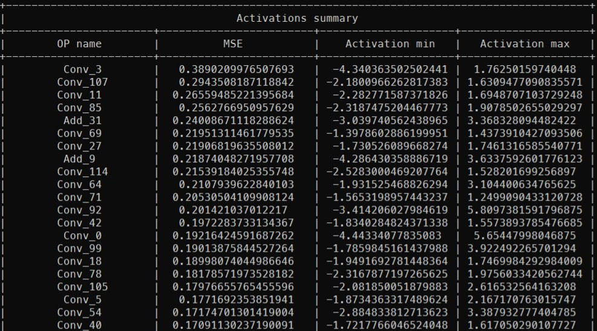
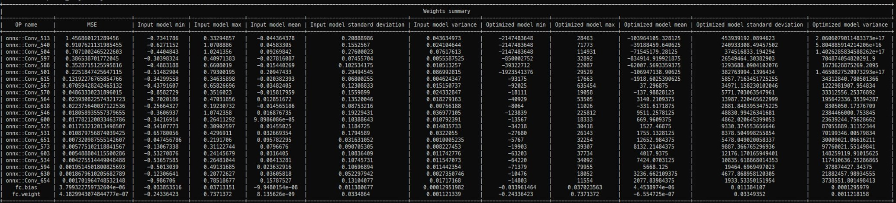

# Quantization diagnosis
There are 2 ways to diagnose quantized model with Intel® Neural Compressor. First is non-GUI mode that is described below and second is GUI mode with [Neural Insights](https://github.com/intel/neural-compressor/tree/master/neural_insights) component.

## Supported feature matrix
<table class="center">
    <thead>
        <tr>
            <th>Types</th>
            <th>Quantization</th>
            <th>Dataset Requirements</th>
            <th>Framework</th>
            <th>Backend</th>
        </tr>
    </thead>
    <tbody>
        <tr>
            <td rowspan="2" align="center">Post-Training Static Quantization (PTQ)</td>
            <td rowspan="2" align="center">weights and activations</td>
            <td rowspan="2" align="center">calibration</td>
            <td align="center">TensorFlow</td>
            <td align="center"><a href="https://github.com/tensorflow/tensorflow">TensorFlow</a>/<a href="https://github.com/Intel-tensorflow/tensorflow">Intel TensorFlow</a></td>
        </tr>
        <tr>
            <td align="center">ONNX Runtime</td>
            <td align="center"><a href="https://github.com/microsoft/onnxruntime/blob/master/onnxruntime/python/tools/quantization/quantize.py">QLinearops/QDQ</a></td>
        </tr>
    </tbody>
</table>

## Run diagnosis example
Below it is explained how to run diagnosis for ONNX ResNet50 model.

### Prepare dataset 

Download dataset [ILSVR2012 validation Imagenet dataset](http://www.image-net.org/challenges/LSVRC/2012/downloads).

Download label:
```
wget http://dl.caffe.berkeleyvision.org/caffe_ilsvrc12.tar.gz
tar -xvzf caffe_ilsvrc12.tar.gz val.txt
```

### Run quantization script 

Then execute script with quantization APi in another terminal with --diagnose flag.
```
python examples/onnxrt/image_recognition/resnet50_torchvision/quantization/ptq_static/main.py \
  --model_path=/path/to/resnet50_v1.onnx/ \
  --dataset_location=/path/to/ImageNet/ \
  --label_path=/path/to/val.txt/
  --tune 
  --diagnose 
```

## See diagnosis data

After script's execution you will see the results in your terminal.
In the activations summary you can see a table with OP name, MSE (mean squared error), activation minimum and maximum sorted by MSE.



In the weights summary table there are parameters like minimum, maximum, mean, standard deviation and variance for both input and optimized models. The table is also sorted by MSE.

