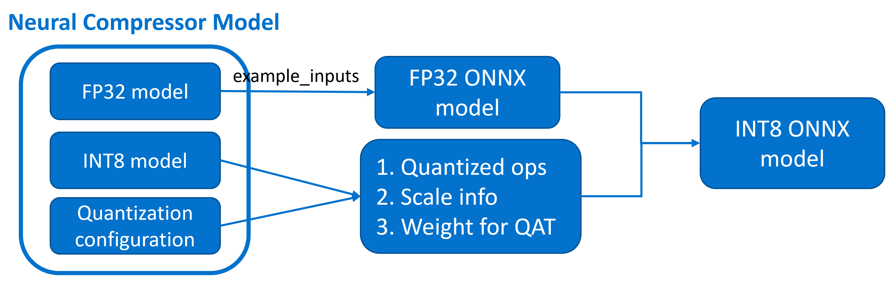

Export
=====

1. [Introduction](#introduction)

2. [Supported Framework Model Matrix](#supported-framework-model-matrix)

3. [Examples](#examples)

4. [Appendix](#appendix)

# Introduction
Open Neural Network Exchange (ONNX) is an open standard format for representing machine learning models. Exporting FP32 PyTorch/Tensorflow models has become popular and easy to use. However, for Intel Neural Compressor, we hope to export the INT8 model into the ONNX format to achieve higher applicability in multiple frameworks.

Here we briefly introduce our export API for PyTorch FP32/INT8 models. First, the INT8 ONNX model is not directly exported from the INT8 PyTorch model, but quantized after obtaining the FP32 ONNX model using the mature torch.onnx.export API. To ensure the majority of the quantization process of ONNX is consistent with PyTorch, we reuse three key pieces of information from the Neural Compressor model to perform ONNX quantization.

 - Quantized operations: Only operations quantized in PyTorch will be quantized in the quantization process of ONNX.
 - Scale info: Scale information is collected from the quantization process of PyTorch.
 - Weights of quantization aware training(QAT): For quantization aware training, the updated weights are passed to the ONNX model.

<a target="_blank" href="./_static/imgs/export.png" text-align:center>
    <center> 
         
    </center>
</a>

# Supported Framework Model Matrix

| Export | Post-training Dynamic Quantization | Post-training Static Quantization | Quantization Aware Training |
| :---: | :---: | :---: | :---: |
| FP32 PyTorch Model -> FP32 ONNX Model | &#10004; | &#10004; | &#10004; |
| INT8 PyTorch Model -> INT8 QDQ ONNX Model | &#10004; | &#10004; | &#10004; |
| INT8 PyTorch Model -> INT8 QLinear ONNX Model | &#10004; | &#10004; | &#10004; |

# Examples

## FP32 Model Export
```python
from neural_compressor.experimental.common import Model
from neural_compressor.config import Torch2ONNXConfig
inc_model = Model(model)
fp32_onnx_config = Torch2ONNXConfig(
    dtype="fp32",
    example_inputs=torch.randn(1, 3, 224, 224),
    input_names=['input'],
    output_names=['output'],
    dynamic_axes={"input": {0: "batch_size"},
                    "output": {0: "batch_size"}},
)
inc_model.export('fp32-model.onnx', fp32_onnx_config)
```

## INT8 Model Export

```python
# q_model is a Neural Compressor model after performing quantization.
from neural_compressor.config import Torch2ONNXConfig
int8_onnx_config = Torch2ONNXConfig(
    dtype="int8",
    opset_version=14,
    quant_format="QDQ", # or QLinear
    example_inputs=torch.randn(1, 3, 224, 224),
    input_names=['input'],
    output_names=['output'],
    dynamic_axes={"input": {0: "batch_size"},
                    "output": {0: "batch_size"}},
)
q_model.export('int8-model.onnx', int8_onnx_config)
```

# Appendix

Since there is a known quantization gap between PyTorch 'nn.Linear' module and ONNX 'MatMul + Add' subgraph, we provide three recipes.

For different recipes and ONNX INT8 model formats, 'nn.quantized.Linear' will be exported to the following subgraph:


<table class="tg">
 <thead>
   <tr>
     <th align="center">Recipe</th>
     <th align="center">QDQ</th>
     <th align="center">QLinear</th>
   </tr>
 </thead>
 <tbody>
   <tr>
     <td align="center">QDQ_OP_FP32_BIAS</td>
     <td>
<pre>
     QuantizeLinear
           |
    DequantizeLinear
           |             
         MatMul
           |
          Add
</pre>
     </td>
     <td>
<pre>
   QuantizeLinear
         |
MatMulIntegerToFloat
         |
        Add 
</pre>
     </td>
   </tr>
   <tr>
     <td align="center">QDQ_OP_INT32_BIAS</td>
     <td>
<pre>
     QuantizeLinear
           |
     MatMulInteger
           |
          Add
           |
          Cast
           |
          Mul
</pre>
     </td>
     <td>
<pre>
   QuantizeLinear
         |
    MatMulInteger
         |
        Add
         |
        Cast
         |
        Mul
</pre>
     </td>
   </tr>
   <tr>
     <td align="center">QDQ_OP_FP32_BIAS_QDQ</td>
     <td>
<pre>
     QuantizeLinear
           |
    DequantizeLinear   
           |
         MatMul
           |
          Add
           |
     QuantizeLinear
           |
    DequantizeLinear
</pre>
     </td>
     <td>
<pre>
   QuantizeLinear
         |
MatMulIntegerToFloat
         |
        Add
         |
   QuantizeLinear
         |
  DequantizeLinear
</pre>
     </td>
   </tr>
 </tbody>
</table>

The default recipe is `QDQ_OP_FP32_BIAS`. If the accuracy of the exported ONNX INT8 model cannot meet your criterion, we recommend you try recipe `QDQ_OP_INT32_BIAS` and `QDQ_OP_FP32_BIAS_QDQ` as follows:
```python
# q_model is a Neural Compressor model after performing quantization.
from neural_compressor.config import Torch2ONNXConfig
int8_onnx_config = Torch2ONNXConfig(
    dtype="int8",
    opset_version=14,
    quant_format="QDQ", # or QLinear
    example_inputs=torch.randn(1, 3, 224, 224),
    input_names=['input'],
    output_names=['output'],
    dynamic_axes={"input": {0: "batch_size"},
                    "output": {0: "batch_size"}},
    recipe='QDQ_OP_INT32_BIAS', # or QDQ_OP_FP32_BIAS_QDQ
)
q_model.export('int8-model.onnx', int8_onnx_config)
```