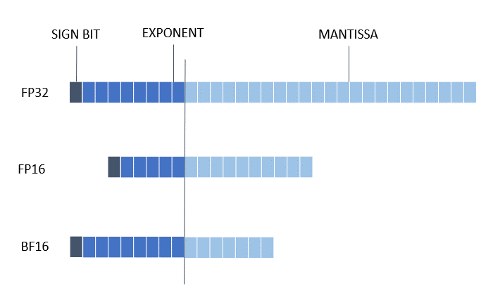

Mixed Precision
===============

1. [Introduction](#introduction)
2. [Mixed Precision Support Matrix](#mixed-precision-support-matrix)
3. [Get Started with Mixed Precision API](#get-start-with-mixed-precision-api)
4. [Examples](#examples)

## Introduction

The recent growth of Deep Learning has driven the development of more complex models that require significantly more compute and memory capabilities. Several low precision numeric formats have been proposed to address the problem. Google's [bfloat16](https://cloud.google.com/tpu/docs/bfloat16) and the [FP16: IEEE](https://en.wikipedia.org/wiki/Half-precision_floating-point_format) half-precision format are two of the most widely used sixteen bit formats. [Mixed precision](https://arxiv.org/abs/1710.03740) training and inference using low precision formats have been developed to reduce compute and bandwidth requirements.

The recently launched 3rd Gen Intel® Xeon® Scalable processor (codenamed Cooper Lake), featuring Intel® Deep Learning Boost, is the first general-purpose x86 CPU to support the bfloat16 format. Specifically, three new bfloat16 instructions are added as a part of the AVX512_BF16 extension within Intel Deep Learning Boost: VCVTNE2PS2BF16, VCVTNEPS2BF16, and VDPBF16PS. The first two instructions allow converting to and from bfloat16 data type, while the last one performs a dot product of bfloat16 pairs. Further details can be found in the [hardware numerics document](https://software.intel.com/content/www/us/en/develop/download/bfloat16-hardware-numerics-definition.html) published by Intel.

<a target="_blank" href="./_static/imgs/data_format.png" text-align:center>
    <center> 
         
    </center>
</a>

## Mixed Precision Support Matrix

|Framework     |BF16         |
|--------------|:-----------:|
|TensorFlow    |&#10004;     |
|PyTorch       |&#10004;     |
|ONNX          |plan to support in the future |
|MXNet         |&#10004;     |

> **During quantization, BF16 conversion can be executed if force enabled. Please refer to this [document](./quantization_mixed_precision.md) for its workflow.**

## Get Started with Mixed Precision API

To get a bf16 model, users can use the Mixed Precision API as follows.


```python
from neural_compressor import mix_precision
from neural_compressor.config import MixedPrecisionConfig

conf = MixedPrecisionConfig()

converted_model = mix_precision.fit(model, config=conf)
converted_model.save('./path/to/save/')
```

> **BF16 conversion may lead to accuracy drop. Intel® Neural Compressor provides an accuracy-aware tuning function to reduce accuracy loss, which will fallback converted ops to FP32 automatically to get better accuracy. To enable this function, users only need to provide an evaluation function (or dataloader + metric).**

  
## Examples

There are 2 pre-requirements to run BF16 mixed precision examples:

- Hardware: CPU supports `avx512_bf16` instruction set.
- Software: intel-tensorflow >= [2.3.0](https://pypi.org/project/intel-tensorflow/2.3.0/) or torch >= [1.11.0](https://download.pytorch.org/whl/torch_stable.html).

If either pre-requirement can't be met, the program would exit consequently.
