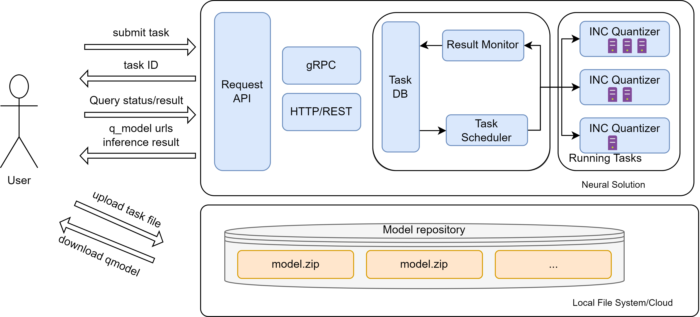

# Neural Solution: Bring the Optimization Power of Intel® Neural Compressor as a Service

`Neural Solution`, `Intel Neural Compressor`, `Distributed Tuning` `Deep Learning`, `Quantization`

In today's fast-paced world of deep learning, model compression techniques play a crucial role in enhancing efficiency and reducing computational resources. Intel® Neural Compressor (INC) is a cutting-edge tool that offers a wide range of popular model compression techniques, including quantization, pruning, distillation, and neural architecture search on mainstream frameworks. It supports a wide range of Intel hardware and has been extensively tested. The tool validates thousands of models from popular models by leveraging zero-code optimization solution [Neural Coder](https://github.com/intel/neural-compressor/blob/master/neural_coder#what-do-we-offer) and automatic [accuracy-driven](https://github.com/intel/neural-compressor/blob/master/docs/source/design.md#workflow) quantization strategies.

In this blog, we are happy to introduce Neural Solution, a novel component that brings the capabilities of INC as a service. Neural Solution simplifies the process of quantizing models and significantly improves efficiency in accuracy-aware tuning. By leveraging Neural Solution, users can harness the power of model optimization provided by INC without the need for complex setup procedures. It provides a seamless experience with a comprehensive set of resources and automatic scheduling of optimization tasks.

One major challenge in model quantization is identifying the optimal accuracy-relative configuration, such as selecting the appropriate algorithm to do calibration and specific key operators to fall back to lower precision. This configuration tuning process is time-consuming. To mitigate this pain point, Intel® Neural Compressor has introduced distributed tuning to parallelize the tuning process across multiple nodes. With Neural Solution, users can effortlessly utilize this advanced feature without the hassle of repetitive environment setups.

In addition, Neural solution also offers a convenient interface for seamless integration into different applications or platforms. It exposes both RESTful and gRPC APIs, empowering users to submit quantization tasks, query the optimization process, and obtain tuning results with ease.

Moreover, Neural Solution seamlessly integrates with the Neural Coder, eliminating the need for users to modify their existing codebase. By removing this hurdle, Neural Solution accelerates the optimization process, allowing users to benefit from the tool's functionalities without dedicating significant time and effort to code adaptation. This approach significantly lowers the barrier to entry for users who may not possess extensive coding expertise.

[TBD,  how does it solve privacy concerns]

[The fig about how does the neural solution work]

[TBD some detail about how does the ns work?]

[TODO add links for keywords]

### Get started with neural solution

#### Install neural solution
#### start neural solution service
#### submit task
#### query result
#### stop service

###

[TBD] Some experimental result

### Conclusion/future work

Outline
- Introduce INC with a few sentences
- Introduce NS with a few sentences
- The value of NS
  - efficient: distributed tuning
  - compatibility: APIs
  - Code Less
- How to use it, following the doc of quantizing e2e hg model
- Conclusion

