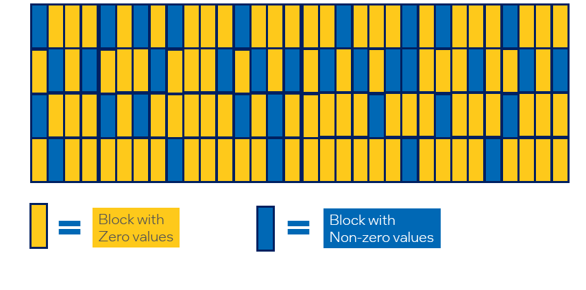
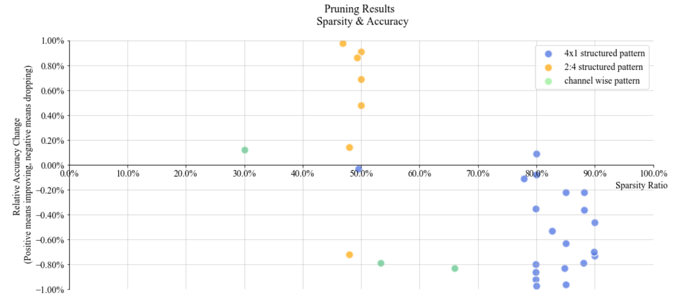

Pruning
============

1. [Introduction](#introduction)

    1.1. [Neural Network Pruning](#neural-network-pruning)

    1.2. [Pruning Patterns](#pruning-patterns)

    1.3. [Pruning Criteria](#pruning-criteria)

    1.4. [Pruning Schedule](#pruning-schedule)

    1.5. [Pruning Types](#pruning-types)

    1.6. [Pruning Scope](#pruning-scope)

    1.7. [Sparsity Decay Types](#sparsity-decay-types)

    1.8. [Regularization](#regularization)

2. [Pruning Support Matrix](#pruning-support-matrix)

3. [Get Started With Pruning API](#get-started-with-pruning-api)

4. [Examples](#examples)

5. [Sparse Model Deployment](#sparse-model-deployment)

6. [Reference](#reference)


## Introduction

### Neural Network Pruning
Neural network pruning (briefly known as pruning or sparsity) is one of the most promising model compression techniques. It removes the least important parameters in the network and achieves compact architectures with minimal accuracy drop and maximal inference acceleration. As current state-of-the-art models have increasingly more parameters, pruning plays a crucial role in enabling them to run on devices whose memory footprints and computing resources are limited. 

<div align=center>
<a target="_blank" href="./imgs/pruning/pruning_intro.png">
    
</a>
</div>


### Pruning Patterns

Pruning patterns defines the rules of pruned weights' arrangements in space.

<div align=center>
<a target="_blank" href="./imgs/pruning/pruning_patterns.jpg">
    
</a>
</div>


- Unstructured Pruning

  Unstructured pruning means finding and removing the less salient connection in the model where the nonzero patterns are irregular and could be anywhere in the matrix.

- 2in4 Pruning

  NVIDIA proposed [2:4 sparsity](https://developer.nvidia.com/blog/accelerating-inference-with-sparsity-using-ampere-and-tensorrt/) (or known as "2in4 sparsity") in Ampere architecture, for every 4 continuous elements in a matrix, two of them are zero and others are non-zero.

- Structured Pruning

  Structured pruning means finding parameters in groups, deleting entire blocks, filters, or channels according to some pruning criterions. In general, structured pruning leads to lower accuracy due to restrictive structure than unstructured pruning; However, it can accelerate the model execution significantly because it can fit hardware design better.

  Different from 2:4 sparsity above, we propose the block-wise structured sparsity patterns that we are able to demonstrate the performance benefits on existing Intel hardwares even without the support of hardware sparsity. A block-wise sparsity pattern with block size ```S``` means the contiguous ```S``` elements in this block are all zero values.

  For a typical GEMM, the weight dimension is ```IC``` x ```OC```, where ```IC``` is the number of input channels and ```OC``` is the number of output channels. Note that sometimes ```IC``` is also called dimension ```K```, and ```OC``` is called dimension ```N```. The sparsity dimension is on ```OC``` (or ```N```).

  For a typical Convolution, the weight dimension is ```OC x IC x KH x KW```, where ```OC``` is the number of output channels, ```IC``` is the number of input channels, and ```KH``` and ```KW``` is the kernel height and weight. The sparsity dimension is also on ```OC```.

  Here is a figure showing a matrix with ```IC``` = 32 and ```OC``` = 16 dimension, and a block-wise sparsity pattern with block size 4 on ```OC``` dimension.

<div align=center>
<a target="_blank" href="./imgs/pruning/sparse_dim.png">
    
</a>
</div>

- Channel-wise Pruning

  Channel-wise pruning means removing less salient channels on feature maps and it could directly shrink feature map widths. Users could set a channelx1 (or 1xchannel) pruning pattern to use this method.
  
  An advantage of channel pruning is that in some particular structure(feed forward parts in Transformers etc.), pruned channels can be removed permanently from original weights without influencing other dense channels. Via this process, we can decrease these weights' size and obtain direct improvements of inference speed, without using hardware related optimization tools like [Intel Extension for Transformers](https://github.com/intel/intel-extension-for-transformers). 
  
  We name this process as <span id="click">**Model Auto Slim**</span> and currently we have validated that this process can significantly improve some popular transformer model's inference speed. Please refer more details of such method in this [model slim example](../../examples/pytorch/nlp/huggingface_models/question-answering/model_slim/eager/).

### Pruning Criteria

Pruning criteria defines the rules of which weights are least important to be pruned, in order to maintain the model's original accuracy. Most popular criteria examine weights' absolute value and their corresponding gradients. 

- Magnitude

  The algorithm prunes the weight by the lowest absolute value at each layer with given sparsity target.

- Gradient sensitivity

  The algorithm prunes the head, intermediate layers, and hidden states in NLP model according to importance score calculated by following the paper [FastFormers](https://arxiv.org/abs/2010.13382). 

- Group Lasso

  The algorithm uses Group lasso regularization to prune entire rows, columns or blocks of parameters that result in a smaller dense network.

- SNIP

  The algorithm prunes the dense model at its initialization, by analyzing the weights' effect to the loss function when they are masked. Please refer to the original [paper](https://arxiv.org/abs/1810.02340) for details

- SNIP with momentum

  The algorithm improves original SNIP algorithms and introduces weights' score maps which updates in a momentum way.\
  In the following formula, $n$ is the pruning step and $W$ and $G$ are model's weights and gradients respectively.
  $$Score_{n} = 1.0 \times Score_{n-1} + 0.9 \times |W_{n} \times G_{n}|$$

### Pruning Schedule

Pruning schedule defines the way the model reach the target sparsity (the ratio of pruned weights).

- Iterative Pruning

  Iterative pruning means the model is gradually pruned to its target sparsity during a training process. The pruning process contains several pruning steps, and each step raises model's sparsity to a higher value. In the final pruning step, the model reaches target sparsity and the pruning process ends. 

- One-shot Pruning

  One-shot pruning means the model is pruned to its target sparsity with one single step. This pruning method often works at model's initialization step. It can easily cause accuracy drop, but save much training time.


### Pruning Types

Pruning type defines how the masks are generated and applied to a neural network. In Intel Neural Compressor, both pruning criterion and pruning type are defined in pruning_type. Currently supported pruning types include **snip_momentum(default)**, **snip_momentum_progressive**, **magnitude**, **magnitude_progressive**, **gradient**, **gradient_progressive**, **snip**, **snip_progressive** and **pattern_lock**. progressive pruning is preferred when large patterns like 1xchannel and channelx1 are selected.

- Progressive Pruning

  Progressive pruning aims at smoothing the structured pruning by automatically interpolating a group of intervals masks during the pruning process. In this method, a sequence of masks is generated to enable a more flexible pruning process and those masks would gradually change into ones to fit the target pruning structure.
  Progressive pruning is used mainly for channel-wise pruning and currently only supports NxM pruning pattern.

  <div align = "center", style = "width: 77%; margin-bottom: 2%;">
      <a target="_blank" href="./imgs/pruning/progressive_pruning.png">
          
      </a>
  </div>
  &emsp;&emsp;(a) refers to the traditional structured iterative pruning;  <Br/>
  &emsp;&emsp;(b) inserts unstructured masks which prune some weights by referring to pre-defined score maps.

  (b) is adopted in progressive pruning implementation. after a new structure pruning step, newly generated masks with full-zero blocks are not used to prune the model immediately. Instead, only a part of weights in these blocks is selected to be pruned by referring to these weights’ score maps. these partial-zero unstructured masks are added to the previous structured masks and  pruning continues. After training the model with these interpolating masks and masking more elements in these blocks, the mask interpolation process is returned. After several steps of mask interpolation, All weights in the blocks are finally masked and the model is trained as pure block-wise sparsity.

- Pattern_lock Pruning

  Pattern_lock pruning type uses masks of a fixed pattern during the pruning process. It locks the sparsity pattern in fine-tuning phase by freezing those zero values of weight tensor during weight update of training. It can be applied for the following scenario: after the model is pruned under a large dataset, pattern lock can be used to retrain the sparse model on a downstream task (a smaller dataset). Please refer to [Prune once for all](https://arxiv.org/pdf/2111.05754.pdf) for more information.

### Pruning Scope

Range of sparse score calculation in iterative pruning, default scope is global.

- Global

  The score map is computed out of entire parameters, Some layers are higher than the target sparsity and some of them are lower, the total sparsity of the model reaches the target. You can also set the "min sparsity ratio"/"max sparsity ratio" to be the same as the target to achieve same sparsity for each layer in a global way.

- Local

  The score map is computed from the corresponding layer's weight, The sparsity of each layer is equal to the target.

### Sparsity Decay Types

Growth rules for the sparsity of iterative pruning, "exp", "cos", "cube",  and "linear" are available，We use exp by default.
<div align=center>
<a target="_blank" href="./imgs/pruning/sparsity_decay_type.png">
    
</a>
</div>


### Regularization

Regularization is a technique that discourages learning a more complex model and therefore performs variable-selection. In the image below, some weights are pushed to be as small as possible and the connections are thus pruned. **Group-lasso** method is used in Intel Neural Compressor.

- Group Lasso

  The main ideas of Group Lasso are to construct an objective function that penalizes the L2 parameterization of the grouped variables, determines the coefficients of some groups of variables to be zero, and obtains a refined model by feature filtering.

<div align=center>
<a target="_blank" href="./imgs/pruning/Regularization.jpg">
    
</a>
</div>

## Pruning Support Matrix
(Currently we only support pruning for PyTorch models)
<table>
<thead>
  <tr>
    <th>Pruning Type</th>
    <th>Pruning Granularity</th>
    <th>Pruning Algorithm</th>
    <th>Framework</th>
  </tr>
</thead>
<tbody>
  <tr>
    <td rowspan="3">Unstructured Pruning</td>
    <td rowspan="3">Element-wise</td>
    <td>Magnitude</td>
    <td>PyTorch</td>
  </tr>
  <tr>
    <td>Pattern Lock</td>
    <td>PyTorch</td>
  </tr>
  <tr>
    <td>SNIP with momentum</td>
    <td>PyTorch</td>
  </tr>
  <tr>
    <td rowspan="6">Structured Pruning</td>
    <td rowspan="2">Filter/Channel-wise</td>
    <td>Gradient</td>
    <td>PyTorch</td>
  </tr>
  <tr>
    <td>SNIP with momentum</td>
    <td>PyTorch</td>
  </tr>
  <tr>
    <td rowspan="2">Block-wise</td>
    <td>Group Lasso</td>
    <td>PyTorch</td>
  </tr>
  <tr>
    <td>SNIP with momentum</td>
    <td>PyTorch</td>
  </tr>
  <tr>
    <td rowspan="2">Element-wise</td>
    <td>Pattern Lock</td>
    <td>PyTorch</td>
  </tr>
  <tr>
    <td>SNIP with momentum</td>
    <td>PyTorch</td>
  </tr>
</tbody>
</table>

## Get Started with Pruning API

Neural Compressor `Pruning` API is defined under `neural_compressor.training`, which takes a user defined yaml file as input. Below is the launcher code of applying the API to execute a pruning process.

Users can pass the customized training/evaluation functions to `Pruning` for flexible scenarios. In this case, pruning process can be done by pre-defined hooks in Neural Compressor. Users need to put those hooks inside the training function.

The following section exemplifies how to use hooks in user pass-in training function to perform model pruning. Through the pruning API, multiple pruner objects are supported in one single Pruning object to enable layer-specific configurations and a default setting is used as a complement.

- Step 1: Define a dict-like configuration in your training codes. We provide you a template of configuration below.
  ```python
      configs = [
              { ## pruner1
                  'target_sparsity': 0.9,   # Target sparsity ratio of modules.
                  'pruning_type': "snip_momentum", # Default pruning type.
                  'pattern': "4x1", # Default pruning pattern.
                  'op_names': ['layer1.*'],  # A list of modules that would be pruned.
                  'excluded_op_names': ['layer3.*'],  # A list of modules that would not be pruned.
                  'start_step': 0,  # Step at which to begin pruning.
                  'end_step': 10,   # Step at which to end pruning.
                  'pruning_scope': "global", # Default pruning scope.
                  'pruning_frequency': 1, # Frequency of applying pruning.
                  'min_sparsity_ratio_per_op': 0.0,  # Minimum sparsity ratio of each module.
                  'max_sparsity_ratio_per_op': 0.98, # Maximum sparsity ratio of each module.
                  'sparsity_decay_type': "exp", # Function applied to control pruning rate.
                  'pruning_op_types': ['Conv', 'Linear'], # Types of op that would be pruned.
              },
              { ## pruner2
                  "op_names": ['layer3.*'], # A list of modules that would be pruned.
                  "pruning_type": "snip_momentum_progressive",   # Pruning type for the listed ops.
                  # 'target_sparsity'
              } # For layer3, the missing target_sparsity would be complemented by default setting (i.e. 0.8)
          ]
  ```
  
- Step 2: Insert API functions in your codes. Only 5 lines of codes are required.
  ```python
      """ All you need is to insert following API functions to your codes:
      on_train_begin() # Setup pruner
      on_step_begin() # Prune weights
      on_before_optimizer_step() # Do weight regularization
      on_after_optimizer_step() # Update weights' criteria, mask weights
      on_train_end() # end of pruner, Print sparse information
      """
      from neural_compressor.training import prepare_compression, WeightPruningConfig
      ##setting configs
      pruning_configs=[
      {"op_names": ['layer1.*']，"pattern":'4x1'},
      {"op_names": ['layer2.*']，"pattern":'1x1', 'target_sparsity':0.5}
      ]
      config = WeightPruningConfig(pruning_configs,
                                   target_sparsity=0.8,
                                   excluded_op_names=['classifier'])  ##default setting
      config = WeightPruningConfig(configs)
      compression_manager = prepare_compression(model, config)
      compression_manager.callbacks.on_train_begin()  ## insert hook
      for epoch in range(num_train_epochs):
          model.train()
          for step, batch in enumerate(train_dataloader):
              compression_manager.callbacks.on_step_begin(step) ## insert hook
              outputs = model(**batch)
              loss = outputs.loss
              loss.backward()
              compression_manager.callbacks.on_before_optimizer_step()  ## insert hook
              optimizer.step()
              compression_manager.callbacks.on_after_optimizer_step() ## insert hook
              lr_scheduler.step()
              model.zero_grad()
      ...
      compression_manager.callbacks.on_train_end()
      ...
  ```

 In the case mentioned above, pruning process can be done by pre-defined hooks in Neural Compressor. Users need to place those hooks inside the training function. The pre-defined Neural Compressor hooks are listed below.

```python
    on_train_begin() : Execute at the beginning of training phase.
    on_epoch_begin(epoch) : Execute at the beginning of each epoch.
    on_step_begin(batch) : Execute at the beginning of each batch.
    on_step_end() : Execute at the end of each batch.
    on_epoch_end() : Execute at the end of each epoch.
    on_before_optimizer_step() : Execute before optimization step.
    on_after_optimizer_step() : Execute after optimization step.
    on_train_end() : Execute at the ending of training phase.
```


## Examples

We validate the sparsity on typical models across different domains (including CV, NLP, and Recommendation System). [Validated pruning examples](./validated_model_list.md#validated-pruning-examples) shows the sparsity pattern, sparsity ratio, and accuracy of sparse and dense (Reference) model for each model. 

Figure below shows our pruning results (pruned model's accuracy and sparsity as well as sparse patterns.)

<div align = "center", style = "width: 77%; margin-bottom: 2%;">
  <a target="_blank" href="./imgs/pruning/pruning_scatter.png">
    
  </a>
</div>

"Experimental" annotation means these examples codes are ready but pruning results are under improvements. Please don't hesitate to try these codes with different configurations to get better pruning results! 

- Text Classification

  Sparsity is implemented in different pruning patterns of MRPC and SST-2 tasks [Text-classification examples](../../examples/pytorch/nlp/huggingface_models/text-classification/pruning/eager).

- Question Answering

  Multiple examples of sparse models were obtained on the SQuAD-v1.1 dataset [Question-answering examples](../../examples/pytorch/nlp/huggingface_models/question-answering/pruning/eager).

- Language Translation (Experimental)

  Pruning Flan-T5-small model on English-Romanian translation task [Translation examples](../../examples/pytorch/nlp/huggingface_models/translation/pruning/eager).

- Object Detection (Experimental)

  Pruning on YOLOv5 model using coco dataset [Object-detection examples](../../examples/pytorch/object_detection/yolo_v5/pruning/eager).

- Image Recognition (Experimental)

  Pruning on ResNet50 model using ImageNet dataset [Image-recognition examples](../../examples/pytorch/image_recognition/ResNet50/pruning/eager/).
  

Please refer to [pruning examples](../../examples/README.md#Pruning-1) for more information.

## Sparse Model Deployment

Particular hardware/software like [Intel Extension for Transformer](https://github.com/intel/intel-extension-for-transformers) are required to obtain inference speed and footprints' optimization for most sparse models. However, using [model slim](#click) for some special structures can obtain significant inference speed improvements and footprint reduction without the post-pruning deployment. In other words, you can achieve model acceleration directly under your training framework (PyTorch, etc.)


## Reference

[1] Namhoon Lee, Thalaiyasingam Ajanthan, and Philip Torr. SNIP: Single-shot network pruning based on connection sensitivity. In International Conference on Learning Representations, 2019.

[2] Zafrir, Ofir, Ariel Larey, Guy Boudoukh, Haihao Shen, and Moshe Wasserblat. "Prune once for all: Sparse pre-trained language models." arXiv preprint arXiv:2111.05754 (2021).