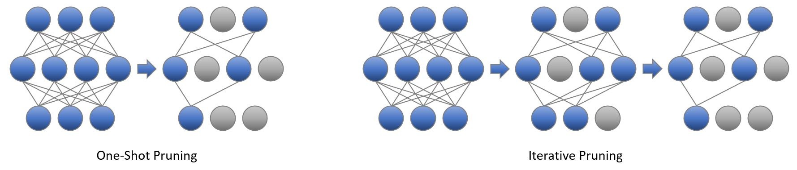

Pruning
============


1. [Introduction](#introduction)


    - [Neural Network Pruning](#neural-network-pruning)


    - [Pruning Patterns](#pruning-patterns)


    - [Pruning Criteria](#pruning-criteria)


    - [Pruning Schedules](#pruning-schedules)


    - [Pruning Types](#pruning-types)


    - [Pruning Scope](#pruning-scope)


    - [Sparsity Decay Types](#sparsity-decay-types)


    - [Regularization](#regularization)


    - [Pruning Support Matrix](#pruning-support-matrix)


2. [Get Started With Pruning API](#get-started-with-pruning-api)


3. [Examples](#examples)


4. [Sparse Model Deployment](#sparse-model-deployment)


5. [Reference](#reference)


## Introduction


### Neural Network Pruning
Neural network pruning is a promising model compression technique that removes the least important parameters/neurons in the network and achieves compact architectures of minimal accuracy drop and maximal inference acceleration. As state-of-the-art model sizes have grown at an unprecedented speed, pruning has become increasingly crucial to reducing the computational and memory footprint that huge neural networks require.

<div align=center>
<a target="_blank" href="imgs/pruning/pruning.png">
    
</a>
</div>


### Pruning Patterns


Pruning patterns defines the rules of pruned weights' arrangements in space. Intel Neural Compressor currently supports **N:M** and **NxM** patterns. N:M pattern is applied to input channels; for NxM pattern, N stands for output channels and M stands for input ones.

- NxM Pruning

  NxM pruning means pruning parameters in groups and deleting entire blocks, filters, or channels according to some pruning criteria. Consecutive NxM matrix blocks are used as the minimum unit for weight pruning, thus NxM pruning leads to lower accuracy due to restrictive structure compared to unstructured pruning but it can significantly accelerate the model execution as it fits better with hardware designs.  *Users could set "NxM", e.g. "4x1", in pruning pattern to enable it.*

- N:M Pruning

  N weights are selected for pruning from each M consecutive weights, The 2:4 pattern is commonly used. *Users could set  "N:M" , e.g. "2:4", to enable it.*

- Channel-wise Pruning

  Channel-wise pruning means removing less salient channels on feature maps and it could directly shrink feature map widths. *Users could set "channelx1"( some input channels will be totally pruned) (or "1xchannel")  to enable it.*

  An advantage of channel pruning is that in some particular structure(feed forward parts in Transformers etc.), pruned channels can be removed permanently from original weights without influencing other dense channels. Via this process, we can decrease these weights' size and obtain direct improvements of inference speed, without using hardware related optimization tools like [Intel Extension for Transformers](https://github.com/intel/intel-extension-for-transformers). 


  We name this process as <span id="click">**Model Auto Slim**(experimental feature)</span> and currently we have validated that this process can significantly improve some popular transformer model's inference speed. Currently this method is under development and only supports some particular structures. Please refer more details of such method in this [model slim example](../../examples/pytorch/nlp/huggingface_models/question-answering/model_slim/).

- Unstructured Pruning

  Unstructured pruning means pruning parameters individually without any constraints.  *Users could set "1x1" in  pruning pattern to enable it.*


<div align=center>
<a target="_blank" href="imgs/pruning/Pruning_patterns.jpg">
    
</a>
</div>


- Multi-head Attention Pruning (Work in progress)

  Multi-head attention mechanism boosts transformer models' capability of contextual information analysis. However, different heads' contribution to the final output varies. In most situation, a number of heads can be removed without causing accuracy drop. Head pruning can be applied in a wide range of scenes including BERT, GPT as well as other large language models. **We haven't support it in pruning, but we have provided experimental feature in Model Auto Slim**. Please refer to [multi-head attention auto slim examples](https://github.com/intel/neural-compressor/blob/master/examples/pytorch/nlp/huggingface_models/question-answering/model_slim)


### Pruning Criteria


Pruning Criteria determines how should the weights of a neural network are scored and pruned. In the image below, pruning score is represented by neurons' color and those with the lowest scores are pruned. Currently, Intel Neural Compressor supports **magnitude**, **gradient**, **snip** and **snip momentum(default)** criteria; pruning criteria is defined along with pruning type of Intel Neural Compressor configurations.

- Magnitude

  The algorithm prunes the weight by the lowest absolute value of each layer with given sparsity target.

- Gradient

  Gradient based criterion. The algorithm prunes the weight by the lowest gradient value of each layer with given sparsity target. Note that when using a gradient-based criterion, it is necessary to let the pruning start step >= 1.

- SNIP

  Gradient based criterion. Please refer to the original [paper](https://arxiv.org/abs/1810.02340) for more details. $W$ and $G$ are model's weights and gradients respectively. 

  $$Score = |W \times G|$$

- SNIP Momentum

  Gradient based criterion. The algorithm improves original SNIP algorithm and updates the score in a momentum way.\
  In the following formula, $n$ is the training step and $W$ and $G$ are model's weights and gradients respectively.
  $$Score_{n} = 1.0 \times Score_{n-1} + 0.9 \times |W_{n} \times G_{n}|$$

<div align=center>
<a target="_blank" href="imgs/pruning/pruning_criteria.png">
    
</a>
</div>


### Pruning Types


Pruning type defines how the masks are generated and applied to a neural network. In Intel Neural Compressor, both pruning criterion and pruning type are defined in pruning_type. Currently supported pruning types include **snip_momentum(default)**, **snip_momentum_progressive**, **magnitude**, **magnitude_progressive**, **gradient**, **gradient_progressive**, **snip**, **snip_progressive** and **pattern_lock**. progressive pruning is preferred when large patterns like 1xchannel and channelx1 are selected. Please note that progressive pruning only supports NxM patterns and is preferred when large patterns such as 1xchannel and channelx1 are selected.


- Progressive Pruning

  Progressive pruning aims at smoothing the structured pruning by automatically interpolating a group of intervals masks during the pruning process. In this method, a sequence of masks is generated to enable a more flexible pruning process and those masks would gradually change into ones to fit the target pruning structure.
  Progressive pruning is used mainly for channel-wise pruning and currently only supports NxM pruning pattern.

  <div align = "center", style = "width: 77%; margin-bottom: 2%;">
      <a target="_blank" href="imgs/pruning/progressive_pruning.png">
          
      </a>
  </div>
  &emsp;&emsp;(a) refers to the traditional structured iterative pruning;  <Br/>
  &emsp;&emsp;(b) inserts unstructured masks which prune some weights by referring to pruning criterion.

  (b) is adopted in progressive pruning implementation. after a new structure pruning step, newly generated masks with full-zero blocks are not used to prune the model immediately. Instead, only a part of weights in these blocks is selected to be pruned by referring to these weights’ score maps. these partial-zero unstructured masks are added to the previous structured masks and  pruning continues. After training the model with these interpolating masks and masking more elements in these blocks, the mask interpolation process is returned. After several steps of mask interpolation, All weights in the blocks are finally masked and the model is trained as pure block-wise sparsity.

- Pattern_lock Pruning

  Pattern_lock pruning type uses masks of a fixed pattern during the pruning process. It locks the sparsity pattern in fine-tuning phase by freezing those zero values of weight tensor during weight update of training. It can be applied for the following scenario: after the model is pruned under a large dataset, pattern lock can be used to retrain the sparse model on a downstream task (a smaller dataset). Please refer to [Prune once for all](https://arxiv.org/pdf/2111.05754.pdf) for more information.


### Pruning Schedules


Pruning schedule defines the way the model reaches the target sparsity (the ratio of pruned weights). Both  **iterative**  and **one shot** pruning schedules are supported.

- Iterative Pruning

  Iterative pruning means the model is gradually pruned to its target sparsity during a training process. The pruning process contains several pruning steps, and each step raises model's sparsity to a higher value. In the final pruning step, the model reaches target sparsity and the pruning process ends.
  
  

- One-shot Pruning

  One-shot pruning means the model is pruned to its target sparsity with one single step. This often takes place at the initial stage of training/finetuning which simplifies the pruning procedure. However, one-shot pruning is prone to larger accuracy degradation compared to iterative pruning. *Users could set start_step=end_step in pruning configuration to enable this. Also please note if gradient based criterion is used, start step should be greater than 0.*


<div align=center>
<a target="_blank" href="imgs/pruning/Pruning_schedule.jpg">
    
</a>
</div>


### Pruning Scope

Range of sparse score calculation in iterative pruning, default scope is global.

- Global

  The score map is computed out of entire parameters, Some layers are higher than the target sparsity and some of them are lower, the total sparsity of the model reaches the target. You can also set the "min sparsity ratio"/"max sparsity ratio" to be the same as the target to achieve same sparsity for each layer in a global way.


- Local

  The score map is computed from the corresponding layer's weight, The sparsity of each layer is equal to the target.


### Sparsity Decay Types

Growth rules for the sparsity of iterative pruning, "exp", "cos", "cube",  and "linear" are available，We use exp by default.
<div align=center>
<a target="_blank" href="imgs/pruning/sparsity_decay_type.png">
    
</a>
</div>


### Regularization

Regularization is a technique that discourages learning a more complex model and therefore performs variable-selection. In the image below, some weights are pushed to be as small as possible and the connections are thus pruned. **Group-lasso** method is supported in Intel Neural Compressor.

- Group Lasso

  The main idea of Group Lasso is to construct an objective function that penalizes the L2 parameterization of the grouped variables, determines the coefficients of some groups of variables to be zero, and obtains a refined model by feature filtering.

<div align=center>
<a target="_blank" href="imgs/pruning/Regularization.jpg">
    
</a>
</div>


### Pruning Support Matrix

|Framework |  Status  | 
|  :----:  | :----:  | 
| PyTorch   |  Supported  |
| TensorFlow |  Unsupported  |


## Get Started with Pruning API


Neural Compressor `Pruning` API is defined under `neural_compressor.training`, which takes a user-defined configure object as input.
Users can pass the customized training/evaluation functions to `Pruning` in various scenarios.


The following section exemplifies how to use hooks in user pass-in training function to perform model pruning. Through the pruning API, multiple pruner objects are supported in one single Pruning object to enable layer-specific configurations and a default set is used as a complement.

- Step 1: Define a dict-like configuration in your training codes. Usually only 5-7 configuration items need to be identified. For customized pruning, a configuration template is shown below:

  ```python
      configs = [
              { ## Example of a regular configuration
                "op_names": ['layer1.*'], # A list of modules that would be pruned. All linear/conv layers will be hooked when op_names is not explicitly defined.
                "start_step": 1,  # Step at which to begin pruning, if a gradient-based criterion is used (e.g., snip-momentum), start_step should be equal to or greater than 1.
                "end_step": 10000, # Step at which to end pruning, for one-shot pruning start_step = end_step.
                "excluded_op_names": ['.*embeddings*'], # A list of modules that would not be pruned.
                'target_sparsity': 0.9,   # Target sparsity ratio of modules.
                "pruning_frequency": 250,   # Frequency of applying pruning, The recommended setting is one fortieth of the pruning steps.
                "pattern": "4x1",   # Default pruning pattern.
              }, # The missing parameter items would be complemented by default settings (i.e. start_step = 1)


              # It also supports setting multiple pruners, and fine-grained pruning by partition.
              { ## pruner2
                  'target_sparsity': 0.9,   # Target sparsity ratio of modules.
                  'pruning_type': "snip_momentum", # Default pruning type.
                  'pattern': "4x1", # Default pruning pattern.
                  'op_names': ['layer2.*'],  # A list of modules that would be pruned.
                  'excluded_op_names': ['layer3.*'],  # A list of modules that would not be pruned.
                  'start_step': 1,  # Step at which to begin pruning.
                  'end_step': 10,   # Step at which to end pruning.
                  'pruning_scope': "global", # Default pruning scope.
                  'pruning_frequency': 1, # Frequency of applying pruning.
                  'min_sparsity_ratio_per_op': 0.0,  # Minimum sparsity ratio of each module.
                  'max_sparsity_ratio_per_op': 0.98, # Maximum sparsity ratio of each module.
                  'sparsity_decay_type': "exp", # Function applied to control pruning rate.
                  'pruning_op_types': ['Conv', 'Linear'], # Types of op that would be pruned.
              }
          ]
  ```

- Step 2: Enable pruning functionalities 

     [**Experimental option** ]Modify model and optimizer.

    ```python
        from neural_compressor import WeightPruningConfig
        from neural_compressor.experimental.compression import prepare_pruning
        config = WeightPruningConfig(configs)
        prepare_pruning(config, model, optimizer) # modify model and optimizer
        for epoch in range(num_train_epochs):
          model.train()
          for step, batch in enumerate(train_dataloader):
              outputs = model(**batch)
              loss = outputs.loss
              loss.backward()
              optimizer.step()
              lr_scheduler.step()
              model.zero_grad()
  ```


    [**Stable Option** ]Insert Hook functions in your codes. 
    
    ```python
        """ All you need is to insert following API functions to your codes:
        on_train_begin() # Setup pruners
        on_step_begin() # Prune weights
        on_before_optimizer_step() # Do weight regularization
        on_after_optimizer_step() # Update weights' criteria, mask weights
        on_train_end() # End of pruner, print sparse information
        """
        from neural_compressor.training import prepare_compression, WeightPruningConfig
        config = WeightPruningConfig(configs)
        compression_manager = prepare_compression(model, config) # Define a pruning object.
        compression_manager.callbacks.on_train_begin()  ## insert hook  
        for epoch in range(num_train_epochs):
            model.train()
            for step, batch in enumerate(train_dataloader):
                compression_manager.callbacks.on_step_begin(step)
                outputs = model(**batch)
                loss = outputs.loss
                loss.backward()
                compression_manager.callbacks.on_before_optimizer_step()
                optimizer.step()
                compression_manager.callbacks.on_after_optimizer_step()
                lr_scheduler.step()
                model.zero_grad()
        compression_manager.callbacks.on_train_end()
    ```
   In the case mentioned above, pruning process can be done by pre-defined hooks in Neural Compressor. Users need to place those hooks inside the training function.


## Examples

The pruning technique  is validated on typical models across various domains (including CV and NLP).

<div align = "center", style = "width: 77%; margin-bottom: 2%;">
  <a target="_blank" href="imgs/pruning/pruning_scatter.png">
    
  </a>
</div>

"Experimental" annotation means these examples codes are ready but pruning results are under improvements. Please don't hesitate to try these codes with different configurations to get better pruning results! 

- Text Classification

  Sparsity is implemented in different pruning patterns of MRPC and SST-2 tasks [Text-classification examples](../../examples/pytorch/nlp/huggingface_models/text-classification/pruning/eager).

- Question Answering

  Multiple examples of sparse models were obtained on the SQuAD-v1.1 dataset [Question-answering examples](../../examples/pytorch/nlp/huggingface_models/question-answering/pruning/eager).

- Language Translation (Experimental, sparsity 0.8, pattern 4x1, BLEU 25.63(dense) vs 24.35(sparse))

  Pruning Flan-T5-small model on English-Romanian translation task [Translation examples](../../examples/pytorch/nlp/huggingface_models/translation/pruning/eager).

- Object Detection (Experimental, sparsity 0.8, pattern 4x1, mAP 0.404(dense) vs 0.381(sparse))

  Pruning on YOLOv5 model using coco dataset [Object-detection examples](../../examples/pytorch/object_detection/yolo_v5/pruning/eager).

- Image Recognition (Experimental, sparsity 0.75, pattern 2x1, top1 acc 0.801(dense) vs 0.7895(sparse))

  Pruning on ResNet50 model using ImageNet dataset [Image-recognition examples](../../examples/pytorch/image_recognition/ResNet50/pruning/eager/).

Please refer to [pruning examples](../../examples/README.md#Pruning-1) for more information.

## Sparse Model Deployment

Particular hardware/software like [Intel Extension for Transformer](https://github.com/intel/intel-extension-for-transformers) are required to obtain inference speed and footprints' optimization for most sparse models. However, using [model slim](#click) for some special structures can obtain significant inference speed improvements and footprint reduction without the post-pruning deployment. In other words, you can achieve model acceleration directly under your training framework (PyTorch, etc.)

## Reference

[1] Namhoon Lee, Thalaiyasingam Ajanthan, and Philip Torr. SNIP: Single-shot network pruning based on connection sensitivity. In International Conference on Learning Representations, 2019.

[2] Zafrir, Ofir, Ariel Larey, Guy Boudoukh, Haihao Shen, and Moshe Wasserblat. "Prune once for all: Sparse pre-trained language models." arXiv preprint arXiv:2111.05754 (2021).
