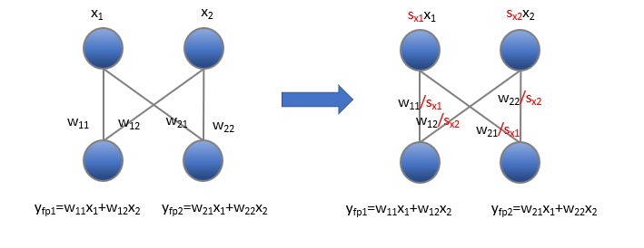
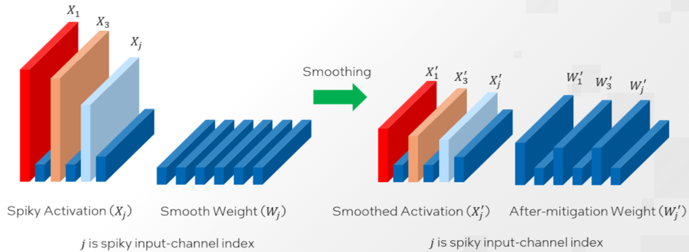

# Smooth Quant

1. [Introduction](#Introduction)
2. [Quantization Fundamentals](#Quantization-Fundamentals)
3. [SmoothQuant and Our Enhancement](#SmoothQuant-and-Our-Enhancement)
4. [Supported Framework Matrix](#Supported-Framework-Matrix)

## Introduction

Quantization is a common compression operation to reduce memory and accelerate inference by converting the floating point matrix to an integer matrix. For large language models (LLMs) with gigantic parameters, the systematic outliers make quantification of activations difficult.  [SmoothQuant](https://arxiv.org/abs/2211.10438), a training free post-training quantization (PTQ) solution, offline migrates this difficulty from activations to weights with a mathematically equivalent transformation.

## Quantization Fundamentals

Quantization is a common compression operation to reduce memory and accelerate inference; therefore, the difficulty of LLM deployment can be alleviated. Quantization converts the floating point matrix to an integer matrix.

The equation of quantization is as follows:

$$
X_{int8} = round(X_{fp32}/S) + Z \tag{1}
$$

where $X_{fp32}$ is the input matrix, $S$ is the scale factor,  $Z$ is the integer zero point.

### Per-tensor & Per-channel

There are several choices of sharing quantization parameters among tensor elements, also called quantization granularity. The coarsest level, per-tensor granularity, is that all elements in the tensor share the same quantization parameters. Finer granularity means sharing quantization parameters per row or per column for 2D matrices and per channel for 3D matrices. Similarly, the finest granularity is that each element has an individual set of quantization parameters.


However, due to the model accuracy and computational consumption, per-tensor or per-channel are usually adopted. **In the following part, We will show that per-channel could bring lower quantization loss but has some limitations, that is why normally we use per-channel for weight quantization and per-tensor for activation/input quantization**

#### Per-tensor example

Suppose the weight tensor is：

```python
import torch

W = torch.Tensor(
    [
        [0.6839, 0.4741, 0.7451],
        [0.9301, 0.1742, 0.6835],
    ]
)
```

According to the formula (1), we need scale $S$ and zero point $Z$ to calculate the integer matrix.

$$
S = \frac{X_{max} - X{min}}{2^b -1} \tag{2}
$$

$$
Z = -round(X_{min/}/S) \tag{3}
$$

The per-tensor quantization function is:

```python
def quantize(x, num_bits=8):
    q_min, q_max = 0, 2.0**num_bits - 1.0
    scale = (torch.max(x) - torch.min(x)) / (2**num_bits - 1)
    scale = torch.clip(scale, min=1e-5)
    zp = torch.round(0 - (torch.min(x)) / scale)
    q_x = x / scale + zp
    q_x.clamp_(q_min, q_max).round_()
    print(f"scale = {scale}, zp = {zp}")
    return q_x, scale, zp
```

Then we can get the quantized $W_{q}$

```bash
>>> W_q, scale, zp = quantize(W)
scale = 0.00296431384049356, zp = -59.0
>>> W_q
tensor([[172., 101., 192.],
        [255.,   0., 172.]])
```

With the value of scale and zp, we can dequantize the tensor.

```python
def dequantize(q_x, scale, zp):
    return scale * (q_x - zp)
```

```bash
>>> W_dq = dequantize(W_q, 0.001, -50)
>>> W_dq
tensor([[0.2220, 0.1510, 0.2420],
        [0.2570, 0.0500, 0.1890]])
>>> loss = torch.nn.MSELoss()(W_dq, W)
>>> loss.item()
0.1983354538679123

>>> W_dq = dequantize(W_q, scale, zp)
>>> W_dq
tensor([[0.6848, 0.4743, 0.7440],
        [0.9308, 0.1749, 0.6848]])
>>> loss = torch.nn.MSELoss()(W_dq, W)
>>> loss.item()
7.385297635664756e-07
```

The difference between $W$ and $W_{dq}$ shows that quantization affects precision and appropriate values of scale and zero point will reduce the loss of precision. 

#### Per-channel example

Similarly, the example of per-channel quantization is as follows:

```python
def quantize_per_channel(x, num_bits=8):
    q_min, q_max = 0, 2.0**num_bits - 1.0
    x_tmp = x.detach().reshape(x.shape[0], -1)
    scales = x_tmp.max(dim=-1, keepdim=True)[0] / (2**num_bits - 1)
    zp = torch.round(0 - x_tmp.min(dim=-1, keepdim=True)[0].divide(scales))
    q_x = x_tmp.divide(scales) + zp
    q_x.clamp_(q_min, q_max).round_()
    print(f"scales = {scales}, \n zp = {zp}")
    return q_x, scales, zp


def dequantize_per_channel(q_x, scales, zp):
    print(q_x, scales, zp)
    print(scales * (q_x - zp))
    return scales * (q_x - zp)
```

```bash
>>>W_q, scales, zp = quantize_per_channel(W)
scale = tensor([[0.0029],
        [0.0036]]), 
zp = tensor([[-162.],
        [ -48.]])
>>>W_q
tensor([[ 72.,   0.,  93.],
        [207.,   0., 139.]])

>>>W_dq = dequantize_per_channel(W_q, scales, zp)
>>>W_dq
tensor([[0.6837, 0.4734, 0.7451],
        [0.9301, 0.1751, 0.6821]])
```

And the loss is

```bash
>>> loss = torch.nn.MSELoss()(W_dq, W)
>>> loss.item()
5.637690492221736e-07
```

Through this example, we can see that per-channel quantization has finer granularity and has lower loss (loss 5.6376e-07 for per-channel quantization and 7.3852e-07 for per-tensor quantization).

#### Matmul quantization example

For a linear layer in most model, $Y=X \cdot W$, we can quantize both the weights and activations in order to reduce the storage and accelerate inference.
Using per-tensor scale quantization to show the process.

```python
def quantize_per_tensor_absmax(x, n_bits=8):
    scales = x.abs().max()
    q_max = 2 ** (n_bits - 1) - 1
    scales.clamp_(min=1e-5).div_(q_max)
    q_x = x / scales
    q_x = q_x.clamp_(-q_max, q_max).round_()
    return q_x, scales


def dequantize(q_x, scale):
    return scale * q_x
```

Randomly initialize the $W$ and $Y$, then calculate the result of $Y=X \cdot W$

```bash
>>>W = torch.rand(2, 3, dtype=torch.float32)
>>>X = torch.rand(3, 4, dtype=torch.float32)
>>>W
tensor([[0.0806, 0.7589, 0.6038],
        [0.3815, 0.5040, 0.7174]])
>>>X
tensor([[0.5444, 0.5826, 0.7772, 0.5555],
        [0.3740, 0.3253, 0.0698, 0.1381],
        [0.5972, 0.0086, 0.0737, 0.8298]])
>>>Y = torch.matmul(W, X)
>>>Y
tensor([[0.6883, 0.2991, 0.1601, 0.6506],
        [0.8246, 0.3924, 0.3845, 0.8768]])
```

Quantize weight and activation, matmul(quantize(X), quantize(Y))

```bash
>>>W_q, W_scale = quantize_per_tensor_absmax(W)
>>>X_q, X_scale = quantize_per_tensor_absmax(X)
>>>print(f'{W_q}\n{W_scale.item()}')
>>>print(f'{X_q}\n{X_scale.item()}')
tensor([[ 13., 127., 101.],
        [ 64.,  84., 120.]])
0.0059755356051027775
tensor([[ 83.,  89., 119.,  85.],
        [ 57.,  50.,  11.,  21.],
        [ 91.,   1.,  11., 127.]])
0.006533813662827015

>>>Y_q = torch.matmul(W_q, X_q)
>>>Y_q
tensor([[17509.,  7608.,  4055., 16599.],
        [21020., 10016.,  9860., 22444.]])
>>>Y_dq = dequantize(Y_q, W_scale * X_scale)
>>>Y_dq
tensor([[0.6836, 0.2970, 0.1583, 0.6481],
        [0.8207, 0.3911, 0.3850, 0.8763]])
```

#### Per-channel limitation

Though per-channel quantization could bring lower quantization error, we could not apply it for activations due to the difficulty of the dequantization. We would prove it in the following image and the zero point of quantization would be ignored for simplicity.

The image on the left presents a normal linear forward  with 1x2 input $x$ and 2x2 weight $w$. The results $y$ could be easily obtained by simple mathematics. In the middle image, we apply per-tensor quantization for activations and per-channel quantization for weights; the results after quantization that are denoted by $y_1$ and $y_2$, could be easily dequantized to the float results $y_{fp1}$ and $y_{fp2}$ by per channel scale $1.0/s_1s_x$ and $1.0/s_2s_x$. However, after applying per-channel quantization for activation (right image), we could not dequantize the  $y_1$ and  $y_2$ to float results.

<div align="center">
    
</div>

## SmoothQuant and Our Enhancement

### SmoothQuant

In the previous subsection, we have explained why per-channel quantization could not be applied for activation, even though it could lead to lower quantization loss. However, the quantization error loss of activation plays an important role in the accuracy loss of model quantization[^2][^3][^4]. 


To reduce the quantization loss of activations, lots of methods have been proposed. In the following, we briefly introduce SPIQ[^2], Outlier Suppression[^3] and Smoothquant[^4]. All these three methods share a similar idea to migrate the difficulty from activation quantization to weight quantization but differ in how much difficulty to be transferred.


So **the first question is how to migrate the difficulty from activation to weights?** The solution is straightforward, that is to convert the network to an output equivalent network that is presented in the image below and apply quantization to this equivalent network. The intuition is that each channel of activation could be scaled to make it more quantization-friendly, similar to a fake per-channel activation quantization.

<div align="center">
    
</div>


Please note that this conversion will make the quantization of weights more difficult, because the scales attached to weights shown above are per-input-channel, while quantization of weights is per-output-channel or per-tensor.

So **the second question is how much difficulty to be migrated**, that is how to choose the **conversion per-channel scale** $s_{x1}$ and $s_{x2}$ from the above image. Different works adopt different ways.

*SPIQ* just adopts the quantization scale of activations as the conversion per-channel scale.

*Outlier suppression* adopts the scale of the preceding layernorm as the conversion per-channel scale.

*Smoothquant* introduces a hyperparameter $\alpha$ as a smooth factor to calculate the conversion per-channel scale and balance the quantization difficulty of activation and weight.

$$
s_j = max(|X_j|)^\alpha/max(|W_j|)^{1-\alpha} \tag{4}
$$

j is the index of the input channels.


<div align="center">
    
</div>


For most of the models such as OPT and BLOOM, $\alpha = 0.5$ is a well-balanced value to split the difficulty of weight and activation quantization. A larger $\alpha$ value could be used on models with more significant activation outliers to migrate more quantization difficulty to weights.


### Our enhancement: 

#### Algorithm: Auto-tuning of $\alpha$.

SmoothQuant method aims to split the quantization difficulty of weight and activation by using a fixed-value $\alpha$ for an entire model. However, as the distributions of activation outliers vary not only across different models but also across different layers within a model, we hereby propose a method to obtain layer-wise optimal $\alpha$ values with the ability to tune automatically.
Currently, both layer-wise and block-wise auto-tuning methods are supported and the default option is layer-wise.
In block-wise auto-tuning, layers within one block (e.g an OPTDecoderLayer) would share the same alpha value; users could set *'do_blockwise': True* in *auto_alpha_args* to enable it.

Our proposed method consists of 8 major steps:

-    Hook input minimum and maximum values of layers to be smoothed using register_forward_hook.
-    Find a list of layers on which smoothquant could be performed.
-    Generate a list of $\alpha$ values of a user-defined range and set a default $\alpha$ value.
-    Calculate smoothing factor using default $\alpha$ value, adjust parameters accordingly and forward the adjusted model given an input sample.
-    Perform per-channel quantization_dequantization of weights and per-tensor quantization_dequantization of activations to predict output.
-    Calculate the layer-wise/block-wise loss with respect to FP32 output, iterate the previous two steps given each $\alpha$ value and save the layer-wise/block-wise loss per alpha.
-    Apply criterion on input LayerNorm op and obtain the optimal alpha values of a single input sample.
-    Iterate the previous three steps over a number of input samples and save the layer-wise/block-wise optimal $\alpha$ values.


Multiple criteria (e.g min, max and mean) are supported to determine the $\alpha$ value of an input LayerNorm op of a transformer block. Both alpha range and criterion could be configured in auto_alpha_args.

In our experiments, an $\alpha$ range of [0.0, 1.0] with a step_size of 0.1 is found to be well-balanced one for the majority of models.
 
## Supported Framework Matrix

| Framework | Alpha          | Folding                   |
|:---------:|----------------|---------------------------|
| PyTorch   | [0-1] / 'auto' | False                     |
| IPEX      | [0-1] / 'auto' | True / False(Version>2.1) |
| Tensorflow| [0-1]          | False                     |

## Reference

[^1]: Jason, Wei, et al. "Emergent Abilities of Large Language Models". Published in Transactions on Machine Learning Research (2022).

[^2]: Yvinec, Edouard, et al. "SPIQ: Data-Free Per-Channel Static Input Quantization." Proceedings of the IEEE/CVF Winter Conference on Applications of Computer Vision. 2023.

[^3]: Wei, Xiuying, et al. "Outlier suppression: Pushing the limit of low-bit transformer language models." arXiv preprint arXiv:2209.13325 (2022).

[^4]: Xiao, Guangxuan, et al. "Smoothquant: Accurate and efficient post-training quantization for large language models." arXiv preprint arXiv:2211.10438 (2022).
