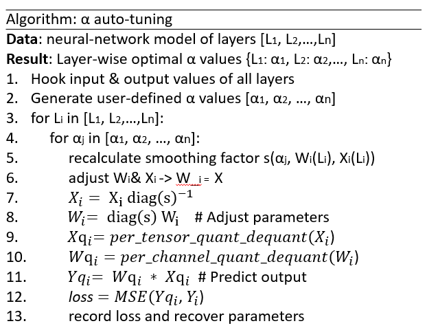

## Intel® Neural Compressor introduction

Intel® Neural Compressor is an open-source Python library that supports popular model compression techniques on all mainstream deep learning frameworks (TensorFlow, PyTorch, ONNX Runtime, and MXNet). INC aims to provide popular model compression techniques such as quantization, pruning (sparsity), distillation, and neural architecture search on mainstream frameworks such as TensorFlow, PyTorch, ONNX Runtime and MXNet, as well as Intel extensions such as [Intel Extension for TensorFlow](https://github.com/intel/intel-extension-for-tensorflow) and [Intel Extension for PyTorch](https://github.com/intel/intel-extension-for-pytorch).


**Visit the Intel® Neural Compressor online document website at: https://intel.github.io/neural-compressor.**

## Preliminaries

### LLM
A Large language model (LLM) is a language model with more than billions of weights, that is trained on massive data to perform natural language processing (NLP) and natural language generation (NLG) tasks. More complicated network structures and larger number of parameters also enable LLMs to master the intrinsic complexity of natural language. Once trained, an LLM could be fine-tuned for a wide variety of downstrean NLP tasks including conversational chatbots like ChatGPT, machine translation, text classification, fraud detection and sentiment analysis.

### LLM Deployment Challenges
Acording to Gholami and et al[^5], the bandwidth of hardware increases about 1.4x every two years while the compute increases about 3.1x every two years. Additionally, multiple nodes are now required to serve extra large mdoels and bring the extra bandwith challenge between cross-node communication.

On the other hand, billions or more paramaters make LLMs perform well in various tasks but require more computing resources and more difficult to deploy. Models are usually loaded on servers which have limited memory for inference tasks. The growing scale of LLM significantly slows down the process of inference. In worst cases, a task might not be performed if the infrastructure fails to meet the requirement. 

As such, reducing the model size for LLMs is an urgent request. One of the most popular and effective ways is quantization, especially post-training quantization (PTQ).


### Quantization

Quantization is a common compression operation to reduce memory and accelerate inference; therefore, the difficulty of LLM deployment can be alleviated. Quantization converts the floating point matrix to an integer matrix.

The equation of quantization is as follows:

$$
X_{int8} = round(X_{fp32}/S) + Z \tag{1}
$$

where $X_{fp32}$, $S$ and $Z$ are the input matrix, scale factor, and integer zero point, respectively.

### Per-tenor & Per-channel
There are several choices of sharing quantization parameters among tensor elements, also called quantization granularity. The coarsest level, per-tensor granularity, is that all elements in the tensor share the same quantization parameters. Finer granularity means sharing quantization parameters per row or per column for 2D matrices and per channel for 3D matrices. Similarly, the finest granularity is that each element has an individual parameter.

However, due to the model accuracy and computational consumption, per-tensor or per-channel are usually adopted. 

For more details, please refer to [INC docs](https://github.com/intel/neural-compressor/blob/master/docs/source/smooth_quant.md). **We show that per-channel could bring lower quantization loss but with some limitations, that is why normally we use per-channel for weight quantization and per-tensor for activation/input quantization**

## SmoothQuant and our enhancement
### SmoothQuant
In the [INC docs](https://github.com/intel/neural-compressor/blob/master/docs/source/smooth_quant.md), we have explained why per-channel quantization could not be applied for activation, even though it could lead to lower quantization loss. However, the quantization error loss of activation plays an important role in the accuracy loss of model quantization[^2][^3][^4]. 


To reduce the quantization loss of activations, lots of methods have been proposed. In the following, we briefly introduce SPIQ[^2], Outlier Suppression[^3] and Smoothquant[^4]. All these three methods share a similar idea to migrate the difficulty from activation quantization to weight quantization but differ in how much difficulty to be transferred.


So **the first question is how to migrate the difficulty from activation to weights?** The solution is straightforward, that is to convert the network to an output equivalent network that is presented in the image below and apply quantization to this equivalent network. The intuition is that each channel of activation could be scaled to make it more quantization-friendly, acting like a fake per-channel activation quantization.

<div align="center">
    
</div>

Please note that this conversion will make the quantization of weights more difficult, because the scales related to weights are per-input-channel, while quantization of weights is per-output-channel or per-tensor.

So **the second question is how much difficulty to be migrated**, that is how to choose the **convention per-channel scale** $s_{x1}$ and $s_{x2}$ on the above image. Different works adopt different ways.

*SPIQ* just adopts the quantization scale of activations as the convention per-channel scale.

*Outlier suppression* adopts the scale of the preceding layernorm as the convention per-channel scale.

*Smoothquant* introduces a hyperparameter $\alpha$ as a smooth factor to calculate the convention per-channel scale and balance the quantization difficulty of activation and weight.

$$
s_j = max(|X_j|)^\alpha/max(|W_j|)^{1-\alpha}
$$

j is the index of the input channels.


<div align="center">
    
</div>


For most of the models such as OPT and BLOOM, $\alpha = 0.5$ is a well-balanced value to split the difficulty of weight and activation quantization. A larger $\alpha$ value could be used on models with more significant activation outliers to migrate more quantization difficulty to weights.


### Our enhancement: 
#### Algorithm: Layer-wise Auto-tuning of $\alpha$.
SmoothQuant method aims to split the quantization difficulty of weight and activation by using a fixed-value $\alpha$ for an entire model. However, as the distributions of activation outliers vary not only across different models but also across different layers within a model, we hereby propose a method to obtain layer-wise optimal $\alpha$ values with the ability to tune automatically.

Our proposed method consists of 5 major steps and a pseudocode is listed below:
-    Hook input and output values of all layers using register_forward_hook.
-    Generate a list of $\alpha$ values given user-defined $\alpha$ range and step_sizes.
-    Recalculate smoothing factor given an $\alpha$ value and adjust parameters(weights and activations).
-    Perform per-channel quantization_dequantization of weights and per-tensor quantization_dequantization of inputs to predict the layer-wise output corresponding to the given $\alpha$ value.
-    Calculate the mean-squared loss with respect to the actual output value, recover the adjusted parameters and save the layer-wise optimal $\alpha$ values.


<div align="left">
    
</div>


Multiple criteria (e.g min, max and mean) are supported to determine the $\alpha$ value of an input LayerNorm op of a transformer block.

In our experiments, an $\alpha$ range of [0.3, 0.7] with a step_size of 0.05 is found to be well-balanced one for the majority of models.
#### Engineering 
*fully automated*: the user only needs to pass a model and dataloader

```python
from neural_compressor.adaptor.torch_utils.smooth_quant import TorchSmoothQuant
sq = TorchSmoothQuant(model, dataloader)
sq.transform(alpha) ##alpha could be a float or a string 'auto'
```
please note that we rely on torch jit to analyze the model. If you are using huggingface model, you could set torchscript to True when loading the model or set the return_dict to False"

*support lots of fusing patterns*: when applying the convention per-channel scales, a mul layer needs to be inserted,  which will introduce some overhead. The official code fuses this op to the previous layernorm, while we support more fusing patterns, like linear_1->relu->linear_2, which means the scales of linear_1 will be fused to linear_2.
All the supported patten are shown below. We haven't handled the layers whoes scale could not be aboserbed for torch backend.

```bash
conv2d/linear->relu/leakyrelu/hardtanh->conv2d/linear/layernorm/batchnorm/instancenorm/t5norm/llamanorm/groupnorm/

conv2d/linear->conv2d/linear/layernorm/batchnorm/instancenorm/t5norm/llamanorm/groupnorm
```
For opt models, we could fuse one more layer than the official code, because the fc2 layer in the block follows the linear->relu->linear pattern.
## Results
| Model\Last token accuracy |  FP32  | INT8 (w/o SmoothQuant) | INT8 (w/ SmoothQuant) | INT8 (w/ SmoothQuant auto tuning) |
|---------------------|:------:|:----------------------:|-----------------------|-----------------------------------|
| bigscience/bloom-560m | 65.20% |         63.44%         | 66.48% (alpha=0.5)    | 64.76%                            |
| bigscience/bloom-1b7 | 71.43% |         67.78%         | 72.56% (alpha=0.5)    | 72.58%                            |
| bigscience/bloom-3b | 73.97% |         69.99%         | 74.02% (alpha=0.5)    | 74.16%                            |
| bigscience/bloom-7b1 | 77.44% |         75.46%         | 77.02%(alpha=0.5)     | 77.45%                            |
| bigscience/bloom-176b | 84.17% |         82.13%         | 83.52% (alpha=0.6)    | -                                 |
| facebook/opt-125m   | 63.89% |         63.48%         | 63.44% (alpha=0.5)    | 64.14%                            |
| facebook/opt-1.3b   | 75.41% |         73.59%         | 70.94% (alpha=0.5)    | 74.80%                            |
| facebook/opt-2.7b   | 77.79% |         78.57%         | 78.60%(alpha=0.5)     | 78.25%                            |
| facebook/opt-6.7b   | 81.26% |         76.65%         | 81.58%(alpha=0.5)     | 81.39%                            |
| EleutherAI/gpt-j-6B | 79.17% |         78.82%         | 78.84%(alpha=0.6)     | 79.29%                            |


## Reference
[^1]: Jason, Wei, et al. "Emergent Abilities of Large Language Models". Published in Transactions on Machine Learning Research (2022)

[^2]: Yvinec, Edouard, et al. "SPIQ: Data-Free Per-Channel Static Input Quantization." Proceedings of the IEEE/CVF Winter Conference on Applications of Computer Vision. 2023.

[^3]: Wei, Xiuying, et al. "Outlier suppression: Pushing the limit of low-bit transformer language models." arXiv preprint arXiv:2209.13325 (2022).

[^4]: Xiao, Guangxuan, et al. "Smoothquant: Accurate and efficient post-training quantization for large language models." arXiv preprint arXiv:2211.10438 (2022).

[^5]: Amir Gholami, Zhewei Yao, Sehoon Kim, Michael W Mahoney, and Kurt Keutzer. Ai and memory wall. RiseLab Medium Post(2021).

[^6]: Zhewe, Yao, et al. "A Comprehensive Study on Post-Training Quantization for Large Language Models".  arXiv preprint arXiv:2303.08302 (2023).
