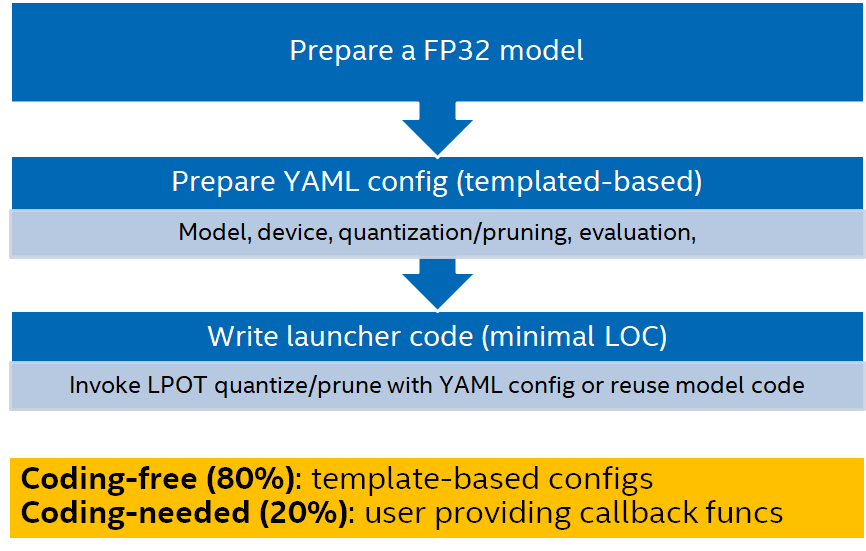

Tutorial
=========================================

This tutorial will introduce step by step instructions on how to integrate models with Intel® Low Precision Optimization Tool (LPOT) with examples. 

<table>
  <tr>
    <td>Steps of enabling model with LPOT</td>
  </tr>
  <tr>
    <td></td>
  </tr>
 </table>

# Usage Examples

To write lanuncher code, user need prepare four components:

1.	`Dataloader/Dataset`
2.	`Model`
3.	`Postprocess`      <span style="color:red">*optional*</span>
4.	`Metric`

LPOT will construct the whole quantization/pruning process by these four ingredients. 

LPOT has added built-in supports on popular dataloader/dataset and metric to ease the preparation. Please refer to [dataset](./dataset.md) and [metric](./metric.md) to know how to use them in yaml. 

LPOT also supports register custom dataset and custom metric by code. 

As for model, LPOT abstract a common API, named as [lpot.experimental.common.Model](../lpot/experimental/common/model.py), to cover the case in which model, weight, and other necessary info, are separately stored. Please refer to [model](./model.md) to know how to use it.

Postprocess is treat as a specical transform by LPOT which is only needed when model output is mismatching with the expected input of LPOT built-in metrics. if user is using custom metric, the postprocess is not needed indeed as custom metric implementation need ensure it can handle model output correctly. On the other hand, the postprocess logic becomes part of custom metric implementation.

Below is an example of how to enable LPOT on TensorFlow mobilenet_v1 with built-in dataloader, dataset and metric.

```python
# main.py
from lpot.experimental import Quantization, common
quantizer = Quantization('./conf.yaml')
quantizer.model = common.Model("./mobilenet_v1_1.0_224_frozen.pb")
quantized_model = quantizer()
```

```yaml
# conf.yaml
model:
  name: mobilenet_v1 
  framework: tensorflow
quantization:
  calibration:
    sampling_size: 20
    dataloader:
      batch_size: 1
      dataset:
        ImageRecord:
          root: /path/to/imagenet/
      transform:
        ParseDecodeImagenet: {}
        BilinearImagenet: 
          height: 224
          width: 224
evaluation:
  accuracy:
    metric:
      topk: 1
    dataloader:
      batch_size: 32 
      dataset:
        ImageRecord:
          root: /path/to/imagenet/
      transform:
        ParseDecodeImagenet: {}
        BilinearImagenet: 
          height: 224
          width: 224

```

In this example, we use a LPOT built-in dataset “ImageRecord” and metric “topk”.

If user wants to use a dataset or metric which does not support by LPOT built-in, user could register a custom one like below helloworld example.

```python
# main.py
from lpot.experimental import Quantization, common

class Dataset(object):
  def __init__(self):
      (train_images, train_labels), (test_images,
                 test_labels) = keras.datasets.fashion_mnist.load_data()
      self.test_images = test_images.astype(np.float32) / 255.0
      self.labels = test_labels
  def __getitem__(self, index):
      return self.test_images[index], self.labels[index]
  def __len__(self):
      return len(self.test_images)

# Define a customized Metric function 
class MyMetric(object):
  def __init__(self, *args):
      self.pred_list = []
      self.label_list = []
      self.samples = 0
  def update(self, predict, label):
      self.pred_list.extend(np.argmax(predict, axis=1))
      self.label_list.extend(label)
      self.samples += len(label)
  def reset(self):
      self.pred_list = []
      self.label_list = []
      self.samples = 0
  def result(self):
      correct_num = np.sum(
            np.array(self.pred_list) == np.array(self.label_list))
      return correct_num / self.samples

# Quantize with customized dataloader and metric
quantizer = Quantization('./conf.yaml')
dataset = Dataset()
quantizer.metric = common.Metric(MyMetric)
quantizer.calib_dataloader = common.DataLoader(dataset, batch_size=1)
quantizer.eval_dataloader = common.DataLoader(dataset, batch_size=1)
quantizer.model = common.Model('../models/simple_model')
q_model = quantizer()
```
Note: 

In the customized dataset, the `__getitem__()` interface must be implemented and return single sample and label. In this example, it returns the (image, label) pair. User could return (image, 0) for label-free case.

In the customized metric, the update() function records the predict result of each mini-batch, the result() function would be invoked by LPOT at the end of evaluation to return a scalar to reflect model accuracy. By default, this scalar is higher-is-better. If this scalar returned from customerized metric is a lower-is-better value, `tuning.accuracy_criterion.higher_is_better` in yaml should be set to `False`.

```yaml
# conf.yaml
model:
  name: hello_world
  framework: tensorflow
  inputs: input
  outputs: output

tuning:
  accuracy_criterion:
    relative: 0.01
  exit_policy:
    timeout: 100
  random_seed: 100
```

# Helloworld Examples

1.  Builtin dataloader and metric example: see [README](../examples/helloworld/tf_example1/README.md) for more details.
2.  TensorFlow checkpoint: see [tf_example4](../examples/helloworld/tf_example4) for more details.
3.  Enable benchmark for performance and accuracy measurement: see [tf_example5](../examples/helloworld/tf_example5) for more details.
4.  TensorFlow slim model: see [tf_example3](../examples/helloworld/tf_example3/README.md) for more details.

