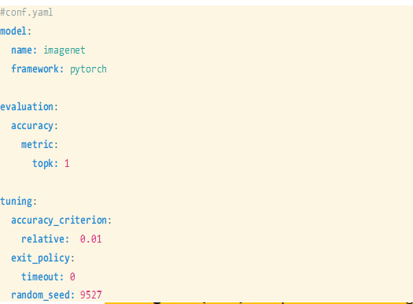
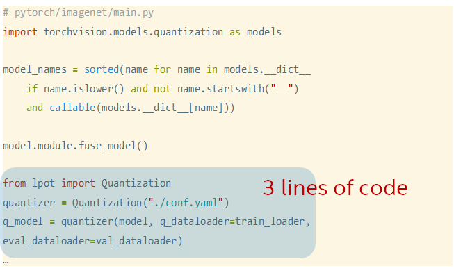
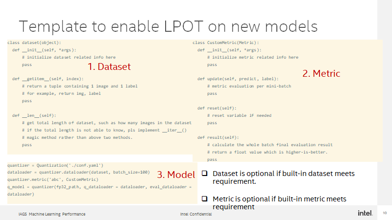

Tutorial
=========================================

This tutorial will introduce step by step instructions on how to integrate models with Intel® Low Precision Optimization Tool (LPOT) with examples. 

First user needs to prepare FP32 model, and then configure the model information and tuning parameters in yaml. LPOT supports builtin dataloaders for pupular dataset such as imagenet and coco, and supports builtin evaluators like topk, Loss and MSE, to use the builtin dataloader and evaluators user can configure them in yaml file. Then user can add a simple launcher to call quantization. Of course, user can also define their own dataloader and evaluators. This tutorial will use examples to introduce how to do quantization and run benchmark with both builtin and customized dataloader and evaluators.  

<table>
  <tr>
    <td>Tutorial</td>
  </tr>
  <tr>
    <td></td>
  </tr>
 </table>
 
Here is an example of ymal file and laucher code, the ymal file defined the tuning accuracy target and evaluation funciton, and only 3 lines of code are added to launch LPOT for quantization.
<table>
  <tr>
    <td>ymal</td>
    <td>launcher</td>
  </tr>
  <tr>
    <td></td>
    <td></td>
  </tr>
 </table>

To define a customized dataloader or evaluator for quantization, user can implement them follow this template:
<table>
  <tr>
    <td>Template for customized dataloader and evaluator</td>
  </tr>
  <tr>
    <td></td>
  </tr>
 </table>

Next, let's introduce how to do quantization in different scenarios. 

# Buildin dataloader and metric 
The [tf_example1](../examples/helloworld/tf_example1) demonstrates how to utilize LPOT builtin dataloader and evalautors for quantizaiton. User only needs to add 3 lines of launcher code for tuning, see [README](../examples/helloworld/tf_example1/README.md) for more details. 


# Customized dataloader
With a Keras saved model as example, [../examples/helloworld/tf_example2](../examples/helloworld/tf_example2] demonstrates how to define a customized dataloader and metric for quantization. 

First define a dataset class on mnist, it implements a __getitem() interface and return the next (image, label) pair.

```
class Dataset(object):
  def __init__(self):
      (train_images, train_labels), (test_images,
                 test_labels) = keras.datasets.fashion_mnist.load_data()
      self.test_images = test_images.astype(np.float32) / 255.0
      self.labels = test_labels
      pass

  def __getitem__(self, index):
      return self.test_images[index], self.labels[index]

  def __len__(self):
      return len(self.test_images)

```
Then define a customized metric to caculate accuracy. The update() function record the predict result and result() function provide the summary of accurate rate. 

```
import lpot
from lpot.metric import Metric
class MyMetric(Metric):
  def __init__(self, *args):
      self.pred_list = []
      self.label_list = []
      self.samples = 0
      pass

  def update(self, predict, label):
      self.pred_list.extend(np.argmax(predict, axis=1))
      self.label_list.extend(label)
      self.samples += len(label)
      pass

  def reset(self):
      self.pred_list = []
      self.label_list = []
      self.samples = 0
      pass

  def result(self):
      correct_num = np.sum(
            np.array(self.pred_list) == np.array(self.label_list))
      return correct_num / self.samples
```

Then define a dataloader based on the mnist dataset, and register the customer metric to run quantization. q_model is the quantized model generated. 
```

import lpot
quantizer = lpot.Quantization('./conf.yaml')
dataset = Dataset()
quantizer.metric('hello_metric', MyMetric)
dataloader = quantizer.dataloader(dataset, batch_size=1)
q_model = quantizer('../models/simple_model', q_dataloader = dataloader, eval_dataloader = dataloader)

```

# The interface is similiar for different TensorFlow models
1.  TensorFlow checkpoint: see [tf_example4](../examples/helloworld/tf_example4)
2.  Enable benchmark for performanace and accuracy measurement: see [tf_example5](../examples/helloworld/tf_example5)
3.  TensorFlow slim model: see [tf_example3](../examples/helloworld/tf_example3), while to quantize a slim .ckpt model we need to get the graph first, see [README](../examples/helloworld/tf_example3/README.md).  

