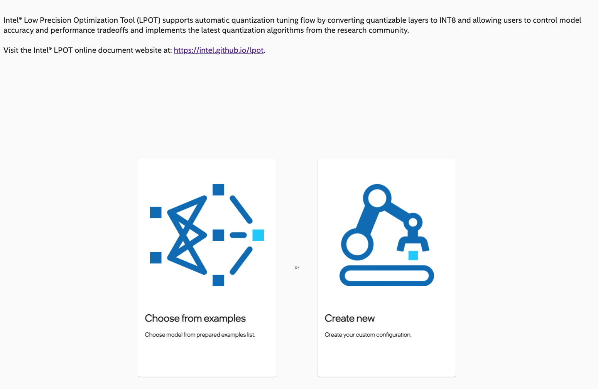
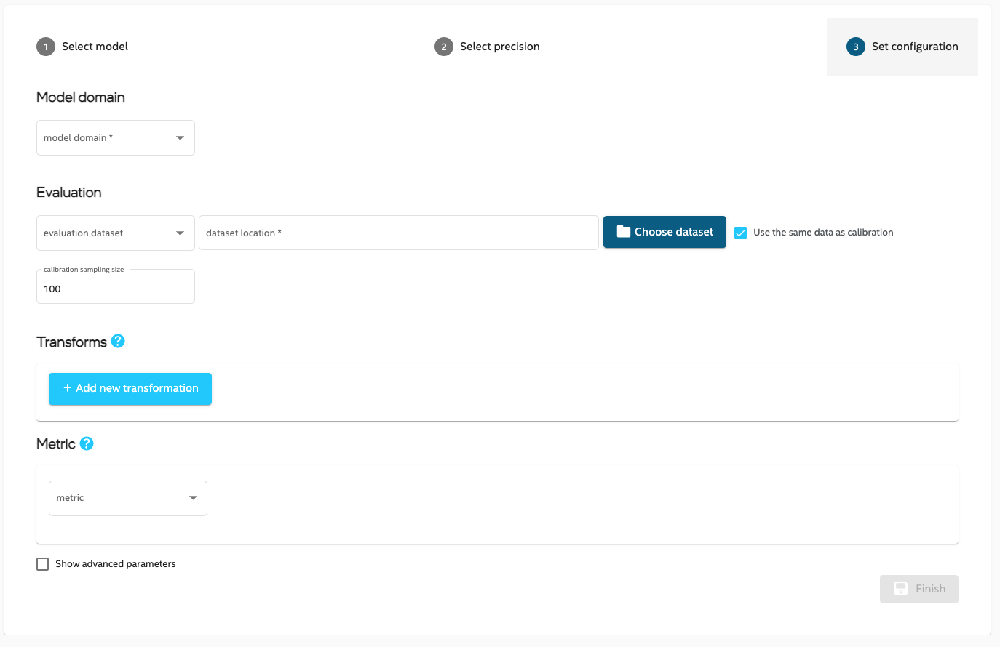
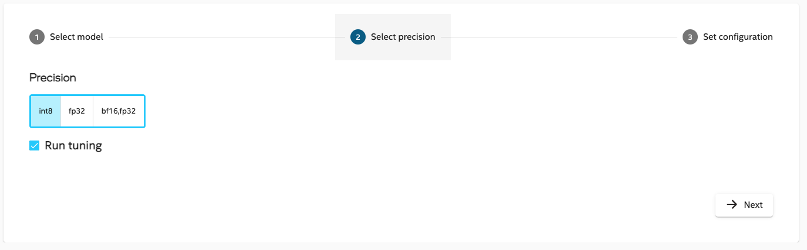
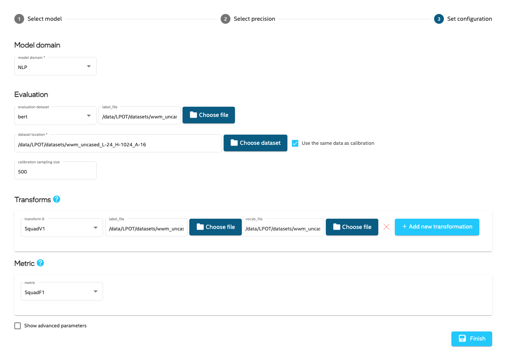

LPOT UX
=======

LPOT UX is only available on Linux based hosts.

## Start the UX

1. Start the LPOT UX server:

   ```shell
   lpot_ux
   ```
   > **Note**: TF 2.5.0 requires setting environment variable TF_ENABLE_MKL_NATIVE_FORMAT=0 for INT8 quantization:
    ```shell
    TF_ENABLE_MKL_NATIVE_FORMAT=0 lpot_ux
    ```

2. The server prints information on how to access the Web UI.

   An example message looks like this: 

   ```text
   LPOT UX Server started.
   Setup port forwarding from your local port 5000 to 5000 on this machine.
   Then open address http://localhost:5000/?token=338174d13706855fc6924cec7b3a8ae8
   ```

   Make certain that requested port forwarding is set up (depending on your OS) and then open the address in your web browser.

## Home

This view shows introduction to LPOT and 2 buttons for creating new configurations in 2 different ways. First one links to **Examples**, the second one to **Config wizard**.



On the left hand side there is a panel with list of configurations.


One can see system information by clicking  button. The result is details dialog:

 

By clicking   button you can navigate to **My models list**.


## Configuration details

When clicking on configuration from the left hand side list, you can see its details view. You can see the results, rerun the tuning, check the configuration and console output. You can also see the model graph.


## My Models list

This view lists all Model Configurations defined on a given server. 

You can create a new model using pre-defined models by using a New Model Wizard or **Examples**:


## New Model Configuration from New Model Wizard
### Basic parameters

1. Enter information in all required fields (marked by a *) in the Wizard: 




2. Either save this configuration (by clicking **Finish**), or change some advanced parameters (by checking the checkbox 
).

### Advanced parameters

From the advanced parameters page, you can configure more features such as tuning, quantization, and benchmarking. 


## New Model Configuration from Examples


Included are models you can use to test tuning. You have to point to the Dataset that you want to use click **Finish** too add it to your models. A new model will be downloaded and added to the **My models** list, ready for tuning.

## Custom dataset or metric

If you choose **custom** in the Dataset or Metric section, the appropriate code templates will be generated for you to fill in with your code. The path to the template will be available by clicking the **Copy code template path** button located in the right-most column in the **My models** list.

Follow the comments in the generated code template to fill in required methods with your own code.

## BERT model configuration
* Follow [instructions](../examples/tensorflow/nlp/bert_large_squad/README.md) to:
   * install Intel Tensorflow 1.15 up2
   * prepare dataset and a frozen pb model 
* In the **Create low precision model** in first step:
   * select created frozen model
   * select input_file, batch_size in inputs (in that order)
   * choose **custom** in output and enter `IteratorGetNext:3, unstack:0, unstack:1` in input field

* in second step don't change anything

* in third step :
   * choose NLP as model domain
   * in **Calibration/label_file**, select **dev-v1.1.json** file from created dataset
   * in **Calibration/dataset location**, select **evel.tf_record** file from created dataset
   * in **Evaluation/Transforms/label_file**, select **dev-v1.1.json** file from created dataset  
   * in **Evaluation/Transforms/vocab_file**, select **vocab.txt** file from created dataset
   * click **Finish** or change Advanced parameters

 

## Model Graph Display
For Tensorflow frozen pb models there will be a new button available .

Click it to display graph of selected model:

.


## Tuning

Now that you have created a Model Configuration, you can do the following:

* See the generated config (by clicking the **Show config** link).
* Start the tuning process:
  * Click the blue arrow  to start the tuning.
  * Click **Show output** to see logs that are generated during tuning.
  * Your model will be tuned according to configuration.
  * When the tuning is finished, you will see accuracy results in the **My Models** list:
      - The **Accuracy** section displays comparisons in accuracy metrics between the original and tuned models.
      - **Model size** compares the sizes of both models.
      - When automatic benchmarking is finished, **Throughput** shows the performance gain from tuning. 
