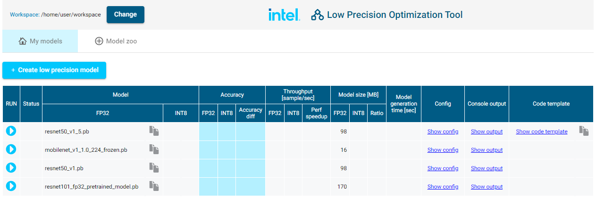
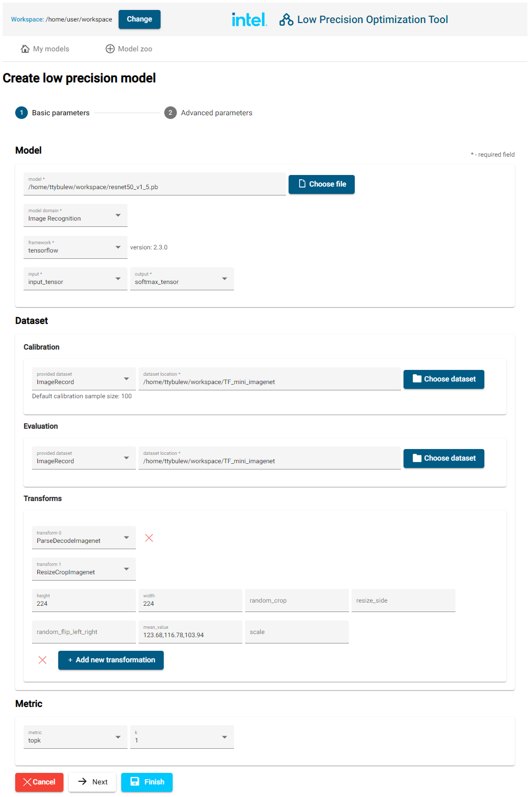
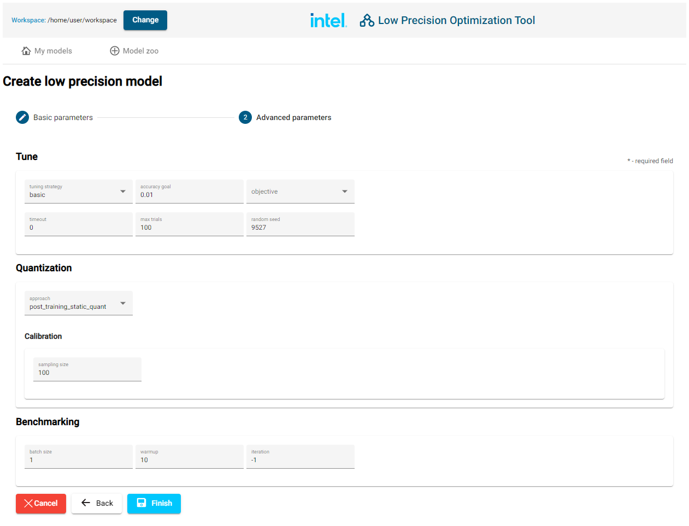
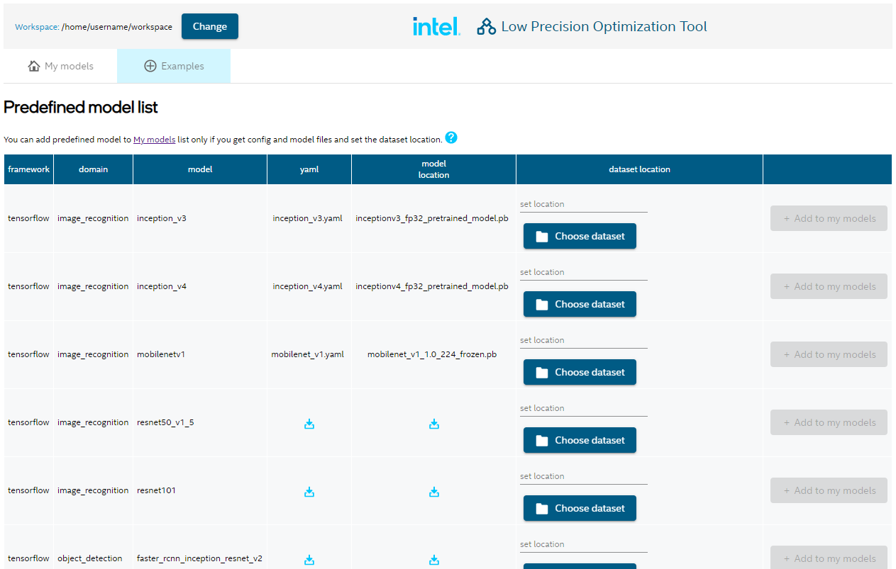

Intel® Low Precision Optimization Tool UX
=========================================

# Starting the UX
1. Start LPOT UX server:
   ```shell
   lpot_ux
   ```
1. Server prints information how to access the Web UI.

   Example message looks like:
   ```text
   LPOT UX Server started.
   Setup port forwarding from your local port 5000 to 5000 on this machine.
   Then open address http://localhost:5000/?token=338174d13706855fc6924cec7b3a8ae8
   ```

   Please make sure that requested port forwarding is set up (depending on your OS), then open address in your web browser

# My Models list
This view lists all Model Configurations defined on given server. 

You can create new model using pre-defined models using a New Model Wizard or Examples



# New Model Configuration from New Model Wizard
## Basic parameters
1. If you have all related files in one directory, you can point your Workspace there.
   
   Click the 
   button (on the top-left part of UX) and navigate to desired directory.
   
   In opened modal window, click "Choose" to confirm your selection.
1. Open the wizard by clicking  button.
1. In the wizard fill in all required fields (marked by a *)
   
1. You can either save this configuration (by clicking "Save"), or change some advanced parameters (by clicking "Next").

## Advanced parameters
On advanced parameters page, you can select how more features of tuning, quantization and benchmarking will be configured.
   

# New Model Configuration from Examples

We have some models prepared to test the tuning with. Visit "Examples" tab to:
1. Download a model to selected Workspace.
1. Download predefined configuration file for models.
1. When both model and configuration are downloaded, you can point to Dataset to be used and finally click "Add to my models".
1. New model will be added to "My models" list, ready for tuning.

# Custom dataset or metric
If you choose "custom" in Dataset or Metric section, appropriate code template will be generated for you to fill in with your code.

Path to the template will be available by clicking "Copy code template path" button in right-most column in My models list.

Follow the comments in generated code template to fill in required methods with your own code.

# Tuning
Having a Model Configuration created, you can:
1. See generated config (by clicking the "Show config" link).
1. Start the tuning:
   1. Click the blue arrow  to start the tuning.
   1. You can now click on "Show output" link to see logs generated during tuning.
   1. Your model will be tuned according to configuration.
   1. When tuning is finished, you will see accuracy results in My models list:
      - "Accuracy" section will display comparison in accuracy metric between original and tuned model,
      - "Model size" will compare sizes of both models
      - when automatic benchmarking is finished, "Throughput" will show performance gain from tuning 

# Advanced options
## TLS connection encryption

You can provide your own certificate and key to the server in order to use TLS encrypted communication between UI and server.

Add two parameters to server start command:
```
lpot_ux --certfile path_to_cert.crt --keyfile path_to_private_key.key
```
