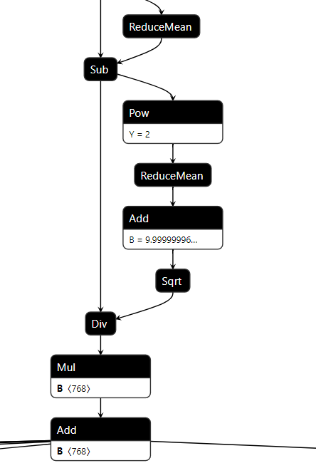

# Add a Customized Pattern to Engine Compile

The `Engine` in `Neural_Compressor` support user add customized pattern of model. Which means you can compile your own pretrained model to `Engine` ir just by adding the specific patterns which the `engine.compile` does not contain.

The intermediate graph in `Engine` can be treated as a `list` that stores all nodes of model under control flow. Some certain nodes may compose a pattern which need to be fused for speeding up inference. For simplifying the network structure, we also design different attributes attached to fused nodes. So aim at adding a customized pattern, there needs three steps: **1. register the nodes' op_types; 2.  set the pattern mapping config and register the pattern; 3. fuse pattern and set attributes of new pattern after fusion.**



Above is a `LayerNorm` pattern in `distilbert_base` onnx model. Assume it is a customized pattern in your model that need to be added in `Engine.compile`.  Follow the steps below to make `Engine` support this pattern, and fuse these 9 nodes to one node called `LayerNorm` in `Engine`.

##  Register the nodes' op_types

First you should check whether the nodes' op_types in the pattern are registered in `Engine` or not.  If not, you need to add the op_type class for `engine.compile` loading and extracting the origin model. All the ops can be found from this [link](https://github.com/intel/neural-compressor/blob/master/engine/compile/ops/op.py). For quick check, use the commands below.

```python
# make sure you have cloned neural_compressor repo and installed neural_compressor
from engine.compile.ops.op import OPERATORS
# All the op_type names and objects are stored in `OPERATORS`
print(OPERATORS)
```

The print result will show all registered ops, for example:

```python
{'All': <class 'engine.compile.ops.all.All'>, 'Assert': <class 'engine.compile.ops.assert.Assert'>, 'BatchMatMul': <class 'engine.compile.ops.batch_matmul.BatchMatMul'>, 'BatchMatMulV2': <class 'engine.compile.ops.batch_matmul_v2.BatchMatMulV2'>, 'BiasAdd': <class 'engine.compile.ops.bias_add.BiasAdd'>, 'Cast': <class 'engine.compile.ops.cast.Cast'>, 'Concat': <class 'engine.compile.ops.concat.Concat'>, 'AddV2': <class 'engine.compile.ops.empty_ops.AddV2'>, 'Add': <class 'engine.compile.ops.empty_ops.Add'>, 'BinaryAdd': <class 'engine.compile.ops.empty_ops.BinaryAdd'>, 'ConstantOfShape': <class 'engine.compile.ops.empty_ops.ConstantOfShape'>, 'DequantizeLinear': <class 'engine.compile.ops.empty_ops.DequantizeLinear'>, 'Div': <class 'engine.compile.ops.empty_ops.Div'>, 'Equal': <class 'engine.compile.ops.empty_ops.Equal'>, 'Erf': <class 'engine.compile.ops.empty_ops.Erf'>, 'Expand': <class 'engine.compile.ops.empty_ops.Expand'>, 'Fill': <class 'engine.compile.ops.empty_ops.Fill'>, 'FlatMapDataset': <class 'engine.compile.ops.empty_ops.FlatMapDataset'>, 'Identity': <class 'engine.compile.ops.empty_ops.Identity'>, 'InnerProduct': <class 'engine.compile.ops.empty_ops.InnerProduct'>, 'Input': <class 'engine.compile.ops.empty_ops.Input'>, 'LayerNorm': <class 'engine.compile.ops.empty_ops.LayerNorm'>, 'LessEqual': <class 'engine.compile.ops.empty_ops.LessEqual'>, 'MakeIterator': <class 'engine.compile.ops.empty_ops.MakeIterator'>, 'MatMulWithBiasAdd': <class 'engine.compile.ops.empty_ops.MatMulWithBiasAdd'>, 'MatMulWithBiasGelu': <class 'engine.compile.ops.empty_ops.MatMulWithBiasGelu'>, 'MatMulWithBiasTanh': <class 'engine.compile.ops.empty_ops.MatMulWithBiasTanh'>, 'MatMulWithBias': <class 'engine.compile.ops.empty_ops.MatMulWithBias'>, 'Mul': <class 'engine.compile.ops.empty_ops.Mul'>, 'NonZero': <class 'engine.compile.ops.empty_ops.NonZero'>, 'Output': <class 'engine.compile.ops.empty_ops.Output'>, 'PaddingSequence': <class 'engine.compile.ops.empty_ops.PaddingSequence'>, 'Pow': <class 'engine.compile.ops.empty_ops.Pow'>,
 ...}
```

These ops can be roughly divided into two categories, the one is without attributes, like `Mul`, the other one is with attributes, for example,  `Reshape` has the attributes `dst_shape`. You can look through the `engine.executor` for more info about the `Engine` ops' attribute settings.

Assume the `Sqrt` and `ReduceMean` in `LayerNorm` pattern is  new op_types for `engine.compile`.  Here are the examples that show how to register them.

`Sqrt` has not attributes. You can add this op class in [`engine.compile.ops.empty_ops`](https://github.com/intel/neural-compressor/blob/master/engine/compile/ops/empty_ops.py).

```python
# register the 'Sqrt' class in OPERATORS
@operator_registry(operator_type='Sqrt')
# all ops class will inherit the father class 'Operator'
class Sqrt(Operator):
    def __init__(self):
        super().__init__()
```

`ReduceMean` has `keep_dims` and `axis` two attributes, you need to set them by extracting the node from the origin model.

Create a python file (for example, name can be `reduce_mean.py`) in [`engine.compile.ops`](https://github.com/intel/neural-compressor/tree/master/engine/compile/ops) and add the `ReduceMean` op class.

In this `LayerNorm` pattern, the `ReduceMean` node in origin onnx model just has `axes` value which is a list, that is the value of `axis` attribute comes from.  The `keep_dims` attribute is `False` by default in `engine.executor`, so if the `ReduceMean` node has the `keep_dims` attribute, you should extract and set it. Otherwise, you can just ignore it.

```python
from .op import Operator, operator_registry
from .tensor import Tensor
from ..graph_utils import list2str

@operator_registry(operator_type='ReduceMean')
class ReduceMean(Operator):
    def __init__(self):
        super().__init__()
    # rewrite the 'set_attr' function to set the attributes
    def set_attr(self, framework, node):
        # other frameworks may also have the 'ReduceMean' op_type
        if framework == 'onnxruntime':
            # if node has 'keep_dims' attribute in origin model
            if len(node.attribute) == 2:
                axis = node.attribute[1].ints
                self._attr['keep_dims'] = bool(node.attribute[0].i)
            # if node has not 'keep_dims' attribute in origin model
            if len(node.attribute) == 1:
               axis = node.attribute[0].ints
            # in this 'LayerNorm' pattern, the axis just have on element in a list
            if len(axis) == 1:
                self._attr['axis'] = axis[0]
            # if the axis list have several element, change the list to string
            # for example, [1, 2, 3] --> '1,2,3'
            else:
                self._attr['axis'] = list2str(axis)
```

After adding the two op classes, you can use the `OPERATORS` to check whether them be added successfully or not. Please do not forget reinstall the `Neural_Compressor` in local for making your code changes effective.

```shell
# enter into the <neural_compressor> folder
cd <you_work_dir>/neural_compressor/
# reinstall the neural_compressor locally
python setup.py install
```

```python
# check your code changes
from engine.compile.ops.op import OPERATORS
'Sqrt' and 'ReduceMean' in OPERATORS
```

If nothing wrong, the output result should be `True`

## Set the pattern mapping config and register the pattern;

In `Engine`, we treat the pattern fusion as the process of pattern mapping: from a group nodes to another group nodes. In this step, you need to supply a config for `pattern_mapping` function and register your pattern, in order to make sure that the `engine.compile` to implement pattern fusion correctly.

- Create a python file (for example, name can be `layer_norm.py`) in [`engine.compile.sub_graph`](https://github.com/intel/neural-compressor/tree/master/engine/compile/sub_graph) and add the `LayerNorm` pattern mapping config.

  For the above `LayerNorm` pattern, the config example can be like this:

  ```python
  # LayerNorm in distil_bert_base
  pattern_mapping_config = {
              'LayerNorm': [
      {
      'patterns': {
                   'in': [[(0, 'ReduceMean'), (1, 'Sub'), (2, 'Pow'), (3, 'ReduceMean'),
                          (4, 'Add'), (5, 'Sqrt'), (6, 'Div'), (7,'Mul'), (8, 'Add')]],
                   'out': [[(0, 'LayerNorm')]]
                   },
       'search_mode': 'op_type',
       'node_names': {
                      0: 8
                     },
       'input_tensors': {
                          0: [[{
                              0: [0]
                          }, {
                              7: [1]
                          }, {
                              8: [1]
                          }], [[0, 1, 2], 3]]
                         },
       'output_tensors': {
                          0: [[{
                              8: [0]
                          }], [[0], 1]]
                      },
       'returns': [4]
       },
    ]
  }
  ```

  The dict in the config will guide the `pattern_mapping` function how to find all the group nodes that belong to `LayerNorm` pattern in intermediate graph and how to replace them with new pattern. We use this config to store many dicts because different models (even same model) could have different representations for a certain pattern. If you want to delve into it, pleas see  [pattern_recognize](https://github.com/intel/neural-compressor/tree/master/engine/docs/pattern_recognition.md) and [graph_fusion](https://github.com/intel/neural-compressor/tree/master/engine/docs/graph_fusion.md) docs for more details.

- Register the `LayerNorm` pattern

  Like the node op_type, the new pattern also need to be registered. You can check the existing pattern classes by the commands below.

  ```python
  from engine.compile.sub_graph.pattern import PATTERNS
  print(PATTERNS)
  ```

  The print result will show all registered patterns, for example:

  ```shell
  {'AddEmbeddings': <class 'engine.compile.sub_graph.add_embeddings.AddEmbeddings'>, 'AttentionReshape': <class 'engine.compile.sub_graph.attention_reshape.AttentionReshape'>, 'Gelu': <class 'engine.compile.sub_graph.gelu.Gelu'>, 'InputData': <class 'engine.compile.sub_graph.input_data.InputData'>, 'InputFile': <class 'engine.compile.sub_graph.input_file.InputFile'>, 'LastLayerShape': <class 'engine.compile.sub_graph.last_layer_shape.LastLayerShape'>, ...}
  ```

  In order to complete the `LayerNorm` pattern registration, write a related classes in the python file you created before and put the pattern mapping config in.

  ```python
  from .pattern import Pattern, pattern_registry
  from collections import namedtuple, OrderedDict
  from .. import graph_utils as util

  @pattern_registry(pattern_type='LayerNorm')
  class LayerNorm(Pattern):
      def __call__(self, model):

          pattern_mapping_config = {
              'LayerNorm': [
                  # LayerNorm in distil_bert_base
                  {
                      'patterns': {
                          'in': [[(0, 'ReduceMean'), (1, 'Sub'), (2, 'Pow'), (3, 'ReduceMean'),
                                  (4, 'Add'), (5, 'Sqrt'), (6, 'Div'), (7,'Mul'), (8, 'Add')]],
                          'out': [[(0, 'LayerNorm')]]
                      },
                      'search_mode': 'op_type',
                      'node_names': {
                          0: 8
                      },
                      'input_tensors': {
                          0: [[{
                              0: [0]
                          }, {
                              7: [1]
                          }, {
                              8: [1]
                          }], [[0, 1, 2], 3]]
                      },
                      'output_tensors': {
                          0: [[{
                              8: [0]
                          }], [[0], 1]]
                      },
                      'returns': [4]
                  },
              ]
          }
  ```

  After save this python file, you can check it by retrieving the `PATTERNS`

  ```python
  from engine.compile.sub_graph.pattern import PATTERNS
  'LayerNorm' in PATTERNS
  ```

  If nothing wrong, the output result should be `True`.

## Fuse pattern and set attributes of new pattern after fusion

- Define the pattern fusion order

  Fuse pattern should follow specific order if a model has multiple patterns. For example, if the model has A pattern (nodes: a-->b) and B pattern (nodes: a-->b-->c), and B pattern is actually equivalent to A pattern + c node. So you should fuse A pattern first, then B pattern (more info and details please see the [graph_fusion](https://github.com/intel/neural-compressor/tree/master/engine/docs/graph_fusion.md)).

  There is a list called `supported_patterns` in [`engine.compile.sub_graph.pattern`](https://github.com/intel/neural-compressor/blob/master/engine/compile/sub_graph/pattern.py). It control the order of pattern fusion. You need to add your customized pattern name (the `pattern_type` you register in step 2) into `supported_patterns` at appropriate location (If a pattern does not influence other patterns, you can put it at arbitrary location).

  For example, change the `supported_patterns` like:

  ```python
  supported_patterns = [
      'InputData',
      'A pattern'
      ...
      'LayerNorm',
      'B pattern',
      ...
      'OutputData',
  ]
  ```

- Replace the pattern with new pattern

  According to the pattern mapping dict in step 2, add these two lines below to get the intermediate graph after pattern fusion.

  ```python
  # get the above LayerNorm pattern dict
  pattern_dict = pattern_mapping_config['LayerNorm'][0]
  # get the intermediate graph (model) after fuse LayerNorm pattern
  # new_node_name and ret_old_nodes are used for set attributes later
  model, new_node_names, ret_old_nodes = util.pattern_mapping('LayerNorm', pattern_dict, model)
  ```

- Set the attributes of new pattern

  Every new pattern generated after fusion could have their own attributes (when we talk about pattern attribute, it stands for the operator's attributes in the pattern, which defined by `engine.executor` ). As for `LayerNorm` pattern, the above 9 nodes are fused to one node with op_type `LayerNorm`. This operation has an attribute `epsilon` in `engine.executor`, which  is a value added to the denominator for numerical stability.

  We recommend to write a `_set_attr` function and call it after pattern mapping to set the nodes' attributes. Here is the example for `LayerNorm` pattern.

  ```python
  def _set_attr(epsilon, node_names, model):
      attr = OrderedDict()
      # set the `epsilon` attribute
      attr['epsilon'] = float(epsilon)
      ln_node_idx = model.get_node_id(node_names[0])
      # make the LayerNorm node in model have the
      model.nodes[ln_node_idx].attr = attr
  # LayerNorm pattern mapping
  pattern_dict = pattern_mapping_config['LayerNorm'][0]
  model, new_node_names, ret_old_nodes = util.pattern_mapping('LayerNorm', pattern_dict, model)
  # if the model has the above LayerNorm pattern
  if len(new_node_names) != 0:
      # set the LayerNorm node attribute
      for j in range(len(new_node_names)):
          # get the epsilon value from the ret_old_nodes
          epsilon = ret_old_nodes[j][0].input_tensors[1].data
          _set_attr(epsilon, new_node_names[j], model)
      return model
  ```

Here gives the complete code of the `LayerNorm` pattern config, pattern fusion and attributes setting.

```python
from .pattern import Pattern, pattern_registry
from collections import namedtuple, OrderedDict
from .. import graph_utils as util

@pattern_registry(pattern_type='LayerNorm')
class LayerNorm(Pattern):
    def __call__(self, model):

        pattern_mapping_config = {
            'LayerNorm': [
                # LayerNorm in distil_bert_base
                {
                    'patterns': {
                        'in': [[(0, 'ReduceMean'), (1, 'Sub'), (2, 'Pow'), (3, 'ReduceMean'),
                                (4, 'Add'), (5, 'Sqrt'), (6, 'Div'), (7,'Mul'), (8, 'Add')]],
                        'out': [[(0, 'LayerNorm')]]
                    },
                    'search_mode': 'op_type',
                    'node_names': {
                        0: 8
                    },
                    'input_tensors': {
                        0: [[{
                            0: [0]
                        }, {
                            7: [1]
                        }, {
                            8: [1]
                        }], [[0, 1, 2], 3]]
                    },
                    'output_tensors': {
                        0: [[{
                            8: [0]
                        }], [[0], 1]]
                    },
                    'returns': [4]
                },
            ]
        }

        # general LayerNorm node attribute setting function
        def _set_attr(epsilon, node_names, model):
            attr = OrderedDict()
            attr['epsilon'] = float(epsilon)
            ln_node_idx = model.get_node_id(node_names[0])
            model.nodes[ln_node_idx].attr = attr
        # use for-loop because you may add other LayerNorm pattern mapping dict
        # when meeting other different models
        for i in range(len(pattern_mapping_config['LayerNorm'])):
            # replace all the LayerNorm pattern in the model
            pattern_dict = pattern_mapping_config['LayerNorm'][i]
            model, new_node_names, ret_old_nodes = util.pattern_mapping('LayerNorm', pattern_dict, model)
            if len(new_node_names) != 0:
                # set the LayerNorm node attribute
                for j in range(len(new_node_names)):
                    epsilon = ret_old_nodes[j][0].input_tensors[1].data
                    _set_attr(epsilon, new_node_names[j], model)
                return model
        # if a model has not any LayerNorm pattern in the pattern_mapping config,return
        return model
```

After finishing these three steps in `engine.compile`, reinstall `Neural_Compressor` and then use `compile` function would compile your model with the customized pattern.

>**NOTE**:
>
>1. The pattern mapping function just support pattern after fusion is sequence for now, like [a-->b-->c] or [a]. So if the customized  pattern after fusion is too complicated, you had better decompose it.
>2. The `engine.executor` may have not the operators' implementation of customized pattern after fusion, you need to add them in `engine.executor` if this condition happens.
