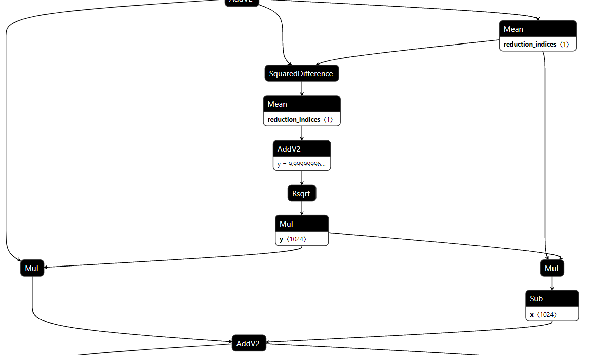
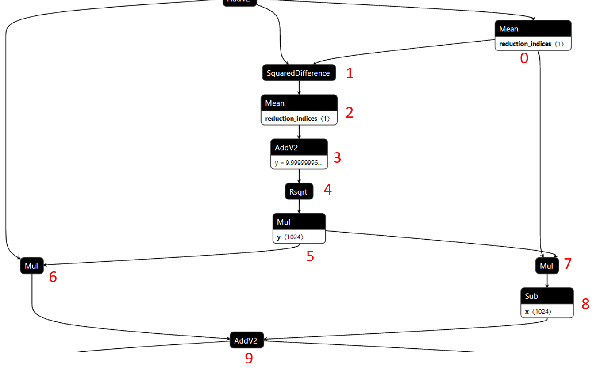

# Pattern Recognize

Pattern recognition is one of the most important part of pattern fusion. The corresponding API is `search_pattern` in [`engine.compile.graph_utils`](https://github.com/intel/neural-compressor/blob/master/engine/compile/graph_utils.py). The main purpose of it is to find all the group nodes' names from the model that satisfy the given pattern representation.  The process of it can be divided into three parts: **1.parse the pattern representation list; 2.search each straight chain pattern; 3.splice sub-chains  with main chain and remove duplicate results**.

## Pattern representation

Our pattern recognition function supports the pattern which is not sequence and has sub-graph, like the `LayerNorm` pattern below (from TensorFlow bert_large model).



Pattern recognition function utilizes a general rules to represent and search the pattern. We use a combination of index and op_type to recruit node and several lists to indicate different straight chains. For example, the pattern representation of the `LayerNorm` pattern above can be like this:

```python
ln_pattern = [[(0, 'Mean'), (1, 'SquaredDifference'), (2, 'Mean'), (3, ['Add', 'AddV2']), (4, 'Rsqrt'), (5, 'Mul'), (7, 'Mul'), (8, 'Sub'), (9, ['Add', 'AddV2'])], [(5, 'Mul'), (6, 'Mul'), (9, ['Add', 'AddV2'])]]
```

First, due to computation order, we set index for each node in the `LayerNorm` pattern. These indexes also supply the locations for splicing sub-chains with main chain. You can set the index number by yourself as long as calculation order is correct (We recommend the number starts from 0 and grows recursively for conciseness and intuition).

Second, define a main chain by choosing a longest one containing head and tail nodes of pattern, and the rest are the sub-chains whose tail node must be in main chain for splicing successfully. In the `LayerNorm` pattern, we choose the chain with index  `[0,1,2,3,4,5,7,8,9]`(see the image below) as the main chain. And the rest chain with index `[5,6,9]` is a sub-chain attached to the main chain.  Of course you can choose the chain with index `[0,1,2,3,4,5,6,9]` as the main chain, but generally we recommend and prefer longer ones.

Finally, write the index and op_type of each node into list and form the pattern representation.

>  **NOTE**:
>
> 1. The main chain representation should always be the first one in the list, while the rest sub-chains have not order requirements.
>
> 2. `[op_type1, op_type2]` means the the op_type could be op_type1 or op_type2. It is optional. This feature would be useful for add new pattern representation which just has some different op_types.
>
> 3. The sub-chains must have tail node which is in main chain, while the head node can be empty ('empty' means the head node is not in main chain, mostly from the outside of the pattern, using `()` to indicate a empty head node). For example, if node `(6, 'Mul')`  has node head node, then its representation list should be:
>
>    ```python
>    [(), (6, 'Mul'), (9, ['Add', 'AddV2'])]
>    ```




## Parse pattern representation list

The pattern recognition function would firstly parse the pattern representation list and separate main chain, sub-chains patterns and related op_type and index for searching and splicing later. It will also check the sub-chains whether have head or not.

## Search each straight chain pattern

The [`engine.compile.graph_utils`](https://github.com/intel/neural-compressor/blob/master/engine/compile/graph_utils.py) has `search_straight_pattern` API for searching sequence pattern. It receives `input_pattern` and `graph` parameters and exploits `DFS` algorithm to find eligible results. The `input_pattern` is a list contains several op_type from the step above. For example, it could be one like this:

```python
['MatMul', 'BiasAdd', ['Add', 'AddV2']]
```

The `graph` is the intermediate graph of `engine.compile`. This API returns matched node_names results list. For example, if the intermediate graph has 24 layers and each layer has a `['MatMul', 'BiasAdd', ['Add', 'AddV2']]` pattern, then the length is 24. Each match pattern result is still a list contains the node names, and the last element is the op_type list corresponding to the former node names.

```python
# the input_pattern is [A, B, C]
ret = [[A_node_name_1, B_node_name_1, C_node_name_1, [A, B, C]], [A_node_name_2, B_node_name_2, C_node_name_2, [A, B, C]], ..., [A_node_name_n, B_node_name_n, C_node_name_n, [A, B, C]], ...]
```

Assume you want to find the match results of pattern `['MatMul', 'BiasAdd', ['Add', 'AddV2']]` in bert_large TensorFlow model (you can get this model from this [link](https://github.com/intel/neural-compressor/tree/master/examples/engine/nlp/squad/bert_large#2-prepare-dataset-and-model) and make sure the tf version is `intel-tensorflow-1.15-up2`).

```python
from engine.compile import COMPILES
from engine.compile.graph_utils import search_straight_pattern
graph = COMPILES['loader']()(bert_large_model_path)
graph = COMPILES['extractor']()(graph)
input_pattern = ['MatMul', 'BiasAdd', ['Add', 'AddV2']]
ret = search_straight_pattern(input_pattern, graph)
print(ret)
```

If nothing wrong, you can get the output like this:

```shell
[['bert/encoder/layer_0/attention/output/dense/MatMul', 'bert/encoder/layer_0/attention/output/dense/BiasAdd', 'bert/encoder/layer_0/attention/output/add', ['MatMul', 'BiasAdd', 'AddV2']], ['bert/encoder/layer_0/intermediate/dense/MatMul', 'bert/encoder/layer_0/intermediate/dense/BiasAdd', 'bert/encoder/layer_0/intermediate/dense/add', ['MatMul', 'BiasAdd', 'AddV2']], ['bert/encoder/layer_0/output/dense/MatMul', 'bert/encoder/layer_0/output/dense/BiasAdd', 'bert/encoder/layer_0/output/add', ['MatMul', 'BiasAdd', 'AddV2']], ['bert/encoder/layer_1/attention/output/dense/MatMul', 'bert/encoder/layer_1/attention/output/dense/BiasAdd', 'bert/encoder/layer_1/attention/output/add', ['MatMul', 'BiasAdd', 'AddV2']], ['bert/encoder/layer_1/intermediate/dense/MatMul', 'bert/encoder/layer_1/intermediate/dense/BiasAdd', 'bert/encoder/layer_1/intermediate/dense/add', ['MatMul', 'BiasAdd', 'AddV2']], ['bert/encoder/layer_1/output/dense/MatMul', 'bert/encoder/layer_1/output/dense/BiasAdd', 'bert/encoder/layer_1/output/add', ['MatMul', 'BiasAdd', 'AddV2']], ['bert/encoder/layer_2/attention/output/dense/MatMul', 'bert/encoder/layer_2/attention/output/dense/BiasAdd', 'bert/encoder/layer_2/attention/output/add', ['MatMul', 'BiasAdd', 'AddV2']], ['bert/encoder/layer_2/intermediate/dense/MatMul', 'bert/encoder/layer_2/intermediate/dense/BiasAdd', 'bert/encoder/layer_2/intermediate/dense/add', ['MatMul', 'BiasAdd', 'AddV2']], ['bert/encoder/layer_2/output/dense/MatMul', 'bert/encoder/layer_2/output/dense/BiasAdd', 'bert/encoder/layer_2/output/add', ['MatMul', 'BiasAdd', 'AddV2']], ...]
```

The pattern recognition function would search each straight chain pattern after parsing in the graph. It stores the main chain pattern matched results firstly and implements other sub-chain pattern search and splicing one by one afterwards.

## Splice sub-chains  with main chain and remove duplicate results

Each sub-chain pattern matched results would find their attached main chain by check the node names with the indexes. They are merged into the last result recursively by inserting node name at certain position with the help of the indexes. However, due to the volatile and complicated pattern form, there must have other validation ways to avoiding duplicated and incorrect outcomes. For example,  a pattern may be symmetric, the main chain and sub-chain are totally same. Or a pattern has several exactly the same sub-chains attached at same location. So when doing splicing, the pattern recognition function would screen the sub-chain pattern matched results by checking if any node name occurs already or not. And before return the final results, it also remove the duplicate element in the list.  For more details, you can see the implementation of `search_pattern` API.

In the end, here is the example shows how to get the `LayerNorm`  pattern matched results in bert_large TensorFlow model.

```python
from engine.compile import COMPILES
from engine.compile.graph_utils import search_pattern
graph = COMPILES['loader']()(bert_large_model_path)
graph = COMPILES['extractor']()(graph)
ln_pattern = [[(0, 'Mean'), (1, 'SquaredDifference'), (2, 'Mean'), (3, ['Add', 'AddV2']), (4, 'Rsqrt'), (5, 'Mul'), (7, 'Mul'), (8, 'Sub'), (9, ['Add', 'AddV2'])], [(5, 'Mul'), (6, 'Mul'), (9, ['Add', 'AddV2'])]]
ret = search_pattern(ln_pattern, graph)
print(len(ret))
print(ret)
```

If nothing wrong, the output outcome should be like this:

```shell
49
[['bert/embeddings/LayerNorm/moments/mean', 'bert/embeddings/LayerNorm/moments/SquaredDifference', 'bert/embeddings/LayerNorm/moments/variance', 'bert/embeddings/LayerNorm/batchnorm/add', 'bert/embeddings/LayerNorm/batchnorm/Rsqrt', 'bert/embeddings/LayerNorm/batchnorm/mul', 'bert/embeddings/LayerNorm/batchnorm/mul_1', 'bert/embeddings/LayerNorm/batchnorm/mul_2', 'bert/embeddings/LayerNorm/batchnorm/sub', 'bert/embeddings/LayerNorm/batchnorm/add_1', ['Mean', 'SquaredDifference', 'Mean', 'AddV2', 'Rsqrt', 'Mul', 'Mul', 'Mul', 'Sub', 'AddV2']], ['bert/encoder/layer_0/attention/output/LayerNorm/moments/mean', 'bert/encoder/layer_0/attention/output/LayerNorm/moments/SquaredDifference', 'bert/encoder/layer_0/attention/output/LayerNorm/moments/variance', 'bert/encoder/layer_0/attention/output/LayerNorm/batchnorm/add', 'bert/encoder/layer_0/attention/output/LayerNorm/batchnorm/Rsqrt', 'bert/encoder/layer_0/attention/output/LayerNorm/batchnorm/mul', 'bert/encoder/layer_0/attention/output/LayerNorm/batchnorm/mul_1', 'bert/encoder/layer_0/attention/output/LayerNorm/batchnorm/mul_2', 'bert/encoder/layer_0/attention/output/LayerNorm/batchnorm/sub', 'bert/encoder/layer_0/attention/output/LayerNorm/batchnorm/add_1', ['Mean', 'SquaredDifference', 'Mean', 'AddV2', 'Rsqrt', 'Mul', 'Mul', 'Mul', 'Sub', 'AddV2']], ['bert/encoder/layer_0/output/LayerNorm/moments/mean', 'bert/encoder/layer_0/output/LayerNorm/moments/SquaredDifference', 'bert/encoder/layer_0/output/LayerNorm/moments/variance', 'bert/encoder/layer_0/output/LayerNorm/batchnorm/add', 'bert/encoder/layer_0/output/LayerNorm/batchnorm/Rsqrt', 'bert/encoder/layer_0/output/LayerNorm/batchnorm/mul', 'bert/encoder/layer_0/output/LayerNorm/batchnorm/mul_1', 'bert/encoder/layer_0/output/LayerNorm/batchnorm/mul_2', 'bert/encoder/layer_0/output/LayerNorm/batchnorm/sub', 'bert/encoder/layer_0/output/LayerNorm/batchnorm/add_1', ['Mean', 'SquaredDifference', 'Mean', 'AddV2', 'Rsqrt', 'Mul', 'Mul', 'Mul', 'Sub', 'AddV2']], ...]
```
