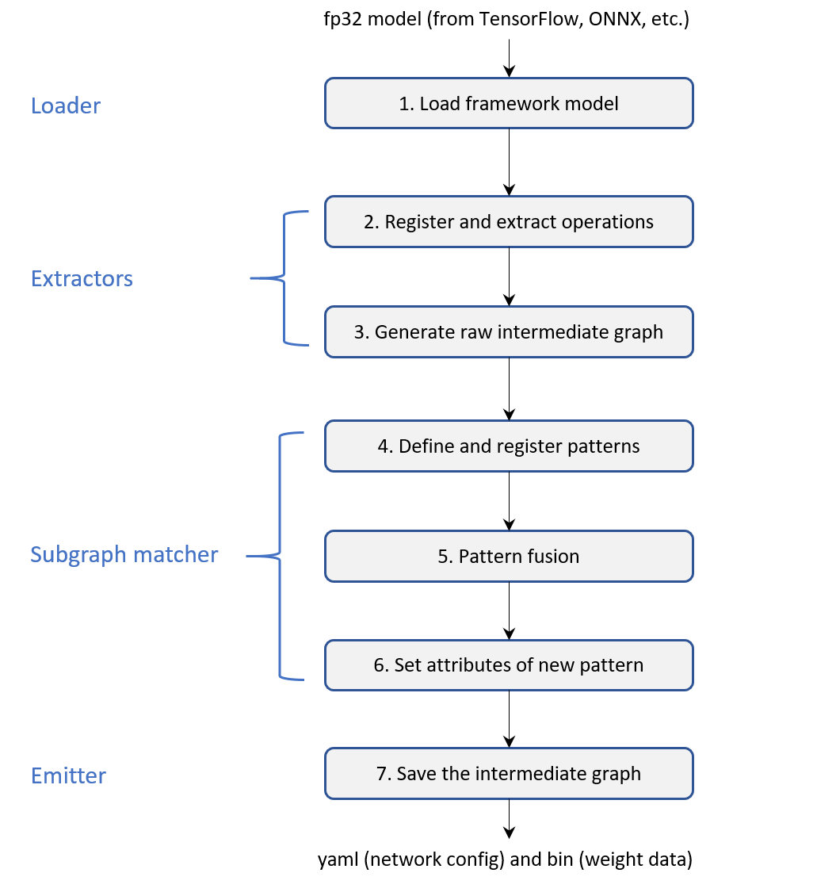

# Compile a TensorFlow Model to Engine IR

The `Engine`  as the backend of `Neural_Compressor` support frozen static graph model from two deep learning framework (`TensorFlow` and `ONNX`) for now. The image below shows the workflow of how the `Engine` compile framework model to its own intermediate representation (IR). The `Loader` is used to load models from different deep learning framework. Then the `Extractors` would extract operations of the origin model and compose the engine graph. Next, the `Subgraph matcher`  implement pattern fusion for accelerating inference. In the end, the `Emitter` saves the final intermediate graph on the disk as the format of `.yaml` and `.bin` files.



Here is one example show that how to use `Engine` to compile `TensorFlow` model to `Engine` intermediate representations. In this example, we will compile a classic NLP model `bert_base` in `TensorFlow` framework on task `MRPC` to `Engine` IR.

## Prepare your environment

**Attention**: The source of `TensorFlow` package should come from `Intel`, because it be added some customized optimizations.

  ```shell
  # clone the neural_compressor repository
  git clone https://github.com/intel/neural-compressor.git
  cd <nc_folder>/examples/engine/nlp/mrpc/bert_base

  # use conda create new work environment
  conda create -n <your_env_name> python=3.7
  conda activate <your_env_name>

  # install Intel-TensorFlow
  pip install https://storage.googleapis.com/intel-optimized-tensorflow/intel_tensorflow-1.15.0up2-cp37-cp37m-manylinux2010_x86_64.whl

  # install other necessary requirements
  pip install -r requirements.txt
  ```
## Prepare MRPC dataset and pretrained model
### Get MRPC dataset

  ```shell
  python prepare_dataset.py --tasks='MRPC' --output_dir=./data
  ```

### Get pretrained model

  ```shell
  bash prepare_model.sh --dataset_location=./data --output_dir=./model
  ```

## Compile the bert_base model to Engine IR

```python
# import compile api form engine
from engine.compile import compile
# get the engine intermediate graph
graph = compile("./model/bert_base_mrpc.pb")
# save the graph and get the final ir
# the yaml and bin file will stored in '<ir>' folder
graph.save()
# you can also set the ir output folder, like
graph.save('my_ir')
```
