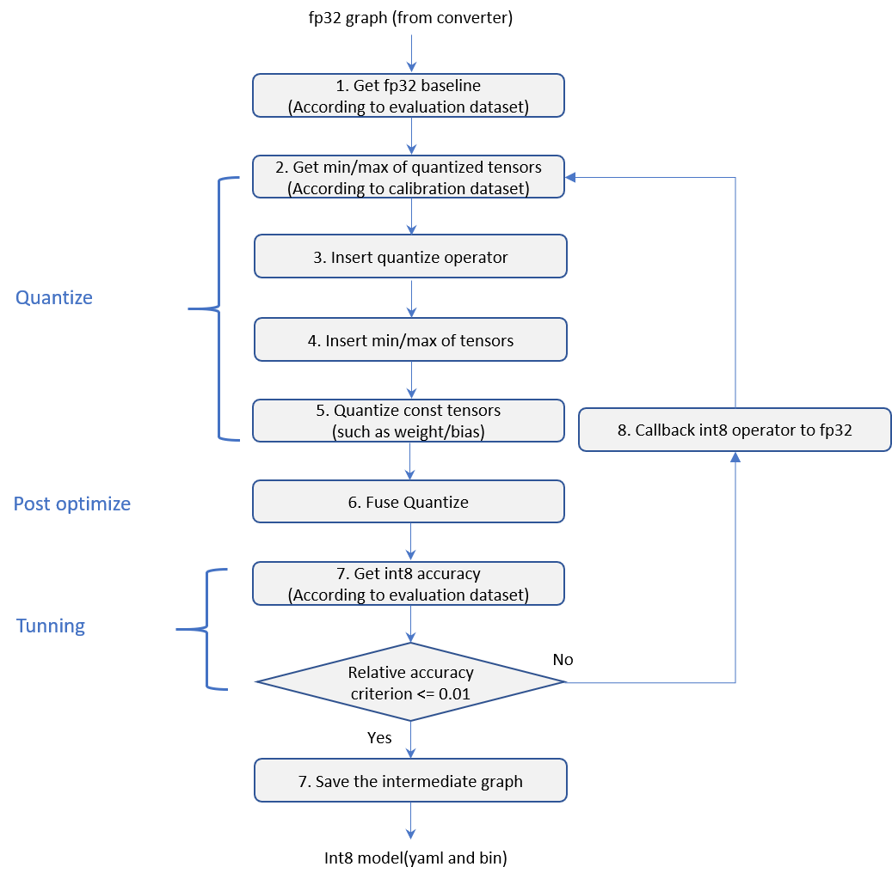
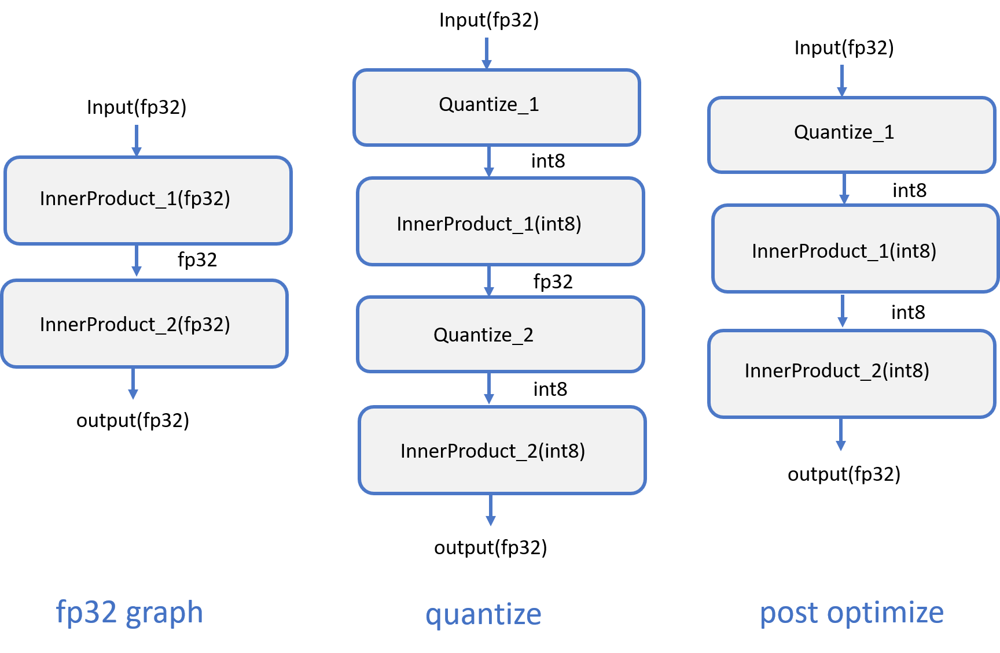

# Quantize a tensorflow model to engine low precision/int8 IR

## Design
Quantizing a tensorflow model to engine low precision/int8 IR has two steps: 1. Convert tensorflow model to engine float IR; 2. Quantize float IR to low precision/int8 IR. The first step will be finished in engine compile. We focus on the second step how to quantize a float engine IR to low precision IR in INC. The whole is in examples/engine/nlp/bert_base_mrpc.

## Prerequisite
### Install environment
```shell
cd <nc_folder>/examples/deepengine/nlp/bert_base_mrpc
conda create -n <env name> python=3.7
conda activate <env name>
pip install 1.15.0 up2 from links below:
https://storage.googleapis.com/intel-optimized-tensorflow/intel_tensorflow-1.15.0up2-cp37-cp37m-manylinux2010_x86_64.whl
pip install -r requirements.txt
```
### Prepare Dataset
```python
python prepare_dataset.py --tasks='MRPC' --output_dir=./data
```
### Prepare Tensorflow model (pb)
```shell
bash prepare_model.sh --dataset_location=./data --output_dir=./model
```

## Tuning and benchmark
### Tune the low precision model
The process of converting a float model to a low precision model in INC is called tuning.
The whole workflow is as follow:  Now the const tensor has symmetric quantization mode, and it also has per channel and per tensor two modes. Activation tensor has asymmetric and symmetric two modes.
And there is a simple example to show how float model tuned to low precision model, like this 
It quantizes the all int8 operators by calibration dataset. In order to meet the accuracy requirements, it will run low precision models and determine whether the relative accuracy between low precision model with float model is within the limited range. If not, it will recall some int8 operators to float. So the object quantizer need dataset, model and metric.
```python
from neural_compressor.experimental import Quantization, common
ds = TF_BERTDataSet(args.data_dir, args.vocab_file, args.do_lower_case)
quantizer = Quantization(args.config)
quantizer.model = args.input_model
quantizer.eval_dataloader = common.DataLoader(ds, args.batch_size)
quantizer.calib_dataloader = common.DataLoader(ds, args.batch_size)
q_model = quantizer.fit()
q_model.save(args.output_model)
```
There are several build-in metrics in INC. In this example, MRPC is used and configured in bert.yaml:
```shell
evaluation:
  accuracy:
    metric:
      GLUE:
        task: mrpc
```

### Benchmark the tuned low precision model:
User can also run tuned low precision model on benchmark dataset and get the accuracy and performance of it by configuring mode=accuracy or mode=performance.
```python
from neural_compressor.experimental import Benchmark, common
ds = TF_BERTDataSet(args.data_dir, args.vocab_file, args.do_lower_case)
evaluator = Benchmark(args.config)
evaluator.model = args.input_model
evaluator.b_dataloader = common.DataLoader(ds, args.batch_size)
evaluator(args.mode)
```

### Config for tuning and benchmark:
The yaml can config sampling size of calibration dataset for quantization. And the accuracy criterion is generally 1% relative error. Or if you only want to quantize but no callback, you can set timeout to 1 for tuning exit policy.
```shell
quantization:
  calibration:
    sampling_size: 40

tuning:
  accuracy_criterion:
    relative: 0.01
  exit_policy:
    timeout: 0
  random_seed: 9527
```

And if you want to get performance, setting num of instance and cores per instance according to your device is needed. In addition, don't remember to set warmup and iteration. It's better if warmup is more than 5 and iteration is more than 10.
```shell
  performance:
    warmup: 5
    iteration: 10
    configs:
      num_of_instance: 1
      cores_per_instance: 28
```

Each model has its own metric to get accuracy. INC also provides some metrics for users and you only need to set task in yaml as follows:
```shell
evaluation:
  accuracy:
    metric:
      GLUE:
        task: mrpc
```

## Run tuning and benchmark
Users can run shell to tune model and get its accuracy and performance.
### 1. To get the tuned model and its accuracy:
```shell
bash run_tuning.sh --config=bert.yaml --input_model=roberta_base_mrpc.onnx --output_model=ir --dataset_location=data
```

### 2. To get the benchmark of tuned model:
```shell
bash run_benchmark.sh --config=bert.yaml --input_model=ir --dataset_location=data --batch_size=1 --mode=accuracy
```

```shell
bash run_benchmark.sh --config=bert.yaml --input_model=ir --dataset_location=data --batch_size=1 --mode=performance
```
