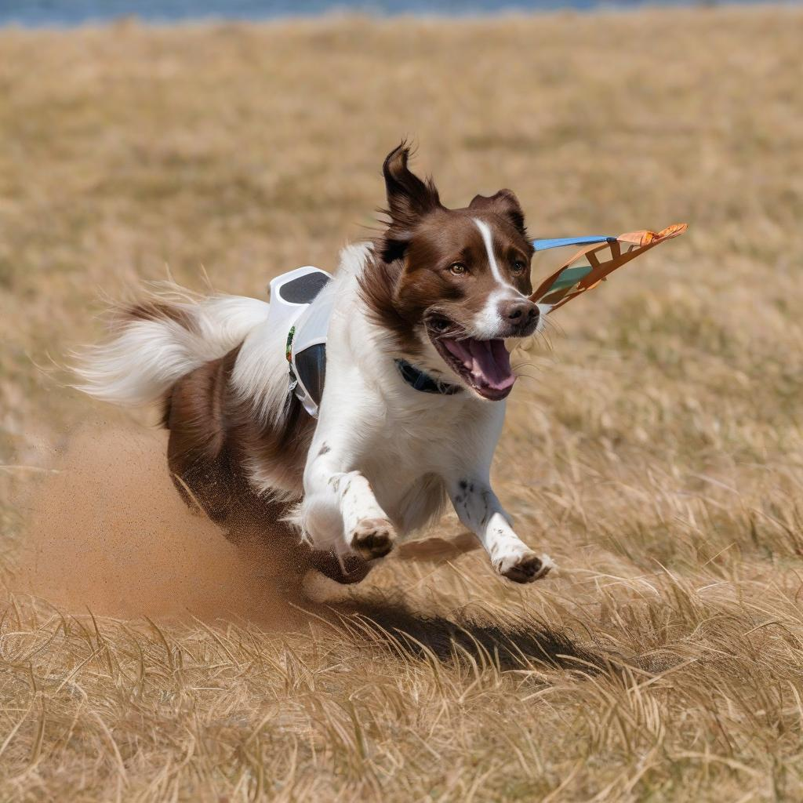
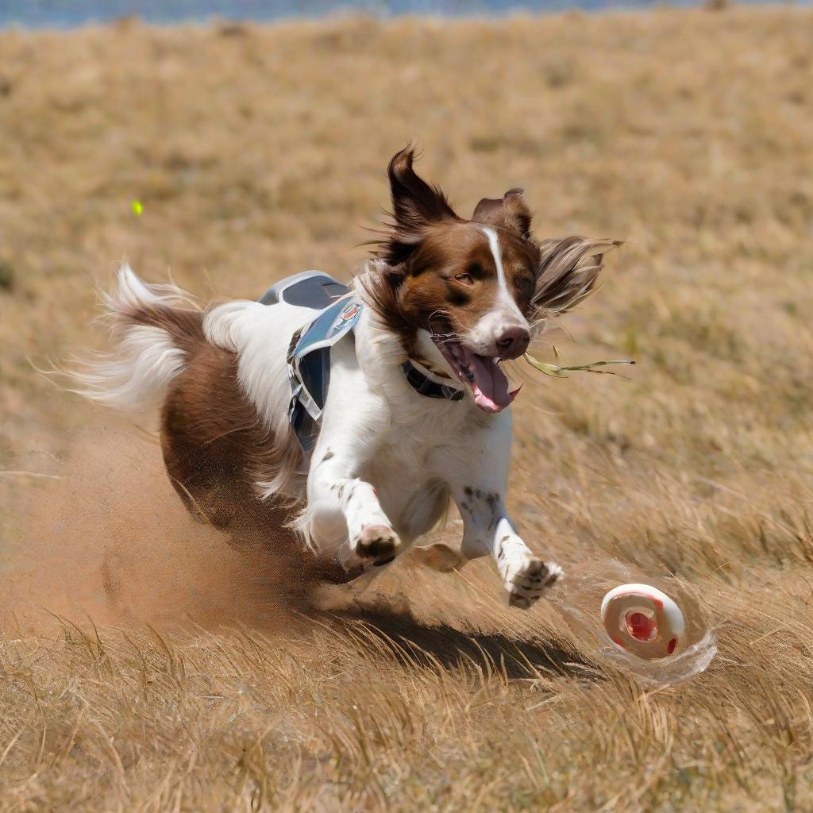

Step-by-Step
============
This document describes the step-by-step instructions to run [stable diffusion XL model](https://huggingface.co/stabilityai/stable-diffusion-xl-base-1.0) using Smooth Quantization to accelerate inference while maintain the quality of output image.

# Prerequisite

## Environment
Recommend python 3.9 or higher version.

```shell
pip install -r requirements.txt
```
**Note**: IPEX along with torch require nightly version (2.4) for compatibility. Please refer to [installation](https://intel.github.io/intel-extension-for-pytorch/index.html#installation?platform=cpu&version=main&os=linux%2fwsl2&package=source). 

# Run

To quantize the model:
```bash
python sdxl_smooth_quant.py --model_name_or_path stabilityai/stable-diffusion-xl-base-1.0 --quantize --alpha 0.44 --output_dir "./saved_results"
```
or
```bash
sh run_quant.sh --alpha=0.44
```
To load a quantized model:
```bash
python sdxl_smooth_quant.py --model_name_or_path stabilityai/stable-diffusion-xl-base-1.0 --quantize --load --int8
```
or
```bash
sh run_quant.sh --int8=true
```

# Results
## Image Generated

With caption `"A brown and white dog runs on some brown grass near a Frisbee that is just sailing above the ground."`, results of fp32 model and int8 model are listed left and right respectively.

<p float="left">
  
  
</p>

## CLIP evaluation
We have also evaluated CLIP scores on 5000 samples from COCO2014 validation dataset for FP32 model and INT8 model. CLIP results are listed below.

| Precision            | FP32  | INT8  | 
|----------------------|-------|-------|
| CLIP on COCO2014 val  | 32.05 | 31.77 |

We're using the mlperf_sd_inference [repo](https://github.com/ahmadki/mlperf_sd_inference) to evaluate CLIP scores. In order to support evaluation on quantized model,
we made some modification on the script (`main.py`). Please use as following:
```bash
git clone https://github.com/ahmadki/mlperf_sd_inference.git
cd mlperf_sd_inference
mv ../main.py ./
```
After setting the environment as instructed in the repo, you can execute the modified `main.py` script to generate images:
```bash
python main.py \
    --model-id stabilityai/stable-diffusion-xl-base-1.0 \
    --quantized-unet ./saved_results \  # quantized model saving path, should include `qconfig.json` and `quantized_model.pt`
    --precision fp32 \ 
    --guidance 8.0 \
    --steps 20 \
    --iters 200 \  # change to 5000 for the full 5k dataset
    --latent-path latents.pt \
    --base-output-dir ./output
```
Then you can compute CLIP score using the images generated by the quantized model:
```bash
mv ./output/stabilityai--stable-diffusion-xl-base-1.0__euler__20__8.0__fp32/* ./output/  # switch directory
rm -rf ./output/stabilityai--stable-diffusion-xl-base-1.0__euler__20__8.0__fp32/

python clip/clip_score.py \
    --tsv-file captions_5k.tsv \
    --image-folder ./output \  # folder with the generated images
    --device "cpu"     
```
Or you can use the bash script for all steps above:
```bash
sh run_benchmark.sh --mode=accuracy --int8=true
```
