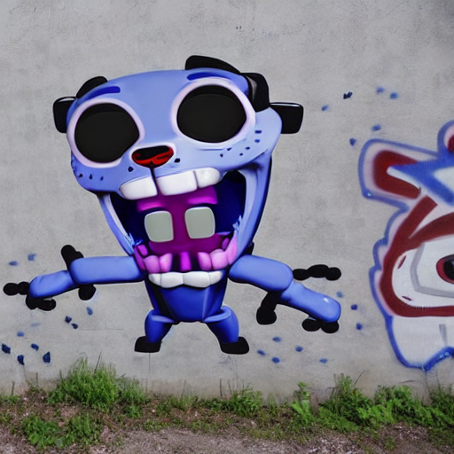

## A example using Textual Inversion method to personalize text2image

**note**: the example is integrating INC in progress.

[Textual inversion](https://arxiv.org/abs/2208.01618) is a method to personalize text2image models like stable diffusion on your own images._By using just 3-5 images new concepts can be taught to Stable Diffusion and the model personalized on your own images_
The `textual_inversion.py` script shows how to implement the training procedure and adapt it for stable diffusion.

### Installing the dependencies

Before running the scripts, make sure to install the library's training dependencies:

```bash
pip install -r requirements.txt
```

### Nezha cartoon example

You need to accept the model license before downloading or using the weights. In this example we'll use model version `v1-4`, so you'll need to visit [its card](https://huggingface.co/CompVis/stable-diffusion-v1-4), read the license and tick the checkbox if you agree.

You have to be a registered user in 🤗 Hugging Face Hub, and you'll also need to use an access token for the code to work. For more information on access tokens, please refer to [this section of the documentation](https://huggingface.co/docs/hub/security-tokens).

Run the following command to authenticate your token

```bash
huggingface-cli login
```

If you have already cloned the repo, then you won't need to go through these steps.

<br>

Now let's get our dataset. We just use one picture which is from the huggingface datasets [sd-concepts-library/youtooz-candy](https://huggingface.co/sd-concepts-library/youtooz-candy), and save it to the `./youtooz_candy` directory. The picture show below:


#### finetune with CPU using IPEX

The following script shows how to use CPU with BF16 

```bash
export MODEL_NAME="CompVis/stable-diffusion-v1-4"
export DATA_DIR="./youtooz_candy"

# add use_bf16
python textual_inversion_ipex.py \
  --pretrained_model_name_or_path=$MODEL_NAME \
  --train_data_dir=$DATA_DIR \
  --learnable_property="object" \
  --placeholder_token="youtooz_candy" --initializer_token="toy" \
  --resolution=512 \
  --train_batch_size=1 \
  --gradient_accumulation_steps=4 \
  --use_bf16 \
  --max_train_steps=3000 \
  --learning_rate=5.0e-04 --scale_lr \
  --lr_scheduler="constant" \
  --lr_warmup_steps=0 \
  --output_dir="youtooz_candy_model"
```

#### finetune with GPU using accelerate

Initialize an [🤗Accelerate](https://github.com/huggingface/accelerate/) environment with:

```bash
accelerate config
```

And launch the training using

```bash
export MODEL_NAME="CompVis/stable-diffusion-v1-4"
export DATA_DIR="./youtooz_candy"

accelerate launch textual_inversion.py \
  --pretrained_model_name_or_path=$MODEL_NAME \
  --train_data_dir=$DATA_DIR \
  --learnable_property="object" \
  --placeholder_token="youtooz_candy" --initializer_token="toy" \
  --resolution=512 \
  --train_batch_size=1 \
  --gradient_accumulation_steps=4 \
  --max_train_steps=3000 \
  --learning_rate=5.0e-04 --scale_lr \
  --lr_scheduler="constant" \
  --lr_warmup_steps=0 \
  --output_dir="youtooz_candy_model"
```


### Inference

Once you have trained a model using above command, the inference can be done simply using the `StableDiffusionPipeline`. Make sure to include the `placeholder_token` in your prompt.

```python
from diffusers import StableDiffusionPipeline
import torch

model_id = "youtooz_candy_model"

# use cpu (FP32 by default; low precision coming soon)
pipe = StableDiffusionPipeline.from_pretrained(model_id, torch_dtype=torch.float)

# use gpu
#pipe = StableDiffusionPipeline.from_pretrained(model_id, torch_dtype=torch.float16).to("cuda")

prompt = "a graffiti in a wall with a youtooz_candy on it"

image = pipe(prompt, num_inference_steps=50, guidance_scale=7.5).images[0]

image.save("./generated_images/graffiti.png")
```

Here is a sample image generated by the fine-tuned model:



