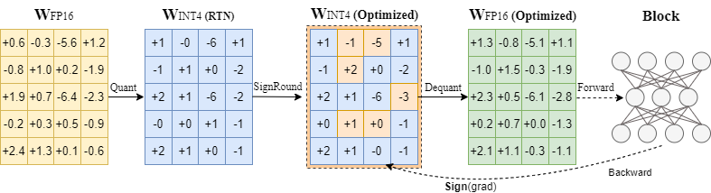

This is a sample code for SignRound ([arxiv](https://arxiv.org/abs/2309.05516)), which currently only supports LlaMa, OPT, and BLOOM models. We will provide a unified API that will support a broader range of models in Intel Neural Compressor.




# Prerequisite
python 3.9 or higher 

pip install -r requirements.txt


# Run

```bash
CUDA_VISIBLE_DEVICES=0  python3 signround.py --model_name facebook/opt-125m --amp --num_bits 4 --group_size -1 --seqlen 512
```

To optimize GPU memory usage, you can enable the "low_gpu_mem_usage" option. Additionally, you can reduce the training batch size (train_bs) and increase the gradient_accumulate_steps accordingly.

```bash
CUDA_VISIBLE_DEVICES=0 python3 signround.py --model_name facebook/opt-125m --amp --num_bits 4 --group_size -1 --seqlen 512 --low_gpu_mem_usage --train_bs 1 --gradient_accumulate_steps 8
```
## Known issue
To address the original lambada evaluation bug in the old version of lm-eval, we have incorporated the lm-eval from intel extension for transformers(ITREX). This discrepancy may lead to certain variations.

To reproduce our results in the paper, please install ITREX 

```bash
pip install intel-extension-for-transformers
```
## Reference
If you find SignRound useful or relevant to your research, please kindly cite our paper

```
@article{cheng2023optimize,
  title={Optimize Weight Rounding via Signed Gradient Descent for the Quantization of LLMs},
  author={Cheng, Wenhua and Zhang, Weiwei and Shen, Haihao and Cai, Yiyang and He, Xin and Lv, Kaokao},
  journal={arXiv preprint arXiv:2309.05516},
  year={2023}
}
```

