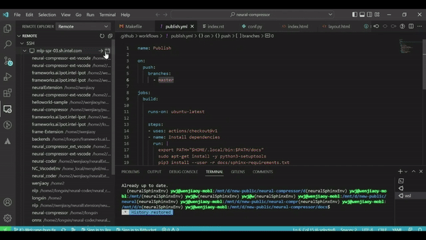
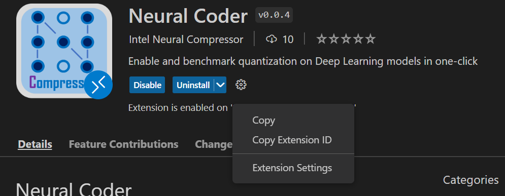
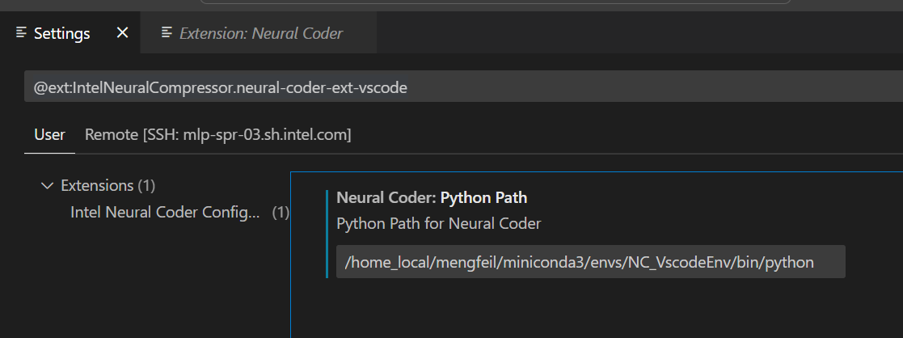
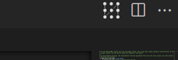
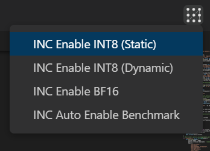
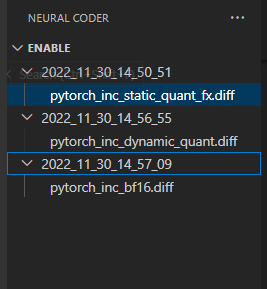
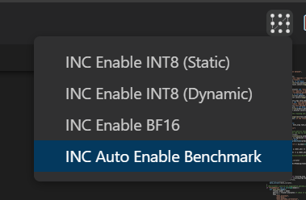
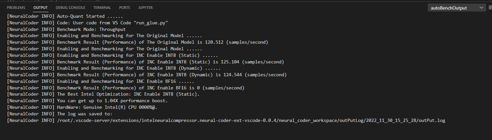
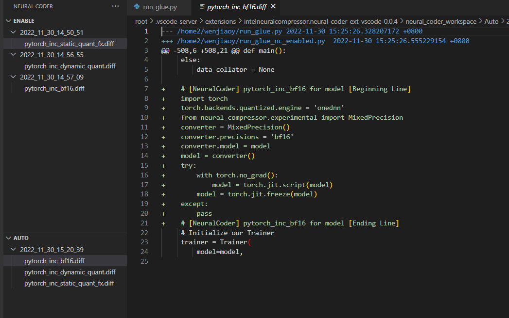

Neural Coder
=======================
Neural Coder, a novel component under **Intel® Neural Compressor** to further simplify the deployment of DL models via **one-click** automated code changes for device compatibility and optimization enabling, has also enabled its extension service in VS Code to further simplify the usage for general programmers that use VS Code as a daily application.

   
  

[Neural Coder](https://marketplace.visualstudio.com/items?itemName=IntelNeuralCompressor.neural-coder-ext-vscode) is an [open-source](https://github.com/intel/neural-compressor/tree/master/neural_coder) extension for [Visual Studio Code](https://code.visualstudio.com).

# Background Introduction
## Intel® Neural Compressor
Intel® Neural Compressor is an open-source Python library for model compression that reduces the model size and increases DL inference performance on CPUs or GPUs. It supports post-training static and dynamic quantization of PyTorch models. It supports automatic accuracy-driven tuning strategies for users to easily generate quantized model. The users can easily apply static, dynamic and aware-training quantization approaches while giving an expected accuracy criteria.
## Neural Coder
Neural Coder is a novel component under Intel® Neural Compressor to further simplify the deployment of DL models via one-click automated code changes for device compatibility and optimization enabling. Subsequently, Neural Coder can perform automated benchmark on all optimization approaches and evaluate for the best out-of-box optimized performance. Neural Coder uses static program analysis and heuristics to help users take advantage of Intel DL Boost and hardware features to improve performance. This one-click enabling boosts developer productivity while making it easier to take advantage of acceleration.
## Neural Coder Extension in VSCode
VS Code users can leverage Neural Coder's extension to perform **automatic quantization and benchmark evaluation** for Deep Learning models.

 

  

# Neural Coder Extension Usage
We provide here a detailed step-by-step guide on using Neural Coder extension in VS Code:
 

  

### 1. Open 
Open VS Code Extension and link to a remote Linux-based server via SSH since Neural Coder requires a Linux-based environment.

> If you're using VS Code on a Linux-based machine, then this step is not needed.

### 2. Search 
Search for Neural Coder extension in VS Code extension market:

Simply enter "Neural Coder" in the search box of the extension market to find the extension package. 

You will be able to find the icon below, and then just click "Install". (Note: The extension installation location should be a SSH remote server to which you are connected, assuming your VS Code is Windows-based.)

Once the installation is done, it will display that the extension is installed and enabled on your machine, and you're also able to disable it or uninstall it in case you need to.

### 3. Setting
Click the "Extension Settings" tab of the setting button on the right and fill in the path of Python you want to run.
- Click the "Extension Settings" tab

- fill in the path 

### 4. Icon
Open your code for the Deep Learning model that you want to quantize and evaluate. 

You can see a new icon appear to the upper right, and also a left sidebars for the purpose of displaying operation history. 
Hover over and see that it's a Neural Coder's icon.
- The icon of Neural Coder extension

- The history panel of Neural Coder

### 5. optimization (quantization)
Click the Neural Coder button at the top right and select the optimization (quantization) you want to conduct on your Deep Learning code.
#### 5.1 Enable
Select "INC Enable INT8 (Static)", "INC Enable INT8 (Dynamic)", or "INC Enable BF16"

Wait for the progress bar. You will see that the quantization has been enabled into your Deep Learning code:

The history of Neural Coder enabling that you have conducted will appear in the history panel, in the form of patch files, and you can easily track back to see how the quantization enabling is done by Neural Coder for your code at a specific time point:

- The history of Neural Coder enabling that you have conducted

- A specific Neural Coder enabling as a patch file

#### 5.2 Auto
Select "INC Auto Enable Benchmark"

Enter the Python code execution parameters (argparse) for the current code:

An "Output" panel will pop up below, displaying the enabling and benchmark results for the current Deep Learning code:

The "Auto" section in the history panel keeps the patch file (.diff) for each optimization within this benchmark execution:

Also click to view patch result:

