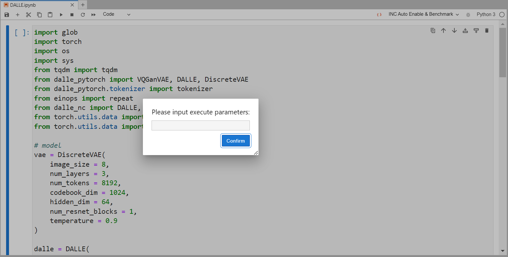
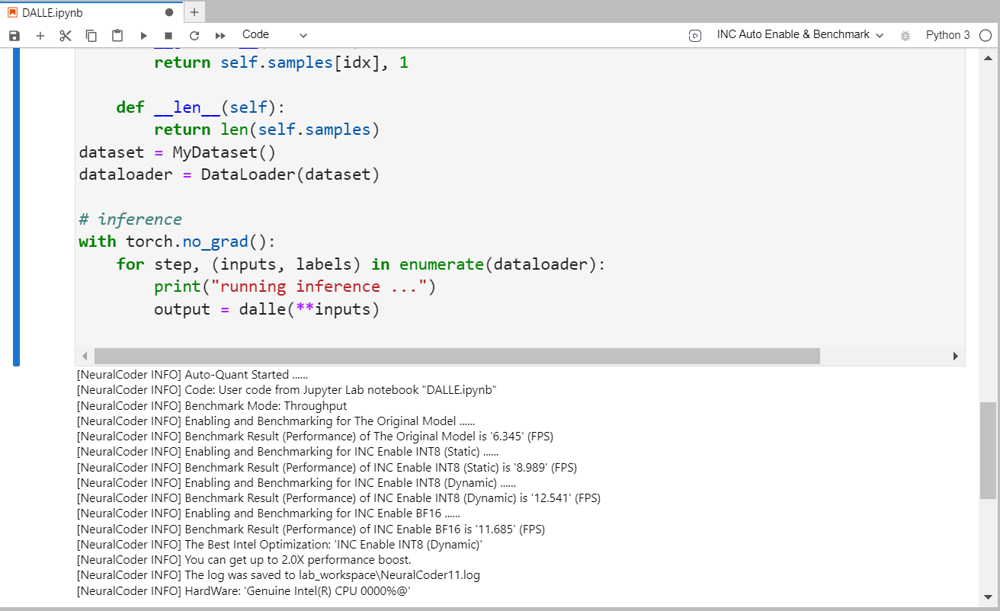

Neural Compressor as JupyterLab Extension
===========================
A JupyterLab Extension library supporting Neural Coder, a novel feature powered by Intel® Neural Compressor to further simplify performance optimizations of Deep Learning models.

## Installation

**Installation on Linux**
```Shell
# To install the extension, execute:
pip install neural_compressor_ext_lab
# To install alibaba-blade version, execute:
pip install neural_compressor_ext_lab_alibaba
```
## Getting Started

**Access Jupyter Lab remotely using SSH**

* Launch the Jupyter Lab service on the remote server:
```bash
jupyter lab --no-browser --port=8889
```
* Start SSH in a local terminal:
```bash
ssh -N -f -L localhost:8888:localhost:8889 username@serverIP
```
**Access Jupyter Lab locally**
```bash
jupyter lab
```
**Jupyter Front-End** 

* As shown in the drop-down list, supported features include INC Enable INT8(Static), INC Enable INT8(Dynamic), INC Enable BF16, and INC Auto Enable & Benchmark. The first three features enable specific quantization features into DL scripts. The last feature automatically enables all quantization features on a PyTorch model script and automatically evaluates the best performance on the model. It is a code-free solution that can help users enable quantization algorithms on a PyTorch model with no manual coding needed.

 

* Click the run button at the left side of the drop-down list to start. After finishing, you can see the code changes for specific optimization enabling as shown in the figure below.


* The last option requires you to enter additional parameters needed to run the DL script.
 
 
 
* In the output area below the code cell, you can see the execution progress of automatic quantization.

 
 
* After finishing, you can see the code changes for best-performing optimization enabling.

 

**neural_compressor_ext_lab_alibaba**

It is a subversion dedicated to support Alibaba Blade-DISC, similar in installation and usage to the one mentioned above.
