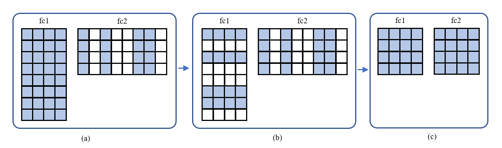

Auto Slim
============

1. [Introduction](#introduction)

    - [Channel Pruning and Model Slim](#channel-pruning-and-model-slim)

    - [Feed Forward Network Slim](#feed-forward-network-slim)

    - [Multi-head Attention Slim (Experimental)](#multi-head-attention-slim-experimental)

2. [API for Auto Slim](#api-for-auto-slim)

3. [Run Examples](#run-examples)

## Introduction

### Channel Pruning and Model Slim

  Channel-wise pruning means removing less salient channels on feature maps and it could directly shrink feature map widths. Users could set a channelx1 (or 1xchannel) pruning pattern to use this method.
  
  An interesting thing is that if we do channel-wise pruning for some layers in NLP models, we can permanently remove these all-zero channels without changing their accuracy. By applying this method to Transformer based models, including GPT, BERT and other large language models, users can obtain acceleration in inference.

  Based on this logic, we have developed **Model Slim** method, this method aims at optimizing Transformer's both two main modules: **multi-head attention** modules and **feed forward networks**. This leads to a promising application of Since these two modules take most computing overheads in the entire model, users can slim models and obtain inference speed gain without deploying them with particular hardware-aware repos. Plus, we have already verified that after applying model slim in some Transformer models, their inference speed and total size can be significantly improved. 

### Feed Forward Network Slim

  Feed forward network mainly consists two consecutive linear layers. We conduct the input channel pruning for the second linear layer (masking weights by column). We can remove these all-zero channels. Plus, we also remove the same indices' output channels in the first linear layers (masking weights by row), since their contribution for activation will be masked by the second layer's. 

<div align=center>
<a target="_blank" href="./imgs/auto_slim_feed_forward_network.png">
    
</a>
</div>

  The figure above shows how we execute the slim process for feed forward networks. In three sub-figures, **row number and column number refers to output channels and input channels respectively**. (a) shows a feed forward network's initial status with the second linear layer's input channel pruned. (b) shows projecting the sparse channel indices to the first layer's output channels. The channel with same index takes the same color, and white channels means their weights are pruned to be zero. Finally, in (c), we remove sparse channel in both linear layers and obtain two dense linear layers. 

  This leads to no change for model's accuracy, but can obtain a significant acceleration for model's inference, because the transformer models' feed forward network parts take nearly 50% of entire computing overhead. Thus, compressing weights in feed forward network is really useful.

### Multi-head Attention Slim

  Self attention modules are common in all Transformer-based models. These models use multi-head attention to enhance their abilities of linking contextual information. Transformer-based models usually stack a sequence of multi-head attention modules, and they take great storage and memory bandwidth. As an optimization method, head pruning removes attention heads which make minor contribution to model's contextual analysis. This method does not lead to much accuracy loss, but provides us with much opportunity for model acceleration.

## API for Auto Slim

  Since feed forward networks and multi-head attention modules share similar structures in difference models, it would be more convenient if we can locate them automatically and execute the model slim schemes respectively. We provide API functions for you to complete the process above and slim your transformer models easily. Here is how to call our API functions. Simply provide a target sparsity value to our Our API function parse_auto_slim_config and it can generate the pruning_configs used by our pruning API. Such process is fully automatic and target multi-head attention layers will be included without manual setting. After pruning process finished, use API function model_slim to slim the model.
  
  Since head pruning slim process is still under refinement progress, its auto slim function is limited. We will update its function right away.

```python
# auto slim config
# part1 generate pruning configs for the second linear layers.
pruning_configs = []
from neural_compressor.compression.pruner import parse_auto_slim_config

auto_slim_configs = parse_auto_slim_config(model, multi_head_attention_sparsity, feed_forward_sparsity)
pruning_configs += auto_slim_configs

################
"""
# Training codes.
......
"""
################

from neural_compressor.compression.pruner import model_slim

model = model_slim(model)
```

## Run Examples

We have provided BERT-Base examples for both and feed forward networks and multi-head attention modules to explicit our slim potential and obtain best acceleration performance. Please follow this(../../../../examples/pytorch/nlp/huggingface_models/question-answering/model_slim/). More examples related to popular large language models will be included right away.
