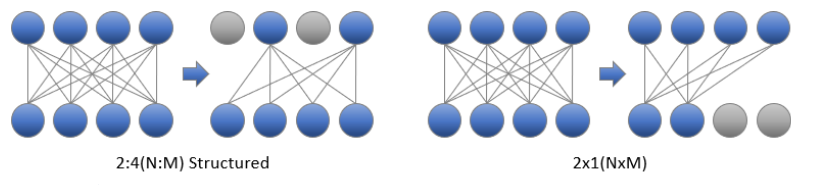
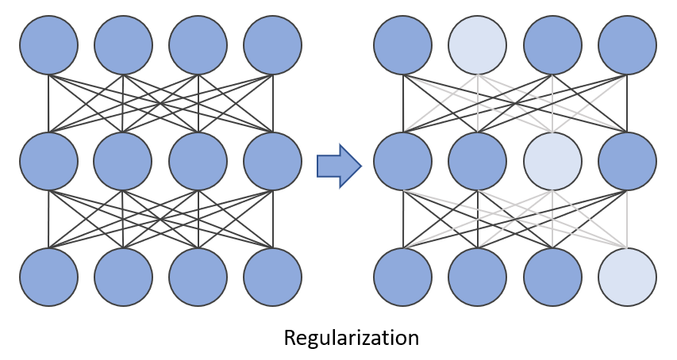

Pruning
============


1. [Introduction](#introduction)


>>>[Neural Network Pruning](#neural-network-pruning)


>>>[Pruning Patterns](#pruning-patterns)


>>>[Pruning Criteria](#pruning-criteria)


>>>[Pruning Schedule](#pruning-schedule)


>>>[Pruning type](#pruning-type)


>>>[Regularization](#regularization)


2. [Get Started With Pruning API](#get-started-with-pruning-api)


3. [Examples](#examples)


4. [Citation](#citation)


## Introduction


### Neural Network Pruning
Neural network pruning is a promising model compression technique that removes the least important parameters/neurons in the network and achieves compact architectures with minimal accuracy drop and maximal inference acceleration. As state-of-the-art model sizes have grown at an unprecedented speed, pruning has become increasingly crucial for reducing the computational and memory footprint that huge neural networks require.

<div align=center>
<a target="_blank" href="./../../docs/source/_static/imgs/pruning/pruning.PNG">
    
</a>
</div>


### Pruning Patterns


Pruning patterns defines the rules of pruned weights' arrangements in space. INC currently supports unstructured, N:M and NxM patterns. Please note that N:M pattern is applied to input channels while NxM pattern is applied to output ones. [Details](../../docs/source/pruning_details.md#pruning-patterns).

<div align=center>
<a target="_blank" href="./../../docs/source/_static/imgs/pruning/Pruning_patterns.PNG">
    
</a>
</div>

### Pruning Criteria


Pruning Criteria determines how should the weights of a neural network be scored and pruned. In the image below, pruning scores are represented by neurons' color and those with the lowest scores are pruned. The magnitude and gradient are widely used to score the weights. Currently, INC supports **magnitude**, **gradient**, **snip** and **snip_momentum** criteria. [Details](../../docs/source/pruning_details.md#pruning-criteria).

<div align=center>
<a target="_blank" href="./../../docs/source/_static/imgs/pruning/pruning_criteria.PNG">
    
</a>
</div>

### Pruning Schedules


Pruning schedule defines the way the model reach the target sparsity (the ratio of pruned weights). Both **one-shot** and **iterative** pruning schedules are supported. [Details](../../docs/source/pruning_details.md#pruning-schedule).

<div align=center>
<a target="_blank" href="./../../docs/source/_static/imgs/pruning/Pruning_schedule.PNG">
    
</a>  
</div>


### Pruning Types


Pruning type defines how the masks are generated and applied to a neural network. Both **pattern_lock** and **progressive** types are supported by INC. [Details](../../docs/source/pruning_details.md#pruning-type).


### Regularization


Regularization is a technique that discourages learning a more complex model and therefore performs variable-selection. In the image below, some weights are pushed to be as small as possible and the connections are thus sparsified. **Group-lasso** method is used in INC. 
[Details](../../docs/source/pruning_details.md#regularization).

<div align=center>
<a target="_blank" href="./../../docs/source/_static/imgs/pruning/Regularization.PNG">
    
</a>
</div>


## Get Started with Pruning API


Neural Compressor `Pruning` API is defined under `neural_compressor.pruning`, which takes a user defined yaml file as input. 
Users can pass the customized training/evaluation functions to `Pruning` in various scenarios. 

In this case, pruning process can be done by pre-defined hooks in Neural Compressor. Users need to place those hooks inside the training function. The pre-defined Neural Compressor hooks are listed below.


```
on_train_begin() : Execute at the beginning of training phase.
on_epoch_begin(epoch) : Execute at the beginning of each epoch.
on_step_begin(batch) : Execute at the beginning of each batch.
on_step_end() : Execute at the end of each batch.
on_epoch_end() : Execute at the end of each epoch.
on_before_optimizer_step() : Execute before optimization step.
on_after_optimizer_step() : Execute after optimization step.
```


The following section is an example of how to use hooks in user pass-in training function to perform BERT training. Our pruning API supports multiple pruner objects in a single Pruning object, which means we can apply different pruning configurations for different layers in a model. Since these pruning configurations share the same parameter names, we introduce a global-local configuration structure to initialize a Pruning object. First, we set up a dict-like local_config, which refers to some unique configurations for specific pruners. Afterwards, we pass this local_config dict and common configurations for all pruners (known as "global setting") to Pruning's initialization function. Below is code example for how to utilize our global-local configuration method to initialize a Pruning object.


```python
from neural_compressor.pruning import Pruning
from neural_compressor.config import WeightPruningConfig

config = WeightPruningConfig(
    local_configs,  # An example of local_configs is shown below.
    target_sparsity=0.8, start_step=1, end_step=10, pruning_frequency=1
)
prune = Pruning(config)
prune.model = model
prune.on_train_begin()
for epoch in range(num_train_epochs):
    model.train()
    prune.on_epoch_begin(epoch)
    for step, batch in enumerate(train_dataloader):
        prune.on_step_begin(step)
        outputs = model(**batch)
        loss = outputs.loss
        loss.backward()
        prune.on_before_optimizer_step()
        optimizer.step()
        prune.on_after_optimizer_step()
        scheduler.step()  # Update learning rate schedule
        model.zero_grad()
        prune.on_step_end()
    prune.on_epoch_end()
...
```

```python
local_configs = [{
            'target_sparsity': 0.9,  # Target sparsity ratio of modules.
            'pruning_type': "snip_momentum", # Default pruning type.
            'pattern': "4x1",  # Default pruning pattern.
            'op_names': ['layer1.*'],  # A list of modules that would be pruned.
            'excluded_op_names': ['layer3.*'],  # A list of modules that would not be pruned.
            'start_step': 0, # Step at which to begin pruning.
            'end_step': 10, # Step at which to end pruning.
            'pruning_scope': "global", # Default pruning scope.
            'pruning_frequency': 1, # Frequency of applying pruning.
            'min_sparsity_ratio_per_op': 0.0,  # Minimum sparsity ratio of each module.
            'max_sparsity_ratio_per_op': 0.98, # Maximum sparsity ratio of each module.
            'sparsity_decay_type': "exp", # Function applied to control pruning rate. 
            'pruning_op_types': ['Conv', 'Linear'], # Types of op that would be pruned.
        }]
```


## Examples


We validate the pruning technique on typical models across various domains (including CV and NLP) and the examples are listed in [Pruning Examples](../../docs/source/pruning_details.md#examples). A complete overview of validated examples including quantization, pruning and distillation results could be found in  [INC Validated examples](../../docs/source/validated_model_list.md#validated-pruning-examples).


Please refer to pruning examples [PyTorch](../../examples/README.md#Pruning-1)) for more information.


## Citation