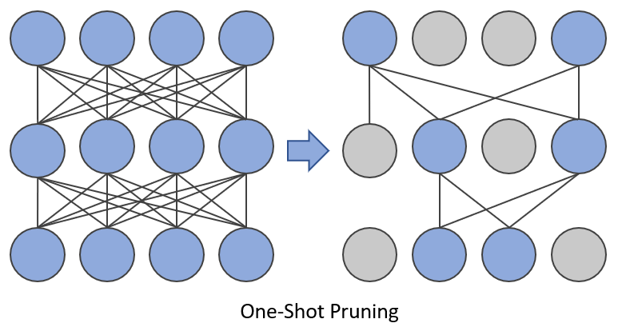
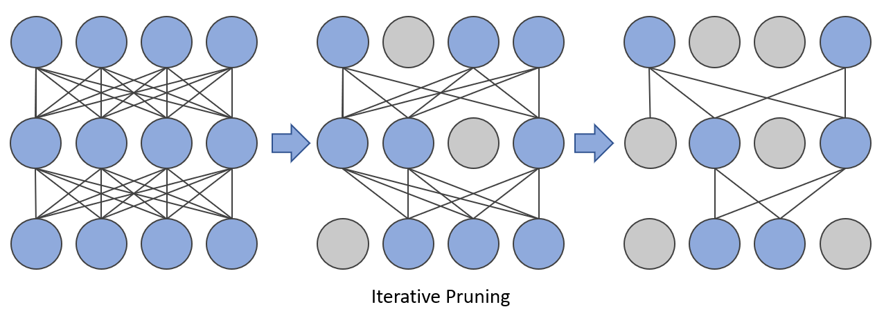

Pruning
============


1. [Introduction](#introduction)


    1.1. [Neural Network Pruning](#neural-network-pruning)


    1.2. [Pruning Patterns](#pruning-patterns)


    1.3. [Pruning Criteria](#pruning-criteria)


    1.4. [Pruning Schedule](#pruning-schedule)


    
    1.5. [Regularization](#regularization)


2. [Pruning Support Matrix](#pruning-support-matrix)


3. [Get Started With Pruning API](#get-started-with-pruning-api)


4. [Examples](#examples)


## Introduction


### Neural Network Pruning
Neural network pruning is a promising model compression technique that removes the least important parameters in the network and achieves compact architectures with minimal accuracy drop and maximal inference acceleration. As state-of-the-art model sizes have grown at an unprecedented speed, pruning has become increasingly crucial for reducing the computational and memory footprint that huge neural networks require.
A detailed explanation of pruning technique and results could be found in  [Pruning details](../../docs/source/pruning_details.md#introduction).

<a target="_blank" href="./../../docs/source/_static/imgs/pruning/pruning.PNG">
    
</a>


### Pruning Patterns


Pruning patterns defines the rules of pruned weights' arrangements in space. INC currently supports unstructured, N:M pruning and blockwise patterns. [Details](../../docs/source/pruning_details.md#pruning-patterns).

<a target="_blank" href="./../../docs/source/_static/imgs/pruning/Pruning_patterns.PNG">
    
</a>


### Pruning Criteria


Pruning Criteria determines how should the weights of a neural network be scored and pruned. In the image below, pruning scores are represented by neurons' color and those with the lowest scores are pruned. The magnitude and gradient are widely used to score the weights. Currently, INC supports magnitude, snip and snip_momentum criteria. [Details](../../docs/source/pruning_details.md#pruning-criteria).

<a target="_blank" href="./../../docs/source/_static/imgs/pruning/pruning_criteria.PNG">
    
</a>


### Pruning Schedule


Pruning schedule defines the way the model reach the target sparsity (the ratio of pruned weights). Both one-shot and iterative pruning schedules are supported. [Details](../../docs/source/pruning_details.md#pruning-schedule).

- One-shot Pruning

<a target="_blank" href="./../../docs/source/_static/imgs/pruning/oneshot_pruning.PNG">
    
</a>

- Iterative Pruning

<a target="_blank" href="./../../docs/source/_static/imgs/pruning/iterative_pruning.PNG">
    
</a>


### Regularization


Regularization is a technique that discourages learning a more complex model and therefore performs variable-selection. In the image below, some weights are pushed to be as small as possible and the connections are thus sparsified. Group-lasso method is used in INC.
[Details](../../docs/source/pruning_details.md#regularization).

<a target="_blank" href="./../../docs/source/_static/imgs/pruning/Regularization.PNG">
    
</a>


## Pruning Support Matrix


<table>
<thead>
  <tr>
    <th>Pruning Type</th>
    <th>Pruning Granularity</th>
    <th>Pruning Algorithm</th>
    <th>Framework</th>
  </tr>
</thead>
<tbody>
  <tr>
    <td rowspan="3">Unstructured Pruning</td>
    <td rowspan="3">Element-wise</td>
    <td>Magnitude</td>
    <td>PyTorch, TensorFlow</td>
  </tr>
  <tr>
    <td>Pattern Lock</td>
    <td>PyTorch</td>
  </tr>
  <tr>
    <td>SNIP with momentum</td>
    <td>PyTorch</td>
  </tr>
  <tr>
    <td rowspan="6">Structured Pruning</td>
    <td rowspan="2">Filter/Channel-wise</td>
    <td>Gradient Sensitivity</td>
    <td>PyTorch</td>
  </tr>
  <tr>
    <td>SNIP with momentum</td>
    <td>PyTorch</td>
  </tr>
  <tr>
    <td rowspan="2">Block-wise</td>
    <td>Group Lasso</td>
    <td>PyTorch</td>
  </tr>
  <tr>
    <td>SNIP with momentum</td>
    <td>PyTorch</td>
  </tr>
  <tr>
    <td rowspan="2">Element-wise</td>
    <td>Pattern Lock</td>
    <td>PyTorch</td>
  </tr>
  <tr>
    <td>SNIP with momentum</td>
    <td>PyTorch</td>
  </tr>
</tbody>
</table>


## Get Started with Pruning API


Neural Compressor `Pruning` API is defined under `neural_compressor.experimental.Pruning`, which takes a user defined yaml file as input. Below is the launcher code of applying the API to execute a pruning process.


```python
from neural_compressor.experimental import Pruning
prune = Pruning('/path/to/user/pruning/yaml')
prune.model = model
model = prune.fit()
```


Users can pass the customized training/evaluation functions to `Pruning` for flexible scenarios. In this case, pruning process can be done by pre-defined hooks in Neural Compressor. Users need to put those hooks inside the training function.


Neural Compressor defines several hooks for users to use:


```
on_epoch_begin(epoch) : Hook executed at each epoch beginning
on_step_begin(batch) : Hook executed at each batch beginning
on_step_end() : Hook executed at each batch end
on_epoch_end() : Hook executed at each epoch end
on_before_optimizer_step() : Hook executed after gradients calculated and before backward
```


Following section shows how to use hooks in user pass-in training function which is part of example from BERT training:


```python
for epoch in range(num_train_epochs):
    model.train()
    prune.on_epoch_begin(epoch)
    for step, batch in enumerate(train_dataloader):
        prune.on_step_begin(step)
        outputs = model(**batch)
        loss = outputs.loss / gradient_accumulation_steps
        loss.backward()
        if (step + 1) % gradient_accumulation_steps == 0:
            prune.on_before_optimizer_step()
            optimizer.step()
            scheduler.step()  # Update learning rate schedule
            model.zero_grad()
        prune.on_step_end()
...
```
In this case, the launcher code is like the following:


```python
from neural_compressor.experimental import Pruning, common
prune = Pruning(args.config)
prune.model = model
prune.train_func = pruning_func
model = prune.fit()
```


## Examples


We validate the sparsity on typical models across different domains (including CV, NLP, and Recommendation System) and the examples are listed below. A complete overview of validated examples including quantization, pruning and distillation result could be found in  [INC Validated examples](../../docs/source/validated_model_list.md#validated-pruning-examples).

<table>
<thead>
  <tr>
    <th>Model</th>
    <th>Dataset</th>
    <th>Pruning Algorithm</th>
    <th>Framework</th>
  </tr>
</thead>

Please refer to pruning examples([TensorFlow](../../examples/README.md#Pruning), [PyTorch](../../examples/README.md#Pruning-1)) for more information.
 
