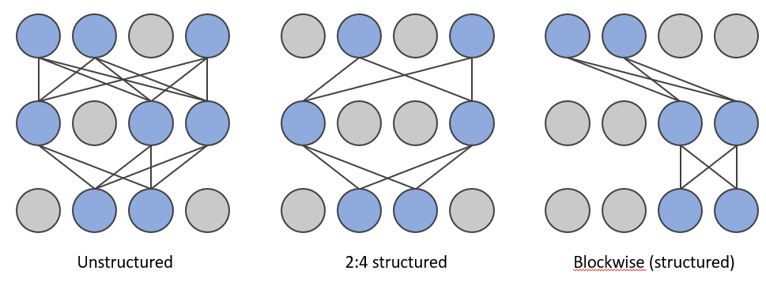

Pruning
============


1. [Introduction](#introduction)


    1.1. [Neural Network Pruning](#neural-network-pruning)


    1.2. [Pruning Patterns](#pruning-patterns)


    1.3. [Pruning Criteria](#pruning-criteria)


    1.4. [Pruning Schedule](#pruning-schedule)


2. [Pruning Support Matrix](#pruning-support-matrix)


3. [Get Started With Pruning API](#get-started-with-pruning-api)


4. [Examples](#examples)


## Introduction


### Neural Network Pruning
Neural network pruning is a promising model compression technique that removes the least important parameters in the network and achieves compact architectures with minimal accuracy drop and maximal inference acceleration. As state-of-the-art model sizes have grown at an unprecedented speed, pruning has become increasingly crucial for reducing the computational and memory footprint that huge neural networks require.
A detailed explanation of pruning technique and results could be found in  [Pruning details](../../docs/source/pruning_details.md#introduction).


<a target="_blank" href="./../../docs/source/_static/imgs/pruning/pruning.PNG">
    
</a>


### Pruning Patterns


Pruning patterns defines the rules of pruned weights' arrangements in space.


<a target="_blank" href="./../../docs/source/_static/imgs/pruning/pruning_pattern.png">
    
</a>


#### Unstructured Pruning


Unstructured pruning means pruning the least salient connections in the model. The nonzero patterns are irregular and could be anywhere in the matrix.


#### Structured Pruning


Structured pruning means pruning parameters in groups and deleting entire blocks, filters, or channels according to some pruning criterions. In general, structured pruning leads to lower accuracy due to restrictive structure compared to unstructured pruning but it can significantly accelerate the model execution as it fits better with hardware designs.


 -  2in4 Pruning


NVIDIA proposed [2:4 sparsity](https://developer.nvidia.com/blog/accelerating-inference-with-sparsity-using-ampere-and-tensorrt/) (or known as "2in4 sparsity") in Ampere architecture; for every 4 continuous elements in a matrix, two of them are zero and others are non-zero.


 -  Block-wise Pruning


Different from 2:4 sparsity above, we propose the block-wise structured sparsity patterns that we are able to demonstrate the performance benefits on existing Intel hardwares even without the support of hardware sparsity. A block-wise sparsity pattern with block size ```S``` means the contiguous ```S``` elements in this block are all zero values.


For a typical GEMM, the weight dimension is ```IC``` x ```OC```, where ```IC``` is the number of input channels and ```OC``` is the number of output channels. Note that sometimes ```IC``` is also called dimension ```K```, and ```OC``` is called dimension ```N```. The sparsity dimension is on ```OC``` (or ```N```).


For a typical Convolution, the weight dimension is ```OC x IC x KH x KW```, where ```OC``` is the number of output channels, ```IC``` is the number of input channels, and ```KH``` and ```KW``` is the kernel height and weight. The sparsity dimension is also on ```OC```.


Here is a figure showing a matrix with ```IC``` = 32 and ```OC``` = 16 dimension, and a block-wise sparsity pattern with block size 4 on ```OC``` dimension.


<a target="_blank" href="./../../docs/source/_static/imgs/pruning/sparse_dim.png">
    
</a>


### Pruning Criteria


Pruning criteria determines how should the weights of a neural network be scored and pruned. The magnitude and gradient are widely used to score the weights.


- Magnitude


  The algorithm prunes the weight by the lowest absolute value at each layer with given sparsity target.


- SNIP


  The algorithm prunes the dense model at its initialization, by analyzing the weights' effect to the loss function when they are masked. Please refer to the original [paper](https://arxiv.org/abs/1810.02340) for details


- SNIP with momentum


  The algorithm improves original SNIP algorithms and introduces weights' score maps which updates in a momentum way.\
  In the following formula, $n$ is the pruning step and $W$ and $G$ are model's weights and gradients respectively.
  $$Score_{n} = 1.0 \times Score_{n-1} + 0.9 \times |W_{n} \times G_{n}|$$


### Pruning Schedule


Pruning schedule defines the way the model reach the target sparsity (the ratio of pruned weights).


- One-shot Pruning


  One-shot pruning means the model is pruned to its target sparsity with one single step. This pruning method often works at model's initialization step. It can easily cause accuracy drop, but save much training time.


- Iterative Pruning


  Iterative pruning means the model is gradually pruned to its target sparsity during a training process. The pruning process contains several pruning steps, and each step raises model's sparsity to a higher value. In the final pruning step, the model reaches target sparsity and the pruning process ends.


- Progressive Pruning


  Progressive pruning aims at smoothing the structured pruning by automatically interpolating a group of interval masks during the pruning process. In this method, a sequence of masks are generated to enable a more flexible pruning process and those masks would gradually change into ones to fit the target pruning structure. 


### Regularization


Regularization is a technique that discourages learning a more complex model and therefore performs variable-selection.


- Group Lasso


  The Group-lasso algorithm is used to prune entire rows, columns or blocks of parameters that result in a smaller dense network.


## Pruning Support Matrix


<table>
<thead>
  <tr>
    <th>Pruning Type</th>
    <th>Pruning Granularity</th>
    <th>Pruning Algorithm</th>
    <th>Framework</th>
  </tr>
</thead>
<tbody>
  <tr>
    <td rowspan="3">Unstructured Pruning</td>
    <td rowspan="3">Element-wise</td>
    <td>Magnitude</td>
    <td>PyTorch, TensorFlow</td>
  </tr>
  <tr>
    <td>Pattern Lock</td>
    <td>PyTorch</td>
  </tr>
  <tr>
    <td>SNIP with momentum</td>
    <td>PyTorch</td>
  </tr>
  <tr>
    <td rowspan="6">Structured Pruning</td>
    <td rowspan="2">Filter/Channel-wise</td>
    <td>Gradient Sensitivity</td>
    <td>PyTorch</td>
  </tr>
  <tr>
    <td>SNIP with momentum</td>
    <td>PyTorch</td>
  </tr>
  <tr>
    <td rowspan="2">Block-wise</td>
    <td>Group Lasso</td>
    <td>PyTorch</td>
  </tr>
  <tr>
    <td>SNIP with momentum</td>
    <td>PyTorch</td>
  </tr>
  <tr>
    <td rowspan="2">Element-wise</td>
    <td>Pattern Lock</td>
    <td>PyTorch</td>
  </tr>
  <tr>
    <td>SNIP with momentum</td>
    <td>PyTorch</td>
  </tr>
</tbody>
</table>


## Get Started with Pruning API


Neural Compressor `Pruning` API is defined under `neural_compressor.experimental.Pruning`, which takes a user defined yaml file as input. Below is the launcher code of applying the API to execute a pruning process.


```python
from neural_compressor.experimental import Pruning
prune = Pruning('/path/to/user/pruning/yaml')
prune.model = model
model = prune.fit()
```


Users can pass the customized training/evaluation functions to `Pruning` for flexible scenarios. In this case, pruning process can be done by pre-defined hooks in Neural Compressor. Users need to put those hooks inside the training function.


Neural Compressor defines several hooks for users to use:


```
on_epoch_begin(epoch) : Hook executed at each epoch beginning
on_step_begin(batch) : Hook executed at each batch beginning
on_step_end() : Hook executed at each batch end
on_epoch_end() : Hook executed at each epoch end
on_before_optimizer_step() : Hook executed after gradients calculated and before backward
```


Following section shows how to use hooks in user pass-in training function which is part of example from BERT training:


```python
   for epoch in range(num_train_epochs):
       model.train()
       prune.on_epoch_begin(epoch)
       for step, batch in enumerate(train_dataloader):
           prune.on_step_begin(step)
           outputs = model(**batch)
           loss = outputs.loss / gradient_accumulation_steps
           loss.backward()
           if (step + 1) % gradient_accumulation_steps == 0:
               prune.on_before_optimizer_step()
               optimizer.step()
               scheduler.step()  # Update learning rate schedule
               model.zero_grad()
           prune.on_step_end()
...
```
In this case, the launcher code is like the following:


```python
from neural_compressor.experimental import Pruning, common
prune = Pruning(args.config)
prune.model = model
prune.train_func = pruning_func
model = prune.fit()
```


## Examples


We validate the sparsity on typical models across different domains (including CV, NLP, and Recommendation System) and the examples are listed below. A complete overview of validated examples including quantization, pruning and distillation result could be found in  [INC Validated examples](../../docs/source/validated_model_list.md#validated-pruning-examples).

<table>
<thead>
  <tr>
    <th>Model</th>
    <th>Dataset</th>
    <th>Pruning Algorithm</th>
    <th>Framework</th>
  </tr>
</thead>

Please refer to pruning examples([TensorFlow](../../examples/README.md#Pruning), [PyTorch](../../examples/README.md#Pruning-1)) for more information.
 
