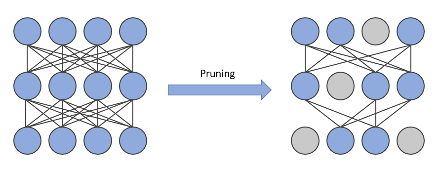
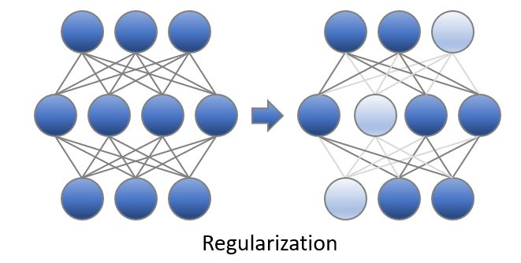
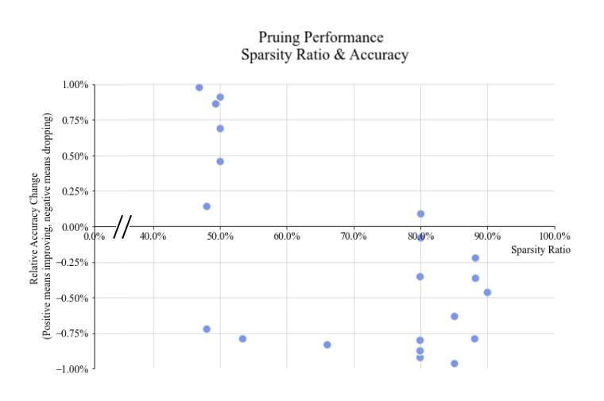

Pruning
============


1. [Introduction](#introduction)


    - [Neural Network Pruning](#neural-network-pruning)


    - [Pruning Patterns](#pruning-patterns)


    - [Pruning Criteria](#pruning-criteria)


    - [Pruning Schedules](#pruning-schedule)


    - [Pruning types](#pruning-type)


    - [Regularization](#regularization)


2. [Get Started With Pruning API](#get-started-with-pruning-api)


3. [Examples](#examples)


## Introduction


### Neural Network Pruning
Neural network pruning is a promising model compression technique that removes the least important parameters/neurons in the network and achieves compact architectures with minimal accuracy drop and maximal inference acceleration. As state-of-the-art model sizes have grown at an unprecedented speed, pruning has become increasingly crucial for reducing the computational and memory footprint that huge neural networks require.

<div align=center>
<a target="_blank" href="./../../docs/source/_static/imgs/pruning/pruning.PNG">
    
</a>
</div>


### Pruning Patterns


Pruning patterns defines the rules of pruned weights' arrangements in space. Intel Neural Compressor currently supports unstructured, N:M and NxM patterns. N:M pattern is applied to input channels; for NxM pattern, N stands for output channels and M stands for input ones. Please note that 1x1 pattern is referred to as unstructured pruning and channelx1 (or 1xchannel) pattern is referred to as channel-wise pruning.

- Unstructured Pruning
  Unstructured pruning means pruning the least salient connections in the model. The nonzero patterns are irregular and could be anywhere in the matrix.

- Structured Pruning
  Structured pruning means pruning parameters in groups and deleting entire blocks, filters, or channels according to some pruning criterions. In general, structured pruning leads to lower accuracy due to restrictive structure compared to unstructured pruning but it can significantly accelerate the model execution as it fits better with hardware designs.

<div align=center>
<a target="_blank" href="../../docs/source/_static/imgs/pruning/Pruning_patterns.JPG">
    
</a>
</div>

### Pruning Criteria


Pruning Criteria determines how should the weights of a neural network be scored and pruned. In the image below, pruning scores are represented by neurons' color and those with the lowest scores are pruned. The magnitude and gradient are widely used to score the weights. Currently, Intel Neural Compressor supports **magnitude**, **gradient**, **snip** and **snip_momentum** criteria; pruning criteria is defined along with pruning type in Intel Neural Compressor configurations.

- Magnitude
  The algorithm prunes the weight by the lowest absolute value at each layer with given sparsity target.

- Gradient
The algorithm prunes the weight by the lowest gradient value at each layer with given sparsity target.

- SNIP
The algorithm prunes the dense model at its initialization, by analyzing the weights' effect to the loss function when they are masked. Please refer to the original [paper](https://arxiv.org/abs/1810.02340) for details

- SNIP with momentum
  The algorithm improves original SNIP algorithms and introduces weights' score maps which updates in a momentum way.\
  In the following formula, $n$ is the pruning step and $W$ and $G$ are model's weights and gradients respectively.
  $$Score_{n} = 1.0 \times Score_{n-1} + 0.9 \times |W_{n} \times G_{n}|$$

<div align=center>
<a target="_blank" href="./../../docs/source/_static/imgs/pruning/pruning_criteria.PNG">
    
</a>
</div>

### Pruning Schedules


Pruning schedule defines the way the model reach the target sparsity (the ratio of pruned weights). Both **one-shot** and **iterative** pruning schedules are supported.

- One-shot Pruning
  One-shot pruning means the model is pruned to its target sparsity with one single step. This pruning method often works at model's initialization step. It can easily cause accuracy drop, but save much training time.

- Iterative Pruning
  Iterative pruning means the model is gradually pruned to its target sparsity during a training process. The pruning process contains several pruning steps, and each step raises model's sparsity to a higher value. In the final pruning step, the model reaches target sparsity and the pruning process ends.

<div align=center>
<a target="_blank" href="../../docs/source/_static/imgs/pruning/Pruning_schedule.JPG">
    
</a>  
</div>


### Pruning Types


Pruning type defines how the masks are generated and applied to a neural network. In Intel Neural Compressor, both pruning criteria and types are defined in pruning_type. Currently supported pruning types include **snip_momentum(default)**, **snip_momentum_progressive**, **magnitude**, **magnitude_progressive**, **gradient**, **gradient_progressive**, **snip**, **snip_progressive** and **pattern_lock**. We recommend using progressive pruning When choosing large size patterns like 1xchannel and channelx1.

- Pattern_lock Pruning
  Pattern_lock pruning type uses masks of a fixed pattern during the pruning process. It locks the sparsity pattern in finetuning phase by freezing those zero values of weight tensor during weight update of training. It can be applied in the following scenario: after the model is pruned under a large dataset, pattern lock can be used to retrain the sparse model on a downstream task (a smaller dataset). Please refer to [Prune once for all](https://arxiv.org/pdf/2111.05754.pdf) for more information.

- Progressive Pruning
  Progressive pruning aims at smoothing the structured pruning by automatically interpolating a group of interval masks during the pruning process. In this method, a sequence of masks are generated to enable a more flexible pruning process and those masks would gradually change into ones to fit the target pruning structure.
  Progressive pruning is used mainly for channel-wise pruning and currently only supports NxM pruning pattern.

  <div style = "width: 77%; margin-bottom: 2%;">
    <a target="_blank" href="../../docs/source/_static/imgs/pruning/progressive_pruning.png">
      
    </a>
  </div>
  (a) refers to the traditional structured iterative pruning; (b, c, d) demonstrates some typical implementations of mask interpolation. (b) uses masks with smaller structured blocks during every pruning step. (c) inserts masks with smaller structured blocks between every pruning steps. (d) inserts unstructured masks which prune some weights by referring to pre-defined score maps. We use (d) as the mask interpolation implementation of progressive pruning.


### Regularization


Regularization is a technique that discourages learning a more complex model and therefore performs variable-selection. In the image below, some weights are pushed to be as small as possible and the connections are thus sparsified. **Group-lasso** method is used in Intel Neural Compressor. 

- Group Lasso
The main idea of Group Lasso is to construct an objective function that penalizes the L2 parametrization of the grouped variables, determines the coefficients of some groups of variables to be zero, and obtains a refined model by feature filtering.

<div align=center>
<a target="_blank" href="../../docs/source/_static/imgs/pruning/Regularization.JPG">
    
</a>
</div>


## Get Started with Pruning API


Neural Compressor `Pruning` API is defined under `neural_compressor.pruner`, which takes a user-defined config object as input. 
Users can pass the customized training/evaluation functions to `Pruning` in various scenarios. 


The following section exemplifies how to use hooks in user pass-in training function to perform model pruning. Through the pruning API, multiple pruner objects are supported in one single Pruning object to enable layer-specific configurations and a default setting is used as a complement.

Step 1: Define a dict-like configuration in your training codes. We provide you a template of configuration below.
```python
configs = [
        { ## pruner1
            'target_sparsity': 0.9,   # Target sparsity ratio of modules.
            'pruning_type': "snip_momentum", # Default pruning type.
            'pattern': "4x1", # Default pruning pattern. 
            'op_names': ['layer1.*'],  # A list of modules that would be pruned.
            'excluded_op_names': ['layer3.*'],  # A list of modules that would not be pruned.
            'start_step': 0,  # Step at which to begin pruning.
            'end_step': 10,   # Step at which to end pruning.
            'pruning_scope': "global", # Default pruning scope.
            'pruning_frequency': 1, # Frequency of applying pruning.
            'min_sparsity_ratio_per_op': 0.0,  # Minimum sparsity ratio of each module.
            'max_sparsity_ratio_per_op': 0.98, # Maximum sparsity ratio of each module.
            'sparsity_decay_type': "exp", # Function applied to control pruning rate.
            'pruning_op_types': ['Conv', 'Linear'], # Types of op that would be pruned.
        },
        { ## pruner2
            "op_names": ['layer3.*'], # A list of modules that would be pruned.
            "pruning_type": "snip_momentum_progressive",   # Pruning type for the listed ops.
            # 'target_sparsity' 
        } # For layer3, the missing target_sparsity would be complemented by default setting (i.e. 0.8)
    ]
```
Step 2: Insert API functions in your codes. Only 4 lines of codes are required.
```python
""" All you need is to insert following API functions to your codes:
pruner.on_train_begin() # Setup pruner
pruner.on_step_begin() # Prune weights
pruner.on_before_optimizer_step() # Do weight regularization
pruner.on_after_optimizer_step() # Update weights' criteria, mask weights
"""
from neural_compressor.pruner.pruning import Pruning, WeightPruningConfig
config = WeightPruningConfig(configs)
pruner = Pruning(config)  # Define a pruning object.
pruner.model = model      # Set model object to prune.
pruner.on_train_begin()
for epoch in range(num_train_epochs):
    model.train()    
    for step, batch in enumerate(train_dataloader):
        pruner.on_step_begin(step)
        outputs = model(**batch)
        loss = outputs.loss
        loss.backward()
        pruner.on_before_optimizer_step()
        optimizer.step()
        pruner.on_after_optimizer_step()
        lr_scheduler.step()
        model.zero_grad()
```


 In the case mentioned above, pruning process can be done by pre-defined hooks in Neural Compressor. Users need to place those hooks inside the training function. The pre-defined Neural Compressor hooks are listed below.


```
on_train_begin() : Execute at the beginning of training phase.
on_epoch_begin(epoch) : Execute at the beginning of each epoch.
on_step_begin(batch) : Execute at the beginning of each batch.
on_step_end() : Execute at the end of each batch.
on_epoch_end() : Execute at the end of each epoch.
on_before_optimizer_step() : Execute before optimization step.
on_after_optimizer_step() : Execute after optimization step.
```


## Validated Pruning Models


We validate the pruning technique on typical models across various domains (including CV and NLP) and the examples are listed in [Pruning Examples](../../docs/source/pruning_details.md#examples). A complete overview of validated examples including quantization, pruning and distillation results could be found in  [Intel Neural Compressor Validated examples](../../docs/source/validated_model_list.md#validated-pruning-examples).

<div style = "width: 77%; margin-bottom: 2%;">
  <a target="_blank" href="../../docs/source/_static/imgs/pruning/pruning_scatter.JPG">
    
  </a>
</div>

Please refer to pruning examples([PyTorch](../../examples/README.md#Pruning-1)) for more information.


## Reference


 

[1] Namhoon Lee, Thalaiyasingam Ajanthan, and Philip Torr. SNIP: Single-shot network pruning based on connection sensitivity. In International Conference on Learning Representations, 2019.
