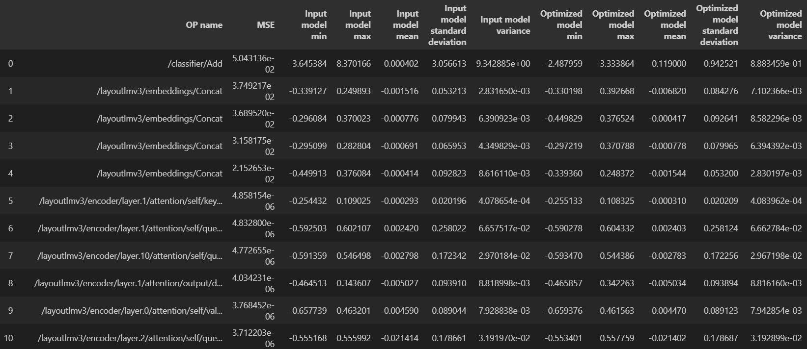
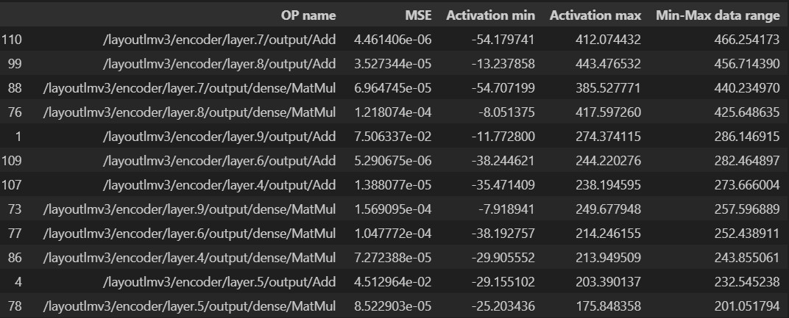

# Step by step example how to debug accuracy with Neural Insights
1. [Introduction](#introduction)
2. [Preparation](#preparation)
3. [Running the quantization](#running-the-quantization)
4. [Analyzing the result of quantization](#-analyzing-the-result-of-quantization)

# Introduction
In this instruction accuracy issue will be debugged using Neural Insights. ONNX LayoutLMv3 model will be used as an example. It will be quantized and the results will be analyzed to find the cause of the accuracy loss.

# Preparation
## Requirements
First you need to install Intel® Neural Compressor and other requirements.
```shell
pip install neural-compressor 
pip install datasets transformers torch torchvision
pip install onnx onnxruntime onnxruntime-extensions
pip install accelerate seqeval tensorboard sentencepiece timm fvcore Pillow einops textdistance shapely protobuf setuptools optimum
```

## Model
Get the LayoutLMv3 model.
```shell
optimum-cli export onnx --model HYPJUDY/layoutlmv3-base-finetuned-funsd layoutlmv3-base-finetuned-funsd-onnx/ --task=token-classification
```

## Scripts
Copy `funsd.py`, `model.py`, and `utils.py` scripts from Intel® Neural Compressor [LayoutLMv3 example](https://github.com/intel/neural-compressor/tree/master/examples/onnxrt/nlp/huggingface_model/token_classification/layoutlmv3/quantization/ptq_static).

## Dataset
First, define some variables that will be used.
```python
model_name_or_path = "HYPJUDY/layoutlmv3-base-finetuned-funsd"
input_model = "./layoutlmv3-base-finetuned-funsd-onnx/model.onnx"
output_model = "./layoutlmv3-base-finetuned-funsd-onnx/model-int8.onnx"
task_name="ner"
```

Dataset needs to be preprocessed before the quantization like in files shown below.
```python
import os
import torch
import numpy as np
from datasets import ClassLabel, load_dataset, load_metric
from torchvision import transforms
from transformers import (
    AutoConfig,
    AutoTokenizer,
    PreTrainedTokenizerFast,
    set_seed,
)
from timm.data.constants import IMAGENET_INCEPTION_MEAN, IMAGENET_INCEPTION_STD
from utils import RandomResizedCropAndInterpolationWithTwoPic, pil_loader, Compose

# Set seed before initializing model.
set_seed(42)

import funsd
datasets = load_dataset(os.path.abspath(funsd.__file__))

column_names = datasets["test"].column_names
features = datasets["test"].features

text_column_name = "words" if "words" in column_names else "tokens"
boxes_column_name = "bboxes"


label_column_name = (
    f"{task_name}_tags" if f"{task_name}_tags" in column_names else column_names[1]
)

remove_columns = column_names

# In the event the labels are not a `Sequence[ClassLabel]`, we will need to go through the dataset to get the
# unique labels.
def get_label_list(labels):
    unique_labels = set()
    for label in labels:
        unique_labels = unique_labels | set(label)
    label_list = list(unique_labels)
    label_list.sort()
    return label_list

if isinstance(features[label_column_name].feature, ClassLabel):
    label_list = features[label_column_name].feature.names
    # No need to convert the labels since they are already ints.
    label_to_id = {i: i for i in range(len(label_list))}
else:
    label_list = get_label_list(datasets["train"][label_column_name])
    label_to_id = {l: i for i, l in enumerate(label_list)}
num_labels = len(label_list)

# Load pretrained model and tokenizer
#
# Distributed training:
# The .from_pretrained methods guarantee that only one local process can concurrently
# download model & vocab.
config = AutoConfig.from_pretrained(
    model_name_or_path,
    num_labels=num_labels,
    finetuning_task=task_name,
    cache_dir=None,
    revision="main",
    input_size=224,
    use_auth_token=None,
)
tokenizer = AutoTokenizer.from_pretrained(
    model_name_or_path,
    tokenizer_file=None,  # avoid loading from a cached file of the pre-trained model in another machine
    cache_dir=None,
    use_fast=True,
    add_prefix_space=True,
    revision="main",
    use_auth_token=None,
)

# Tokenizer check: this script requires a fast tokenizer.
if not isinstance(tokenizer, PreTrainedTokenizerFast):
    raise ValueError(
        "This example script only works for models that have a fast tokenizer. Checkout the big table of models "
        "at https://huggingface.co/transformers/index.html#bigtable to find the model types that meet this "
        "requirement"
    )

# Preprocessing the dataset
# Padding strategy
padding = "max_length"
visual_embed = True

if visual_embed:
    imagenet_default_mean_and_std = False
    mean = IMAGENET_INCEPTION_MEAN
    std = IMAGENET_INCEPTION_STD
    common_transform = Compose([
        # transforms.ColorJitter(0.4, 0.4, 0.4),
        # transforms.RandomHorizontalFlip(p=0.5),
        RandomResizedCropAndInterpolationWithTwoPic(
            size=224, interpolation="bicubic"),
    ])

    patch_transform = transforms.Compose([
        transforms.ToTensor(),
        transforms.Normalize(
            mean=torch.tensor(mean),
            std=torch.tensor(std))
    ])

# Tokenize all texts and align the labels with them.
def tokenize_and_align_labels(examples, augmentation=False):
    tokenized_inputs = tokenizer(
        examples[text_column_name],
        padding=False,
        truncation=True,
        return_overflowing_tokens=True,
        boxes=examples[boxes_column_name],
    )

    labels = []
    bboxes = []
    images = []
    for batch_index in range(len(tokenized_inputs["input_ids"])):
        word_ids = tokenized_inputs.word_ids(batch_index=batch_index)
        org_batch_index = tokenized_inputs["overflow_to_sample_mapping"][batch_index]

        label = examples[label_column_name][org_batch_index]
        bbox = examples["bboxes"][org_batch_index]
        previous_word_idx = None
        label_ids = []
        bbox_inputs = []
        for word_idx in word_ids:
            # Special tokens have a word id that is None. We set the label to -100 so they are automatically
            # ignored in the loss function.
            if word_idx is None:
                label_ids.append(-100)
                bbox_inputs.append([0, 0, 0, 0])
            # We set the label for the first token of each word.
            elif word_idx != previous_word_idx:
                label_ids.append(label_to_id[label[word_idx]])
                bbox_inputs.append(bbox[word_idx])
            # For the other tokens in a word, we set the label to either the current label or -100, depending on
            # the label_all_tokens flag.
            else:
                label_ids.append(-100)
                bbox_inputs.append(bbox[word_idx])
            previous_word_idx = word_idx
        labels.append(label_ids)
        bboxes.append(bbox_inputs)

        if visual_embed:
            ipath = examples["image_path"][org_batch_index]
            img = pil_loader(ipath)
            for_patches, _ = common_transform(img, augmentation=augmentation)
            patch = patch_transform(for_patches)
            images.append(patch)

    tokenized_inputs["labels"] = labels
    tokenized_inputs["bbox"] = bboxes
    if visual_embed:
        tokenized_inputs["images"] = images

    return tokenized_inputs

validation_name = "test"
if validation_name not in datasets:
    raise ValueError("--do_eval requires a validation dataset")
eval_dataset = datasets[validation_name]
eval_dataset = eval_dataset.map(
    tokenize_and_align_labels,
    batched=True,
    remove_columns=remove_columns,
    load_from_cache_file=True,
)
```

```python
import onnxruntime

class IncDataset():
    def __init__(self, 
                 dataset,
                 model,
                 label_names=None,):
        self.dataset = dataset
        self.label_names = ["labels"] if label_names is None else label_names
        self.session = onnxruntime.InferenceSession(model.SerializeToString(),
                                                    providers=onnxruntime.get_available_providers())
        self.onnx_input_names = {input_key.name: idx for idx, input_key in enumerate(self.session.get_inputs())}
        self._process_dataset()
    
    def _process_dataset(self):
        self.label = []
        self.onnx_inputs = []
        for inputs in self.dataset:
            onnx_inputs = []    
            has_labels = all(inputs.get(k) is not None for k in self.label_names)
            if has_labels:
                labels = tuple(np.array([inputs.get(name)]) for name in self.label_names)
                if len(labels) == 1:
                    labels = labels[0]
            else:
                labels = None
            self.label.append(labels)
            for key in self.onnx_input_names:
                if key in inputs:
                    # onnx_inputs[key] = np.array([inputs[key]])
                    onnx_inputs.append(np.array(inputs[key]))
                    # self.onnx_inputs.append([np.array(inputs[key])])
                elif key == 'pixel_values':
                    # onnx_inputs[key] = np.array([inputs['images']], dtype=np.float32)
                    onnx_inputs.append(np.array(inputs['images'], dtype=np.float32))
                    # self.onnx_inputs.append([np.array(inputs['images'], dtype=np.float32)])

            self.onnx_inputs.append(onnx_inputs)
            onnx_inputs =[]

    def __getitem__(self, index):
        return tuple(self.onnx_inputs[index]), self.label[index]

    def __len__(self):
        assert len(self.label) == len(self.onnx_inputs)
        return len(self.onnx_inputs)
```

## Evaluation metric and function
Evaluation metric and function should be configured like in the code shown below.
```python
from datasets import load_metric

# Metrics
metric = load_metric("seqeval")

def compute_metrics(p):
    predictions, labels = p
    predictions = np.argmax(predictions, axis=2)

    # Remove ignored index (special tokens)
    true_predictions = [
        [label_list[p] for (p, l) in zip(prediction, label) if l != -100]
        for prediction, label in zip(predictions, labels)
    ]
    true_labels = [
        [label_list[l] for (p, l) in zip(prediction, label) if l != -100]
        for prediction, label in zip(predictions, labels)
    ]

    results = metric.compute(predictions=true_predictions, references=true_labels)
    return {
        "precision": results["overall_precision"],
        "recall": results["overall_recall"],
        "f1": results["overall_f1"],
        "accuracy": results["overall_accuracy"],
    }

# Evaluation
from model import ORTModel
def eval_func(model):
    ort_model = ORTModel(
        model,
        compute_metrics=compute_metrics,
    )
    outputs = ort_model.evaluation_loop(eval_dataset)
    return outputs.metrics['f1']
```

# Running the quantization
Generate a quantized model.
```python
import onnx
from neural_compressor.data import DataLoader
from neural_compressor import quantization, PostTrainingQuantConfig

onnx_model = onnx.load(input_model)
calib_dataset = IncDataset(eval_dataset, onnx_model)
config = PostTrainingQuantConfig(approach='static', quant_format="QOperator")
q_model = quantization.fit(onnx_model, 
                           config,
                           calib_dataloader=DataLoader(framework='onnxruntime', dataset=calib_dataset))
```

Execute benchmark to get the F1 score of both FP32 and INT8 models and then compute the relative accuracy ratio.
The output results indicate that the quantized model's accuracy is noticeably poor.

```
fp32 f1 = 0.9049, int8 f1 = 0.2989, accuracy ratio = -66.9631%
```

# Analyzing the result of quantization
In this section, the diagnosis tool is used for debugging to achieve higher INT8 model accuracy.
We need to set `diagnosis` parameter to `True` as shown below.
```python
config = PostTrainingQuantConfig(approach="static", quant_format="QOperator", quant_level=1, diagnosis=True) # set 'diagnosis' to True
q_model = quantization.fit(onnx_model, 
                           config, 
                           eval_func=eval_func, 
                           calib_dataloader=DataLoader(framework='onnxruntime', dataset=calib_dataset))
```
The diagnosis tool will output `Activations summary` and `Weights summary` in terminal. 

For easy to check, here we reload them to .csv files as shown below.
```python
import glob
import pandas as pd
pd.set_option('display.max_rows',None)
pd.set_option('display.max_columns',None)

subfolders = glob.glob("./nc_workspace" + "/*/")
subfolders.sort(key=os.path.getmtime, reverse=True)
if subfolders:
    activations_table = os.path.join(subfolders[0], "activations_table.csv")
    weights_table = os.path.join(subfolders[0], "weights_table.csv")
    
    activations_table = pd.read_csv(activations_table)
    weights_table = pd.read_csv(weights_table)
    
    print("Activations summary")
    display(activations_table)
    
    print("\nWeights summary")
    display(weights_table)
```

## Weights summary
These are the top 10 rows from weights summary table:



## Activations summary
These are the top 10 rows from activations summary table:


In the Activations summary table, there are some nodes showing dispersed activation data range. Therefore, we calculate the `Min-Max data range` for activations data and sort the results in descending order.

```python
activations_table["Min-Max data range"] = activations_table["Activation max"] - activations_table["Activation min"]
sorted_data = activations_table.sort_values(by="Min-Max data range", ascending=False)
display(sorted_data)
```

The results should look like below:



According to the results displayed above, it is evident that the nodes of type `/layoutlmv3/encoder/layer.\d+/output/Add` and `/layoutlmv3/encoder/layer.\d+/output/dense/MatMul` have significantly higher values for `Min-Max data range` compared to other node types. This indicates that they may have caused a loss of accuracy. Therefore, we can try to fallback these nodes.

Refer to [diagnosis.md](https://github.com/intel/neural-compressor/blob/master/docs/source/diagnosis.md) for more tips for diagnosis.

```python
from neural_compressor.utils.constant import FP32
config = PostTrainingQuantConfig(approach="static", 
                                 quant_format="QOperator",
                                 op_name_dict={"/layoutlmv3/encoder/layer.\d+/output/dense/MatMul":FP32,
                                               "/layoutlmv3/encoder/layer.\d+/output/Add":FP32})
q_model = quantization.fit(onnx_model, 
                           config,
                           calib_dataloader=DataLoader(framework='onnxruntime', dataset=calib_dataset))
q_model.save(output_model)
```

Execute benchmark on the new quantized model again and the accuracy ratio is improved to <1%.
```
fp32 f1 = 0.9049, int8 f1 = 0.8981, accuracy ratio = -0.7502%
```