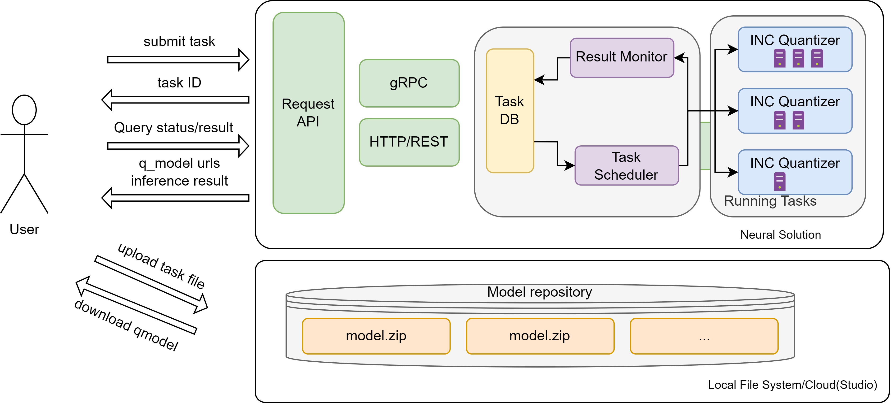
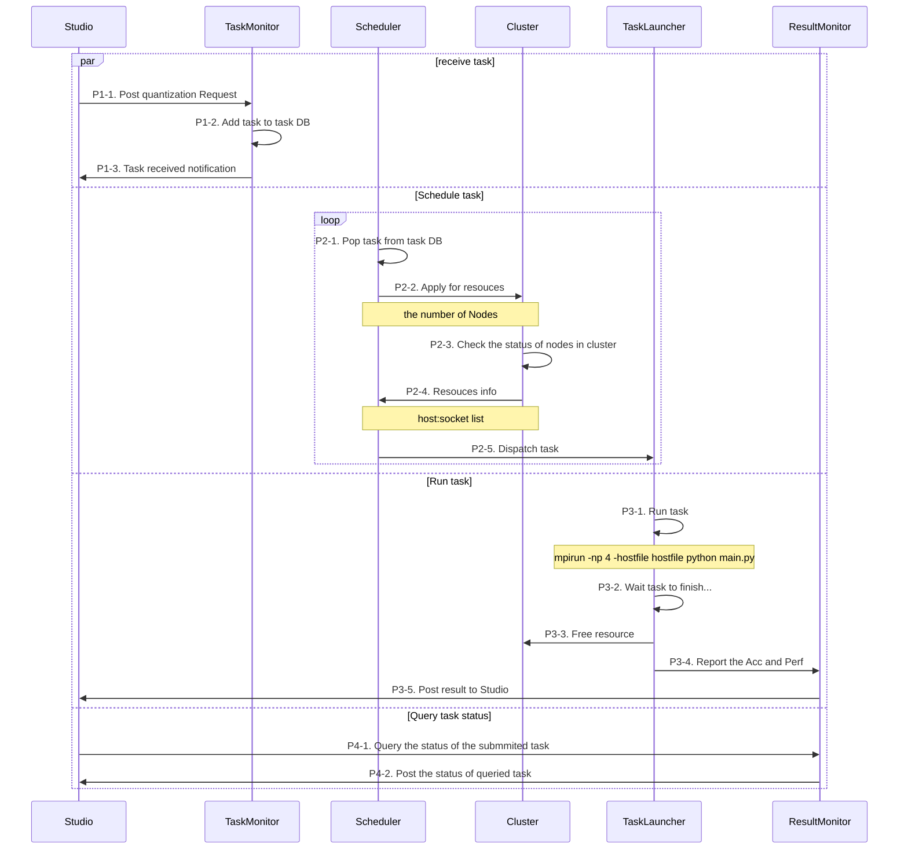

# What's Neural Solution?
<!-- TODO what is ns -->
Neural Solution is a flexible and easy to use tool that brings the capabilities of INC as a service. Users can effortlessly submit optimization tasks through the HTTP/gRPC API. Neural Solution automatically dispatches these tasks to one or multiple nodes, streamlining the entire process. 

# Why Neural Solution?
<!-- TODO what does the ns provide -->
- Efficient: Neural Solution speed up the optimization process by seamlessly parallelizes the tuning process across multi nodes.
- Security:
- Code Less:


# Get Started
<!-- TODO how to install it -->
## Installation
<details>
  <summary>Prerequisites</summary>

<!--TODO: Precise OS versions-->

- Operating systems
  - Linux
- Python: 3.8 ~ 3.10 <!--TODO: double check the PY version with the mpi4py support>
- Conda: ? <!--TODO: Precise Conda versions>
</details>

### Use conda to install neural solution:
```
conda install <!--TODO: align it with neural insights>
```

### Build from source:
<!--TODO: align it with neural insights>


# E2E examples
<!-- TODO highlights E2E examples -->
- Quantizing a Hugging Face model
- Quantizing a custom model
# Learn More
<!-- TODO more docs(Install details, API and so on...) -->

- The Architecture documents
- API Reference

# Contact

Please contact us at [inc.maintainers@intel.com](mailto:inc.maintainers@intel.com) for any Neural Coder related question.
<!-- TODO removed the content below 

# Optimization as a Service(OaaS)

Optimization as a Service(OaaS) is a platform for users to submit quantization/optimization tasks via HTTP/gRPC API. It dispatches tasks automatically to one or multiple nodes. 

### Software Architecture

### Workflow



-->
