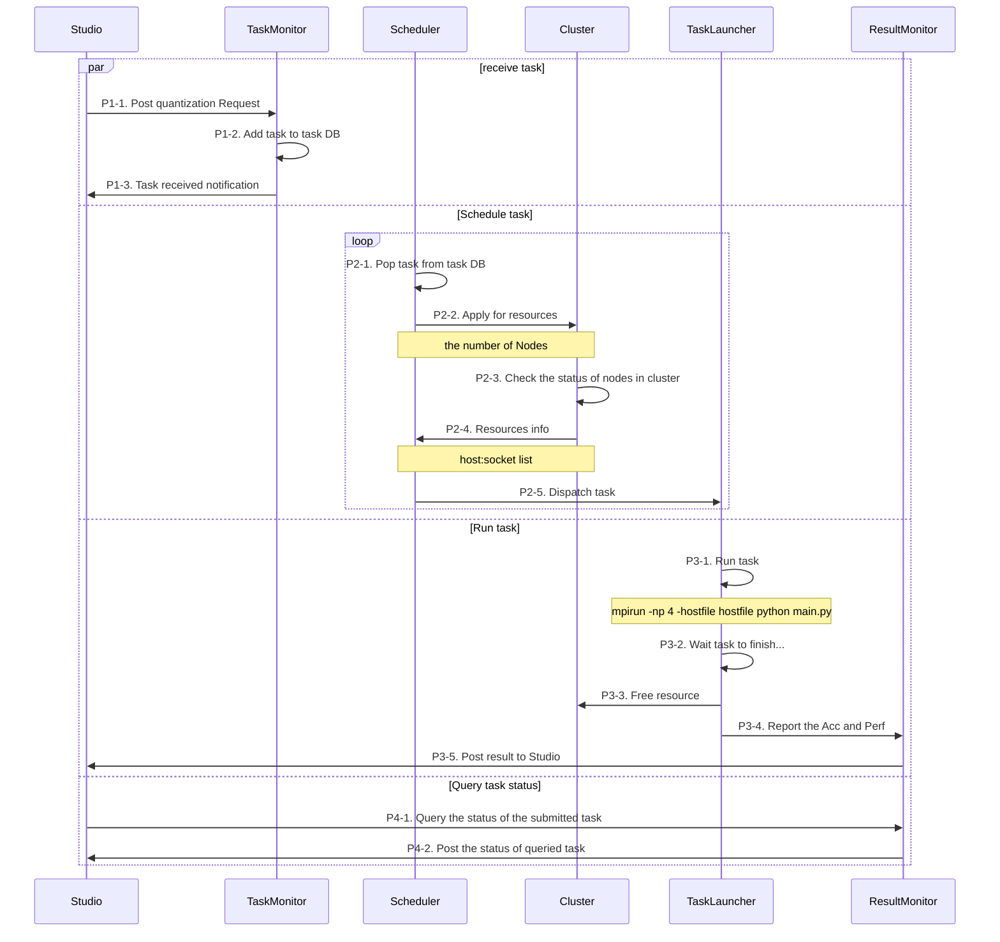
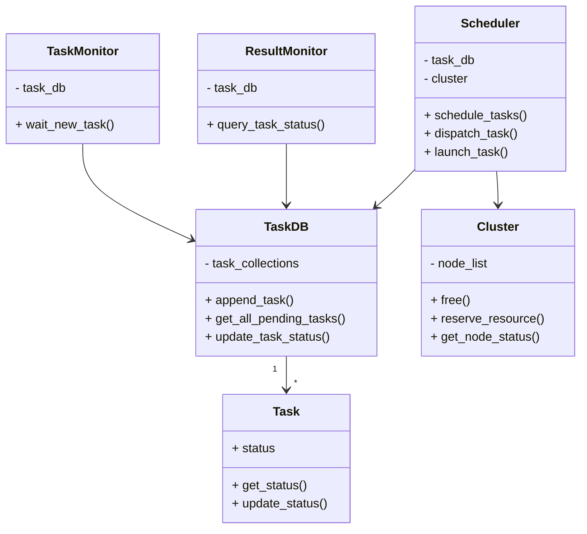

## Design Doc for Optimization as a Service [WIP]

### Contents

- [Design Doc for Optimization as a Service \[WIP\]](#design-doc-for-optimization-as-a-service-wip)
  - [Contents](#contents)
  - [Overview](#overview)
  - [Workflow of OaaS](#workflow-of-oaas)
  - [Class definition diagram](#class-definition-diagram)
  - [Extensibility](#extensibility)

### Overview

Optimization as a service(OaaS) is a platform that enables users to submit quantization tasks for their models and automatically dispatches these tasks to one or multiple nodes for accuracy-aware tuning. OaaS is designed to parallelize the tuning process in two levels: tuning and model. At the tuning level, OaaS execute the tuning process across multiple nodes for one model. At the model level, OaaS allocate free nodes to incoming requests automatically.

### Workflow of OaaS

The optimization process is divided into four parts, each executed in separate threads.

- Part 1. Posting new quantization task. (P1-1 -> P1-2 -> P1-3)

- Part 2. Resource allocation and scheduling. (P2-1 -> P2-2 -> P2-3 -> P2-4 -> P2-5)

- Part 3. Task execution and reporting. (P3-1 -> P3-2 -> P3-3 -> P3-4 -> P3-5)

- Part 4. Updating the status. (P4-1 -> P4-2)

### Class definition diagram

### Extensibility

- The service can be deployed on various resource pool, including a set of worker nodes, such as a local cluster or cloud cluster (AWS and GCP).
