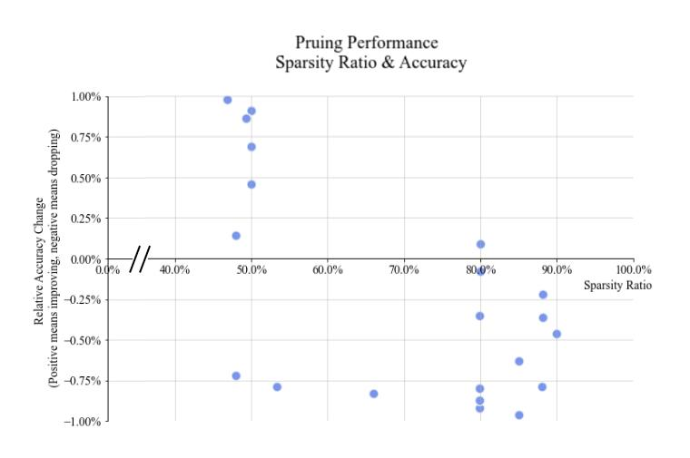

## **Summary**

This is a design discussion RFC for contributing some device-agnostic compression algorithms, like the post training quantization(QDQ quant format) and structural sparsity supported by [Intel(R) Neural Compressor](https://github.com/intel/neural-compressor) into DeepSpeed.

## **Motivation**

As we know, the DeepSpeed Compression have supported many useful compression methods like layer reduction via knowledge distillation, weight quantization, activation quantization, sparse pruning, row pruning, head pruning, and channel pruning.

But those compression methods are lack of main stream support on some popular compression algorithms like post training static quantization and structural sparsity, which have been demostrated as efficient and popular compression methods by the industry.

[Intel(R) Neural Compressor](https://github.com/intel/neural-compressor) has implemented such device-agnostic compression algorithms, we would like to contribute those into DeepSpeed.

## **Proposal Details on Pruning**

In this proposal, we would like to introduce structural pruning functionalities by enabling "N in M" and "N x M" block sparsity pattern with snip_momentum criteria and progressive pruning.

We propose a two-phases support on the structural pruning method.

**Phase 1: structural pruning with global sparse ratio**

This way leverages the existing DeepSpeed sparsity design which has a global sparse ratio control. If the accuracy doesn't meet expectation, user has to tune the training process like what they did on DeepSpeed by manually specifying and exlporing the proper sparse ratio per layer.

We extend the json config file format and implement the structural sparsity algorithm in `compression` dir like below. 

~~~
{
        "sparse_pruning": {
        "shared_parameters": {
          "enabled": True,
          "method": "snip_momentum",          # new value
          "pattern": "4x1",                   # new field
          "dense_ratio": 0.1,
          "gradient_accumulation_steps": 1,   # new field
          "sparsity_decay_type": "exp",       # new field
          "start_step": 0,                    # new field
          "end_tep": 10000                    # new field
        },
        "different_groups": {
          "sp1": {
            "params": {
              "dense_ratio": 0.5
            },
            "modules": [
              "attention.self"
            ]
          }
        }
      },
}
~~~

As for the structural sparsity implementation in `compression` dir, let's taking `LinearLayer_Compress` class in `deepspeed/compression/basic_layer.py` as an example, this class is enhanced like this to support structural sparsity algorithm.

<a target="_blank" href="./imgs/linear_example.png">
  
</a>

**NOTE**: In this phase 1, the DeepSpeed user facing API keeps unchanged. The only change user need to be aware of is the extended Json file format.

**Phase 2: Advanced structural pruning with fine-grained sparse ratio control per layer** 

This advanced algorithm supports the adaptive sparse ratio adjustment algorithm per layer to reach higher accuracy.

This way needs to extend the `initialize()` API to return one more parameter `callbacks` besides ``engine``, ``optimizer``, ``training_dataloader``, ``lr_scheduler``. The json config file needs to be adjusted accordingly.

~~~
def initialize(args=None,
               model: torch.nn.Module = None,
               optimizer: Optional[Union[Optimizer,
                                         DeepSpeedOptimizerCallable]] = None,
               model_parameters: Optional[torch.nn.Module] = None,
               training_data: Optional[torch.utils.data.Dataset] = None,
               lr_scheduler: Optional[Union[_LRScheduler,
                                            DeepSpeedSchedulerCallable]] = None,
               mpu=None,
               dist_init_required: Optional[bool] = None,
               collate_fn=None,
               config=None,
               config_params=None):
    # return A tuple of ``engine``, ``optimizer``, ``training_dataloader``, ``lr_scheduler``, ``callbacks``
~~~

This `callbacks` class object returned by `initialize` function is used to register hooks for user into the normal training process.

~~~
class callbacks():
    def on_epoch_begin(self, epoch):
      ...

    def on_epoch_end(self):
      ...

    def on_step_begin(self, step):
      ...

    def on_step_end(self):
      ...

    ...  # other hooks during training

~~~

The user need to manually insert such hooks into their training code for fine-grain sparsity control per layer.

~~~
    model, optimizer, _, lr_scheduler, callbacks = deepspeed.initialize(
        args=args,
        model=model,
        optimizer=optimizer,
        lr_scheduler=lr_scheduler,
        dist_init_required=True)

    for epoch in range(args.num_train_epochs):
        model.train()
        start_time = time.time()
        callbacks.on_epoch_start(epoch)               # new code
        for step, batch in enumerate(train_dataloader):
            callbacks.on_step_start(step)             # new code
            batch = to_device(batch, device)
            all_loss = forward_fun(batch, model, teacher_model=teacher_model)
            model.backward(all_loss[0])
            model.step()
            callbacks.on_step_end()                   # new code

        callbacks.on_epoch_end()                      # new code
        ...

~~~

## **Structural Sparsity Results**

<a target="_blank" href="./imgs/sparse_result.png">
  
</a>

## **Recommendation**

We recommend to split this contribution into two phases:

1. The first phase focuses on adding the entire structural sparsity methods supported by [Intel(R) Neural Compressor](https://github.com/intel/neural-compressor) into DeepSpeed with minor changes. 
   
   This way provoides the complete structural sparsity capability with global sparse ratio setting. It's easy of use for customer to pilot the structural sparsity feature. 

2. The second phase focuses on productivity improvement by supporting the adaptive sparse ratio adjustment to support broad pruning algorithm. 
 
   This way has the capability of automatically adjusting the sparse ration per layer for better accuracy. It can highly improve the productivity for those customers who wants to have high sparsity but meet strict accuracy goal.

## **Proposal Details on Quantization**

In this proposal, we would like to enhance the quantization functionality by integrating device agnostic post training static&dynamic quantization (QDQ quant format) supported by [Intel(R) Neural Compressor](https://github.com/intel/neural-compressor) into DeepSpeed.

As current implementation of DeepSpeed is focusing on simulating the quantization behavior during training, we propose to add post training quantization by below changes.

```yaml

   "compression_inference": {         # new field
    "static_quantization":            # new field, value could be "dynamic_quantization" as well
        "enabled": true               # new field
    }
    
```

Besides the changes in the compression config file, we also need introduce a new function `quantize` like below to support post-training quantization.

```python

def quantize(model, deepspeed_config, mpu=None, calib_dataloader=None):
    ### The main entry of doing post training quantization
    ###
    ### Args:
    ###      ...
    ###      'calib_dataloader': The dataloader for calibration. Being None for post-training dynamic quantization. 
    ###
    ### Return q_model which is the QDQ model for deployment 

```

The usage would be like below:

```python
    model.load_state_dict(torch.load(args.path_to_model))
    q_model = quantize(model, args.deepspeed_config, calib_dataloader=test_loader)
    
    ### deploy this returned QDQ model through TRT or Intel Extension for PyTorch
    
```

## **Quantization Results**
As for the post training quantization results, please refer to [this link](https://github.com/intel/neural-compressor/blob/master/docs/source/validated_model_list.md)

## **Future Works**

We enabled new quantization algorithms like SmoothQuant in Intel(R) Neural Compressor and applied to popular large language models such as BLOOM-176B. We plan to enable these new features into DeepSpeed compression library as part of our future works.
