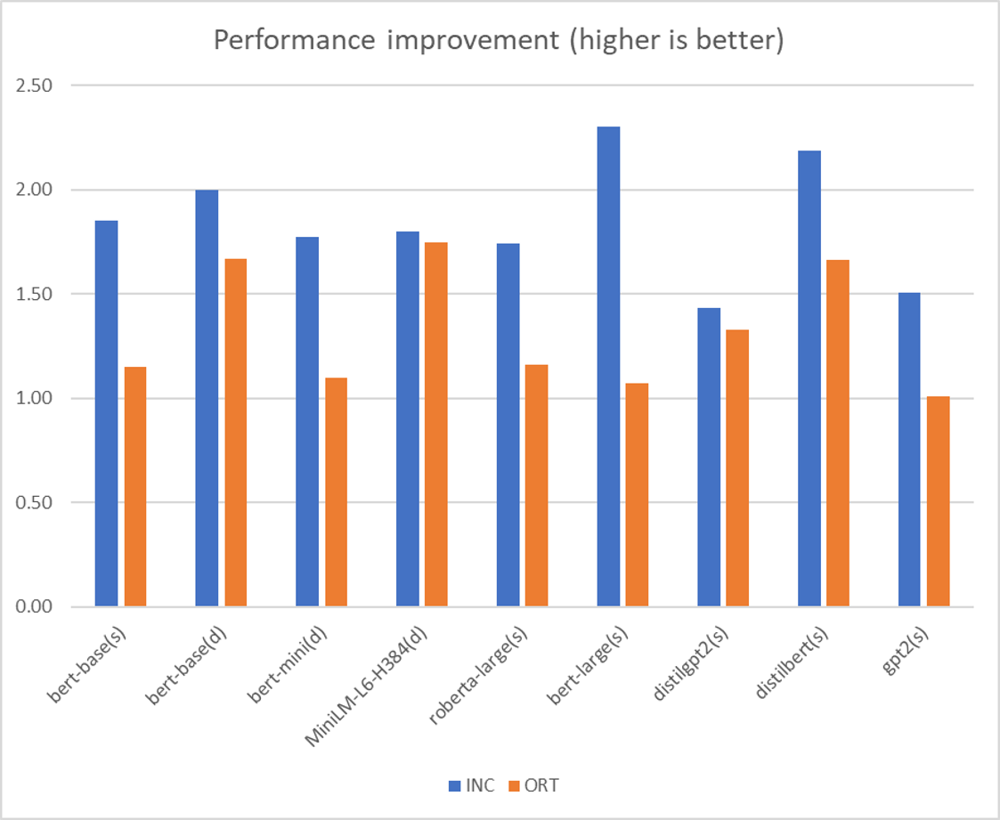

## **Summary**

This RFC is a high level design discussion thread for contributing advance features, like post training optimization and during training optimization, in [Intel(R) Neural Compressor](https://github.com/intel/neural-compressor) to Olive.

## **Motivation**

As we know, the Olive repo have supported model conversion from FP32 framework models to FP32 ONNX models and auto tuning on ONNXRT performance related configurations. To extend the conversion and tuning capability supported by Olive, we would like to contribute some advance features in
[Intel(R) Neural Compressor](https://github.com/intel/neural-compressor) validated on broad models to Olive.

The model optimizations supported by [Intel(R) Neural Compressor](https://github.com/intel/neural-compressor) could be classified into two sets:

1. post-training optimization
   
   This includes `post-training dynamic quantizer` and `post-training static quantizer`. Comping with ORT quantizer, Intel Neural Compressor can provide higher accuracy and better performance gain.

2. during-training optimization

   This includes `quantization-aware training`, `pruning` and `distillation`, which has been demostrated on broad models and can get ~1.x to 25x performance gain relying on which optimizations are used and the model structure.

## **Proposal**

we plan to contribute features into Olive with two phases.

**Phase 1:**, focusing on extending Olive conversion and optimization features

1. Add INC ONNX dynamic quantizer into Olive auto performance tuning scope

   This leverages the existing Olive design and extend optimization config to support INC dynamic quantizer.

2. Add INC ONNX FP32 to FP16 converter into Olive model conversion

   This is used to provide device agnostic model conversion feature (FP32 -> FP16) to Olive.

3. Add INC ONNX static quantizer into Olive auto performance tuning scope

   This optimization config needs to be extended to support INC static quantizer and calibration dataset.

**Phase 2:**, focusing on contributing during training optimizations into Olive

1. Add INC quantization aware training into Olive

2. Add INC pruning into Olive

3. Add INC distillation into Olive

Please note this proposal is for high level direction alignment. welcome any comments or feedbacks on that.
